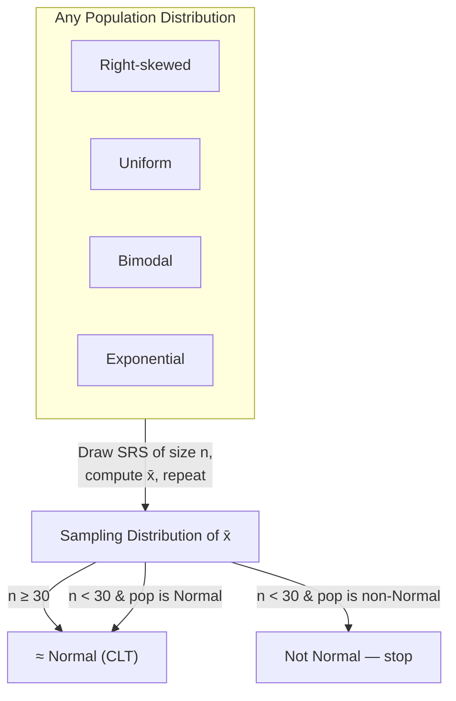
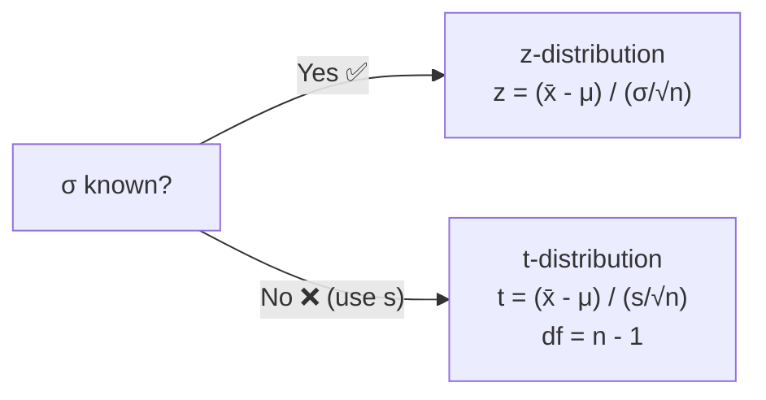

# Sampling Distribution of Means

**Parent:** [[Unit_5_Sampling_Distributions|Unit 5 — Sampling Distributions]]

---

## Definition

Let $\bar{x}$ be the sample mean from an SRS of size $n$ drawn from a population with mean $\mu$ and standard deviation $\sigma$. The **sampling distribution of $\bar{x}$** describes how $\bar{x}$ behaves across all possible samples.

---

## Three Pillars

### 1. Center — Unbiased

$$
\mu_{\bar{x}} = \mu
$$

The sample mean is an **unbiased estimator** of the population mean, regardless of sample size.

### 2. Spread — Standard Error

$$
\sigma_{\bar{x}} = \frac{\sigma}{\sqrt{n}}
$$

This is the **standard error of the mean**. Larger $n$ reduces spread. $\sigma_{\bar{x}}$ is always $\le \sigma$, and goes to 0 as $n \to \infty$.

### 3. Shape — The Central Limit Theorem (CLT)

The **Central Limit Theorem** is the crown jewel of probability and statistics:

> **If $n$ is sufficiently large**, the sampling distribution of $\bar{x}$ is approximately Normal *regardless of the shape of the population distribution*.

$$
\bar{x} \;\dot{\sim}\; N\!\left(\mu,\; \frac{\sigma}{\sqrt{n}}\right)
$$

---

## CLT in Detail

**CLT conditions:**
1. **Random** — SRS or randomized experiment
2. **Independence (10% condition)** — $n \le 0.10N$
3. **Sample size / population shape:**
   - Population Normal → $\bar{x}$ is exactly Normal for any $n$
   - Population not Normal → $\bar{x}$ is approximately Normal if $n \ge 30$
   - Strong skew/outliers → may need $n > 30$ (or median instead of mean)

---

## The $t$-Distribution

When $\sigma$ is unknown (almost always in practice), we estimate it with the sample standard deviation $s$. This creates **additional uncertainty**, captured by the $t$-distribution:

$$
t = \frac{\bar{x} - \mu}{s / \sqrt{n}}
$$

### Properties of $t$

- **Heavier tails** than $z$ — accounts for estimating $\sigma$
- **Degrees of freedom:** $df = n - 1$
- As $df \to \infty$, $t \to z$ (Normal)

---

## Comparison: $\hat{p}$ vs. $\bar{x}$

| Feature | Sample Proportion $\hat{p}$ | Sample Mean $\bar{x}$ |
|---------|---------------------------|----------------------|
| Parameter | $p$ | $\mu$ |
| Center | $\mu_{\hat{p}} = p$ | $\mu_{\bar{x}} = \mu$ |
| Spread | $\sqrt{p(1-p)/n}$ | $\sigma/\sqrt{n}$ |
| Shape condition | $np \ge 10$, $n(1-p) \ge 10$ | CLT: $n \ge 30$ (or pop Normal) |
| Standard error (estimated) | $\sqrt{\hat{p}(1-\hat{p})/n}$ | $s/\sqrt{n}$ |
| Sampling dist. | Normal ($z$) | $t$ ($\sigma$ unknown) or $z$ ($\sigma$ known) |
| Unbiased? | Yes | Yes |

---

## Example: Light Bulb Lifetimes

A light bulb manufacturer claims $\mu = 1000$ hours, $\sigma = 100$ hours. You test $n = 50$ bulbs.

- $\mu_{\bar{x}} = 1000$
- $\sigma_{\bar{x}} = 100 / \sqrt{50} \approx 14.14$
- $n \ge 30$ → CLT applies: $\bar{x} \;\dot{\sim}\; N(1000, 14.14)$

**Question:** What's the probability the sample mean exceeds 1020 hours?

$$
z = \frac{1020 - 1000}{14.14} \approx 1.414
$$

$$
P(Z > 1.414) \approx 0.0786
$$

About 7.9% of samples of size 50 would have a mean exceeding 1020 hours by chance alone.

---

## Why $t$ Matters

The $t$-distribution is wider than $z$, meaning confidence intervals are wider and $p$-values are larger (more conservative). This is appropriate because using $s$ instead of $\sigma$ adds uncertainty. For small $n$, the difference is substantial; for $n \gtrapprox 30$, $t$ and $z$ converge.

> [!key] Rule of Thumb
> Use $z$ when $\sigma$ is known (rare). Use $t$ with $df = n-1$ when $\sigma$ is estimated by $s$ (almost always).
> 
> Related: [[Confidence_Intervals_Means|Inference for Means — t-interval]]

---

[[AP_Statistics_MOC|← Back to AP Statistics MOC]]
