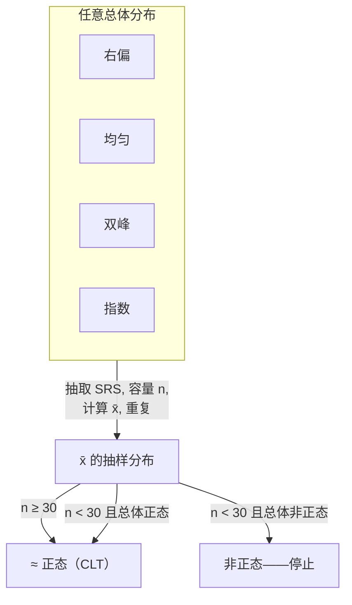
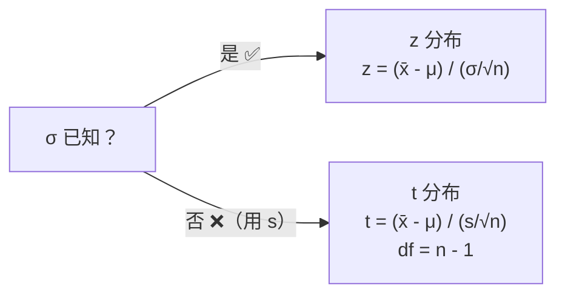

# 均值的抽样分布

**所属：** [[Unit_5_Sampling_Distributions|单元 5 — 抽样分布]]

## 定义

设 $\bar{x}$ 为来自均值为 $\mu$、标准差为 $\sigma$ 的总体的 SRS 的样本均值，样本容量为 $n$。**$\bar{x}$ 的抽样分布**描述 $\bar{x}$ 在所有可能样本中如何变化。

## 三个支柱

### 1. 中心——无偏

$$
\mu_{\bar{x}} = \mu
$$

样本均值是总体均值的**无偏估计量**，与样本容量无关。

### 2. 离散——标准误

$$
\sigma_{\bar{x}} = \frac{\sigma}{\sqrt{n}}
$$

这是**均值的标准误**。$n$ 越大，离散越小。$\sigma_{\bar{x}}$ 始终 $\le \sigma$，且当 $n \to \infty$ 时趋近于 0。

### 3. 形状——中心极限定理（CLT）

**中心极限定理**是概率与统计学的皇冠明珠：

> **如果 $n$ 足够大**，$\bar{x}$ 的抽样分布近似正态，**与总体分布的形状无关**。

$$
\bar{x} \;\dot{\sim}\; N\!\left(\mu,\; \frac{\sigma}{\sqrt{n}}\right)
$$

## CLT 详解

```mermaid
flowchart TB
    subgraph Population["任意总体分布"]
        P1["右偏"] 
        P2["均匀"]
        P3["双峰"]
        P4["指数"]
    end
    Population -->|"抽取 SRS, 容量 n,<br/>计算 x̄, 重复"| SD["x̄ 的抽样分布"]
    SD -->|"n ≥ 30"| Normal["≈ 正态（CLT）"]
    SD -->|"n < 30 且总体正态"| Normal
    SD -->|"n < 30 且总体非正态"| Skewed["非正态——停止"]
```

**CLT 条件：**
1. **随机**——SRS 或随机化实验
2. **独立（10% 条件）**——$n \le 0.10N$
3. **样本容量 / 总体形状：**
   - 总体正态 → $\bar{x}$ 对任意 $n$ 精确正态
   - 总体非正态 → 如果 $n \ge 30$，$\bar{x}$ 近似正态
   - 强偏斜/离群值 → 可能需要 $n > 30$（或改用中位数而非均值）

## $t$ 分布

当 $\sigma$ 未知时（实践中几乎总是如此），我们用样本标准差 $s$ 估计它。这引入了**额外的不确定性**，由 $t$ 分布来刻画：

$$
t = \frac{\bar{x} - \mu}{s / \sqrt{n}}
$$

### $t$ 分布的性质

- **尾部比 $z$ 更厚**——反映了对 $\sigma$ 的估计
- **自由度：** $df = n - 1$
- 当 $df \to \infty$ 时，$t \to z$（正态）

```mermaid
flowchart LR
    A["σ 已知？"] -->|"是 ✅"| B["z 分布<br/>z = (x̄ - μ) / (σ/√n)"]
    A -->|"否 ❌（用 s）"| C["t 分布<br/>t = (x̄ - μ) / (s/√n)<br/>df = n - 1"]
```

## 对比：$\hat{p}$ vs $\bar{x}$

| 特征 | 样本比例 $\hat{p}$ | 样本均值 $\bar{x}$ |
|---------|---------------------------|----------------------|
| 参数 | $p$ | $\mu$ |
| 中心 | $\mu_{\hat{p}} = p$ | $\mu_{\bar{x}} = \mu$ |
| 离散 | $\sqrt{p(1-p)/n}$ | $\sigma/\sqrt{n}$ |
| 形状条件 | $np \ge 10$，$n(1-p) \ge 10$ | CLT：$n \ge 30$（或总体正态） |
| 标准误（估计值） | $\sqrt{\hat{p}(1-\hat{p})/n}$ | $s/\sqrt{n}$ |
| 抽样分布 | 正态（$z$） | $t$（$\sigma$ 未知）或 $z$（$\sigma$ 已知） |
| 无偏？ | 是 | 是 |

## 示例：灯泡寿命

灯泡制造商声称 $\mu = 1000$ 小时，$\sigma = 100$ 小时。你测试 $n = 50$ 个灯泡。

- $\mu_{\bar{x}} = 1000$
- $\sigma_{\bar{x}} = 100 / \sqrt{50} \approx 14.14$
- $n \ge 30$ → CLT 适用：$\bar{x} \;\dot{\sim}\; N(1000, 14.14)$

**问题：** 样本均值超过 1020 小时的概率是多少？

$$
z = \frac{1020 - 1000}{14.14} \approx 1.414
$$

$$
P(Z > 1.414) \approx 0.0786
$$

在容量为 50 的样本中，约有 7.9% 的样本均值会因随机性超过 1020 小时。

## 为什么 $t$ 很重要

$t$ 分布比 $z$ 更宽，意味着置信区间更宽，$p$ 值更大（更保守）。这是合理的，因为用 $s$ 代替 $\sigma$ 增加了不确定性。对小的 $n$，差异显著；对 $n \gtrapprox 30$，$t$ 和 $z$ 趋于一致。

> [!key] 经验法则
> $\sigma$ 已知时用 $z$（很少见）。$\sigma$ 由 $s$ 估计时（几乎总是），用 $df = n-1$ 的 $t$ 分布。
>
> 相关：[[Confidence_Intervals_Means|均值的推断 — t 区间]]

---

[[AP_Statistics_MOC|← 返回 AP 统计学知识地图]]