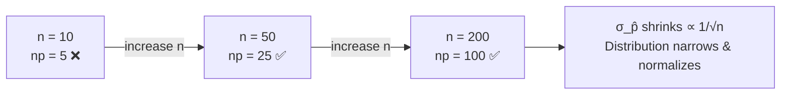

# Sampling Distribution of Proportions

**Parent:** [[Unit_5_Sampling_Distributions|Unit 5 — Sampling Distributions]]

---

## Definition

Let $\hat{p}$ be the sample proportion of successes in a simple random sample (SRS) of size $n$ drawn from a population with true proportion $p$. The **sampling distribution of $\hat{p}$** describes how $\hat{p}$ behaves across all possible samples.

---

## Three Pillars

### 1. Center — Unbiased

$$
\mu_{\hat{p}} = p
$$

The sample proportion is an **unbiased estimator** of the population proportion. On average, $\hat{p}$ hits $p$.

### 2. Spread — Standard Error

$$
\sigma_{\hat{p}} = \sqrt{\frac{p(1-p)}{n}}
$$

Greater $n$ → smaller spread. Larger $p(1-p)$ (max at $p = 0.5$) → larger spread.

### 3. Shape — Approximately Normal

When conditions hold, the sampling distribution is approximately Normal:

$$
\hat{p} \sim N\!\left(p,\; \sqrt{\frac{p(1-p)}{n}}\right)
$$

---

## Conditions for Normal Approximation

| Condition | Requirement | Why It Matters |
|-----------|-------------|----------------|
| **Random** | SRS or randomized experiment | Avoids bias; ensures independence |
| **10% Condition** | $n \le 0.10N$ | Independence: each sample < 10% of population |
| **Large Counts** | $np \ge 10$ and $n(1-p) \ge 10$ | Enough successes and failures for CLT to work |

> [!warning] If any condition fails
> - Not random → cannot generalize; stop.
> - 10% violated → use **finite population correction**: $\sigma_{\hat{p}} = \sqrt{\frac{p(1-p)}{n}} \cdot \sqrt{\frac{N-n}{N-1}}$
> - Large counts fail → distribution is skewed; use exact binomial methods instead.

---

## What Changes as $n$ Grows?

As $n$ increases:
- $\sigma_{\hat{p}}$ decreases by a factor of $\frac{1}{\sqrt{n}}$
- The **shape** becomes more Normal (even for skewed $p$)
- The **center** remains at $p$ (unbiasedness preserved)

---

## Standardizing $\hat{p}$

Convert $\hat{p}$ to a $z$-score for probability calculations:

$$
z = \frac{\hat{p} - p}{\sqrt{\frac{p(1-p)}{n}}}
$$

This $z$ follows a standard Normal distribution $N(0, 1)$ when conditions are met.

---

## Example: Tossing a Coin

Suppose $p = 0.5$ (fair coin), $n = 100$ tosses.

- $\mu_{\hat{p}} = 0.5$
- $\sigma_{\hat{p}} = \sqrt{\frac{0.5(0.5)}{100}} = 0.05$
- $np = 50 \ge 10$, $n(1-p) = 50 \ge 10$ ✅

**Question:** What's the probability $\hat{p} \ge 0.60$?

$$
z = \frac{0.60 - 0.50}{0.05} = 2.0
$$

$$
P(Z \ge 2.0) = 0.0228
$$

Only about 2.3% of samples of size 100 from a fair coin would show 60% or more heads.

---

## Relationship to Inference

The sampling distribution of $\hat{p}$ is the foundation for both:

- **[[Confidence_Intervals_Proportions]]** — Use $\hat{p}$ as point estimate, SE uses $\hat{p}$ (or $p_0$ for tests)
- **[[Significance_Tests_Proportions]]** — The null distribution under $H_0: p = p_0$ uses $\sigma_{\hat{p}} = \sqrt{p_0(1-p_0)/n}$

> [!summary] Quick Reference
> - **Center:** $\mu_{\hat{p}} = p$
> - **Spread:** $\sigma_{\hat{p}} = \sqrt{p(1-p)/n}$
> - **Shape:** Normal if random, 10%, large counts all met
> - **Standard error (estimated):** $SE_{\hat{p}} = \sqrt{\hat{p}(1-\hat{p})/n}$ (used when $p$ is unknown)

---

[[AP_Statistics_MOC|← Back to AP Statistics MOC]]
