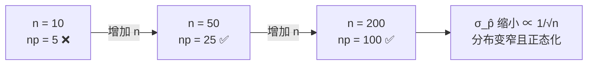

# 比例的抽样分布

**所属：** [[Unit_5_Sampling_Distributions|单元 5 — 抽样分布]]

## 定义

设 $\hat{p}$ 为来自总体真实比例为 $p$ 的简单随机样本（SRS）中成功的样本比例，样本容量为 $n$。**$\hat{p}$ 的抽样分布**描述 $\hat{p}$ 在所有可能样本中如何变化。

## 三个支柱

### 1. 中心——无偏

$$
\mu_{\hat{p}} = p
$$

样本比例是总体比例的**无偏估计量**。平均而言，$\hat{p}$ 击中 $p$。

### 2. 离散——标准误

$$
\sigma_{\hat{p}} = \sqrt{\frac{p(1-p)}{n}}
$$

$n$ 越大 → 离散越小。$p(1-p)$ 越大（$p = 0.5$ 时最大）→ 离散越大。

### 3. 形状——近似正态

条件满足时，抽样分布近似正态：

$$
\hat{p} \sim N\!\left(p,\; \sqrt{\frac{p(1-p)}{n}}\right)
$$

## 正态近似的条件

| 条件 | 要求 | 为什么重要 |
|-----------|-------------|----------------|
| **随机** | SRS 或随机化实验 | 避免偏倚；保证独立性 |
| **10% 条件** | $n \le 0.10N$ | 独立性：每个样本 < 总体的 10% |
| **大计数** | $np \ge 10$ 且 $n(1-p) \ge 10$ | 成功和失败个数足够，使 CLT 生效 |

> [!warning] 如果条件不满足
> - 不随机 → 不能推广；停止。
> - 违反 10% → 使用**有限总体校正**：$\sigma_{\hat{p}} = \sqrt{\frac{p(1-p)}{n}} \cdot \sqrt{\frac{N-n}{N-1}}$
> - 大计数条件不满足 → 分布偏斜；改用精确二项方法。

## $n$ 增大时有什么变化？

```mermaid
flowchart LR
    A["n = 10<br/>np = 5 ❌"] -->|"增加 n"| B["n = 50<br/>np = 25 ✅"]
    B -->|"增加 n"| C["n = 200<br/>np = 100 ✅"]
    C --> D["σ_p̂ 缩小 ∝ 1/√n<br/>分布变窄且正态化"]
```

$n$ 增大时：
- $\sigma_{\hat{p}}$ 以 $\frac{1}{\sqrt{n}}$ 的因子缩小
- **形状**变得更正态（即使 $p$ 偏斜）
- **中心**保持在 $p$（无偏性不变）

## 标准化 $\hat{p}$

将 $\hat{p}$ 转换为 $z$ 分数以计算概率：

$$
z = \frac{\hat{p} - p}{\sqrt{\frac{p(1-p)}{n}}}
$$

条件满足时，此 $z$ 服从标准正态分布 $N(0, 1)$。

## 示例：抛硬币

假设 $p = 0.5$（均匀硬币），$n = 100$ 次抛掷。

- $\mu_{\hat{p}} = 0.5$
- $\sigma_{\hat{p}} = \sqrt{\frac{0.5(0.5)}{100}} = 0.05$
- $np = 50 \ge 10$，$n(1-p) = 50 \ge 10$ ✅

**问题：** $\hat{p} \ge 0.60$ 的概率是多少？

$$
z = \frac{0.60 - 0.50}{0.05} = 2.0
$$

$$
P(Z \ge 2.0) = 0.0228
$$

从均匀硬币做 100 次抛掷的样本中，只有约 2.3% 会出现 60% 或更多正面。

## 与推断的关系

$\hat{p}$ 的抽样分布是以下两者的基础：

- **[[Confidence_Intervals_Proportions]]**——用 $\hat{p}$ 作为点估计，标准误使用 $\hat{p}$（或检验时用 $p_0$）
- **[[Significance_Tests_Proportions]]**——$H_0: p = p_0$ 下的零分布使用 $\sigma_{\hat{p}} = \sqrt{p_0(1-p_0)/n}$

> [!summary] 快速参考
> - **中心：** $\mu_{\hat{p}} = p$
> - **离散：** $\sigma_{\hat{p}} = \sqrt{p(1-p)/n}$
> - **形状：** 满足随机、10%、大计数条件时正态
> - **标准误（估计值）：** $SE_{\hat{p}} = \sqrt{\hat{p}(1-\hat{p})/n}$（$p$ 未知时使用）

---

[[AP_Statistics_MOC|← 返回 AP 统计学知识地图]]