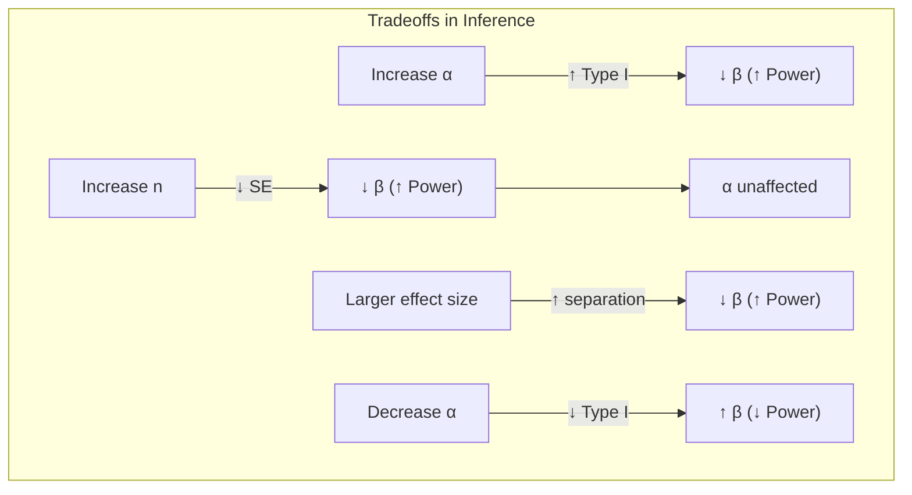
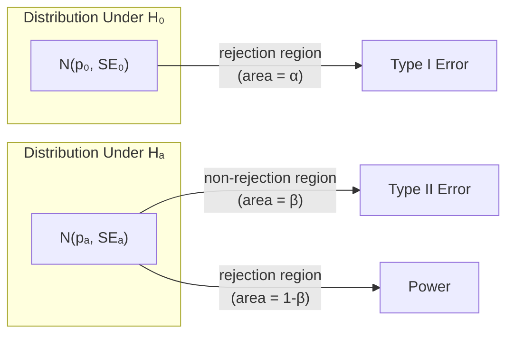

# Type I and Type II Errors

**Parent:** [[Unit_6_Inference_for_Proportions|Unit 6 — Inference for Proportions]]

---

## The Decision Framework

When we perform a hypothesis test, there are **four possible outcomes** — two correct, two incorrect.

### $2 \times 2$ Decision Table

| | $H_0$ is **True** | $H_0$ is **False** |
|:---|:---:|:---:|
| **Reject $H_0$** | ❌ **Type I Error** (False Positive) | ✅ **Correct Decision** (Power) |
| **Fail to Reject $H_0$** | ✅ **Correct Decision** | ❌ **Type II Error** (False Negative) |

---

## Type I Error

> **Definition:** Rejecting $H_0$ when $H_0$ is actually true. A **false positive**.

**Probability:** $\alpha$ (the significance level)

- $\alpha$ is set **before** data collection (common values: 0.10, 0.05, 0.01)
- A test at $\alpha = 0.05$ will incorrectly reject a true $H_0$ about 5% of the time
- **Consequence example:** Concluding a drug is effective when it actually isn't — leading to approval of an ineffective treatment

---

## Type II Error

> **Definition:** Failing to reject $H_0$ when $H_0$ is actually false. A **false negative**.

**Probability:** $\beta$

- $\beta$ depends on: the true effect size, sample size $n$, and $\alpha$
- $\beta$ is **not** directly set by the analyst; it is calculated from the specific alternative
- **Consequence example:** Concluding a drug is ineffective when it actually works — missing a potential treatment

---

## Power

> **Definition:** The probability of correctly rejecting $H_0$ when $H_0$ is false.

$$
\text{Power} = 1 - \beta
$$

Increasing power means we are more likely to detect a real effect when one exists.

### How to Increase Power

| Method | Effect | Tradeoff |
|--------|--------|----------|
| Increase sample size $n$ | Decreases SE, separates null & alternative distributions | Cost, time |
| Increase $\alpha$ | Reject more often (lower threshold) | Higher Type I error rate |
| Larger effect size | Naturally easier to detect | Cannot control (it's the truth) |
| Reduce variability | Better data collection | Often limited by population |

---

## Relationships Between $\alpha$, $\beta$, $n$, and Effect Size

> [!key] Fundamental Tension
> For a fixed $n$, decreasing $\alpha$ increases $\beta$. The only way to reduce **both** error types simultaneously is to increase $n$.

---

## Calculating $\beta$ and Power (One-Proportion $z$-Test)

**Setup:** Test $H_0: p = p_0$ vs $H_a: p > p_0$ at level $\alpha$.

**Step 1 — Find the rejection cutoff:**

$$
\text{Reject if } \hat{p} > p_0 + z_\alpha \sqrt{\frac{p_0(1-p_0)}{n}}
$$

Let this critical value be $\hat{p}_c$.

**Step 2 — Compute $\beta$ for a specific alternative $p_a > p_0$:**

$$
\beta = P(\hat{p} \le \hat{p}_c \mid p = p_a) = \Phi\!\left(\frac{\hat{p}_c - p_a}{\sqrt{p_a(1-p_a)/n}}\right)
$$

**Step 3 — Power:**

$$
\text{Power} = 1 - \beta = P(\hat{p} > \hat{p}_c \mid p = p_a)
$$

---

## Visualizing the Tradeoff

- **$\alpha$** = area under $H_0$ curve in the rejection region
- **$\beta$** = area under $H_a$ curve in the non-rejection region
- **Power** = area under $H_a$ curve in the rejection region

---

## AP Exam Tips

> [!tip] How to Identify Error Types on the Exam
> 1. Determine $H_0$ and $H_a$ from the problem context.
> 2. Ask: "If $H_0$ is true but we reject it → Type I." / "If $H_0$ is false but we don't reject → Type II."
> 3. Always describe the error **in context**, not just in symbols.
>
> **Example (Type I):** "Concluding that the new teaching method is more effective when it actually isn't."
> **Example (Type II):** "Concluding that the new teaching method is not more effective when it actually is."

---

## Summary

| Concept | Symbol | Definition | How to Reduce |
|---------|--------|------------|---------------|
| Type I Error | $\alpha$ | Reject true $H_0$ (false positive) | Decrease $\alpha$ |
| Type II Error | $\beta$ | Fail to reject false $H_0$ (false negative) | Increase $n$, increase $\alpha$ |
| Power | $1-\beta$ | Correctly reject false $H_0$ | Increase $n$, increase $\alpha$, larger effect |

Related: [[Significance_Tests_Proportions|Significance Tests for Proportions]], [[Confidence_Intervals_Proportions|Confidence Intervals]]

---

[[AP_Statistics_MOC|← Back to AP Statistics MOC]]
