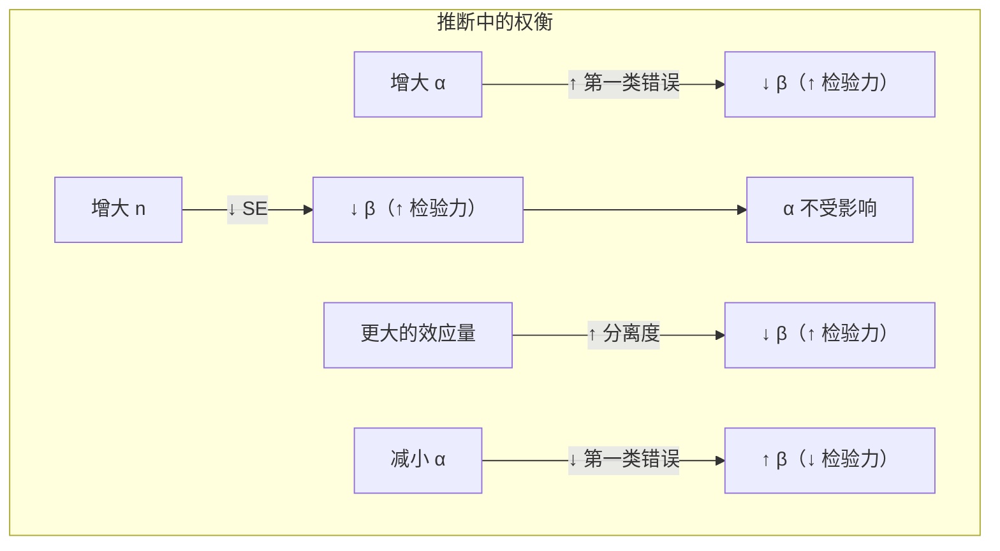
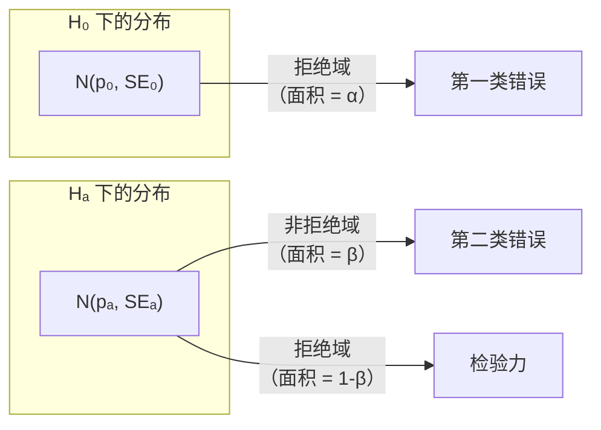

# 第一类错误与第二类错误

**所属：** [[Unit_6_Inference_for_Proportions|单元 6 — 比例的推断]]

## 决策框架

做假设检验时，有**四种可能结果**——两种正确，两种错误。

### $2 \times 2$ 决策表

| | $H_0$ 为**真** | $H_0$ 为**假** |
|:---|:---:|:---:|
| **拒绝 $H_0$** | ❌ **第一类错误**（假阳性） | ✅ **正确决策**（检验力） |
| **无法拒绝 $H_0$** | ✅ **正确决策** | ❌ **第二类错误**（假阴性） |

## 第一类错误

> **定义：** $H_0$ 实际为真时拒绝 $H_0$。即**假阳性**。

**概率：** $\alpha$（显著性水平）

- $\alpha$ 在**收集数据前**设定（常用值：0.10、0.05、0.01）
- 在 $\alpha = 0.05$ 下检验，约有 5% 的概率错误拒绝真实的 $H_0$
- **后果示例：** 断定某药有效而实际上无效——导致批准无效治疗

## 第二类错误

> **定义：** $H_0$ 实际为假时无法拒绝 $H_0$。即**假阴性**。

**概率：** $\beta$

- $\beta$ 取决于：真实效应量、样本量 $n$ 和 $\alpha$
- $\beta$ **不是**分析者直接设定的；它由特定备择假设计算得出
- **后果示例：** 断定某药无效而实际上有效——错过潜在治疗

## 检验力（Power）

> **定义：** $H_0$ 实际为假时正确拒绝 $H_0$ 的概率。

$$
\text{检验力} = 1 - \beta
$$

检验力越高，越可能检测到真实存在的效应。

### 如何提高检验力

| 方法 | 效果 | 权衡 |
|--------|--------|----------|
| 增加样本量 $n$ | 减小 SE，拉开零分布与备择分布的距离 | 成本、时间 |
| 增大 $\alpha$ | 更频繁拒绝（阈值更低） | 第一类错误率更高 |
| 更大的效应量 | 自然更容易检测 | 无法控制（这是真相） |
| 减少变异 | 更好的数据收集 | 常受总体限制 |

## $\alpha$、$\beta$、$n$ 与效应量的关系

```mermaid
flowchart TB
    subgraph Tradeoffs["推断中的权衡"]
        A["增大 α"] -->|"↑ 第一类错误"| B["↓ β（↑ 检验力）"]
        C["增大 n"] -->|"↓ SE"| D["↓ β（↑ 检验力）"]
        D --> E["α 不受影响"]
        F["更大的效应量"] -->|"↑ 分离度"| G["↓ β（↑ 检验力）"]
        H["减小 α"] -->|"↓ 第一类错误"| I["↑ β（↓ 检验力）"]
    end
```

> [!key] 基本张力
> 固定 $n$ 时，减小 $\alpha$ 会增大 $\beta$。要**同时**减少两类错误，唯一途径是增大 $n$。

## 计算 $\beta$ 与检验力（单比例 $z$ 检验）

**设定：** 在水平 $\alpha$ 下检验 $H_0: p = p_0$ vs $H_a: p > p_0$。

**步骤 1——求拒绝阈值：**

$$
\text{如果 } \hat{p} > p_0 + z_\alpha \sqrt{\frac{p_0(1-p_0)}{n}}，则拒绝
$$

设此临界值为 $\hat{p}_c$。

**步骤 2——对特定备择 $p_a > p_0$ 计算 $\beta$：**

$$
\beta = P(\hat{p} \le \hat{p}_c \mid p = p_a) = \Phi\!\left(\frac{\hat{p}_c - p_a}{\sqrt{p_a(1-p_a)/n}}\right)
$$

**步骤 3——检验力：**

$$
\text{检验力} = 1 - \beta = P(\hat{p} > \hat{p}_c \mid p = p_a)
$$

## 可视化权衡

```mermaid
flowchart LR
    subgraph NullDist["H₀ 下的分布"]
        ND["N(p₀, SE₀)"]
    end
    subgraph AltDist["Hₐ 下的分布"]
        AD["N(pₐ, SEₐ)"]
    end
    ND -->|"拒绝域<br/>（面积 = α）"| RR["第一类错误"]
    AD -->|"非拒绝域<br/>（面积 = β）"| NR["第二类错误"]
    AD -->|"拒绝域<br/>（面积 = 1-β）"| PW["检验力"]
```

- **$\alpha$** = $H_0$ 曲线下拒绝域的面积
- **$\beta$** = $H_a$ 曲线下非拒绝域的面积
- **检验力** = $H_a$ 曲线下拒绝域的面积

## AP 考试提示

> [!tip] 考试中如何识别错误类型
> 1. 从题目情境确定 $H_0$ 和 $H_a$。
> 2. 问自己："如果 $H_0$ 为真但我们拒绝了 → 第一类错误。"/"如果 $H_0$ 为假但我们没有拒绝 → 第二类错误。"
> 3. 始终**结合情境**描述错误，而不是只用符号。
>
> **示例（第一类）：**"断定新教学法更有效，而实际上并非如此。"
> **示例（第二类）：**"断定新教学法并不更有效，而实际上确实更有效。"

## 总结

| 概念 | 符号 | 定义 | 如何减少 |
|---------|--------|------------|---------------|
| 第一类错误 | $\alpha$ | 拒绝真实的 $H_0$（假阳性） | 减小 $\alpha$ |
| 第二类错误 | $\beta$ | 无法拒绝虚假的 $H_0$（假阴性） | 增大 $n$、增大 $\alpha$ |
| 检验力 | $1-\beta$ | 正确拒绝虚假的 $H_0$ | 增大 $n$、增大 $\alpha$、更大效应 |

相关：[[Significance_Tests_Proportions|比例的显著性检验]]、[[Confidence_Intervals_Proportions|比例的置信区间]]

---

[[AP_Statistics_MOC|← 返回 AP 统计学知识地图]]