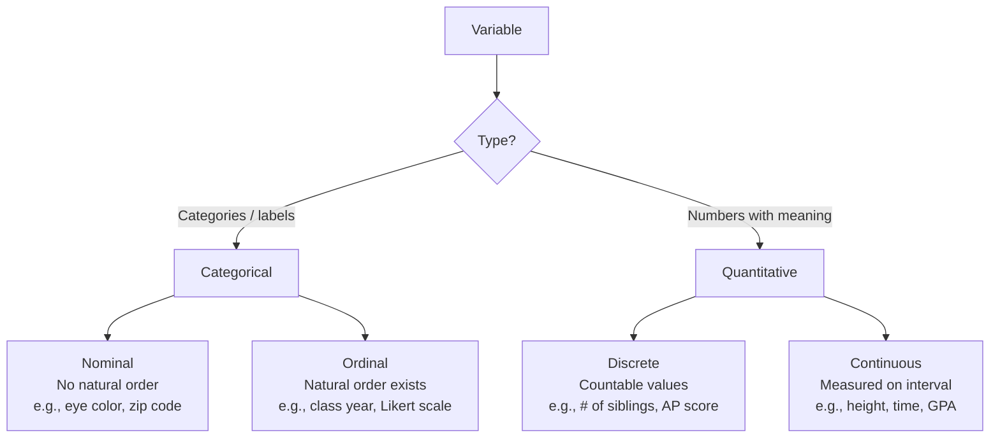

# Unit 1 — Exploring One-Variable Data

> **AP Exam Weight:** 15–23% | **Big Idea:** Variation and Distribution

Unit 1 introduces the fundamental vocabulary and graphical toolkit for describing a single variable. Before we can model relationships or draw inferences, we must first understand what kind of data we have and how to display it honestly.

Part of: [[AP_Statistics_MOC]].

## Classifying Data

The first decision in any analysis is to identify the **type** of variable.



- **Categorical (qualitative):** Places individuals into groups. Zip codes are categorical despite being numeric — you cannot compute a meaningful average zip code.
- **Quantitative:** Represents a measurable quantity. Discrete variables take a finite or countably infinite set of values; continuous variables can assume any value in an interval.

## Displaying One-Variable Data

### Frequency Tables

A **frequency table** lists each category alongside its count (frequency) and proportion (relative frequency). The cumulative relative frequency sums proportions up to and including each category — meaningful only when categories have a natural order.

| Favorite Sport | Frequency | Relative Freq. | Cumulative Rel. Freq. |
|:---|:---:|:---:|:---:|
| Soccer | 24 | 0.40 | 0.40 |
| Basketball | 18 | 0.30 | 0.70 |
| Baseball | 12 | 0.20 | 0.90 |
| Other | 6 | 0.10 | 1.00 |

### Dotplots

Each observation is a dot stacked above its value. Best for small datasets ($n < 50$). Reveals clusters, gaps, and outliers instantly.

### Histograms

Divide the range into **bins** (intervals of equal width) and count observations in each bin. The area of each bar is proportional to the frequency.

- **Choice of bin width matters:** Too narrow → jagged noise; too wide → lost detail.
- Unlike bar charts (used for categorical data), histogram bars **touch** — reflecting the continuous nature of the underlying variable.

### Stemplots (Stem-and-Leaf Plots)

Split each observation into a **stem** (all but the final digit) and a **leaf** (final digit). Preserves raw data while showing shape.

**Example:** Scores 73, 78, 81, 82, 82, 88, 93, 95

```
7 | 3 8
8 | 1 2 2 8
9 | 3 5
Key: 7|3 = 73
```

**Split stemplots** double each stem (first occurrence for leaves 0–4, second for 5–9) when data are too concentrated. **Back-to-back stemplots** compare two distributions by sharing a common stem column.

### Boxplots (Box-and-Whisker Plots)

A boxplot displays the **five-number summary**:

$$\text{Minimum} \rightarrow Q_1 \rightarrow \text{Median} \rightarrow Q_3 \rightarrow \text{Maximum}$$

- The **box** spans $Q_1$ to $Q_3$ (the interquartile range, IQR).
- A line inside marks the **median**.
- **Whiskers** extend to the most extreme non-outlier observations. Any point beyond $1.5 \times \text{IQR}$ from the quartiles is plotted individually as an **outlier**.
- **Modified boxplots** plot outliers explicitly; standard boxplots extend whiskers to min/max.

Boxplots are excellent for comparing several groups side-by-side, but they conceal multimodality — always supplement with a histogram or density plot when exploring data.

## Why Display Data Graphically?

1. **Reveal shape** (symmetric, skewed, gaps, clusters).
2. **Detect outliers** that may be errors or interesting cases.
3. **Suggest transformations** (e.g., log for right-skewed data).
4. **Prevent being misled** by summary statistics alone (Anscombe's quartet is made of four datasets with identical $\bar{x}, s, r$ but radically different scatterplots).

## Cautions

- **Area principle:** The area representing each category must be proportional to the frequency. 3D pie charts and unconstrained pictograms violate this.
- **Misleading axes:** Truncated y-axes exaggerate differences. Always check the baseline.
- **Overplotting:** With large $n$, dotplots become unreadable; switch to histograms or kernel density plots.

> [!tip] Exam Tip
> On free-response questions, ALWAYS identify the variable type before choosing a display. "I will use a histogram because the variable is quantitative" earns a point.

**Next:** [[Describing_Distributions]] | [[Measuring_Center_and_Spread]]
