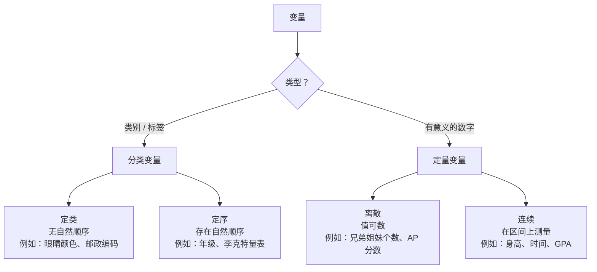

# Unit 1 — 探索单变量数据

> **AP 考试占比：** 15–23% | **核心思想：** 变异与分布（Variation and Distribution）

单元 1 引入描述单个变量的基础词汇和图形工具。建模关系或进行推断之前，必须先弄清数据类型，以及如何如实展示数据。

属于：[[AP_Statistics_MOC]]。

## 数据分类

任何分析的第一步，都是确定变量的**类型**。


```mermaid
flowchart TD
    A[变量] --> B{类型？}
    B -->|"类别 / 标签"| C[分类变量]
    B -->|"有意义的数字"| D[定量变量]
    C --> E[定类<br/>无自然顺序<br/>例如：眼睛颜色、邮政编码]
    C --> F[定序<br/>存在自然顺序<br/>例如：年级、李克特量表]
    D --> G[离散<br/>值可数<br/>例如：兄弟姐妹个数、AP 分数]
    D --> H[连续<br/>在区间上测量<br/>例如：身高、时间、GPA]
```

- **分类变量（定性）：** 将个体归入组别。邮政编码虽是数字，但属于分类变量——求平均邮政编码没有意义。
- **定量变量：** 表示可测量的数量。离散变量取值有限或可数无限；连续变量可取区间内任意值。

## 展示单变量数据

### 频数表

**频数表**列出每个类别及其计数（频数）和比例（相对频数）。累积相对频数把截至当前类别（含当前）的比例累加——仅当类别有自然顺序时才有意义。

| 最喜爱的运动 | 频数 | 相对频数 | 累积相对频数 |
|:---|:---:|:---:|:---:|
| 足球 | 24 | 0.40 | 0.40 |
| 篮球 | 18 | 0.30 | 0.70 |
| 棒球 | 12 | 0.20 | 0.90 |
| 其他 | 6 | 0.10 | 1.00 |

### 点图（Dotplot）

每个观测值在其取值上方堆叠一个点。最适合小样本（$n < 50$）。可立即看出簇、间隙和离群值。

### 直方图（Histogram）

把取值范围划分为**组**（等宽的区间），统计每个组内的观测数。柱形的面积与频数成正比。

- **组宽的选择很关键：** 太窄 → 锯齿状噪声；太宽 → 丢失细节。
- 与条形图（用于分类数据）不同，直方图的柱子**紧挨无间隙**——反映底层变量的连续性。

### 茎叶图（Stem-and-Leaf Plot）

把每个观测值拆成**茎**（末位以外的数字）和**叶**（末位数字）。保留原始数据，同时展示分布形状。

**示例：** 分数 73, 78, 81, 82, 82, 88, 93, 95

```
7 | 3 8
8 | 1 2 2 8
9 | 3 5
键：7|3 = 73
```

数据过于集中时，可用**分裂茎叶图**把每个茎拆成两行（第一行放叶 0–4，第二行放 5–9）。**背靠背茎叶图**共用中间一列茎，用于比较两个分布。

### 箱线图（Box-and-Whisker Plot）

箱线图展示**五数概括**：

$$\text{最小值} \rightarrow Q_1 \rightarrow \text{中位数} \rightarrow Q_3 \rightarrow \text{最大值}$$

- **箱体**从 $Q_1$ 延伸到 $Q_3$（即四分位距 IQR）。
- 箱内横线标记**中位数**。
- **须（whiskers）**延伸到最远的非离群观测值。超出四分位数 $1.5 \times \text{IQR}$ 的点，单独画出，标记为**离群值**。
- **修正箱线图**明确画出离群值；标准箱线图的须延伸到最小/最大值。

箱线图非常适合并排比较多组数据，但它会掩盖多峰性——探索数据时，务必辅以直方图或密度图。

## 为什么要用图形展示数据？

1. **揭示分布形状**（对称、偏斜、间隙、簇）。
2. **发现离群值**——可能是错误，也可能是有趣的案例。
3. **提示变换**（例如右偏数据取对数）。
4. **防止被汇总统计量误导**（安斯库姆四重奏：四组数据的 $\bar{x}, s, r$ 完全相同，散点图却截然不同）。

## 注意事项

- **面积原则：** 每个类别对应的面积必须与频数成正比。3D 饼图和无约束的象形图违反此原则。
- **误导性坐标轴：** 截断的 y 轴会夸大差异。始终检查基线。
- **过度绘制：** $n$ 很大时，点图难以辨认；改用直方图或核密度图。

> [!tip] 考试提示
> 在自由回答题中，选择图表前**务必先说明变量类型**。"因为变量是定量的，所以我用直方图"——这就能得分。

**下一篇：** [[Describing_Distributions]] | [[Measuring_Center_and_Spread]]
