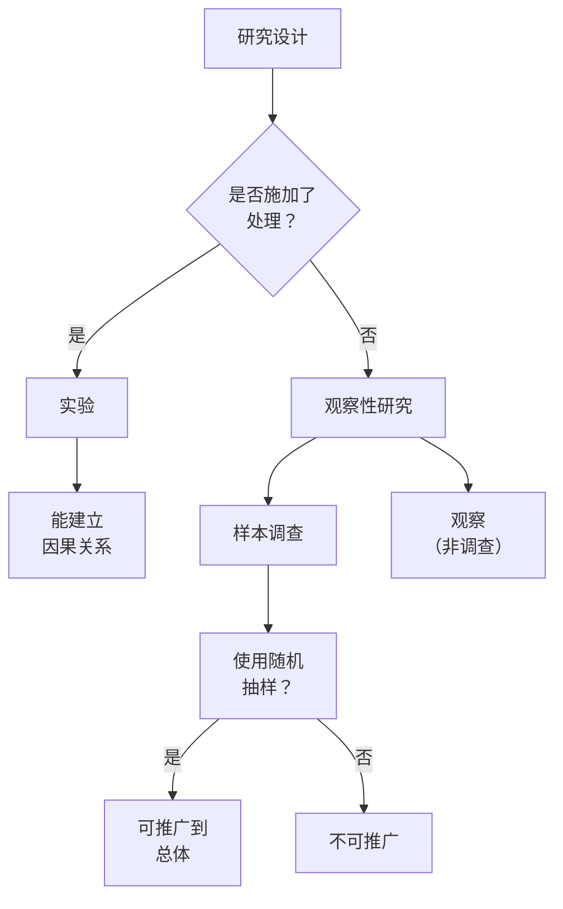

# Unit 3 — 数据收集

**考试占比：** AP 统计学的 12–15%。单元 3 讲解如何正确收集数据，使结论有效——这是统计推断的基础。

> [!info] 为什么这很重要
> 任何统计技术都无法挽救收集不当的数据。有偏样本或混杂实验产生的结论比无用更糟——它们具有误导性。

### 核心词汇

| 术语 | 定义 |
|------|------------|
| **总体（Population）** | 我们想获取信息的全部个体 |
| **样本（Sample）** | 实际收集数据的总体子集 |
| **参数（Parameter）** | 描述总体的数字（例如 $\mu$、$p$） |
| **统计量（Statistic）** | 描述样本的数字（例如 $\bar{x}$、$\hat{p}$） |
| **普查（Census）** | 试图收集总体中每个个体的数据 |
| **偏倚（Bias）** | 系统性误差，始终高估或低估真实值 |

关系很简单：我们用来自**样本**的**统计量**估计关于**总体**的**参数**。估计的质量完全取决于样本的收集方式。

### 研究设计分类

### 观察性研究 vs 实验

- **观察性研究：** 观察个体并测量感兴趣的变量，不施加任何处理。能揭示**关联**，但不能揭示因果。
- **实验：** 故意对个体施加处理以测量其响应。设计得当的实验能建立**因果关系**。

实验的根本优势在于：随机化通过使处理组在除处理本身外的所有变量上大致相等，来控制潜伏变量。

### 随机抽样 → 可推广性

如果样本从总体中**随机选取**，结果可以**推广**回该总体。如果样本有偏（便利、自愿响应），推广性就丧失。

### 随机分配 → 因果关系

如果实验中受试者被**随机分配**到处理组，我们就能得出**因果结论**。没有随机分配，实验比观察性研究好不了多少。

> [!warning] 常见混淆
> **随机抽样**决定谁*进入*研究（可推广性）。**随机分配**决定他们*接受*哪种处理（因果关系）。一项研究可以只有其一，没有另一个。

### 理想情况：随机抽样 + 随机分配

设计良好的调查用随机抽样推广到总体。设计良好的实验用随机分配建立因果关系——并用随机抽样推广那些因果结论。

### 关键要点

1. **总体** → **参数**；**样本** → **统计量**
2. 观察性研究展示关联；实验（含随机化）展示因果
3. 抽样方法决定结论能否推广
4. [[Sampling_Methods|抽样方法 →]]
5. [[Experimental_Design|实验设计 →]]

---
相关笔记：[[AP_Statistics_MOC]]