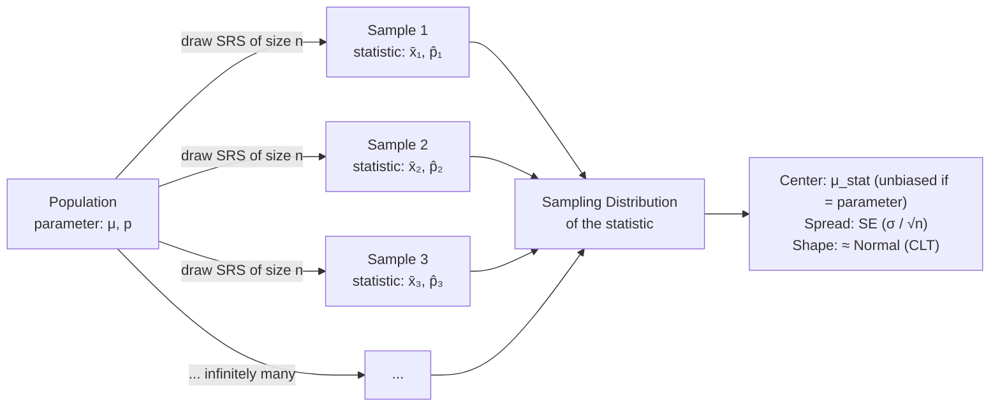
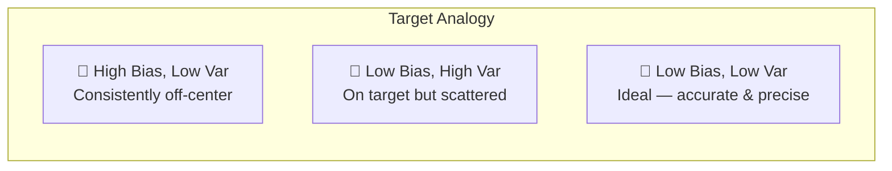

# Unit 5: Sampling Distributions

**Exam weight:** 7–12% | **Prerequisite:** [[AP_Statistics_MOC|AP Statistics MOC]] → Unit 1–4 (Exploring Data, Collecting Data, Probability)

---

## Core Idea

A **sampling distribution** is the probability distribution of a *statistic* (e.g., $\hat{p}$, $\bar{x}$) obtained from all possible samples of the same size $n$ drawn from the same population. It is the bridge between probability and inference — the single most important concept in AP Statistics.

---

## Population ↔ Sample ↔ Sampling Distribution

| Concept | Definition | Variability | Notation |
|---------|-----------|-------------|----------|
| **Population** | All individuals of interest | $\sigma$ (parameter) | $N$, $\mu$, $p$ |
| **Sample** | A subset drawn from the population | $s$ (statistic) | $n$, $\bar{x}$, $\hat{p}$ |
| **Sampling Distribution** | Distribution of a statistic over all possible samples of size $n$ | $\sigma_{\text{stat}}$ (SE) | $\mu_{\hat{p}}$, $\sigma_{\hat{p}}$ |

---

## Bias vs. Variability

A good estimator has **low bias** and **low variability**.

- **Bias** — Systematic error. The center of the sampling distribution is *not* at the true parameter value. High bias = the estimator consistently misses.
- **Variability** — Spread of the sampling distribution. High variability = the statistic jumps wildly from sample to sample.

> [!key] Unbiasedness
> A statistic is an **unbiased estimator** of a parameter if $\mu_{\text{stat}} = \text{parameter}$. Both $\bar{x}$ (for $\mu$) and $\hat{p}$ (for $p$) are unbiased.

---

## Factors Affecting Sampling Distributions

1. **Sample size $n$** — Larger $n$ reduces variability (standard error $\propto 1/\sqrt{n}$).
2. **Population variability $\sigma$** — More variable populations produce more variable sampling distributions.
3. **Sampling method** — Only random sampling (SRS, stratified, cluster) produces valid sampling distributions. Convenience/volunteer samples induce bias.

---

## Key Formulas (Preview)

| Statistic | Mean | Standard Error |
|-----------|------|----------------|
| Sample proportion $\hat{p}$ | $\mu_{\hat{p}} = p$ | $\sigma_{\hat{p}} = \sqrt{\frac{p(1-p)}{n}}$ |
| Sample mean $\bar{x}$ | $\mu_{\bar{x}} = \mu$ | $\sigma_{\bar{x}} = \frac{\sigma}{\sqrt{n}}$ |

---

## Why This Matters for Inference

The sampling distribution is the **null distribution** for hypothesis tests and the basis for **confidence intervals**. Without understanding its shape, center, and spread, we cannot quantify uncertainty — which is the whole point of inferential statistics.

> [!summary] Unit 5 Roadmap
> 1. [[Sampling_Distribution_Proportions]] — $\hat{p}$: conditions, normal approximation
> 2. [[Sampling_Distribution_Means]] — $\bar{x}$: Central Limit Theorem, $t$-distribution
> 3. → [[Unit_6_Inference_for_Proportions|Unit 6: Inference for Proportions]]
