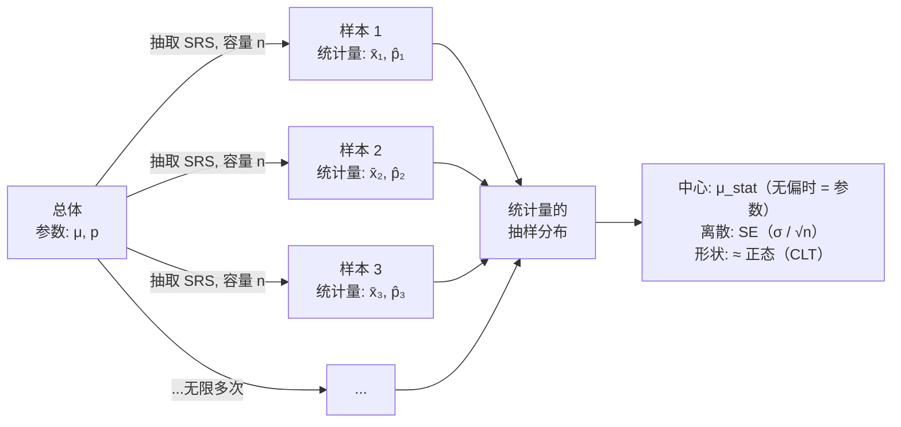

# Unit 5 — 抽样分布

**考试占比：** 7–12% | **前置知识：** [[AP_Statistics_MOC]] → 单元 1–4（探索数据、收集数据、概率）

## 核心思想

**抽样分布**是某个*统计量*（例如 $\hat{p}$、$\bar{x}$）从同一总体中所有可能相同容量 $n$ 的样本得到的概率分布。它是连接概率与推断的桥梁——AP 统计学中最重要的概念。

## 总体 ↔ 样本 ↔ 抽样分布

| 概念 | 定义 | 变异 | 符号 |
|---------|-----------|-------------|----------|
| **总体** | 所有感兴趣的个体 | $\sigma$（参数） | $N$、$\mu$、$p$ |
| **样本** | 从总体中抽取的一个子集 | $s$（统计量） | $n$、$\bar{x}$、$\hat{p}$ |
| **抽样分布** | 统计量在所有可能容量 $n$ 样本上的分布 | $\sigma_{\text{stat}}$（标准误） | $\mu_{\hat{p}}$、$\sigma_{\hat{p}}$ |

```mermaid
flowchart LR
    A["总体<br/>参数: μ, p"] -->|"抽取 SRS, 容量 n"| B["样本 1<br/>统计量: x̄₁, p̂₁"]
    A -->|"抽取 SRS, 容量 n"| C["样本 2<br/>统计量: x̄₂, p̂₂"]
    A -->|"抽取 SRS, 容量 n"| D["样本 3<br/>统计量: x̄₃, p̂₃"]
    A -->|"...无限多次"| E[...]
    B --> F["统计量的<br/>抽样分布"]
    C --> F
    D --> F
    E --> F
    F --> G["中心: μ_stat（无偏时 = 参数）<br/>离散: SE（σ / √n）<br/>形状: ≈ 正态（CLT）"]
```

## 偏倚 vs 变异

好的估计量具有**低偏倚**和**低变异**。

- **偏倚（Bias）**——系统性误差。抽样分布的中心*不在*真实参数值上。高偏倚 = 估计量始终偏离目标。
- **变异（Variability）**——抽样分布的离散程度。高变异 = 统计量在不同样本间剧烈波动。

```mermaid
flowchart LR
    subgraph Target[靶心类比]
        T1["🎯 高偏倚、低变异<br/>始终偏离中心"]
        T2["🎯 低偏倚、高变异<br/>围绕目标但分散"]
        T3["🎯 低偏倚、低变异<br/>理想——准确且精确"]
    end
```

> [!key] 无偏性
> 如果 $\mu_{\text{stat}} = \text{参数}$，则统计量是参数的一个**无偏估计量**。$\bar{x}$（对 $\mu$）和 $\hat{p}$（对 $p$）都是无偏的。

## 影响抽样分布的因素

1. **样本容量 $n$**——$n$ 越大，变异越小（标准误 $\propto 1/\sqrt{n}$）。
2. **总体变异 $\sigma$**——总体变异越大，抽样分布变异越大。
3. **抽样方法**——只有随机抽样（SRS、分层、整群）才能产生有效的抽样分布。便利/自愿样本会引入偏倚。

## 关键公式（预览）

| 统计量 | 均值 | 标准误 |
|-----------|------|----------------|
| 样本比例 $\hat{p}$ | $\mu_{\hat{p}} = p$ | $\sigma_{\hat{p}} = \sqrt{\frac{p(1-p)}{n}}$ |
| 样本均值 $\bar{x}$ | $\mu_{\bar{x}} = \mu$ | $\sigma_{\bar{x}} = \frac{\sigma}{\sqrt{n}}$ |

## 这对推断为什么重要

抽样分布是假设检验的**零分布**和**置信区间**的基础。不理解它的形状、中心和离散程度，就无法量化不确定性——而这正是推断统计学的全部意义。

> [!summary] 单元 5 路线图
> 1. [[Sampling_Distribution_Proportions]]——$\hat{p}$：条件、正态近似
> 2. [[Sampling_Distribution_Means]]——$\bar{x}$：中心极限定理、$t$ 分布
> 3. → [[Unit_6_Inference_for_Proportions|单元 6：比例推断]]