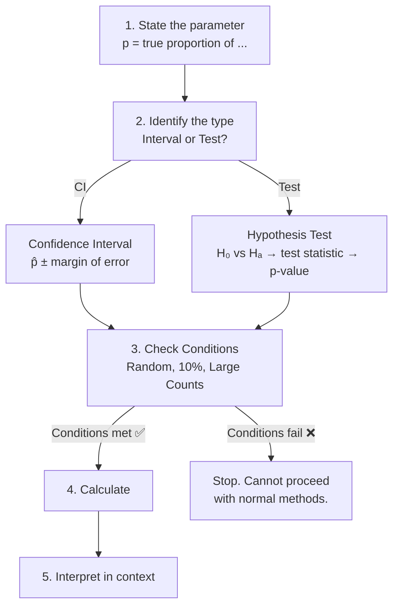
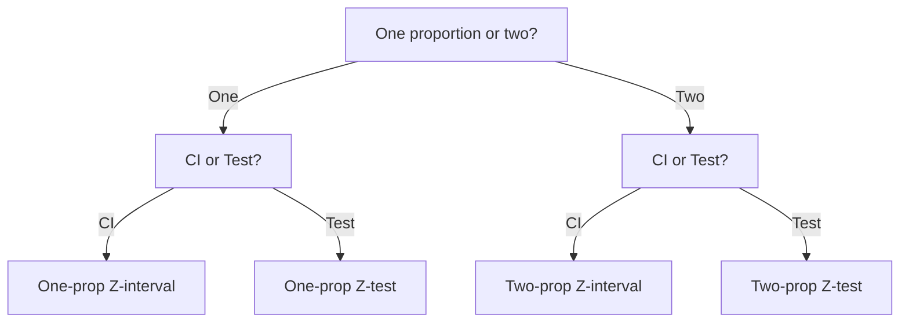

# Unit 6: Inference for Proportions

**Exam weight:** 12–15% | **Prerequisite:** [[Unit_5_Sampling_Distributions|Unit 5 — Sampling Distributions]]

---

## Core Idea

**Statistical inference** uses sample data to draw conclusions about a population parameter. For proportions, the parameter of interest is $p$, the true proportion of successes in the population.

There are **two arms** of inference, and they are dual:

| Arm | Question | Output |
|-----|----------|--------|
| **Confidence Interval** | "What is a plausible range for $p$?" | Range of values |
| **Hypothesis Test** | "Is the evidence strong enough to reject $H_0$?" | Decision + $p$-value |

> [!key] The Duality
> A two-sided hypothesis test at level $\alpha$ rejects $H_0: p = p_0$ exactly when $p_0$ falls outside a $C = 1-\alpha$ confidence interval. They are two sides of the same coin.

---

## Structure of an Inference Problem

---

## The Four-Step Inference Process (AP Exam Format)

| Step | What to Write | Example (Proportions) |
|------|--------------|----------------------|
| **1. State** | Parameter + type + confidence level / $\alpha$ | "We want to estimate $p$, the true proportion of ..." |
| **2. Plan** | Check conditions (Random, 10%, Large Counts) | "SRS ✅; $n \le 0.10N$ ✅; $np \ge 10$ ✅" |
| **3. Do** | Calculate interval or test statistic | "$\hat{p} \pm z^*\sqrt{\hat{p}(1-\hat{p})/n}$" |
| **4. Conclude** | Interpret in context | "We are 95% confident that ..." |

> [!tip] AP Exam Tip
> Always write the **full four-step process** on free-response questions. Partial credit is awarded at each step.

---

## Unit 6 Roadmap

### One-Proportion Inference

| Topic | Method | Formula |
|-------|--------|---------|
| [[Confidence_Intervals_Proportions\|One-Proportion Z-Interval]] | Estimate $p$ | $\hat{p} \pm z^* \sqrt{\frac{\hat{p}(1-\hat{p})}{n}}$ |
| [[Significance_Tests_Proportions\|One-Proportion Z-Test]] | Test $H_0: p = p_0$ | $z = \frac{\hat{p} - p_0}{\sqrt{p_0(1-p_0)/n}}$ |

### Two-Proportion Inference

| Topic | Method | Formula |
|-------|--------|---------|
| [[Confidence_Intervals_Proportions\|Two-Proportion Z-Interval]] | Estimate $p_1 - p_2$ | $(\hat{p}_1 - \hat{p}_2) \pm z^* \sqrt{ \frac{\hat{p}_1(1-\hat{p}_1)}{n_1} + \frac{\hat{p}_2(1-\hat{p}_2)}{n_2} }$ |
| [[Significance_Tests_Proportions\|Two-Proportion Z-Test]] | Test $H_0: p_1 = p_2$ | $z = \frac{\hat{p}_1 - \hat{p}_2}{\sqrt{\hat{p}_c(1-\hat{p}_c)\!\left(\frac{1}{n_1} + \frac{1}{n_2}\right)}}$ |

### Errors

| Topic | Key Concept |
|-------|-------------|
| [[Type_I_and_II_Errors\|Type I & Type II Errors]] | $\alpha$, $\beta$, power, and their tradeoffs |

---

## Choosing the Correct Procedure

> [!summary] Key Assumptions
> All proportion inference procedures require:
> 1. **Random** sample or randomized experiment
> 2. **10% condition** — $n \le 0.10N$ (or $n_1, n_2 \le 0.10N_1, N_2$)
> 3. **Large counts** — at least 10 successes and 10 failures
>
> If any assumption fails, consider alternative methods (exact binomial test, bootstrap CI).

---

[[AP_Statistics_MOC|← Back to AP Statistics MOC]]
