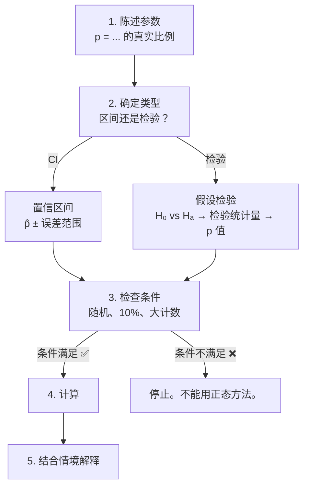
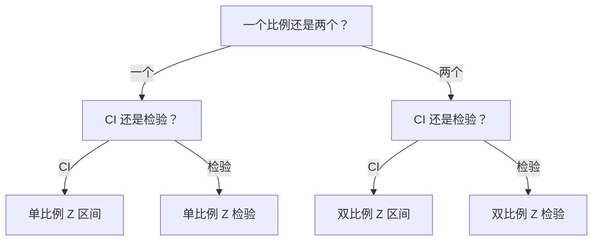

# Unit 6 — 比例的推断

**考试占比：** 12–15% | **前置知识：** [[Unit_5_Sampling_Distributions|单元 5 — 抽样分布]]

## 核心思想

**统计推断**利用样本数据得出关于总体参数的结论。对比例而言，感兴趣的参数是 $p$，即总体中成功的真实比例。

推断有**两个分支**，它们是对偶的：

| 分支 | 问题 | 输出 |
|-----|----------|--------|
| **置信区间** | "$p$ 的合理范围是多少？" | 值的范围 |
| **假设检验** | "证据是否足够强以拒绝 $H_0$？" | 决策 + $p$ 值 |

> [!key] 对偶性
> 水平 $\alpha$ 的双侧检验拒绝 $H_0: p = p_0$，当且仅当 $p_0$ 落在 $C = 1-\alpha$ 置信区间之外。它们是同一枚硬币的两面。

## 推断问题的结构

```mermaid
flowchart TB
    A["1. 陈述参数<br/>p = ... 的真实比例"] --> B["2. 确定类型<br/>区间还是检验？"]
    B -->|"CI"| C["置信区间<br/>p̂ ± 误差范围"]
    B -->|"检验"| D["假设检验<br/>H₀ vs Hₐ → 检验统计量 → p 值"]
    C --> E["3. 检查条件<br/>随机、10%、大计数"]
    D --> E
    E -->|"条件满足 ✅"| F["4. 计算"]
    E -->|"条件不满足 ❌"| G["停止。不能用正态方法。"]
    F --> H["5. 结合情境解释"]
```

## 四步推断流程（AP 考试格式）

| 步骤 | 写什么 | 示例（比例） |
|------|--------------|----------------------|
| **1. 陈述** | 参数 + 类型 + 置信水平 / $\alpha$ | "我们想估计 $p$，即...的真实比例" |
| **2. 计划** | 检查条件（随机、10%、大计数） | "SRS ✅；$n \le 0.10N$ ✅；$np \ge 10$ ✅" |
| **3. 实施** | 计算区间或检验统计量 | "$\hat{p} \pm z^*\sqrt{\hat{p}(1-\hat{p})/n}$" |
| **4. 结论** | 结合情境解释 | "我们有 95% 的把握认为..." |

> [!tip] AP 考试提示
> 自由回答题中始终写出**完整的四步过程**。每一步都有部分分数。

## 单元 6 路线图

### 单比例推断

| 主题 | 方法 | 公式 |
|-------|--------|---------|
| [[Confidence_Intervals_Proportions\|单比例 Z 区间]] | 估计 $p$ | $\hat{p} \pm z^* \sqrt{\frac{\hat{p}(1-\hat{p})}{n}}$ |
| [[Significance_Tests_Proportions\|单比例 Z 检验]] | 检验 $H_0: p = p_0$ | $z = \frac{\hat{p} - p_0}{\sqrt{p_0(1-p_0)/n}}$ |

### 双比例推断

| 主题 | 方法 | 公式 |
|-------|--------|---------|
| [[Confidence_Intervals_Proportions\|双比例 Z 区间]] | 估计 $p_1 - p_2$ | $(\hat{p}_1 - \hat{p}_2) \pm z^* \sqrt{ \frac{\hat{p}_1(1-\hat{p}_1)}{n_1} + \frac{\hat{p}_2(1-\hat{p}_2)}{n_2} }$ |
| [[Significance_Tests_Proportions\|双比例 Z 检验]] | 检验 $H_0: p_1 = p_2$ | $z = \frac{\hat{p}_1 - \hat{p}_2}{\sqrt{\hat{p}_c(1-\hat{p}_c)\!\left(\frac{1}{n_1} + \frac{1}{n_2}\right)}}$ |

### 误差

| 主题 | 关键概念 |
|-------|-------------|
| [[Type_I_and_II_Errors\|第一类与第二类错误]] | $\alpha$、$\beta$、检验力及其权衡 |

## 选择正确的程序

```mermaid
flowchart TD
    Q1["一个比例还是两个？"] -->|"一个"| Q2["CI 还是检验？"]
    Q1 -->|"两个"| Q3["CI 还是检验？"]
    Q2 -->|CI| P1["单比例 Z 区间"]
    Q2 -->|检验| P2["单比例 Z 检验"]
    Q3 -->|CI| P3["双比例 Z 区间"]
    Q3 -->|检验| P4["双比例 Z 检验"]
```

> [!summary] 关键假设
> 所有比例推断方法要求：
> 1. **随机**样本或随机化实验
> 2. **10% 条件**——$n \le 0.10N$（或 $n_1, n_2 \le 0.10N_1, N_2$）
> 3. **大计数**——至少 10 次成功和 10 次失败
>
> 如果任何假设不满足，考虑替代方法（精确二项检验、自助法 CI）。

---

[[AP_Statistics_MOC|← 返回 AP 统计学知识地图]]