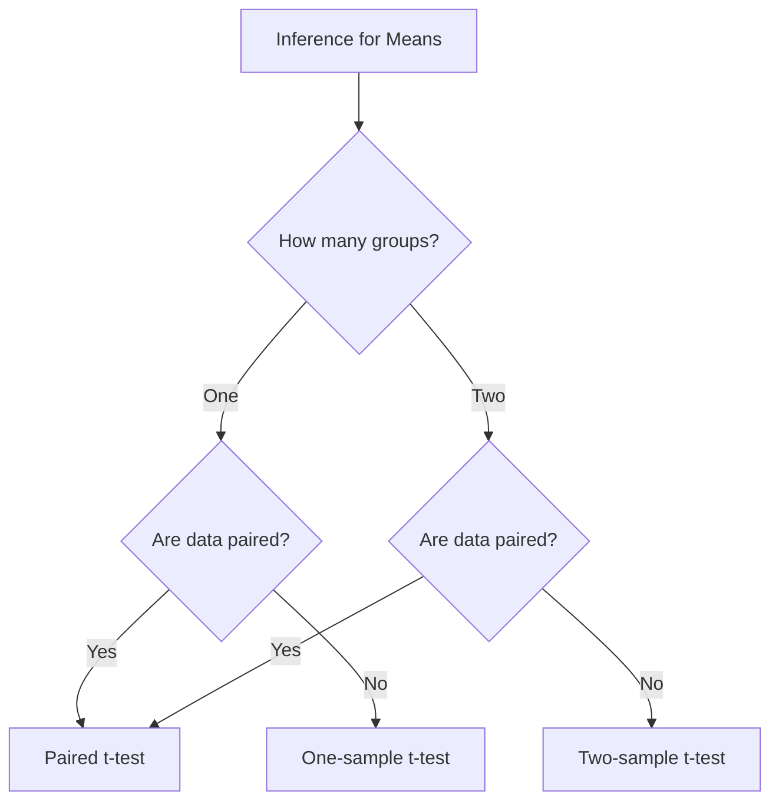

## Overview

Unit 7 covers **inference for population means**, the counterpart to Unit 6 (proportions) but with the added complication of an unknown population standard deviation $\sigma$. When $\sigma$ is unknown—which is virtually always the case—we estimate it with the sample standard deviation $s$, and this substitution changes the sampling distribution from Normal to **t**.

**Weight:** 10–12% of the AP exam.

---

## The t-Distribution

When we standardize a sample mean using $s$ instead of $\sigma$, the resulting statistic

$$ t = \frac{\bar{x} - \mu}{s/\sqrt{n}} $$

follows a **t-distribution** with $n-1$ **degrees of freedom** (df).

| Property | Normal ($z$) | $t$ (df = $k$) |
|-----------|-------------|----------------|
| Shape | Bell-shaped | Bell-shaped, **heavier tails** |
| Center | 0 | 0 |
| Spread | $\sigma$ fixed | Larger spread (depends on $k$) |
| As $k \to \infty$ | — | Approaches Normal |

As df increases, the t-distribution approaches the standard Normal. In practice, for $n \ge 30$, the difference is negligible.

### Why heavier tails?
Using $s$ instead of $\sigma$ introduces extra uncertainty. The t-distribution accounts for this by having fatter tails, producing wider confidence intervals and more conservative tests—the price we pay for estimating the standard deviation.

---

## When to Use $t$ vs $z$

| Situation | Statistic | When? |
|-----------|-----------|-------|
| $\sigma$ **known**, any $n$ | $z$ | Rare in practice |
| $\sigma$ **unknown**, $n$ small | $t$ (df = $n-1$) | Most real-world cases |
| $\sigma$ **unknown**, $n$ large ($\ge 30$) | $t$ (df $\approx \infty$) | $t$ is still correct; $z$ is approximate |

**Rule:** Always use $t$ when $\sigma$ is estimated by $s$. The AP exam rarely tests $z$ for means.

---

## Core Procedures

### One-Sample t-Interval
$$ \bar{x} \pm t^*_{n-1} \cdot \frac{s}{\sqrt{n}} $$
Used to estimate a single population mean $\mu$.

### One-Sample t-Test
$$ t = \frac{\bar{x} - \mu_0}{s/\sqrt{n}}, \quad \text{df} = n-1 $$
Tests $H_0: \mu = \mu_0$.

### Two-Sample t-Interval
$$ (\bar{x}_1 - \bar{x}_2) \pm t^*_{\text{df}} \sqrt{\frac{s_1^2}{n_1} + \frac{s_2^2}{n_2}} $$
Estimates $\mu_1 - \mu_2$. **Never pool variances** in AP Statistics.

### Two-Sample t-Test
$$ t = \frac{(\bar{x}_1 - \bar{x}_2) - 0}{\sqrt{\frac{s_1^2}{n_1} + \frac{s_2^2}{n_2}}} $$
Tests $H_0: \mu_1 - \mu_2 = 0$ (or $\mu_1 = \mu_2$).

### Paired t-Test
$$ t = \frac{\bar{x}_d}{s_d/\sqrt{n}}, \quad \text{df} = n-1 $$
Tests $H_0: \mu_d = 0$ for matched-pairs data (see [[Matched_Pairs_T_Test]]).

---

## Conditions for Inference about Means

1. **Random** — Data from a random sample or randomized experiment.
2. **Independence** — $n < 10\%$ of population (10% condition) for samples; random assignment for experiments.
3. **Nearly Normal** — Population distribution is Normal **or** sample size is large enough ($n \ge 30$ for the CLT to apply). If $n < 30$, check for strong skew or outliers in a graph (histogram, boxplot, or Normal probability plot).

---

## Decision Flowchart

---

## Link to Exam

- **FRQ:** Expect one full question on inference for means (possibly two-sample or matched pairs).
- **MCQ:** 4–6 questions covering t-distribution properties, confidence intervals, and test mechanics.
- **Common mistake:** Using $z$ instead of $t$, or pooling variances in two-sample problems.

See also: [[AP_Statistics_MOC]]
