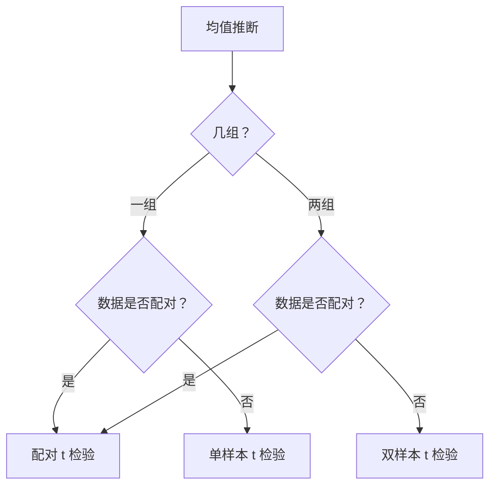

# Unit 7 — 均值的推断

**考试占比：** AP 考试的 10–12%

单元 7 覆盖**总体均值的推断**，是单元 6（比例）的对应部分，但多了一个复杂性：总体标准差 $\sigma$ 未知。当 $\sigma$ 未知时——实际上总是如此——我们用样本标准差 $s$ 来估计，这个替换使抽样分布从正态变为 **t**。

## $t$ 分布

当用 $s$ 代替 $\sigma$ 来标准化样本均值时，得到的统计量

$$ t = \frac{\bar{x} - \mu}{s/\sqrt{n}} $$

服从自由度为 $n-1$ 的 **t 分布**。

| 性质 | 正态（$z$） | $t$（df = $k$） |
|-----------|-------------|----------------|
| 形状 | 钟形 | 钟形，**尾部更厚** |
| 中心 | 0 | 0 |
| 离散 | $\sigma$ 固定 | 离散更大（取决于 $k$） |
| 当 $k \to \infty$ | — | 趋近正态 |

自由度增大时，t 分布趋近标准正态。实践中，$n \ge 30$ 时差异可忽略。

### 为什么尾部更厚？
用 $s$ 代替 $\sigma$ 引入了额外不确定性。t 分布通过更厚的尾部来反映这一点，产生更宽的置信区间和更保守的检验——这是估计标准差的代价。

## 何时用 $t$ vs $z$

| 情形 | 统计量 | 何时使用？ |
|-----------|-----------|-------|
| $\sigma$ **已知**，任意 $n$ | $z$ | 实践中很少见 |
| $\sigma$ **未知**，$n$ 小 | $t$（df = $n-1$） | 大多数实际情况 |
| $\sigma$ **未知**，$n$ 大（$\ge 30$） | $t$（df $\approx \infty$） | $t$ 仍然正确；$z$ 是近似 |

**规则：** 当 $\sigma$ 由 $s$ 估计时，始终用 $t$。AP 考试很少考均值的 $z$ 检验。

## 核心程序

### 单样本 t 区间
$$ \bar{x} \pm t^*_{n-1} \cdot \frac{s}{\sqrt{n}} $$
用于估计单个总体均值 $\mu$。

### 单样本 t 检验
$$ t = \frac{\bar{x} - \mu_0}{s/\sqrt{n}}, \quad \text{df} = n-1 $$
检验 $H_0: \mu = \mu_0$。

### 双样本 t 区间
$$ (\bar{x}_1 - \bar{x}_2) \pm t^*_{\text{df}} \sqrt{\frac{s_1^2}{n_1} + \frac{s_2^2}{n_2}} $$
估计 $\mu_1 - \mu_2$。在 AP 统计学中**绝不合并方差**。

### 双样本 t 检验
$$ t = \frac{(\bar{x}_1 - \bar{x}_2) - 0}{\sqrt{\frac{s_1^2}{n_1} + \frac{s_2^2}{n_2}}} $$
检验 $H_0: \mu_1 - \mu_2 = 0$（或 $\mu_1 = \mu_2$）。

### 配对 t 检验
$$ t = \frac{\bar{x}_d}{s_d/\sqrt{n}}, \quad \text{df} = n-1 $$
检验配对数据的 $H_0: \mu_d = 0$（见 [[Matched_Pairs_T_Test]]）。

## 均值推断的条件

1. **随机**——数据来自随机样本或随机化实验。
2. **独立**——样本：$n < 10\%$ 总体（10% 条件）；实验：随机分配。
3. **近似正态**——总体分布正态 **或** 样本容量足够大（$n \ge 30$ 使 CLT 适用）。如果 $n < 30$，在图形（直方图、箱线图或正态概率图）中检查强偏斜或离群值。

## 决策流程图

```mermaid
flowchart TD
    A[均值推断] --> B{几组？}
    B -->|一组| C{数据是否配对？}
    B -->|两组| D{数据是否配对？}
    C -->|是| E[配对 t 检验]
    C -->|否| F[单样本 t 检验]
    D -->|是| E
    D -->|否| G[双样本 t 检验]
```

## 考试链接

- **FRQ：** 预计有一道完整的均值推断题（可能是双样本或配对）。
- **MCQ：** 4–6 道题，覆盖 t 分布性质、置信区间和检验机制。
- **常见错误：** 用 $z$ 代替 $t$，或在双样本问题中合并方差。

另见：[[AP_Statistics_MOC]]