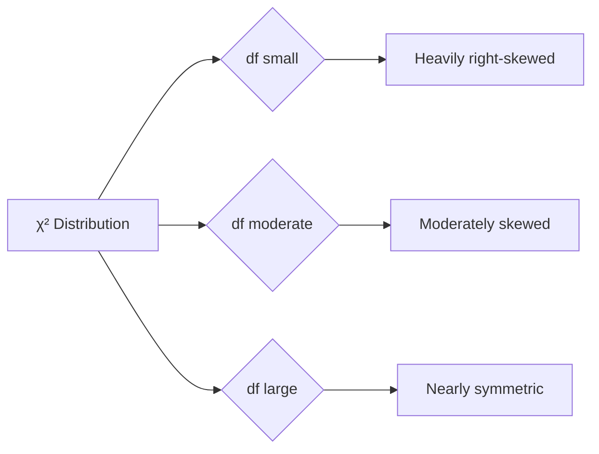

## Overview

Unit 8 introduces **chi-square ($\chi^2$) tests**, used for **categorical data** — counts of observations in categories. Unlike inference for means or proportions, chi-square tests do **not** estimate a parameter; they test whether observed counts deviate from expected counts by more than chance.

**Weight:** 2–5% of the AP exam.

---

## The $\chi^2$ Distribution

The chi-square distribution is a family of right-skewed distributions indexed by **degrees of freedom**.

### Properties

- **Non-negative** — $\chi^2 \ge 0$ (sum of squared terms)
- **Right-skewed** — becomes more symmetric as df increases
- **Mean** = df
- **Variance** = 2(df)
- As df $\to \infty$, $\chi^2$ approaches Normal (centered at df)



---

## The Chi-Square Statistic

$$ \chi^2 = \sum \frac{(O - E)^2}{E} $$

- $O$ = observed count in a cell
- $E$ = expected count in that cell (under $H_0$)
- Sum is taken over **all categories** (or all cells in a table)

Large values of $\chi^2$ cast doubt on $H_0$ — the $p$-value is the area to the right of the calculated $\chi^2$ under the appropriate $\chi^2$ distribution.

---

## Three Types of Chi-Square Tests

### 1. Goodness of Fit
Compares observed counts in a single categorical variable to a hypothesized distribution.

- **$H_0$:** The population follows the specified distribution.
- **df** = (categories − 1)

See [[Chi-Square_Goodness_of_Fit]].

### 2. Homogeneity
Compares the distribution of a categorical variable across two or more groups (populations).

- **$H_0$:** The distribution of the categorical variable is **the same** across all groups.
- **df** = $(R-1)(C-1)$

### 3. Independence
Tests whether two categorical variables are associated within a **single population**.

- **$H_0$:** The two variables are independent.
- **df** = $(R-1)(C-1)$

---

## Conditions for Chi-Square Tests

All three tests share the same three conditions:

1. **Random** — Data come from a random sample or randomized experiment.
2. **Independence** — Individual observations are independent; for tables, each case contributes to exactly one cell.
3. **Large Expected Counts** — All expected counts $\ge 5$ (AP condition; some textbooks use $\ge 1$ with at least 80% $\ge 5$).

### Checking Expected Counts

- **Goodness of fit:** $E_i = n \cdot p_i$, where $p_i$ is the hypothesized proportion for category $i$.
- **Two-way tables:** $E = \frac{\text{row total} \times \text{column total}}{\text{grand total}}$.

If any $E < 5$, consider combining categories (if meaningful).

---

## Decision Tree

```mermaid
flowchart TD
    A[Chi-Square Test] --> B{One variable or two?}
    B -->|One categorical variable| C[Goodness of Fit]
    B -->|Two categorical variables| D{Samples: one or many?}
    D -->|Single sample| E[Test of Independence]
    D -->|Two or more groups| F[Test of Homogeneity]
    C --> G[df = categories - 1]
    E --> H[df = (R-1)(C-1)]
    F --> H
```

---

## Effect Size

The $\chi^2$ statistic itself grows with sample size. To measure **strength of association**, use:

- **Standardized residuals** for individual cells: $\displaystyle \frac{O - E}{\sqrt{E}}$
- **Cramér's $V$** for two-way tables: $\displaystyle V = \sqrt{\frac{\chi^2}{n \cdot \min(R-1, C-1)}}$

Large standardized residuals ($| \text{residual} | > 2$ or $> 3$) indicate cells that contribute most to the significance.

---

## Link to Exam

- **FRQ:** Usually a two-way table (homogeneity or independence) with a full 4-step inference process.
- **MCQ:** 1–2 questions on chi-square; often about expected counts or df.
- **Key skill:** Know how to compute expected counts, check the $E \ge 5$ condition, and interpret the result in context.

---

## Summary Table

| Test | $H_0$ | df | Design |
|------|-------|----|--------|
| GOF | Specified distribution | $k-1$ | One sample, one variable |
| Homogeneity | Same distribution across groups | $(R-1)(C-1)$ | Multiple samples/groups |
| Independence | No association | $(R-1)(C-1)$ | One sample, two variables |

See also: [[Chi-Square_Goodness_of_Fit]], [[Chi-Square_Homogeneity_and_Independence]], [[AP_Statistics_MOC]]
