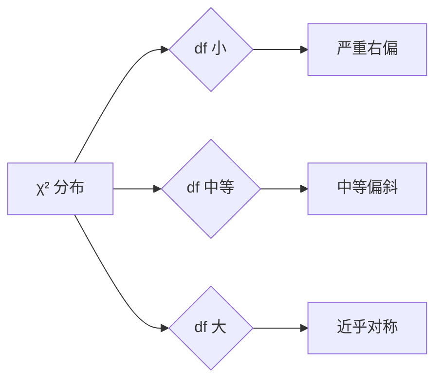

# Unit 8 — 卡方检验

**考试占比：** AP 考试的 2–5%

单元 8 介绍**卡方（$\chi^2$）检验**，用于**分类数据**——各类别中的观测计数。与均值或比例的推断不同，卡方检验**不**估计参数；它检验观测计数是否因随机性之外的原因偏离期望计数。

## $\chi^2$ 分布

卡方分布是一族由**自由度**索引的右偏分布。

### 性质

- **非负**——$\chi^2 \ge 0$（平方项之和）
- **右偏**——自由度增大时变得更对称
- **均值** = df
- **方差** = 2(df)
- 当 df $\to \infty$ 时，$\chi^2$ 趋近正态（以 df 为中心）

```mermaid
flowchart LR
    A[χ² 分布] --> B{df 小}
    A --> C{df 中等}
    A --> D{df 大}
    B --> E[严重右偏]
    C --> F[中等偏斜]
    D --> G[近乎对称]
```

## 卡方统计量

$$ \chi^2 = \sum \frac{(O - E)^2}{E} $$

- $O$ = 单元格中的观测计数
- $E$ = 该单元格的期望计数（在 $H_0$ 下）
- 求和遍历**所有类别**（或表中的所有单元格）

$\chi^2$ 值大则对 $H_0$ 产生怀疑——$p$ 值是计算出的 $\chi^2$ 在相应 $\chi^2$ 分布下右侧的面积。

## 三种卡方检验

### 1. 拟合优度
比较单个分类变量的观测计数与假设分布。

- **$H_0$：** 总体遵循指定分布。
- **df** = (类别数 − 1)

见 [[Chi-Square_Goodness_of_Fit]]。

### 2. 齐性检验
比较分类变量在两个或更多组（总体）间的分布。

- **$H_0$：** 分类变量在所有组中的分布**相同**。
- **df** = $(R-1)(C-1)$

### 3. 独立性检验
检验**单个总体**中两个分类变量是否相关。

- **$H_0$：** 两个变量独立。
- **df** = $(R-1)(C-1)$

## 卡方检验的条件

三种检验共享相同的三个条件：

1. **随机**——数据来自随机样本或随机化实验。
2. **独立**——个体观测独立；对表格而言，每个个体恰好贡献一个单元格。
3. **大期望计数**——所有期望计数 $\ge 5$（AP 条件；部分教科书用 $\ge 1$ 且至少 80% $\ge 5$）。

### 检查期望计数

- **拟合优度：** $E_i = n \cdot p_i$，其中 $p_i$ 是类别 $i$ 的假设比例。
- **二维表：** $E = \frac{\text{行合计} \times \text{列合计}}{\text{总计}}$。

如果任何 $E < 5$，考虑合并类别（如果合理）。

## 决策树

```mermaid
flowchart TD
    A[卡方检验] --> B{一个变量还是两个？}
    B -->|一个分类变量| C[拟合优度]
    B -->|两个分类变量| D{样本：一个还是多个？}
    D -->|单个样本| E[独立性检验]
    D -->|两个或更多组| F[齐性检验]
    C --> G[df = 类别数 - 1]
    E --> H[df = (R-1)(C-1)]
    F --> H
```

## 效应量

$\chi^2$ 统计量本身随样本量增大而增大。要测量**关联强度**，使用：

- 单个单元格的**标准化残差**：$\displaystyle \frac{O - E}{\sqrt{E}}$
- 二维表的 **Cramér's $V$**：$\displaystyle V = \sqrt{\frac{\chi^2}{n \cdot \min(R-1, C-1)}}$

大的标准化残差（$| \text{残差} | > 2$ 或 $> 3$）指示对显著性贡献最大的单元格。

## 考试链接

- **FRQ：** 通常是一道二维表（齐性或独立性），要求完整的四步推断流程。
- **MCQ：** 1–2 道卡方题；通常关于期望计数或 df。
- **关键技能：** 知道如何计算期望计数、检查 $E \ge 5$ 条件，以及结合情境解释结果。

## 汇总表

| 检验 | $H_0$ | df | 设计 |
|------|-------|----|--------|
| 拟合优度 | 指定分布 | $k-1$ | 一个样本，一个变量 |
| 齐性 | 各组分布相同 | $(R-1)(C-1)$ | 多个样本/组 |
| 独立 | 无关联 | $(R-1)(C-1)$ | 一个样本，两个变量 |

另见：[[Chi-Square_Goodness_of_Fit]]、[[Chi-Square_Homogeneity_and_Independence]]、[[AP_Statistics_MOC]]