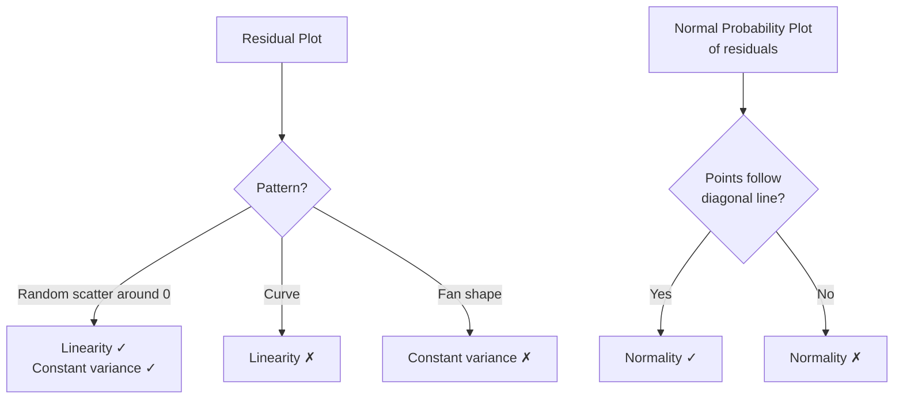

## Overview

Unit 9 extends inference to **linear regression**. Instead of asking about a population mean, we now ask: "Is there a **linear relationship** between $x$ and $y$ in the population?" The parameter of interest is the **population slope** $\beta_1$.

**Weight:** 2–5% of the AP exam.

---

## The Regression Model

In the population, the relationship is:

$$ y_i = \beta_0 + \beta_1 x_i + \varepsilon_i $$

- $\beta_0$: population $y$-intercept
- $\beta_1$: population slope (change in mean $y$ per unit change in $x$)
- $\varepsilon_i$: random error term, independently distributed as $N(0, \sigma)$

We estimate $\beta_0$ and $\beta_1$ with the sample statistics $b_0$ and $b_1$ from least-squares regression.

---

## Hypotheses

- **$H_0$:** $\beta_1 = 0$ — no linear relationship between $x$ and $y$
- **$H_a$:** $\beta_1 \neq 0$ — there is a linear relationship (two-sided)
  - Or one-sided: $\beta_1 > 0$ (positive) or $\beta_1 < 0$ (negative)

---

## Test Statistic

$$ t = \frac{b_1 - 0}{\text{SE}_{b_1}}, \quad \text{df} = n - 2 $$

Where:

$$ \text{SE}_{b_1} = \frac{s}{\sqrt{\sum (x_i - \bar{x})^2}} = \frac{\sqrt{\frac{\sum (y_i - \hat{y}_i)^2}{n-2}}}{\sqrt{\sum (x_i - \bar{x})^2}} $$

- $s$ = standard error of the residuals (estimate of $\sigma$)
- $\sum (y_i - \hat{y}_i)^2$ = sum of squared residuals (SSE)
- $n-2$ in the denominator: we lose 2 df for estimating $\beta_0$ and $\beta_1$

The $p$-value is $P(T_{n-2} \ge |t|)$ for a two-sided test.

---

## Confidence Interval for $\beta_1$

$$ b_1 \pm t^*_{n-2} \cdot \text{SE}_{b_1} $$

Interpretation: "We are $C\%$ confident that the true slope $\beta_1$ is between \_\_ and \_\_."

If 0 is in the interval, we cannot reject $H_0$ at level $\alpha = 1 - C$.

---

## Conditions for Inference about Slope

### 1. Linearity
The relationship between $x$ and $y$ is linear in the population. **Check:** Scatterplot of $y$ vs $x$ should show no obvious curve; residual plot should have no pattern.

### 2. Independence
The observations (and thus the residuals) are independent. **Check:** Data from a random sample or randomized experiment; no repeated measurements on the same unit. For time series data, check no autocorrelation.

### 3. Constant Variance (Homoscedasticity)
The variability of the residuals is approximately constant across all $x$. **Check:** Residual plot — the spread of residuals should not fan out or taper.

### 4. Normality of Residuals
The residuals are approximately Normally distributed at each $x$ (or the sample is large enough for the CLT to apply). **Check:** Histogram or Normal probability plot of the residuals.

---

## Checking Conditions with Graphs

---

## Relationship Between $t$ and $r$

The test for the slope is related to the **correlation coefficient** $r$:

$$ t = \frac{r\sqrt{n-2}}{\sqrt{1-r^2}}, \quad \text{df} = n-2 $$

This means: testing $H_0: \beta_1 = 0$ is **equivalent** to testing $H_0: \rho = 0$ (no linear correlation in the population). The $t$-statistic and $p$-value are identical.

---

## Example

A study examines the relationship between hours studied ($x$) and exam score ($y$) for 20 students.

- $b_1 = 3.2$, $\text{SE}_{b_1} = 0.85$
- $n = 20$, df = 18
- $t = 3.2 / 0.85 = 3.76$
- $p \approx 0.0014$ — strong evidence of a positive linear relationship

**95% CI:** $3.2 \pm 2.101 \times 0.85 = 3.2 \pm 1.79 = (1.41,\ 4.99)$

Interpretation: We are 95% confident that each additional hour studied increases the mean score by 1.41 to 4.99 points.

---

## Interpreting the Slope Confidence Interval

- **Includes 0** → Not significant at $\alpha = 0.05$
- **Entirely positive** → Significant positive relationship
- **Entirely negative** → Significant negative relationship
- **Narrow interval** → Precise estimate (small SE)
- **Wide interval** → Imprecise estimate (large SE or small $n$)

---

## Common Mistakes

| Mistake | Why it's wrong |
|---------|----------------|
| Using df = $n-1$ instead of $n-2$ | Two parameters ($\beta_0$, $\beta_1$) are estimated from the data |
| Checking Normality of $y$ instead of residuals | The model assumption is about $\varepsilon$, not the marginal distribution of $y$ |
| Ignoring curvature in residual plot | Violates linearity condition; slope inference is invalid |
| Claiming causation from significant slope | Association ≠ causation without randomization |
| Extrapolating beyond the range of $x$ | The linear relationship may not hold outside the observed $x$ range |

---

## Link to Exam

- **FRQ:** May appear as part of a larger regression analysis question (often combined with Unit 2 material).
- **MCQ:** 1–2 questions on slope inference, confidence intervals, or interpreting computer output.
- **Key skill:** Read computer regression output (Coef, SE Coef, t, p) and identify $b_1$, $\text{SE}_{b_1}$, and $s$.

See also: [[AP_Statistics_MOC]]
