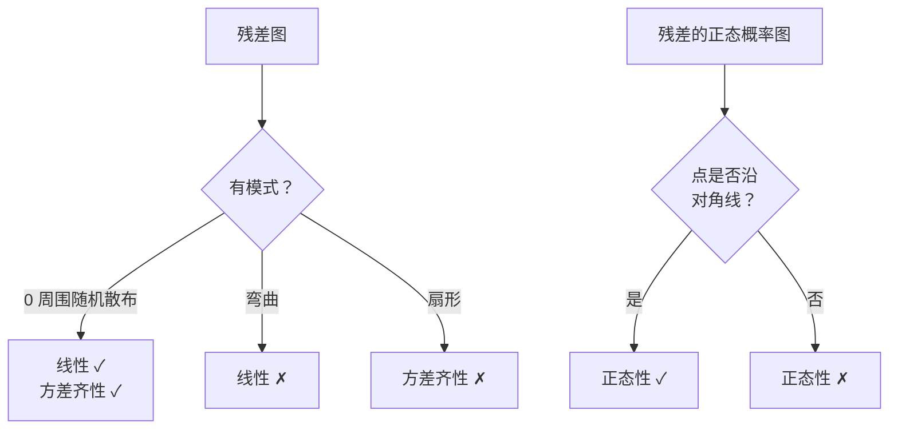

# Unit 9 — 斜率的推断

**考试占比：** AP 考试的 2–5%

单元 9 把推断扩展到**线性回归**。我们不再问总体均值，而是问："总体中 $x$ 和 $y$ 之间是否存在**线性关系**？"感兴趣的参数是**总体斜率** $\beta_1$。

## 回归模型

在总体中，关系为：

$$ y_i = \beta_0 + \beta_1 x_i + \varepsilon_i $$

- $\beta_0$：总体 $y$ 截距
- $\beta_1$：总体斜率（$x$ 每变化一个单位时均值 $y$ 的变化）
- $\varepsilon_i$：随机误差项，独立同分布 $N(0, \sigma)$

我们用最小二乘回归的样本统计量 $b_0$ 和 $b_1$ 估计 $\beta_0$ 和 $\beta_1$。

## 假设

- **$H_0$：** $\beta_1 = 0$——$x$ 和 $y$ 之间没有线性关系
- **$H_a$：** $\beta_1 \neq 0$——存在线性关系（双侧）
  - 或单侧：$\beta_1 > 0$（正）或 $\beta_1 < 0$（负）

## 检验统计量

$$ t = \frac{b_1 - 0}{\text{SE}_{b_1}}, \quad \text{df} = n - 2 $$

其中：

$$ \text{SE}_{b_1} = \frac{s}{\sqrt{\sum (x_i - \bar{x})^2}} = \frac{\sqrt{\frac{\sum (y_i - \hat{y}_i)^2}{n-2}}}{\sqrt{\sum (x_i - \bar{x})^2}} $$

- $s$ = 残差的标准误（$\sigma$ 的估计）
- $\sum (y_i - \hat{y}_i)^2$ = 残差平方和（SSE）
- 分母中的 $n-2$：估计 $\beta_0$ 和 $\beta_1$ 损失 2 个自由度

双侧检验的 $p$ 值是 $P(T_{n-2} \ge |t|)$。

## $\beta_1$ 的置信区间

$$ b_1 \pm t^*_{n-2} \cdot \text{SE}_{b_1} $$

解释："我们有 $C\%$ 的把握认为真实斜率 $\beta_1$ 在 \_\_ 和 \_\_ 之间。"

如果 0 在区间内，则不能在 $\alpha = 1 - C$ 水平下拒绝 $H_0$。

## 斜率推断的条件

### 1. 线性
总体中 $x$ 和 $y$ 的关系是线性的。**检查：** $y$ 对 $x$ 的散点图应无明显弯曲；残差图应无模式。

### 2. 独立
观测值（以及残差）相互独立。**检查：** 数据来自随机样本或随机化实验；同一单元无重复测量。时间序列数据检查无自相关。

### 3. 方差齐性
残差的变异在所有 $x$ 处大致恒定。**检查：** 残差图——残差的散布不应呈扇形扩散或收窄。

### 4. 残差的正态性
每个 $x$ 处的残差近似正态分布（或样本足够大使 CLT 适用）。**检查：** 残差的直方图或正态概率图。

## 用图形检查条件

```mermaid
flowchart TD
    A[残差图] --> B{有模式？}
    B -->|0 周围随机散布| C[线性 ✓<br>方差齐性 ✓]
    B -->|弯曲| D[线性 ✗]
    B -->|扇形| E[方差齐性 ✗]
    
    F[残差的正态概率图] --> G{点是否沿<br>对角线？}
    G -->|是| H[正态性 ✓]
    G -->|否| I[正态性 ✗]
```

## $t$ 与 $r$ 的关系

斜率的检验与**相关系数** $r$ 相关：

$$ t = \frac{r\sqrt{n-2}}{\sqrt{1-r^2}}, \quad \text{df} = n-2 $$

这意味着：检验 $H_0: \beta_1 = 0$ **等价于**检验 $H_0: \rho = 0$（总体中无线性相关）。$t$ 统计量和 $p$ 值完全相同。

## 示例

一项研究考察 20 名学生的学习时长（$x$）与考试成绩（$y$）的关系。

- $b_1 = 3.2$，$\text{SE}_{b_1} = 0.85$
- $n = 20$，df = 18
- $t = 3.2 / 0.85 = 3.76$
- $p \approx 0.0014$——正线性关系的强证据

**95% CI：** $3.2 \pm 2.101 \times 0.85 = 3.2 \pm 1.79 = (1.41,\ 4.99)$

解释：我们有 95% 的把握认为每多学一小时，平均成绩增加 1.41 到 4.99 分。

## 解释斜率置信区间

- **包含 0** → 在 $\alpha = 0.05$ 下不显著
- **完全为正** → 显著正关系
- **完全为负** → 显著负关系
- **窄区间** → 估计精确（SE 小）
- **宽区间** → 估计不精确（SE 大或 $n$ 小）

## 常见错误

| 错误 | 为什么错 |
|---------|----------------|
| 用 df = $n-1$ 而非 $n-2$ | 从数据中估计了两个参数（$\beta_0$、$\beta_1$） |
| 检查 $y$ 的正态性而非残差 | 模型假设关于 $\varepsilon$，而不是 $y$ 的边际分布 |
| 忽略残差图中的弯曲 | 违反线性条件；斜率推断无效 |
| 从显著斜率声称因果关系 | 没有随机化，关联 ≠ 因果 |
| 外推到 $x$ 的范围之外 | 线性关系在观测 $x$ 范围之外可能不成立 |

## 考试链接

- **FRQ：** 可能作为更大回归分析题的一部分出现（常与单元 2 内容结合）。
- **MCQ：** 1–2 道斜率推断、置信区间或解读计算机输出的题。
- **关键技能：** 阅读计算机回归输出（Coef、SE Coef、t、p），识别 $b_1$、$\text{SE}_{b_1}$ 和 $s$。

另见：[[AP_Statistics_MOC]]