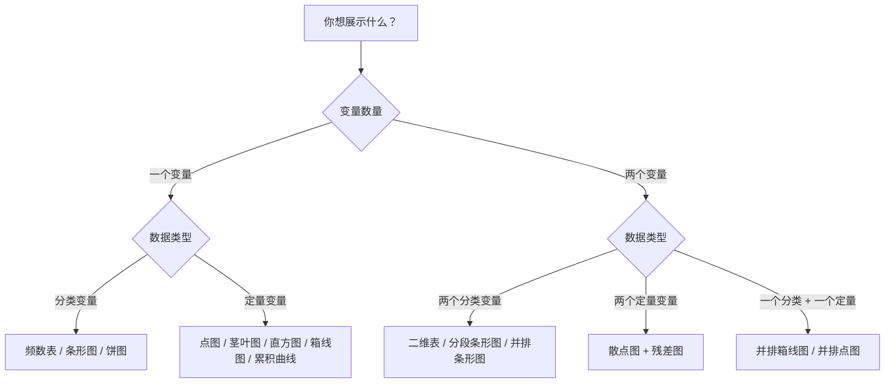

# AP Statistics Chart Types

> [!abstract] 概述
> AP 统计学考试中，**选择正确的图表类型**是数据分析的第一步。选择取决于两个因素：①变量的数据类型（分类/定量）；②变量的数量（一个/两个）。本笔记汇总 SAT 涉及的所有图表类型的适用场景、选择方法和 AP 考试要点。

## 选择图表的决策流程

> [!tip] 核心思路
> 先看数据类型，再看变量数量，最后想展示什么（分布 → 直方图/点图；关系 → 散点图；对比 → 条形图/箱线图）

## 一、分类数据图表（Categorical Data）

### 频数表（Frequency Table）与 相对频数表（Relative Frequency Table）

| 用途 | 列出各类别的计数（频数）或比例（相对频数） |
|------|----------|
| **适用** | 单个分类变量 |
| **AP 要点** | 频数表是基础，但**不是图表**（graph）——题目问"best graph"时不选频数表 |

### 条形图（Bar Chart / Bar Graph）

| 用途 | 用条形高度表示各类别的频数或比例 |
|------|----------|
| **适用** | 单个分类变量 |
| **AP 要点** | 条形之间有**间隙**；条形的顺序可调（如按频数排列）；适用于**任何**分类数据，包括有序分类（ordinal）和无序分类（nominal） |
| **注意** | 条形图展示的是**类别**的频数，不是连续变量的分布 |

### 饼图（Pie Chart）

| 用途 | 用扇形面积表示各类别的比例 |
|------|----------|
| **适用** | 单个分类变量 |
| **AP 要点** | 饼图对**小比例**的区分不如条形图直观；类别过多（>5~6）时视觉效果差 |
| **注意** | 饼图**不适合**展示定量数据（如断裂强度）——这是 AP 统计学的常见考点 |

### 分段条形图（Segmented Bar Chart / 堆叠条形图）

| 用途 | 在一个条形中展示两个分类变量的联合分布，条形高度=100% |
|------|----------|
| **适用** | 两个分类变量 |
| **AP 要点** | 用于比较两个分类变量之间的**条件分布**；若各条形高度一致→变量间可能独立 |
| **变形** | 并排条形图（Side-by-Side Bar Chart / 对比条形图）——将各组条形并排放置，便于直接比较各组内各分类的计数 |

### 二维表（Two-Way Table / Contingency Table / 列联表）

| 用途 | 用表格形式展示两个分类变量的联合分布 |
|------|----------|
| **适用** | 两个分类变量 |
| **AP 要点** | 行和列的合计数称为**边际分布**（marginal distribution）；两个分类变量之间是否独立取决于**条件分布**是否一致 |

## 二、定量数据图表（Quantitative Data）

### 点图（Dotplot）

| 用途 | 每个数据点用一个点（dot）表示，堆叠显示分布 |
|------|----------|
| **适用** | 小样本（$n \lesssim 50$）的定量数据 |
| **AP 要点** | 能清晰展示每个数据值、簇（clusters）和间隙（gaps）；**保留原始数据**——可以从点图反推出每个观测值 |
| **优点** | 简单直观，适合手动画图 |

### 茎叶图（Stemplot / Stem-and-Leaf Plot）

| 用途 | 将数据按"茎"（十位/百位）和"叶"（个位）展开，同时展示分布和保留原始数据 |
|------|----------|
| **适用** | 小到中等样本的定量数据 |
| **AP 要点** | 同样**保留原始数据**；适合比较两组数据（背靠背茎叶图）；当数据量较大时，茎叶图变得冗长杂乱 |
| **注意** | 茎叶图不适用于 $n > 100$ 的数据 |

### 直方图（Histogram）

| 用途 | 将数据分组为区间（bins/classes），用柱形高度表示每个区间内的频数 |
|------|----------|
| **适用** | 中等到大样本的定量数据 |
| **AP 要点** | **最适合展示定量数据分布**的图表之一；区间选择影响图形外观——区间太少丢失细节，区间太多噪声过大；**条形之间无间隙**（区别于条形图的关键特征） |
| **注意** | 直方图**不保留原始数据**（只知道每个区间内的频数，不知道具体值） |

> [!warning] 核心考点
> 当题目描述"show the distribution of breaking strengths"（展示断裂强度的分布）时，**直方图（Histogram）是最佳选择**。饼图（Pie Chart）和条形图（Bar Chart）只适用于分类数据。

### 箱线图（Boxplot / 盒形图）

> [!info] **修正箱线图（Modified Boxplot）**——AP 考试使用的箱线图标准版本

| 用途 | 用五数概括（最小值、$Q_1$、中位数、$Q_3$、最大值）展示分布 |
|------|----------|
| **适用** | 定量数据，尤其适合**比较多个组** |
| **AP 要点** | 箱线图**不展示模态**（modality）——无法判断单峰/双峰；能展示**偏斜**（skew）和**离群值**（outliers）；修正箱线图用 $1.5 \times \text{IQR}$ 规则标记离群值 |
| **优点** | 节省空间，适合并排比较多组数据 |

### 累积相对频数图（Cumulative Relative Frequency Plot / Ogive / 累积曲线）

| 用途 | 横轴为数据值，纵轴为"≤该值的数据比例"，逐点上升至 100% |
|------|----------|
| **适用** | 定量数据 |
| **AP 要点** | 可从累积曲线读出**百分位数**（percentile）；用于估计中位数（累积比例 50% 处对应的数据值）和四分位数 |

## 三、两变量关系图表

### 散点图（Scatterplot）

| 用途 | 用 $(x, y)$ 坐标点展示两个定量变量之间的关系 |
|------|----------|
| **适用** | 两个定量变量 |
| **AP 要点** | 描述方向（正/负相关）、形式（线性/非线性/曲线）、强度（强/弱/无）、离群值；**相关关系 ≠ 因果关系** —— 有相关性不代表有因果联系 |
| **注意** | 散点图只能展示**线性或单调**关系；无明显模式可能意味着变量间不相关或存在更复杂的关系 |

### 残差图（Residual Plot）

| 用途 | 横轴为解释变量 $x$（或预测值 $\hat{y}$），纵轴为残差 $e = y - \hat{y}$ |
|------|----------|
| **适用** | 检验回归模型的**线性假设** |
| **AP 要点** | 残差图**无模式**（随机散布在 $e=0$ 上下）→ 线性模型合适；有**曲线模式**（U 形 / 倒 U 形）→ 线性模型不合适；残差在 $x$ 增大时**发散/收敛**→ 方差不齐（heteroscedasticity） |

## 四、易混淆对比表

| 面临选择 | 正确选择 | 理由 |
|----------|----------|------|
| 定量数据分布 vs 饼图 | **直方图**（或点图/茎叶图/箱线图） | 饼图只适用于分类数据 |
| 定量数据分布 vs 条形图 | **直方图** | 条形图有间隙、展示类别计数；直方图无间隙、展示连续区间频数 |
| 展示分布 vs 频数表 | **直方图**（图表类型） | 频数表是表格不是图表（graph），视觉上不如直方图直观 |
| 展示分布 vs 箱线图 | **直方图**优先 | 箱线图不展示模态（单峰/双峰），当需要全面展示分布形状时，直方图更优 |
| 两个分类变量关系 | **二维表** + **分段条形图/并排条形图** | 二维表提供精确数值，图表提供直观视觉 |
| 两个定量变量关系 | **散点图** | 唯一能展示 $(x, y)$ 点对之间关系的图表 |
| 比较多组数据分布 | **并排箱线图**（或并排点图/直方图） | 箱线图最节省空间，适合多组比较 |

## 五、真题示例

> **题目**：绳索制造商测试了 30 根绳索的样本，记录每根绳索的断裂强度（单位：N），范围从 1,100 N 到 2,075 N。下列哪种图表最适合展示样本数据的分布？
>
> (A) 饼图（Pie chart）
> (B) 条形图（Bar chart）
> (C) 频率直方图（Frequency histogram）
> (D) 频数表（Frequency table）

**分析**：
- 断裂强度是**定量数据**（连续数值，范围 1,100–2,075 N）
- 样本量 $n=30$，属于中等样本
- 目标是展示**分布**（distribution）

| 选项 | 排除理由 |
|------|----------|
| (A) 饼图 | 只适用于**分类数据**的比例展示 |
| (B) 条形图 | 条形图的条形之间有间隙，适合展示**各类别**的计数，不适合展示连续数值的分布 |
| (C) 直方图 ✅ | 将数据分组为连续区间，用柱形高度展示频数分布，**最适合展示定量数据的分布** |
| (D) 频数表 | 是**表格**不是图表（graph），且视觉上不如直方图直观 |

**正确答案：(C) 频率直方图**

## 相关链接

- [[Unit_1_One-Variable_Data|Unit 1 — 探索单变量数据]]
- [[Describing_Distributions|描述分布（SOCS 框架）]]
- [[Measuring_Center_and_Spread|中心与离散程度的度量]]
- [[Two-Way_Tables|二维表（列联表）]]
- [[Correlation_vs_Causation|相关 vs 因果]]
- [[AP_Statistics_MOC|AP 统计学知识地图]]