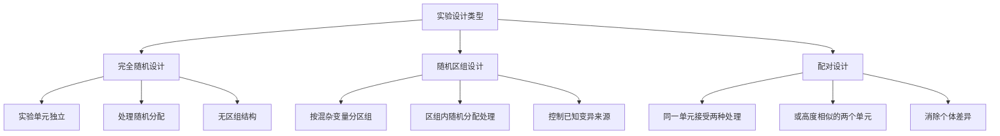
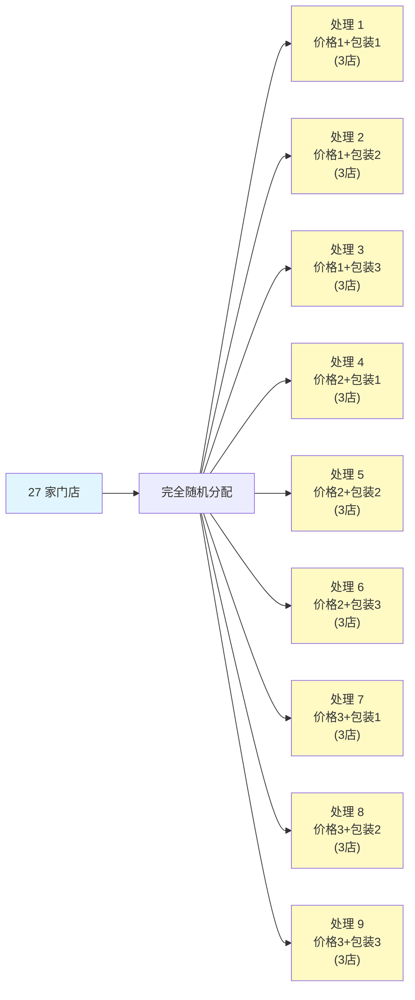
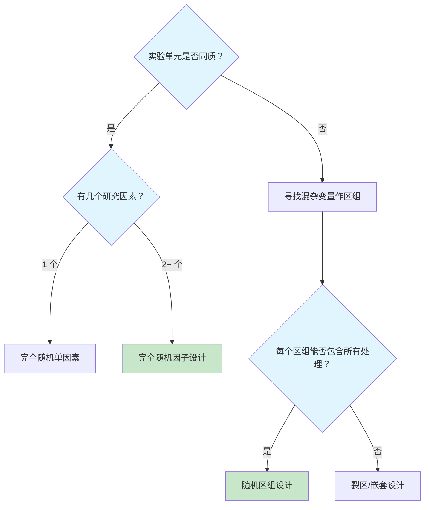

# AP Statistics - Experimental Design Blocks vs Treatments

> [!abstract] 概述
> 区分**区组（Block）**与**处理（Treatment）**是 AP 统计学实验设计的核心考点。区组是混杂变量，处理是研究者施加的干预。二者不可混淆。

## 基本概念

### 处理（Treatment）

> [!note] 定义
> **处理**是实验中研究者主动施加的**实验条件或干预措施**。

- 处理是研究者**关心的自变量**
- 实验目的就是比较不同处理的效果
- 例：Detergent A vs Detergent B、药物剂量（10mg / 20mg / 安慰剂）

### 区组（Block）

> [!note] 定义
> **区组**是实验单元按某个**混杂变量**分组形成的集合，用于控制已知的变异来源。

- 区组是研究者**不关心但必须控制**的变量
- 区组内的实验单元应尽量**同质**
- 例：不同日期、不同评分员、不同班次、不同地块、不同年龄组

## 核心区别

| 维度 | 处理（Treatment） | 区组（Block） |
|------|:-----------------:|:-------------:|
| **角色** | 自变量（研究者关心） | 混杂变量（研究者控制） |
| **目的** | 比较效果差异 | 减少实验误差 |
| **是否随机分配** | ✅ 是 | ❌ 否（按属性分组） |
| **研究者是否施加** | ✅ 主动施加 | ❌ 被动分组 |

## 三种实验设计对比

### 完全随机设计（Completely Randomized Design）

- 所有实验单元**完全随机**分配到各处理组
- 无区组结构
- 适用于实验单元**同质**的场景

### 随机区组设计（Randomized Block Design）

- 先按混杂变量**分区组**，再在区组内随机分配处理
- 每个区组包含**所有处理**
- 适用于存在**已知混杂变量**的场景

### 配对设计（Matched-Pairs Design）

- 每个实验单元**先后接受两种处理**
- 或两个高度相似的单元各接受一种处理
- 是区组大小为 2 的特例

## 经典易错点

> [!warning] 常见错误
> **把处理当作区组**是 AP 考试高频错误。

**错误表述**："A randomized block design with Detergent A and Detergent B as blocks"

**错误原因**：
- Detergent A 和 B 是**处理**，不是区组
- 区组必须是混杂变量（如日期、评分员、洗衣机）
- 处理不能充当区组的角色

**判断方法**：问自己——"这个变量是研究者主动施加的吗？"
- 是 → 处理
- 否，但会影响结果 → 可能的区组变量

## 实战示例：游泳池毛巾实验

**题目回顾**：
- 每缸 20 条毛巾，掷硬币决定用 Detergent A 或 B
- 评分员不知道用了哪种洗涤剂
- 全场只有 1 台洗衣机

**分析**：

| 选项 | 判断 | 理由 |
|------|:----:|------|
| (A) 完全随机设计 | ✅ | 每缸独立，处理随机分配，无区组 |
| (B) 区组 = A 和 B | ❌ | A 和 B 是处理，不是区组 |
| (C) 区组 = 洗衣机 | ❌ | 只有 1 台机器，无法分区组 |
| (D) 配对设计 | ❌ | 每缸只用一种洗涤剂，未配对 |

## 判断区组的 checklist

> [!tip] 判断步骤
> 1. 是否存在研究者**不关心但会影响结果**的变量？
> 2. 该变量能否将实验单元分为**同质**的组？
> 3. 每个组（区组）是否包含**所有处理**？
>
> 三个问题都是"是" → 随机区组设计

## 相关链接

- [[AP_Statistics_Charts]]

---

## 实战示例：市场调查研究（价格 × 包装）

> [!question] 题目
> 某市场研究公司研究**价格**和**包装类型**对某产品销量的影响。选取 27 家特征相似的门店。3 个价格水平 × 3 种包装类型 = 9 种处理组合。记录 7 周总销量。最佳实验设计是？

### 题干信息提取

| 项目 | 内容 |
|------|------|
| 实验单元 | 27 家门店 |
| 因素 1 | 价格（3 水平） |
| 因素 2 | 包装（3 类型） |
| 处理组合数 | $3 \times 3 = 9$ |
 | 每组重复数 | $27 \div 9 = 3$ |
 | 响应变量 | 7 周总销量 |
 | 门店特征 | 相似 → 无已知混杂源 |

### 逐项分析

| 选项 | 设计类型 | 判断 | 理由 |
|------|----------|:----:|------|
| **(A)** | 完全随机；9 种组合各 3 店 | ✅ | 因子设计正确表达：每种组合就是一个处理 |
| **(B)** | 完全随机；仅包装 3 组各 9 店 | ❌ | 丢弃价格因素 → 单因素设计，与题意不符 |
| **(C)** | 区组设计；包装作区组 | ❌ | **包装是处理因素，不能同时作区组** |
| **(D)** | 区组设计；包装作区组 | ❌ | 同 (C)，同一变量身兼二职 → 逻辑矛盾 |

### 答案：(A)

### 核心方法论

> [!important] 方法论 1：因子设计的处理组合识别
> 当实验涉及 **两个或多个因素** 时，每种水平组合构成一个**独立的处理**。本题中"价格水平 $i$ + 包装类型 $j$"是一个处理，共 9 个处理。
>
> 这不是"先按包装分区组，再在组内分价格"——而是把 $(P_i, T_j)$ 视为一个整体处理。

> [!important] 方法论 2：区组变量 vs 处理因素的"身份互斥"原则
> **一个变量不能同时扮演两种角色。**
>
> - 包装类型 → 研究者主动操纵（设定 3 种）→ **处理因素**
> - 包装类型 → 不是混杂变量 → **不能作区组**
>
> 如果强行把包装当区组，就会出现：
> - 区组 A（包装 1）：门店只接受包装 1，再随机分配价格
> - 但我们又需要研究"包装 2 的效果"→ 区组 A 永远看不到包装 2
> - **交互作用不可估计**

> [!important] 方法论 3：门店"相似"= 无需区组化
> 题干明示"27 stores with shoppers of similar characteristics"→ 实验单元同质 → **不需要区组**。
>
> 区组化的前提：存在已知的、会显著影响响应变量的混杂变量。
> - 若 27 店分散在不同城市/商圈 → 可作"地点"区组
> - 本题门店相似 → 无混杂 → 完全随机即可

### 设计结构图

### 与此题相关的决策树

## 注意事项

1. **术语一致**：全文统一使用"区组"（Block）、"处理"（Treatment）、"实验单元"（Experimental Unit）
2. **概念区分**：区组是控制变异的手段，处理是研究的目标
3. **考试技巧**：看到"as blocks"时，先判断该变量是否为混杂变量，而非处理本身
4. **因子设计陷阱**：多因素实验中，处理组合整体是处理，不能拆开其中一个因素当区组
