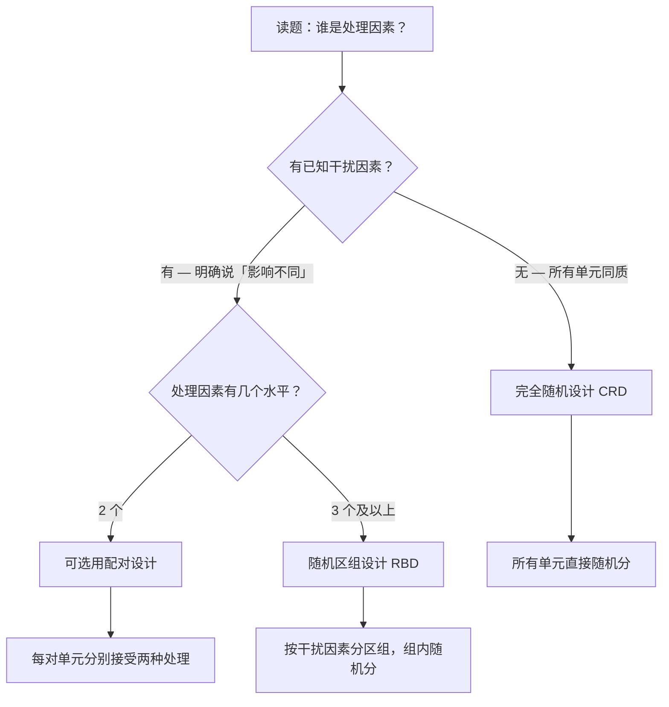
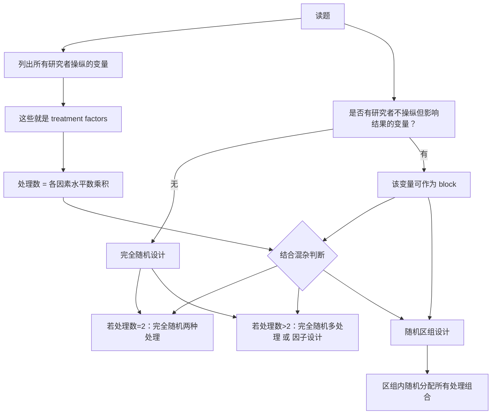
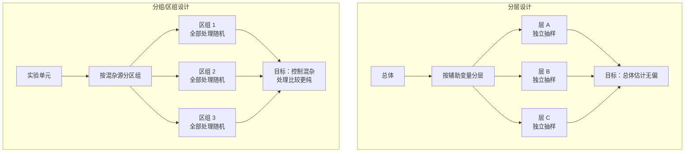
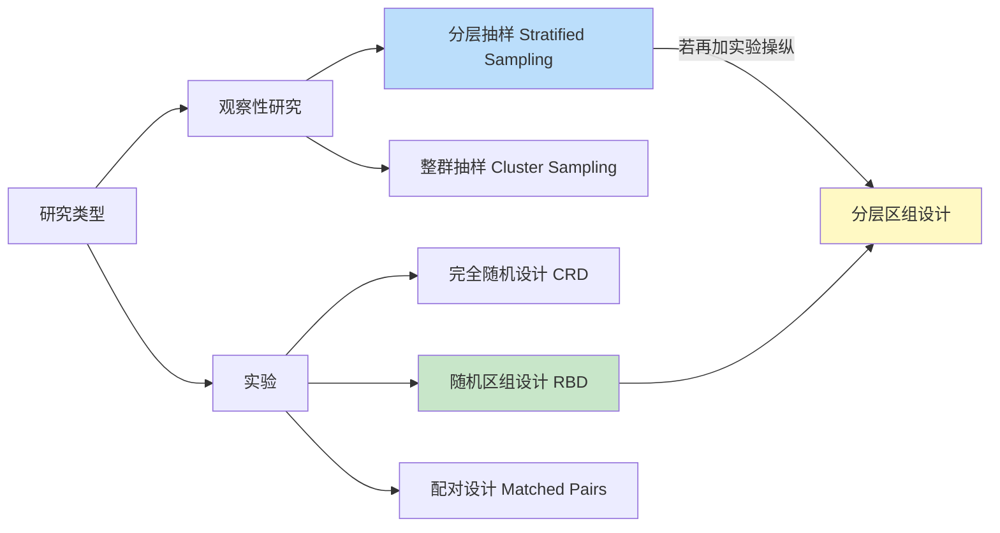

# AP Statistics Experimental Design Selection

> [!abstract] 概述
> AP 实验设计选择题的核心是**从题干中识别处理因素与干扰因素**，再按决策树选出正确设计。三类设计的适用场景完全不同，混淆即错。

## 问题解决决策树

> [!tip] 核心思路
> 三步走：①谁是处理？②有无已知干扰？③处理有几个水平？



## 三类设计的判定标准

### 完全随机设计（Completely Randomized Design, CRD）

| 判定条件 | 实验单元同质，无已知干扰因素 |
|------|------|
| **做法** | 所有单元直接随机分配到各处理组 |
| **关键特征** | 不分组，一步随机化 |
| **适用场景** | 题干未提及任何已知变异来源 |

> [!warning] CRD 的陷阱
> 题干提到另一因素会影响响应变量，但未指明为区组 → 仍是 CRD。但 AP 考试通常在有明确干扰词时考 RBD。

### 随机区组设计（Randomized Block Design, RBD）

| 判定条件 | 存在已知干扰因素，明确说「对不同的 XX 影响不同」 |
|------|------|
| **做法** | 按干扰因素分区组，每个区组内随机分配全部处理 |
| **关键特征** | 每个区组包含**所有**处理，每个处理在区组内出现**等次** |
| **适用场景** | 干扰因素已知且可控，研究者想消除其变异 |

> [!note] 区组 vs 处理
> 区组 = 研究者**不感兴趣**但已知有影响的变量。处理 = 研究者**感兴趣**的变量。区组 = 控制变异，处理 = 研究效应。

### 配对设计（Matched Pairs Design）

| 判定条件 | 处理因素恰好有 **2** 个水平 |
|------|------|
| **做法** | 每对相似单元分别接受两种处理，或同一单元先后接受两种处理 |
| **关键特征** | 仅两种处理；控制个体差异 |
| **适用场景** | 两种处理的比较（如前后测、双胞胎、左右手） |

> [!warning] 配对设计的铁律
> 配对设计**仅适用于 2 个处理水平**。3 个及以上处理 → 不能叫配对设计，必须用 RBD。

## 区分 RBD 与 CRD 的关键词

> [!tip] 读题找信号
> 以下表述强烈暗示**随机区组设计**：
> - 「different types of X respond differently」（不同的 X 响应不同）
> - 「to account for variability in X」（为控制 X 的变异）
> - 「because X can affect Y in different ways」（因为 X 以不同方式影响 Y）

这些表述说明出题者明确告诉你：**存在已知的变异来源，必须通过区组化控制**。

## 典型例题：陶碗釉料实验

> [!example] 题目
> 某陶艺学校想研究**温度**是否影响陶碗釉料。使用 **3 种黏土**，因为釉料对不同黏土影响不同。每种黏土制 8 只碗，共 24 只。使用 **4 种温度**。应选哪种设计？

### 解题步骤

1. **识别处理因素**：温度（4 个水平）——研究者感兴趣
2. **识别干扰因素**：黏土类型（3 种）——明确说「影响不同」
3. **判断设计类型**：有已知干扰 + 处理水平 $\geq 3$ → **随机区组设计**
4. **验证平衡**：3 种黏土 × 4 温度 × 2 只/组合 = 24 只 ✓

### 排除干扰项

| 选项 | 设计类型 | 分配方式 | 判断 |
|------|------|------|------|
| (A) | CRD | 每黏土每温 2 只 | ✗ 有已知干扰却不区组 |
| (B) | 伪 RBD | 每温 6 只 | ✗ 未按黏土壤衡，干扰变异未控制 |
| (C) | **RBD** | 每黏土每温 2 只 | ✓ 黏土壤组，组内平衡 |
| (D) | 配对设计 | 每黏土每温 2 只 | ✗ 配对设计仅适用 2 个处理 |

> [!note] 选项 B 的迷惑性
> B 声称「区组设计」但分配 6 只/温度，完全忽略黏土壤组。这是「挂区组之名，行完全随机之实」。区组设计的核心是每个区组内包含**所有**处理且**等次重复**。

## AP 考试常见陷阱总结

1. **偷换区组变量**：把处理变量说成区组变量（如按温度区组）
2. **处理数不符**：4 个处理却声称配对设计
3. **不平衡设计**：某区组缺少某处理或次数不等
4. **忽略关键词**：题干无「影响不同」却选 RBD（过度推理）

> [!tip] 快速验证清单
> - [ ] 处理的水平数 = ？（$\geq 3$ 排除配对）
> - [ ] 干扰因素是否明确提及「影响不同」？（是 → RBD）
> - [ ] 每个区组是否包含全部处理且次数相等？（是 → RBD 成立）

## 常见误区：因素数量 vs 区组化需求

> [!warning] 高频错误联结
> 许多学生误以为「多因素 → 需要区组化」，实则**两个维度互相独立**。

### 错误心智模型

```
多个 treatment factors → 必须 block 或 pair
单个 treatment factor → 完全随机即可
```

**反例**：本题（市场调查研究）恰恰是 2 个因素（价格 × 包装），但因门店同质、无混杂变量，设计为**完全随机的因子设计**——根本不需要区组。

### 正确心智模型

| 维度 | 问题 | 决定什么 |
|------|------|----------|
| **因素数量** | 有几个研究者操纵的自变量？ | 处理结构：单因素 vs 因子设计（水平乘积 = 处理数） |
| **混杂变量** | 是否有研究者不操纵但影响结果的变量？ | 是否需要区组化：完全随机 vs 随机区组 |

### 四象限真值表

| | 单因素 | 多因素（因子设计） |
|------|--------|-------------------|
| **无混杂变量** | 完全随机单因素 | **完全随机因子设计** ← 本题 |
| **有混杂变量** | 随机区组单因素 | 随机区组因子设计 |

### 关键结论

> [!important] 核心原则
> **一个变量不能同时是 treatment 又是 block。**
>
> 当题干列出多个因素（如价格、包装、剂量）时：
> - 它们都是 **treatment factors** → 组合成因子设计的处理
> - 寻找 block 要找**不在这些因素中的额外变量**（如地点、年龄、批次）

### 修正后的完整决策树



### 实战检验：三题对比

| 题目特征 | 因素数 | 混杂？ | 正确设计 |
|----------|--------|--------|----------|
| 3 种洗涤剂效果，所有洗衣机相同 | 1（洗涤剂） | 无 | 完全随机单因素 |
| 价格 × 包装影响销量，门店相似 | 2 | 无 | **完全随机因子设计** |
| 温度对反应速率，不同批次原料活性不同 | 1（温度） | 有（批次） | 随机区组（batch = block）|
| 肥料 × 灌溉量，不同地块肥力不同 | 2 | 有（地块） | 随机区组因子设计 |

## 分层设计 vs 分组/区组设计

> [!abstract] 概述
> 分层（Stratified）与区组（Block）是两种常被混淆的设计思想。二者都涉及「先分组再操作」，但**目的**和**所属研究范畴**完全不同。

### 核心差异一览

| 维度 | 分层设计 Stratified Design | 分组/区组设计 Block Design |
|------|:--------------------------:|:-------------------------:|
| **所属范畴** | 抽样方法 / 观察性研究 | 实验设计 / 因果研究 |
| **目的** | 确保子群**代表性**、降低抽样误差 | 控制**混杂变量**、提高处理比较精度 |
| **分组依据** | 与目标变量相关的辅助变量（性别、年级） | 与响应变量相关的混杂变量（地块、批次、评分员） |
| **分组后操作** | 每层**独立抽样**（抽多少是目标） | 每区组内**随机施加全部处理**（比较是目标） |
| **能否建因果** | ❌ 观察性研究不能 | ✅ 实验能 |
| **统计目标** | 估计总体参数（均值、比例） | 比较处理效应差异 |

### 分层设计（Stratified Design）

> [!note] 定义
> 将总体按某特征分为互斥的若干**层（strata）**，在每层内独立抽样。

**目的**：保证样本中每个子群都有足够代表，避免某层被偶然抽漏。

**适用场景**：
- 总体存在已知的、与目标变量相关的**子群结构**
- 各层内部差异小、层间差异大时分层收益最大
- 研究目标是对总体做**描述性推断**（估计参数）
- 例：选民调查按「年龄 × 地区」分层，确保各年龄-地区组合都有代表

**与实验的交集**：分层随机分配（Stratified Random Assignment）——先按混杂变量分层，再在每层内随机分配处理。这在高级实验中使用，但 AP 考试中区组化是更常见的表述。

### 分组/区组设计（Block Design）

> [!note] 定义
> 将实验单元按某混杂源分为互斥的若干**区组（blocks）**，每区组内随机施加**全部**处理。

**目的**：通过「同质化比较背景」，剥离混杂变量的噪声，使处理效应更清晰。

**适用场景**：
- 实验单元存在**已知混杂变量**（地块、批次、评分员、日期、动物窝别）
- 研究者感兴趣的是**处理效应的比较**
- 每个区组能容纳所有处理（每个区组大小 ≥ 处理数）
- 例：不同地块肥力不同 → 以地块为区组，每块地内随机分配所有肥料处理

### 关键判断问法

> [!tip] 区分一句话
> 问自己：「这个研究的主要目标是**估计总体**还是**比较处理**？」
>
> - 估计总体、描述现状 → **分层**（抽样范畴）
> - 比较处理、建立因果 → **区组**（实验范畴）

### 结构对比



### 两者的组合使用

**分层区组设计（Stratified Block Design）**：
1. 先按「地区」分层（确保代表性）
2. 在每层内按「医院」分区组（控制医疗条件混杂）
3. 每个医院内随机分配处理

> [!example] 多中心临床试验
> 这是 RCT 的标准做法：先按地理/中心分层保证受试者多样性，再在每个中心内按年龄或病情严重程度区组化，最后区组内随机分配药物/安慰剂。

### 与其他设计的关系图谱



### 一句话总结

> [!important] 核心区分
> **分层**是为了让样本「像」总体（描述精度）；**区组**是为了让处理比较「纯」（因果精度）。前者管抽样，后者管实验。

## 相关链接

- [[Experimental Design]] — 实验设计总览（三大原则 + 四种设计）
- [[AP_Statistics_Experimental_Design_Blocks_vs_Treatments]] — 区组与处理的区分专项
- [[Correlation_vs_Causation]] — 实验能建立因果、观察性研究不能
- [[Sampling_Methods]] — 区组化（实验）与分层（抽样）的对应关系
