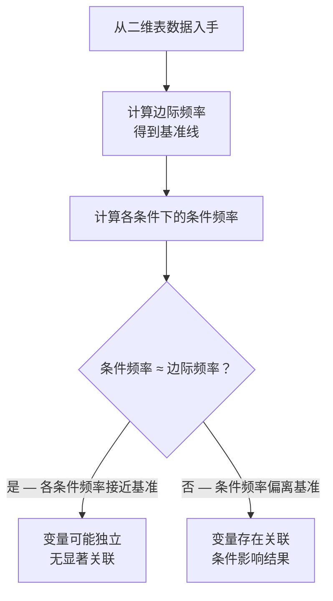

# AP Statistics Marginal vs Conditional Relative Frequency

> [!abstract] 概述
> **边际相对频率**（Marginal Relative Frequency）与**条件相对频率**（Conditional Relative Frequency）的根本差异，是判断两个分类变量是否独立（Independent）还是有关联（Associated）的基石。边际频率描述「通常发生什么」，条件频率描述「特定情境下发生什么」。统计关联存在的证据，就是「特定情境」打破了「通常规律」。

## 核心概念

### 边际相对频率（Marginal Relative Frequency）

> [!note] 定义
> 从二维表的**边缘总计（Total 行/列）**计算的比例，反映**整体、无条件**的基准水平。

- **视角**：全局，不考虑任何其他变量
- **回答的问题**：「在所有样本中，某事件发生的比例是多少？」
- **作用**：提供「基准线」或「平均水平」

**计算公式**：
$$\text{Marginal Relative Frequency} = \frac{\text{某行（或列）的合计数}}{\text{样本总量}}$$

### 条件相对频率（Conditional Relative Frequency）

> [!note] 定义
> 从二维表的**内部某个子集**计算的比例，反映**局部、有条件**的特定情境。

- **视角**：局部，限定在某个条件下
- **回答的问题**：「已知发生 A 的条件下，B 发生的比例是多少？」
- **作用**：揭示特定情境下的行为模式

**计算公式**：
$$\text{Conditional Relative Frequency} = \frac{\text{某单元格频数}}{\text{该条件对应的行（或列）合计数}}$$

## 核心区别

| 维度 | 边际相对频率 | 条件相对频率 |
|------|:------------:|:------------:|
| **视角** | 整体（无条件） | 局部（有条件） |
| **数据来源** | 表边缘的 Total 行/列 | 表内部的子集 |
| **回答的问题** | 「通常发生什么？」 | 「特定情境下发生什么？」 |
| **作用** | 提供基准线 | 揭示情境差异 |
| **符号** | $P(\text{Goalie Left})$ | $P(\text{Goalie Left} \mid \text{Shooter Left})$ |

## 差异如何揭示关联性

> [!important] 核心逻辑
> **比较条件频率与边际频率是否一致**，是判断两个变量是否独立的根本方法。

### 独立（无关联）

如果变量间独立，条件频率应**等于**边际频率：

$$P(\text{Goalie Left}) = P(\text{Goalie Left} \mid \text{Shooter Left}) = P(\text{Goalie Left} \mid \text{Shooter Right})$$

守门员的决策不受射手方向影响，无论射手踢哪边，守门员向左扑的概率都等于总体基准。

### 关联（不独立）

如果变量间有关联，条件频率会**偏离**边际频率：

$$P(\text{Goalie Left}) \neq P(\text{Goalie Left} \mid \text{Shooter Left})$$

守门员的决策随射手方向而改变，特定情境下的概率与基准线不一致。

## 实战示例：点球大战

### 题目数据

|  | 守门员扑左 | 守门员扑右 | 合计 |
|------|:----------:|:----------:|:----:|
| **射手踢左** | 80 | 85 | 165 |
| **射手踢右** | 132 | 75 | 207 |
| **合计** | 212 | 160 | 372 |

### 边际频率计算

> **基准线**：总体来看，守门员向左扑的比例

$$P(\text{Goalie Left}) = \frac{212}{372} \approx 57\%$$

### 条件频率计算

> **特定情境 1**：射手踢左时，守门员向左扑的比例

$$P(\text{Goalie Left} \mid \text{Shooter Left}) = \frac{80}{165} \approx 48\%$$

> **特定情境 2**：射手踢右时，守门员向左扑的比例

$$P(\text{Goalie Left} \mid \text{Shooter Right}) = \frac{132}{207} \approx 64\%$$

### 对比分析

| 情境 | 条件频率 | 与边际频率（57%）对比 |
|------|:--------:|:---------------------:|
| 射手踢左 | 48% | 低于基准 9 个百分点 |
| 射手踢右 | 64% | 高于基准 7 个百分点 |

### 结论

$$48\% \neq 57\% \quad \text{且} \quad 64\% \neq 57\%$$

因为两个条件频率都偏离边际频率，说明**守门员的决策与射手方向存在关联**——射手踢右时，守门员更倾向扑左；射手踢左时，守门员反而减少扑左。

## 解题决策树

> [!tip] 判断关联性三步法

### 判断标准

| 条件 | 结论 |
|------|------|
| 所有条件频率 $\approx$ 边际频率 | 独立（无关联） |
| 任一条件频率 $\neq$ 边际频率 | 有关联 |

> [!warning] 常见误区
> **不要把两个条件频率互相比较**——关键是每个条件频率与边际频率比较。即使两个条件频率不同（如 48% vs 64%），如果它们都接近边际频率（57%），差异可能只是随机波动。

## 与二维表结构的对应

> [!note] 二维表中的三种频率

| 频率类型 | 计算位置 | 示例（本表） |
|----------|----------|--------------|
| **联合频率**（Joint Frequency） | 表内单元格 | 80（射手左 ∩ 守门员左） |
| **边际频率**（Marginal Frequency） | 边缘合计行/列 | 212（守门员左总计） |
| **条件频率**（Conditional Frequency） | 单元格 ÷ 条件合计 | $80 \div 165 \approx 48\%$ |

## 相关链接

- [[AP_Statistics_Charts]] — 二维表与分段条形图
- [[Two-Way_Tables]] — 二维表详细解读
- [[AP_Statistics_MOC]] — AP 统计学知识地图
