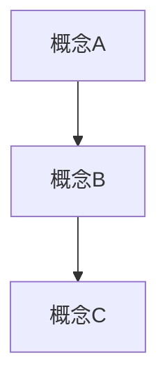

# Obsidian笔记生成

## 任务目标
根据知识点内容生成符合 Obsidian 格式规范的 Markdown 笔记，支持双向链接、数学公式和可视化图示。

## 执行流程

### 1. 读取源内容
使用 `read` 读取源文件，或直接处理提供的知识点内容。

### 2. 分析知识点结构
- 识别主题和子主题
- 确定知识点之间的关联
- 提取关键概念、定理、公式

### 3. 读取参考笔记
查找 `output_dir` 下已有的 `.md` 文件，分析其格式风格：
- 标题层级结构
- 元数据(YAML front matter)格式
- 链接风格
- 公式书写习惯

### 4. 生成笔记内容

#### 元数据规范
```yaml
---
title: 笔记标题
tags:
  - 标签1
  - 标签2
created: YYYY-MM-DD
---
```

#### 数学公式规范
- 行内公式: `$E = mc^2$`
- 块级公式: `$$\int_a^b f(x) \, dx$$`
- 使用 `\displaystyle` 使公式更清晰

#### 链接规范
- 内部链接: `[[笔记名称]]`
- 带显示文本: `[[笔记名称|显示文本]]`
- 标题链接: `[[笔记名称#标题]]`
- 块链接: `[[笔记名称#^block-id]]`

### 5. 添加可视化元素

#### Mermaid 图表


#### 流程图


### 6. 增强可读性
- 添加目录(TOC)
- 使用 Callout 语法高亮重要内容
- 添加代码块示例
- **分割线克制使用**: Markdown 的 `---` 水平分割线仅在必要时使用，即 YAML front matter 与大章节（如 `#` 一级标题）之间。普通章节之间靠标题层级即可清晰分隔，插入 `---` 反而打断阅读流、降低可读性

```markdown
> [!note] 定义
> 这是定义内容

> [!tip] 提示
> 这是提示内容

> [!warning] 注意
> 这是注意事项
```

### 7. 建立笔记链接
- 识别相关笔记
- 添加双向链接
- 创建 MOC (Map of Content) 如需要

### 8. 写入文件
使用 `write` 将笔记写入 `{output_dir}/{笔记名}.md`。

## 输出格式

```markdown
---
title: {标题}
tags: [{标签列表}]
created: {日期}
---

# {标题}

> [!abstract] 概述
> {知识点概述}

## 基本概念
{概念解释}

## 核心公式
$$
{数学公式}
$$

## 相关链接
- [[相关笔记1]]
- [[相关笔记2]]

## 注意事项
1. **公式准确性**: 确保所有数学公式使用正确的 LaTeX 语法
2. **链接有效性**: 只创建指向实际存在或将要创建的笔记的链接
3. **命名规范**: 文件名使用英文或拼音，避免空格和特殊字符
4. **编码统一**: 使用 UTF-8 编码
5. **格式一致**: 与目录下现有笔记保持格式一致
6. **可读优先**: 适当使用加粗、列表、表格等增强可读性
7. **Git 安全网 + 文件写入安全**: 本 skill 遵守 [Git 安全网规范](../git_safety_net.md)。执行 `write` 创建笔记前，必须先读取并执行 `git_safety_net.md` 中的 git 版本追踪指令。同时：先用 `glob` 或 `read` 确认目标 `.md` 文件是否已存在；若文件已存在，优先用 `edit` 追加内容，而非 `write` 覆写。确需覆写须先告知用户。

