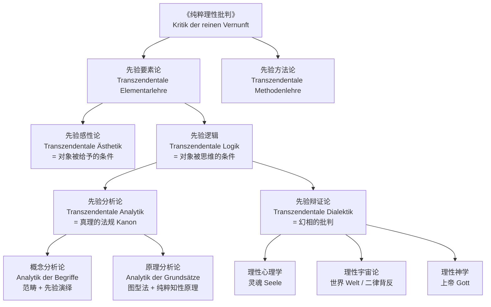
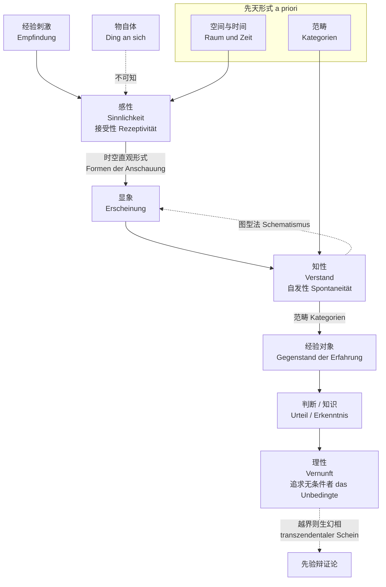

# Kant - Epistemology

> [!info] 术语标注体例
> 全文按「中文（Deutsch；English）」标注。德语依康德原文（普鲁士科学院版 AA；《纯粹理性批判》以 A/B 标 1781/1787 两版页码），英语取剑桥版 Guyer & Wood 译本通行译法。跨笔记术语总表见 [[术语对照表_Deutsch_English]]。

> [!abstract] 概述
> 康德（Immanuel Kant, 1724–1804）的认识论以"哥白尼式革命"著称：不是主体符合客体，而是客体符合主体的先天认知形式。这一框架将知识的可能性条件追溯到心灵的内在结构，为后来的心理主义争论埋下了伏笔。

## 术语速览（Deutsch–English–中文）

| 中文 | Deutsch | English |
|------|---------|---------|
| 先天的 | a priori | a priori |
| 先验的 | transzendental | transcendental |
| 超验的 | transzendent | transcendent |
| 经验的 | empirisch | empirical |
| 感性 | Sinnlichkeit | sensibility |
| 知性 | Verstand | understanding |
| 理性 | Vernunft | reason |
| 直观 | Anschauung | intuition |
| 概念 | Begriff | concept |
| 范畴 | Kategorie | category |
| 表象 | Vorstellung | representation |
| 显象 / 现象 | Erscheinung / Phänomen | appearance / phenomenon |
| 物自体 | Ding an sich | thing in itself |
| 本体（智思物） | Noumenon | noumenon |
| 统觉 | Apperzeption | apperception |
| 综合 | Synthesis | synthesis |
| 判断 | Urteil | judgment |
| 先天综合判断 | synthetisches Urteil a priori | synthetic a priori judgment |
| 图型 | Schema | schema |
| 原理 | Grundsatz | principle |
| 理念 | Idee | idea |
| 幻相 | Schein | illusion |
| 二律背反 | Antinomie | antinomy |
| 界限概念 | Grenzbegriff | boundary concept |

## 哥白尼式革命（Kopernikanische Wende）

> [!warning] 出处更正
> 这段话出自《纯粹理性批判》**B 版序言（KrV B XVI）**，并不存在名为《纯粹理性导论》的著作（易与 1783 年的 *Prolegomena*（《未来形而上学导论》）混淆）。

> [!quote] 康德（KrV B XVI）
> *Bisher nahm man an, alle unsere Erkenntnis müsse sich nach den Gegenständen richten; aber alle Versuche, über sie a priori etwas durch Begriffe auszumachen, wodurch unsere Erkenntnis erweitert würde, gingen unter dieser Voraussetzung zu nichte. Man versuche es daher einmal, ob wir nicht in den Aufgaben der Metaphysik damit besser fortkommen, daß wir annehmen, die Gegenstände müssen sich nach unserem Erkenntnis richten.*
>
> 迄今为止人们假定，我们的一切知识都必须依照对象（sich nach den Gegenständen richten）；但在这个前提下，一切试图通过概念先天地就对象有所断定、从而扩展知识的尝试都归于失败。因此不妨试一试：如果我们假定**对象必须依照我们的认识**（die Gegenstände müssen sich nach unserem Erkenntnis richten），形而上学的任务是否会进行得更顺利。

康德随即以哥白尼为类比：正如哥白尼让**观察者**转动、让星辰静止，才能解释天体运动；形而上学也应让对象依照认识主体的形式。

| 范式 | 公式 | 德语 | 代表立场 |
|------|------|------|---------|
| 旧范式 | 知识 → 符合 → 客体（心灵被动接受） | die Erkenntnis muß sich nach den Gegenständen richten | 独断论 / 素朴实在论 |
| 新范式 | 客体 → 符合 → 主体认知形式（心灵主动构造） | die Gegenstände müssen sich nach unserem Erkenntnis richten | 先验观念论（transzendentaler Idealismus） |

> [!note] 两点必须限定
> 1. **这不是贝克莱式观念论**。康德同时主张**经验实在论**（empirischer Realismus）：经验中的对象（显象）具有客观实在性，并非我的私人感觉。他只是否定了「对象可以脱离我们的直观形式而被认识」这一主张。
> 2. **这是一个「实验」而非证明**。康德在 B 版序言中把自己的做法称作「实验」（*Versuche*）：若按此假定能解释先天知识的可能性，该转向即获得间接支持——参见下文「先验演绎」与「先验辩证论」。

## 《纯粹理性批判》的整体架构（Aufbau der KrV）

> [!important] 全书引导问题（Leitfrage）
> **先天综合判断如何可能？**（*Wie sind synthetische Urteile a priori möglich?*，B19）
> 全书按 **感性论 → 分析论 → 辩证论** 的三步推进：先说明对象如何被**给予**，再说明对象如何被**思维**，最后说明理性超出经验界限时为何**必然**产生幻相。下文主体各节依照这一顺序展开；「知识的结构」「先天综合判断」两节是进入该顺序之前的准备。

## 知识的结构：感性、知性、理性（Sinnlichkeit / Verstand / Vernunft）

康德将知识生成分为不可相互还原的层次：直观无概念则盲，概念无直观则空。

> [!quote] 康德（A51/B75）
> *Gedanken ohne Inhalt sind leer, Anschauungen ohne Begriffe sind blind.*
> 无内容的思想是空的，无概念的直观是盲的。

## 显象、物自体与本体（Erscheinung / Ding an sich / Noumenon）

### 四个必须分开的术语

| 德语 | 中译 | 含义 |
|------|------|------|
| Erscheinung | 显象 | 被给予的、尚未被范畴规定的感性对象（A20/B34） |
| Phänomen | 现象 | 显象作为**可能经验的对象**、已被范畴规定（B 版用语） |
| Ding an sich / Sache an sich | 物自体 | 脱离我们直观形式而被**思考**的同一对象 |
| Noumenon | 本体（智思物） | 通过纯粹范畴被思维的对象；只有**消极义**可用 |

> [!note] 康德的两种 Noumenon（B310–311）
> *Wenn wir unter Noumenon ein Ding verstehen, so fern es nicht Objekt unserer sinnlichen Anschauung ist, indem wir von unserer Anschauungsart desselben abstrahieren: so ist dieses ein Noumenon im negativen Verstande. Verstehen wir aber darunter ein Objekt einer nichtsinnlichen Anschauung, so ... wäre das das Noumenon in positiver Bedeutung.*
>
> **消极义**：仅指「不是感性直观的对象」，是一个限制性概念；**积极义**：指一种智的直观（intellektuelle Anschauung）的对象——康德认为我们没有这种直观，故积极义的 Noumenon 只是**悬拟的（problematisch）**概念，不可断言其存在。

| 维度 | 显象 / 现象 | 物自体 Ding an sich | 本体 Noumenon |
|------|-------------|---------------------|----------------|
| 可知性 | 可被认识 | 不可被认识 | 不可被认识（仅消极义可用） |
| 受时空形式约束 | 是 | 否 | 否 |
| 受范畴约束 | 是（被规定） | 否 | 只是被范畴**思维**，无直观 |
| 认识角色 | 知识的对象 | 认识的界限标记 | 限制感性僭越的概念 |

> [!quote] 康德（B310–311）
> *Der Begriff eines Noumenon ist also bloß ein Grenzbegriff, um die Anmaßung der Sinnlichkeit einzuschränken, und also nur von negativem Gebrauche.*
> 本体的概念因而只是一个**界限概念**（Grenzbegriff），其作用在于限制感性的僭越，因此只有消极的运用。

> [!warning] 三条常见误解
> 1. **物自体 ≠ 另一个世界**：它是**同一对象**脱离我们的认识形式后被思考的方式；康德既不肯定也不否定其存在，只说它不能成为理论认识的对象（*Grenzbegriff* 的字面义即「边界上的标记」）。
> 2. **物自体 ≠ 积极义的本体**：前者是显象的「根据」（Grund），后者是假想的智的直观之对象。
> 3. **「不可知」≠「无所谓」**：在道德与实践哲学中，同一「物自体」领域恰是自由（Freiheit）得以可能的地带——理论理性限制知识，正是为实践理性留出位置（B XXIX f.）。

## 范畴与先验演绎（Kategorien / Transzendentale Deduktion）

### 形而上学演绎：从判断表推出范畴表

康德并非随意列举 12 个范畴：他先给出**判断的逻辑机能表**（Tafel der Urteile，B95），再主张「使判断成为可能的同一知性机能，也使经验对象的构造成为可能」，由此得出范畴表（B106）。这一步称**形而上学演绎**（metaphysische Deduktion）。

| 判断机能 Urteilsfunktion | 范畴 Kategorie | 德语 / 拉丁语 |
|---|---|---|
| **量** Quantität | | |
| 全称判断 allgemein | 统一性 | Einheit / unitas |
| 特称判断 besonder | 多数性 | Vielheit / multitudo |
| 单称判断 einzeln | 总体性 | Allheit / universalitas |
| **质** Qualität | | |
| 肯定判断 bejahend | 实在性 | Realität / realitas |
| 否定判断 verneinend | 否定性 | Negation / negatio |
| 无限判断 unendlich | 限定性 | Limitation / limitatio |
| **关系** Relation | | |
| 直言判断 kategorisch | 实体与偶性 | Substanz und Akzidenz（Inhärenz und Subsistenz） |
| 假言判断 hypothetisch | 因果性与依存性 | Kausalität und Dependenz |
| 选言判断 disjunktiv | 交互性（共在） | Wechselwirkung（Gemeinschaft） |
| **模态** Modalität | | |
| 或然判断 problematisch | 可能性—不可能性 | Möglichkeit / Unmöglichkeit |
| 实然判断 assertorisch | 实存—非实存 | Dasein / Nichtsein |
| 必然判断 apodiktisch | 必然性—偶然性 | Notwendigkeit / Zufälligkeit |

> [!tip] 两个「演绎」的分工
> - **形而上学演绎**：证明范畴是**先天概念**，来源在知性自身（不来自经验）——回答「范畴从何而来」。
> - **先验演绎**（transzendentale Deduktion）：证明这些先天概念对**一切可能经验的对象**具有**客观有效性**（objektive Gültigkeit）——回答「范畴凭什么合法地用于对象」。这是《纯批》公认最难的部分，A 版（1781）与 B 版（1787）各写一次。

### A 版：三重综合（A98–110）

| 层次 | 德语 | 作用 |
|------|------|------|
| 直观中领会的综合 | Synthesis der Apprehension in der Anschauung | 把杂多把握为在时间中前后相继的表象 |
| 想象中再生的综合 | Synthesis der Reproduktion in der Einbildungskraft | 保留先前的表象，使之可与后续表象连结 |
| 概念中认定的综合 | Synthesis der Rekognition im Begriffe | 通过同一性意识把再生的表象认作**同一对象** |

对应三重主观根据：感官（Sinne）—想象力（Einbildungskraft）—统觉（Apperzeption）。

### 先验统觉：演绎的枢纽（B131–132）

> [!quote] 康德（B131–132）
> *Das: Ich denke, muß alle meine Vorstellungen begleiten können; denn sonst würde etwas in mir vorgestellt werden, was gar nicht gedacht werden könnte, welches ebenso viel heißt als: die Vorstellung würde entweder unmöglich, oder wenigstens für mich nichts sein.*
> 「我思」必须能够伴随我的一切表象；否则在我之中就会有某种完全不能思维的东西被表象，而这等于说：该表象要么不可能，要么至少对我来说等于无。

论证骨架：

1. 一切杂多表象必须能被「我思」伴随，否则不成其为**我的**表象；
2. 这种伴随要求杂多具有**综合的统一性**（synthetische Einheit）；
3. 该统一性的来源是**本源的、综合的统觉统一**（ursprünglich-synthetische Einheit der Apperzeption），即先验自我意识；
4. 范畴正是这种统一的**规则**：把杂多综合为对象，就是按范畴规定杂多；
5. 因此一切可能经验的对象必然服从范畴 → 范畴具有客观有效性。

> [!note] 「先验主体」不是「我的心灵」
> 这个「我思」是**先验主体**（transzendentales Subjekt），是一切经验得以可能的**形式条件**，不是心理学意义上的某个人的心灵状态。这个区分正是 19 世纪心理主义争论的原始裂缝（见 [[Kant_to_Psychologism_Development]]）。

### 图型法：范畴与直观的中介（Schematismus，A137/B176）

知性概念与感性直观是**异质的**（heterogen）——「狗」的概念无法直接套到直观上。中介者是**时间的先验规定**，即**图型**（Schema）。

| 范畴 | 图型（时间规定） |
|------|-----------------|
| 实体 | 时间中的持存者（Beharrlichkeit） |
| 因果 | 时间中依照规则的相继（Sukzession nach einer Regel） |
| 交互 | 同一时间中的共在（Zugleichsein） |
| 实在性 | 时间中的充实（Erfüllung der Zeit） |
| 必然性 | 一个对象在一切时间中的存在 |

> [!note] 图型 ≠ 图像
> 图型（Schema）是「想象力依照某个一般概念描画形象」的**规则**，不是某条具体的狗的图像（Bild）。这是康德对「概念如何被应用」这一问题的独特回答。

### 纯粹知性原理（Grundsätze des reinen Verstandes，A148/B187 起）

图型法之后，康德给出四组先天综合原理——这是「先天综合判断如何可能」的具体兑现：

| 原理组 | 德语 | 内容 | 对应范畴 |
|--------|------|------|---------|
| 直观的公理 | Axiome der Anschauung | 一切直观都是广延量（extensive Größe） | 量 |
| 知觉的预感 | Antizipationen der Wahrnehmung | 一切感觉（实在性）都有内包量（intensive Größe） | 质 |
| 经验的类比 | Analogien der Erfahrung | 经验只有通过知觉的必然联结才可能 | 关系 |
| 一般经验思维的悬设 | Postulate des empirischen Denkens überhaupt | 可能 / 现实 / 必然与认识能力的关系 | 模态 |

> [!important] 第二类比（因果原理）为何最著名
> *Alles, was geschieht (anhebt zu sein), setzt etwas voraus, worauf es nach einer Regel folgt.*
> 凡发生之事（开始存在之事）都以某物为前提，它依照一条规则而随之而来。
>
> 这不是关于心理习惯的经验陈述，而是**经验之所以可能的先天条件**：若无因果规则，我们连「客观的相继」与「主观的先后」都无法区分——看一条船顺流而下（客观相继）与扫视一间屋子（主观先后）在直观上都是表象的接续。这是康德对休谟因果性怀疑论的正面回应。

## 先天综合判断（synthetisches Urteil a priori）

全书的核心问题：**先天综合判断如何可能？** 下文三节（感性论 / 分析论 / 辩证论）依次回答 B20 的三个总问题。

| 判断类型 | 德语 | 例 | 特征 |
|----------|------|-----|------|
| 分析判断 | analytisches Urteil | 「所有单身汉是未婚的」 | 谓词已含于主词（同一律足以判定），必然但无新知识 |
| 综合判断 | synthetisches Urteil | 「这朵花是红的」 | 谓词超出主词，有新知识但非必然 |
| **先天综合判断** | **synthetisches Urteil a priori** | 「$7 + 5 = 12$」「一切变化皆有原因」 | 既有新知识，又具严格普遍性与必然性 |

> [!note] 康德的判据（B3–4, B17）
> **分析/综合**由「谓词是否包含于主词概念」区分（逻辑判据）；**先天/后天**由「是否独立于一切经验而有效」区分（认识论判据）。两对区分相互独立，于是有四种组合，其中「先天综合」是唯一需要证明可能性的。

> [!warning] 为什么先天综合判断是关键？
> 数学（几何学、算术）与纯粹自然科学（如因果原理）显然既扩展知识又具必然性。若这类判断不可能，科学知识就失去根基，形而上学也永无成为科学的希望。康德的目标正是为先天综合判断的可能性提供证成。

三条支线（B20 的三个总问题）：

| 问题 | 德语 | 解决场所 |
|------|------|---------|
| 纯粹数学如何可能？ | Wie ist reine Mathematik möglich? | 先验感性论（时空作为先天直观形式） |
| 纯粹自然科学如何可能？ | Wie ist reine Naturwissenschaft möglich? | 先验分析论（范畴 + 纯粹知性原理） |
| 形而上学作为自然倾向如何可能？ | Wie ist Metaphysik als Naturanlage möglich? | 先验辩证论（幻相的批判） |

## 先验感性论：时空作为先天直观形式（Transzendentale Ästhetik）

- **空间**（Raum）：**外感**的先天直观形式（Form des äußeren Sinnes）——一切外部经验之所以可能的前提；
- **时间**（Zeit）：**内感**的先天直观形式（Form des inneren Sinnes）——一切经验（内外）的最终框架。注意：时间虽只直接规定内感，却间接也约束一切外感对象（B49–50）。

### 两种阐明（Erörterung）

| 阐明方式 | 德语 | 做什么 |
|---------|------|--------|
| 形而上阐明 | metaphysische Erörterung | 证明时空是**先天**的（非经验概念）且是**直观**（非概念） |
| 先验阐明 | transzendentale Erörterung | 证明时空使**先天综合知识**（几何学、算术）成为可能——这是它们唯一的解释原则 |

### 两个「面向」：经验实在性 + 先验观念性

| | 主张 | 含义 |
|---|------|------|
| **经验实在性** | empirische Realität | 对一切可能经验中的对象，时空具有客观有效性（不因观察者而异） |
| **先验观念性** | transzendentale Idealität | 时空不是物自体的性质或关系，只是我们直观的主观形式 |

> [!warning] 常见误解
> 1. **时空不是经验概念**：康德承认我们对时空的表象伴随一切经验，但其**必然性与严格普遍性**不能来自归纳（B3–5）。
> 2. **时空不是知性概念**：它们是**直观**（Anschauung），不是概念（Begriff）；因此数学才能「构造概念」（在纯直观中给出对象）。
> 3. **时空既非牛顿式绝对容器、也非莱布尼茨式关系**：牛顿把它当物自体性质的容器，莱布尼茨把它当现象间的关系；康德说它是**主体的直观形式**——正是这一第三条路解释了先天综合的数学知识如何可能。
> 4. **「先验观念性」不等于「时空是幻觉」**：经验实在性与先验观念性并不冲突，二者分属不同层面。

## 先验辩证论：幻相、理念与二律背反（Transzendentale Dialektik）

知性把范畴用于可能经验，是**内在的**（immanent）运用；理性却要求把无条件者当作对象，于是产生**先验幻相**（transzendentaler Schein）——它不是逻辑错误，而是理性本性所致、不可消除但可被识破的错觉（A293/B249 起）。

| 理性理念 | 德语 | 误用的学科 | 批判结果 |
|---------|------|-----------|---------|
| 灵魂 | Seele | 理性心理学（Paralogismen 谬误推理） | 「灵魂是实体」不能被证明 |
| 世界 | Welt | 理性宇宙论（**二律背反** Antinomien） | 正题与反题皆可自洽论证，故必须区分显象/物自体 |
| 上帝 | Gott | 理性神学（本体论/宇宙论/目的论证明） | 三种证明皆被驳倒 |

> [!important] 第三组二律背反：自由与自然必然性
> 正题：除自然因果之外，还必须假定一种**出自自由的因果性**（Kausalität aus Freiheit）；
> 反题：一切皆依自然律发生，没有自由。
> 康德的解决：正题关于**物自体**领域（可思），反题关于**显象**领域（可知）——二者可同真。这一「两个视角」策略是后世争论「相容论」的源头。

> [!warning] 必须区分的两个词
> - **先验的**（transzendental）：关于「先天知识如何可能」的**考察方式**，始终停留在经验界限之内；
> - **超验的**（transzendent）：**超出**一切可能经验的运用（如把范畴用于物自体）。
> 中文常把二者都译成「先验」，但康德对「超验辩证法」（transzendentale Dialektik）的批判恰恰是禁止**超验**（transzendent）运用的。

> [!tip] 理念的正当用途
> 被驳倒的是理念的**构成性运用**（konstitutiver Gebrauch，把灵魂/世界/上帝当作认识对象）；但它们有正当的**调节性运用**（regulativer Gebrauch）：作为指引经验研究不断推进的「焦点」（焦点概念 Focus imaginarius）。

## 与心理主义的历史关联

康德框架留下了三处「后门」，后来都成为心理主义的入口：

| 后门 | 出处 | 被误读为 |
|------|------|---------|
| 范畴是「心灵的先天结构」 | 先验分析论 | 人类心灵的**经验**结构（人类学） |
| 逻辑法则以「我思」为最高条件 | B131–132 | 逻辑规律是**思维自然规律** |
| 先验逻辑 vs 应用逻辑的界限 | 先验逻辑导论 | 混淆二者，把规范性还原为描述性 |

康德本人的防线有三道：

1. **纯粹一般逻辑**（reine allgemeine Logik）：只处理思维的形式，与对象和心灵状态无关（B ix–x）；
2. **先验逻辑 ≠ 应用逻辑**（transzendentale Logik ≠ angewandte Logik）：后者才研究「在偶然的主观条件下」实际如何思维；
3. **逻辑是真理的法规**（Kanon），不是发现的工具（Organon）。

> [!important] 康德不是心理主义者，但康德逻辑学讲义埋下隐患
> 康德的学生 Jäsche（Gottlob Benjamin Jäsche）据其讲稿编成的《逻辑学》（*Immanuel Kants Logik*, 1800）开篇写道：逻辑是「知性与理性的必然法则的科学」（*Wissenschaft von den notwendigen Gesetzen des Verstandes und der Vernunft*）。这句话极易被读作心理学命题——19 世纪的心理主义者正是这样读的。但康德的原意是：这些「法则」是**规范性**的（告诉我们应当如何思维），其必然性来自知性自身的形式，而不来自经验心理学的描述。

关于这一「后门」如何在 1800–1900 年间被逐渐挤开，见 [[Kant_to_Psychologism_Development]]。

## 常见误解速查

| 误解 | 更正 |
|------|------|
| 物自体 = 另一个世界的东西 | 它是同一对象脱离我们认识形式后被思考的方式（Grenzbegriff） |
| 「先天」（a priori）= 天生 / 心理学上先于经验 | 先天的 = 独立于经验而有效且具严格普遍性；与发生顺序无关 |
| 范畴是从经验中抽象出来的 | 范畴源于知性的判断机能，只有**经验性的运用**才需直观 |
| 康德是（贝克莱式）观念论者 | 他是**先验观念论 + 经验实在论**：经验对象客观有效，物自体不可知 |
| 「先验的」= 「超验的」 | 前者在经验界限内考察可能性条件，后者越出界限 |
| 时空是经验概念 / 绝对容器 | 时空是**先天直观形式**，经验实在而先验观念 |
| 先天综合判断不可能（逻辑实证主义读法） | 康德的「先天」≠「分析」；「7+5=12」在康德看来是先天**综合**的 |

## 相关链接

- [[Psychologism]]——康德框架如何被读成心理主义，以及弗雷格/胡塞尔的清算
- [[Kant_to_Psychologism_Development]]——1781–1901 的历史脉络
- [[Mill_Empiricism_about_Logic]]——拒斥先天综合知识的一元经验论路线
- [[术语对照表_Deutsch_English]]——全目录德/英/中术语索引

## 关键文本

- Kant, *Kritik der reinen Vernunft*（1781 A 版 / 1787 B 版）——引用惯例 A/B 页码
- Kant, *Prolegomena zu einer jeden künftigen Metaphysik, die als Wissenschaft wird auftreten können*（1783）——常简称《导论》，是《纯批》的简化版（**与前一行是两部不同的书**）
- Kant, *Immanuel Kants Logik*（Jäsche 编，1800）——逻辑学讲义，心理主义争议的关键文本
- Kant, *De mundi sensibilis atque intelligibilis forma et principiis*（1770，「就职论文」）——时空观的前身

### 二手文献

- P. F. Strawson, *The Bounds of Sense*（1966）——分析哲学式解读的经典
- Henry E. Allison, *Kant's Transcendental Idealism*（1983 / 2004 修订版）——「两个视角」读法的代表
- Sebastian Gardner, *Routledge Philosophy Guidebook to Kant and the Critique of Pure Reason*（1999）
- 邓晓芒，《康德〈纯粹理性批判〉句读》（2010）——逐句疏解，中文最佳伴读
