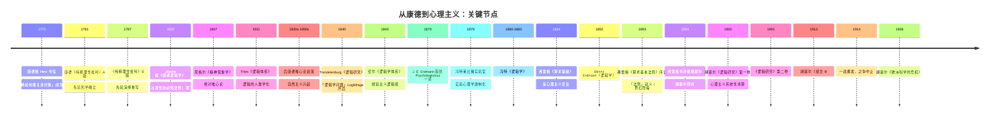
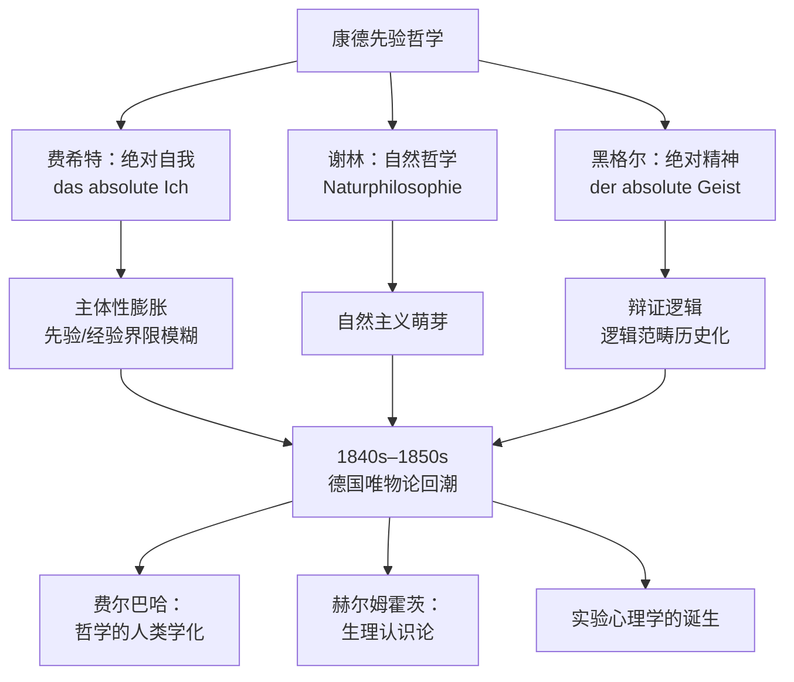
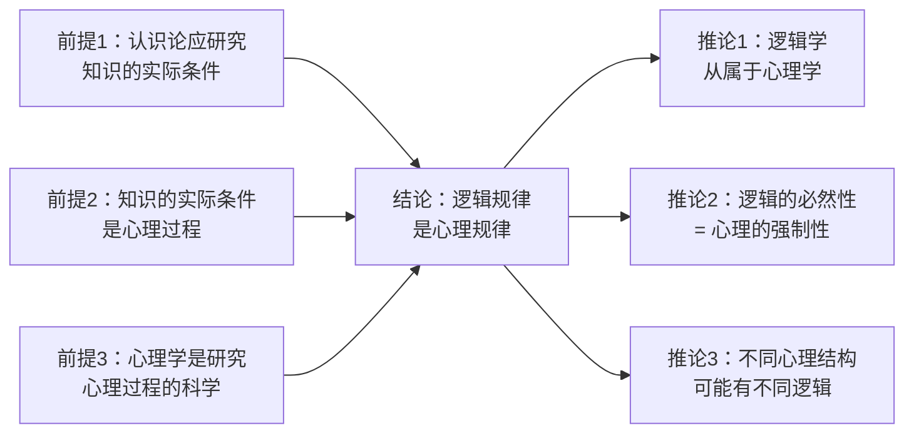
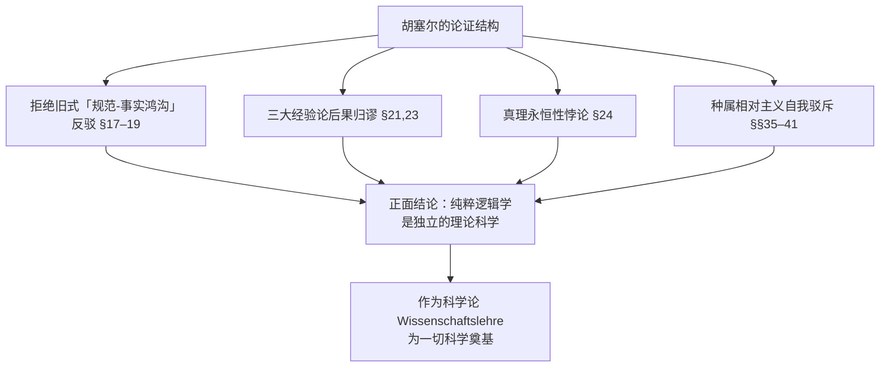
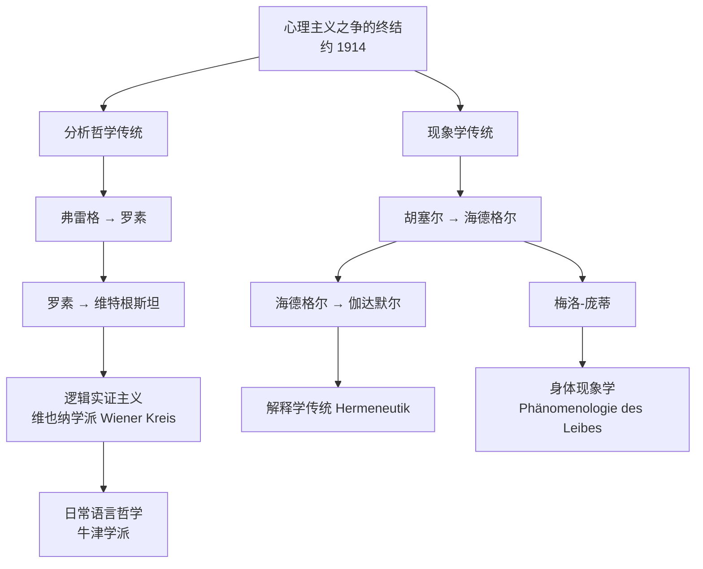

# Kant to Psychologism - Historical Development

> [!abstract] 概述
> 从康德（1780s）到心理主义之争的高峰与终结（1880–1914），约 130 年间德语哲学经历了一条曲折的道路：先验哲学的客观主义逐渐被心理学的自然主义取代，最终在弗雷格和胡塞尔的批判下被清算。这一过程塑造了 20 世纪分析哲学与现象学两大传统。

## 术语速览（Deutsch–English–中文）

| 中文 | Deutsch | English |
|------|---------|---------|
| 先验主体 | transzendentales Subjekt | transcendental subject |
| 经验主体 | empirisches Subjekt | empirical subject |
| 纯粹一般逻辑 | reine allgemeine Logik | pure general logic |
| 先验逻辑 | transzendentale Logik | transcendental logic |
| 应用逻辑 | angewandte Logik | applied logic |
| 思维自然法则 | Naturgesetz des Denkens | natural law of thought |
| 思维的应然法则 | Gesetz des Denkens, wie gedacht werden soll | prescriptive law of thought |
| 发生 / 效力 | Genesis / Geltung | genesis / validity |
| 逻辑学问题 | Logikfrage | the logic question |
| 人类学主义 | Anthropologismus | anthropologism |
| 心理主义之争 | Psychologismus-Streit | the psychologism dispute |
| 真理的界石 | Grenzsteine der Wahrheit | boundary stones of truth |

## 时间线总览

> [!warning] 时间线更正
> 原笔记将「弗雷格批判胡塞尔」置于 1893 年；实际书评发表于 **1894** 年（*Zeitschrift für Philosophie und philosophische Kritik* 103: 313–332）。1893 年是弗雷格《算术基本法则》第一卷出版的年份，两者需分开。

## 第一阶段：康德先验哲学的建立（1781–1800）

### 康德的核心遗产

康德在《纯粹理性批判》中确立了以下原则：

1. **先验与经验的严格区分**：知识的先天形式（时空、范畴）不是从经验中归纳出来的；
2. **逻辑的客观性**：先验逻辑提供的是**客观有效的法则**，不是心理过程的描述；
3. **主体性的构造功能**：心灵不是被动接受印象，而是主动构造经验对象。

> [!note] 康德的三层区分（含德语）
> | 层次 | 内容 | 学科 |
> |------|------|------|
> | 纯粹一般逻辑  *reine allgemeine Logik* | 思维形式（与对象、心灵状态均无关） | 形式逻辑 |
> | 先验逻辑  *transzendentale Logik* | 范畴及其客观运用 | 形而上学 |
> | 应用逻辑  *angewandte Logik* | 在偶然主观条件下实际如何思维 | 经验心理学 |

### 两个关键历史事件

- **1772 年致 Marcus Herz 的书信**：康德首次提出核心难题——「知性的纯粹概念如何能够关涉那些对我们完全异质而不同的对象？」（*wie reine Verstandesbegriffe auf Gegenstände sich beziehen können*）。这个问题直接逼出了十年后的《纯批》，也预设了后来争论的框架。
- **1800 年 Jäsche 编《逻辑学》**：康德的学生 Gottlob Benjamin Jäsche 据其讲稿编定 *Immanuel Kants Logik*，开篇把逻辑定义为「知性与理性的**必然法则**的科学」（*Wissenschaft von den notwendigen Gesetzen des Verstandes und der Vernunft*）。此句本意是**规范性**的，但极易被读作描述性的心理学命题。

### 康德留下的张力

康德框架内含一个危险的模糊性：

- 范畴是「心灵的先天结构」——但「心灵」在这里是**先验主体**（transzendentales Subjekt），不是经验个体（empirisches Subjekt）；
- 后康德时代逐渐遗忘这一区分，将「先验主体」等同于「人类心灵」（menschliche Seele）；
- 这一等同直接为心理主义打开了大门。

## 第二阶段：后康德转向与自然主义兴起（1800–1860）

### 唯心论的衰落

### 关键转变

1. **从先验主体到经验主体**：费希特将康德的先验自我膨胀为创造性的绝对自我，模糊了先验与经验的界限；
2. **从构造到进化**：黑格尔将逻辑范畴历史化、辩证化，暗示逻辑法则可能随精神发展而变化；
3. **从哲学到科学**：19 世纪中叶，自然科学（尤其是生理学、心理学）的成就使哲学家倾向于将认识论问题交给经验科学。

### 导火索：Trendelenburg 与「逻辑学问题」（1840）

> [!important] Logikfrage（逻辑学问题）
> Adolf Trendelenburg 在《逻辑研究》（*Logische Untersuchungen*, 1840）中重提亚里士多德式问题：逻辑学的对象究竟是**思维活动**还是**存在本身**？他反对黑格尔把逻辑等同于本体论，主张逻辑学必须面对「思维与存在的桥梁」。这一争论把逻辑学推到了哲学的中心，也使「逻辑法则的根据在哪里」成为整个世纪的问题。

### 制度因素：大学的学科地盘（Kusch 1995）

| 年份 | 事件 | 后果 |
|------|------|------|
| 1879 | 冯特在莱比锡建第一个心理学实验室 | 实验心理学建制化为独立学科 |
| 1880s | 心理学抢走「研究心灵」的招牌 | 哲学家面临「要么与心理学结盟，要么另找地盘」的选择 |
| 1900s | 弗雷格/胡塞尔的反心理主义胜利 | 哲学转向「逻辑/意义」而非「心灵」 |

> [!warning] 心理主义的温床
> 19 世纪德国哲学的三个趋势共同催生了心理主义：
> - **自然主义**：一切问题最终可由自然科学回答；
> - **历史主义**：一切思想（包括逻辑）都是历史发展的产物；
> - **学科竞争**：实验心理学要求接管认识论的地盘。
> 三者的结合使「逻辑法则 = 人类思维的心理规律」这一等式显得自然。

## 第三阶段：心理主义的鼎盛（1860–1900）

### 心理主义的理论形态

19 世纪后期，心理主义在德国逻辑学和认识论中占据主导地位：

| 哲学家 | 著作 | 核心主张 | 所属论证（PA） |
|--------|------|---------|---------------|
| Jakob Friedrich Fries | *System der Logik* (1811) | 逻辑规律的最终根据在「理性直观 / 情感」，哲学奠基于人类学 | 前身 |
| Christoph von Sigwart | *Logik* (1873/1878) | 逻辑是「思维的法则」；判断的真假必须先有思维主体（*Naturgesetz des Denkens* 式的读法） | PA3 |
| Wilhelm Wundt | *Logik* (1880/1883) | 规范学科必须奠基于描述-说明科学；逻辑规律是精神发展的最高产物 | PA2 |
| Benno Erdmann | *Logik* (1892) | 逻辑规律只有**假设的必然性**：只对人类有效（因为我们无法设想别的逻辑） | PA5 |
| Theodor Lipps | *Grundzüge der Logik* (1893) | 逻辑是「思维的物理学」，是心理学的子学科 | PA1 |
| Gerardus Heymans | (1894, 1905) | 一切逻辑均可还原为意识现象间的关系 | PA1 |
| Theodor Elsenhans | (1897) | 自明感（Evidenz）是心理事实，逻辑必须研究它 | PA4 |
| Wilhelm Jerusalem | (1905) | 判断的行为与内容不可分，故逻辑是心理学的 | PA3 |

> [!note] 未列入上表但常被误认的两个名字
> - **Johann Eduard Erdmann（1805–1892）**：术语 *Psychologismus* 的首创者（约 1870，用以批判 Beneke），**不是**被批判的「Erdmann」；
> - **John Stuart Mill（1806–1873）**：立场是「断裂」的——既说逻辑的理论根据全部借自心理学，又坚持命题关于事物本身而非观念。详见 [[Mill_Empiricism_about_Logic]]。

### 心理主义的内在逻辑

> [!important] 心理主义的"合理性"
> 心理主义并非愚蠢的立场。它回应了一个真实问题：**如果逻辑规律不是从经验中归纳的，也不是柏拉图式的天外之物，那它们的基础是什么？** 心理主义者的回答是：它们根植于人类心灵的先天结构——这本身是对康德问题的一种回答。

## 第四阶段：反心理主义革命（1884–1901）

### 弗雷格的批判（1884–1893）

《算术基础》导论声明遵循**三条**（不是五条）方法论原则：

1. **心理的与逻辑的、主观的与客观的必须严格分开**（*das Psychologische von dem Logischen, das Subjective von dem Objectiven sorgfältig auseinanderzuhalten*）；
2. **词的意义只能在命题语境中询问**，不能在孤立语词中询问（*im Satzzusammenhange, nicht in ihrer Vereinzelung*）；
3. **概念与对象的区别必须始终保持在眼前**（*der Unterschied von Begriff und Gegenstand ist im Auge zu behalten*）。

> [!warning] 更正：「不要把表象当作思想」「句子是意义单位」不是独立原则
> 这两条是上面第 1、2 条的具体展开，Frege 自述的原则只有**三条**。

> [!quote] 弗雷格《算术基本法则》序言（1893: XV–XVI）
> *Der Doppelsinn des Wortes „Gesetz“ ist hier verhängnissvoll. In dem einen Sinne besagt es, was ist, in dem andern schreibt es vor, was sein soll.*
> 「法则」（Gesetz）的双义在这里是致命的：一种意义说的是「是什么」，另一种规定「应当是什么」。
>
> *Wahrsein ist etwas anderes als Fürwahrgehaltenwerden ... so sind auch die Gesetze des Wahrseins nicht psychologische Gesetze, sondern Grenzsteine in einem ewigen Grunde befestigt, von unserm Denken überfluthbar zwar, doch nicht verrückbar.*
> 真（Wahrsein）不同于被认为真（Fürwahrgehaltenwerden），无论是一个人、许多人还是所有人。……因此真理的法则不是心理学法则，而是**砌在永恒地基上的界石**：我们的思维可以漫过它们，却不能移动它们。

### 胡塞尔的清算（1900–1901）

胡塞尔《纯粹逻辑导引》的论证结构（按 SEP/Kusch 的重构）：

三条主攻线：

1. **三大经验论后果的反驳**（§21, §23）：若逻辑规则基于心理学法则，则（a）它们将同样模糊——但逻辑规则不模糊；（b）它们将只是或然的而非先天的——但它们是**明证的**（*apodiktisch einsichtig*）；（c）它们将涉及心理实体——但逻辑规则不关涉心理实体。
2. **真理的永恒性**（§24）：真理不是「事态」（Sachverhalt）的生灭。「对任意真理 t，其矛盾 ~t 不是真理」若是关于事态的法则，将推出「关于真理的法则有生灭」的背谬。
3. **相对主义自我驳斥**（§§35–41）：一切心理主义都是**种属相对主义 / 人类学主义**（*Spezies-Relativismus / Anthropologismus*）：矛盾律包含在「真理」的意义之中，故同一思想不可能对不同物种一真一假；真理永恒；若真理相对，则作为一切事实真理之理想体系之相关物的**世界**也相对。

> [!warning] 重要更正：胡塞尔**不**用「规范-事实鸿沟」
> 原笔记第 2 条「从事实推不出规范」是**新康德主义/自然主义谬误论**的反驳路径，恰恰**不是**胡塞尔的：
> - §17 他明确拒绝「规范反心理主义」：「应当如何思维」只是「实际如何思维」的**特例**；
> - §19 他也拒绝「循环论证」指控：心理学只把逻辑法则当作**方法论规则**使用，而非当作理论前提。

> [!important] 核心区分：发生与效力（Genesis / Geltung）
> 弗雷格与胡塞尔的共同武器是：「我们**如何**得到一个信念」（心理-发生问题）与「该信念凭**什么**有效」（观念-效力问题）是两个不同问题。前者属心理学，后者属逻辑学。
> 这一区分在 20 世纪被 Reichenbach（1938）改造为「**发现的脉络 / 证成的脉络**」（*context of discovery / context of justification*），成为科学哲学的方法论基石。

## 第五阶段：两条哲学传统的诞生（1900–1930）

心理主义之争在 **1914 年一战爆发**后中止（攻讦性学术争论不再被接受；哲学家与心理学家分工：前者转向「战争天才」话语，后者转向士兵测试）。此后两大传统各自成型：

| 传统 | 基本方法论预设 | 德语术语 |
|------|---------------|---------|
| 分析哲学 | 反心理主义、语言转向、逻辑分析 | *sprachliche Wende* |
| 现象学 | 先验还原、意向性、本质直观 | *transzendentale Reduktion* / *Intentionalität* / *Wesensschau* |

## 深层结构：康德问题的延续

> [!important] 康德问题的五种回答
> 心理主义之争本质上是康德问题的延续——**先天知识如何可能？**
>
> | 立场 | 回答 | 德语关键词 |
> |------|------|-----------|
> | 康德 | 因心灵提供先天形式——但心灵是**先验**主体 | *transzendentales Subjekt* |
> | Fries | 因理性有直接的「理性直观/情感」 | *Ahndung* / *Vernunftgefühl* |
> | 心理主义者 | 因**人类**心理结构是普遍的、不可回避的 | *Psychologismus* |
> | 弗雷格 | 因存在客观的、非心理亦非物理的「第三领域」 | *drittes Reich* |
> | 胡塞尔 | 因本质（*Wesen*）可通过直观被直接把握 | *Wesensschau* |

## 当代回响

心理主义之争并未真正结束，而是以新的形式延续：

- **自然化认识论**（蒯因，*Epistemology Naturalized* 1969）：把知识论交由心理学，是不是精致的心理主义？
- **认知科学哲学**：心灵的计算理论是否重新引入心理主义？
- **逻辑多元主义**（logical pluralism）：若逻辑不止一种，则弗雷格/胡塞尔与心理主义者**共享**的「唯一逻辑」前提本身失效；
- **数学哲学**：拉卡托斯的「证明与反驳」是否隐含心理-发生学式的数学观？
- **进化认识论 / 波普尔世界 3**：波普尔的「世界 3」（客观知识世界）能否足够抵御心理主义？

> [!tip] 当代教训（需修正的表述）
> 常见的总结是「逻辑的规范性不能从事实科学推导出来」——但这是**康德-新康德式**的说法，恰恰是胡塞尔自己拒绝使用的论证（见上文 §17）。
> 更稳的表述是：**发生问题不能取代效力问题（Genesis ≠ Geltung）**。即使我们完全弄清了大脑的计算过程，也尚未回答「我们应该如何推理」这一规范问题——而后者不可能由描述性科学自行消解。这一洞见在 AI 时代尤其重要。

## 相关链接

- [[Kant_Epistemology]]——先验主体 / 经验主体的裂缝
- [[Psychologism]]——五种心理主义论证与两大批判
- [[Mill_Empiricism_about_Logic]]——另一条拒绝先天综合知识的路线
- [[术语对照表_Deutsch_English]]——全目录德/英/中术语索引

## 关键文本

### 历史线索

- Kant, *De mundi sensibilis atque intelligibilis forma et principiis*（1770）；*Brief an Marcus Herz*（1772）
- Kant, *Kritik der reinen Vernunft*（1781/1787）；*Immanuel Kants Logik*（Jäsche 编，1800）
- Trendelenburg, *Logische Untersuchungen*（1840）——Logikfrage 的起点
- Fries, *System der Logik*（1811）；Beneke 著作（术语 Psychologismus 的原始靶子）
- Mill, *A System of Logic*（1843）；*Examination of Hamilton*（1865）
- Sigwart, *Logik*（1873/78）；Wundt, *Logik*（1880/83）；B. Erdmann, *Logik*（1892）；Lipps, *Grundzüge der Logik*（1893）

### 批判与回应

- Frege, *Die Grundlagen der Arithmetik*（1884）；*Grundgesetze der Arithmetik* I 序言（1893）；书评（1894）
- Husserl, *Prolegomena zur reinen Logik*（1900）；*Logische Untersuchungen* II（1901）；*Ideen I*（1913）；*Krisis*（1936）
- Schlick（1910）；Wundt（1910）；Heymans（1905）；Sigwart（1921）——早期反驳
- Reichenbach, *Experience and Prediction*（1938）——发现/证成之分

### 研究文献

- Kusch, *Psychologism: A Case Study in the Sociology of Philosophical Knowledge*（1995）
- Beiser, *The Genesis of Neo-Kantianism, 1796–1880*（2014）
- Baker & Hacker, *Frege: Logical Excavations*（1984）
- 邓晓芒，《康德〈纯粹理性批判〉句读》——中文伴读
