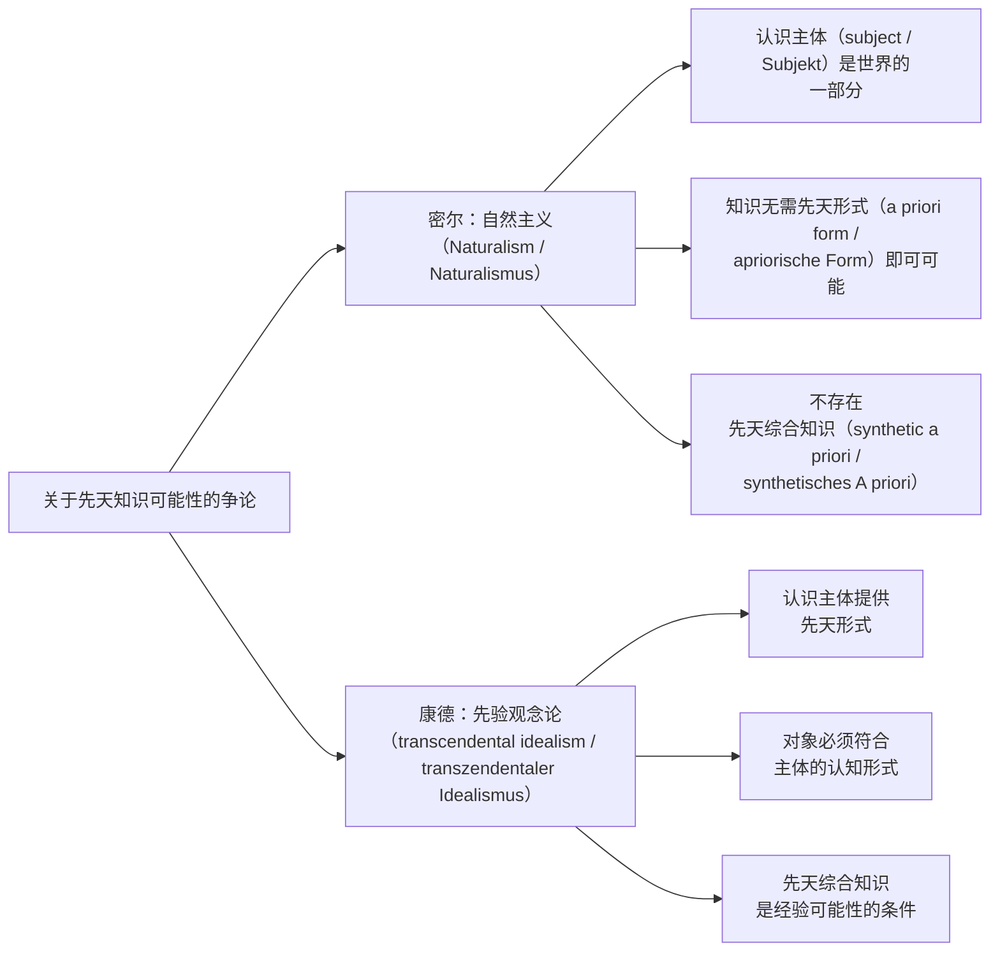

# Mill - Empiricism about Logic

> [!abstract] 概述
> 约翰·斯图尔特·密尔（John Stuart Mill, 1806–1873）在《逻辑学体系》（*A System of Logic*, 1843）中提出一种激进经验论（Empiricism / Empirismus）立场：逻辑和数学不是先验分析真理（analytic truths / analytische Wahrheiten），而是关于世界的**实在命题**（real proposition / reale Aussage），其基础在于归纳（induction / Induktion）而非直觉（intuition / Intuition）。本章（Skorupski, "Empiricism without positivism"）剖析密尔经验论的内在结构、对先天知识（a priori knowledge）的拒斥，以及它如何区别于维也纳实证主义（Vienna positivism / Wiener Positivismus）的经验论版本。

## 术语速览（English–Deutsch–中文）

| 中文 | English | Deutsch |
|------|---------|---------|
| 言语命题 | verbal proposition | verbale Aussage |
| 实在命题 | real proposition | reale Aussage |
| 表面推理 | merely apparent inference | bloß scheinbarer Schluss |
| 实在推理 | real inference | realer Schluss |
| 归纳 / 枚举归纳 | induction / enumerative induction | Induktion / Aufzählungsinduktion |
| 自然必然性 | natural necessity | natürliche Notwendigkeit |
| 规范命题 / 事实命题 | normative / factual proposition | normative / faktische Aussage |
| 可废止地 | defeasibly | widerlegbar（defeasibel） |
| 指称 / 内涵 | denotation / connotation | Denotation / Konnotation |
| 自我证成 / 自我否定 | self-vindication / self-undermining | Selbstrechtfertigung / Selbstuntergrabung |
| 认知主义 | cognitivism | Kognitivismus |
| 概念论 / 唯名论 / 实在论 | conceptualism / nominalism / realism | Konzeptualismus / Nominalismus / Realismus |
| 普遍主义 | universalism | Universalismus |
| 准康德式 | quasi-Kantian | quasi-kantianisch |
| 规则遵循 | rule-following | Regelfolgen |

## 两种经验论传统的对立

在康德之后的分析哲学史上，经验论有两个主导版本：

| 维度 | 密尔经验论 | 逻辑实证主义 |
|------|-----------|-------------|
| 逻辑/数学的性质 | **实在的、后天的**普遍真理（含信息量） | 分析的、先天的（无信息量） |
| 对康德的立场 | 拒绝「先天综合」但保留「实在/有信息」＝「无先天的综合」 | 同样拒绝「先天综合」，手段是把逻辑/数学**分析化** |
| 分析传统中的地位 | 被边缘化 | 成为分析哲学基石 |

> [!warning] 密尔在分析传统中的尴尬地位
> 分析哲学的核心信条之一是「逻辑和数学真理因而是分析的」。密尔否认这一信条，因而在分析传统的鼎盛时期被贬低。Skorupski 的目标是为密尔经验论「正名」——它虽不同于维也纳版本，但并非简单的心理主义。

## 密尔对逻辑的语义分析

### 言语命题 vs 实在命题

密尔在《逻辑学体系》中做出两组核心区分——「言语命题」（verbal proposition / verbale Aussage）与「实在命题」（real proposition / reale Aussage），以及「表面推理」（merely apparent inference / bloß scheinbarer Schluss）与「实在推理」（real inference / realer Schluss）：

```mermaid
graph TD
    A[命题/推理] --> B[言语层面<br>Verbal]
    A --> C[实在层面<br>Real]

    B --> B1[言语命题<br>不传达世界信息]
    B --> B2[表面推理<br>结论已含于前提]
    C --> C1[实在命题<br>传达世界信息]
    C --> C2[实在推理<br>产生新知识]

    B1 --> D[例：分析判断<br>"所有单身汉是未婚的"]
    C1 --> E[例：矛盾律<br>"同一命题不能既真又假"]
```

> [!note] 言语命题的定义
> 一个推理是**言语的**，当且仅当结论所构成的命题集合是前提所构成命题集合的子集。言语命题是言语推理的对应条件句。

### 逻辑连接词的处理

密尔对命题逻辑连接词的处理：

- **合取** $A \land B$：同时断言 A 和断言 B
- **析取** $A \lor B$：定义为 $(\lnot A \to B) \land (\lnot B \to A)$
- **条件句** $A \to B$："B 是 A 的合法推论"

在此定义下，某些演绎推理（deductive inference / deduktive Schlussfolgerung）（如从合取到支命题）是言语的。但密尔坚持：**矛盾律**（law of contradiction / Satz vom Widerspruch）和**排中律**（law of excluded middle / Satz vom ausgeschlossenen Dritten）是实在命题——因此是后天的（a posteriori）。

### 矛盾律与排中律

密尔将 $\lnot A$ 等价于" A 为假"，将 $A$ 等价于" A 为真"：

- **矛盾律**（law of contradiction / Satz vom Widerspruch）→ **排除律**（principle of exclusion）："同一命题不能既真又假"
- **排中律**（law of excluded middle / Satz vom ausgeschlossenen Dritten）→ **二值律**（principle of bivalence / Satz der Zweiwertigkeit）："要么 P 为真，要么 P 为假"

> [!quote] 密尔
> "我不能把这看作一个单纯的言语命题。我认为它是……我们最早和最熟悉的经验概括之一。"（《逻辑学体系》, CW VII:277）

### 演绎产生新知识的论证

密尔的核心认识论论证：

1. 如果所有有效推理（valid inference）都是言语的，那么任何有效演绎的结论都已断言于前提中
2. 知道前提为真 = 知道前提中每个命题为真
3. 结论是那些命题之一 → 知道结论为真
4. 但演绎**确实**产生新知识（new knowledge / neue Erkenntnis）
5. 因此，逻辑必须包含**实在推理**（real inference / reale Schlussfolgerung）

> [!important] 这一论证的哲学意义
> 密尔在此直面了一个真正的困难：如果逻辑全是分析的，演绎如何产生新知识？分析传统（尤其是逻辑实证主义）对此的回答——"新知识是隐含知识的显化"——被密尔斥为"mere salvo"（权宜之计），不具科学价值。

## 对先天知识（a priori）的拒斥

密尔面对的是直觉主义者（intuitionist / Intuitionisten）和康德主义者（Kantian / Kantianer）。他认为关于"先天（a priori）可知的实在命题"的论证可归为两种：

### 论证一：直觉作为基础

- **对方**：我们在数学（mathematics / Mathematik）和逻辑中基于"直觉"（intuition / Intuition）（可想象性 / imaginability）接受某些命题，而非基于经验归纳
- **密尔回应**：经验想象力（experiential imagination）作为实在可能性的向导，其可靠性本身是**后天**（a posteriori）问题。我们有权基于直觉做几何论证，这一事实本身就是经验概括的结果

### 论证二：经验不给出必然性

- **对方**："经验告诉我们何者存在，但不告诉它必然如此且不可能别样"（康德式论证 / Kantian argument）
- **密尔回应**：拒绝必然真理（necessary truth / notwendige Wahrheit）与偶然真理（contingent truth / kontingente Wahrheit）的形而上学区分（metaphysical distinction / metaphysische Unterscheidung）。最高类型的必然性是自然必然性（natural necessity / natürliche Notwendigkeit）。唯一可承认的"必然真理" = "其否定不可设想"

> [!warning] 密尔的核心反驳
> 从"我们无法设想 $\lnot P$"推导出" $\lnot P$ 不可能"，需要预设**思维宇宙与实在宇宙的先天对应**——这正是谢林和黑格尔的预设。密尔认为这是一个"毫无根据的假设"。

### 自然主义 vs 先验观念论



> [!tip] 密尔与康德的共识点
> 两者都承认：自然主义与关于世界的先天知识不相容。分歧在于：没有先天综合知识，知识是否可能？康德说不可能，密尔说可能。

## 密尔不是心理主义

> [!warning] 常见误解
> 密尔常被指控为心理主义者。Skorupski 明确指出：这是错误的。密尔确实主张逻辑须经归纳，但**拒绝**「逻辑规律＝心理过程规律」——这两件事不能混为一谈。弗雷格（不同于胡塞尔）清楚看到了这一点，他真正的靶子是 Benno Erdmann（见 [[Psychologism]]）。

密尔**明确拒绝**心理主义（Psychologism / Psychologismus）的两种形态：

| 心理主义形态 | 密尔的态度 |
|-------------|-----------|
| (1) 逻辑规律（logical law / logisches Gesetz）= 心理过程规律 | **拒绝**——逻辑规律是"一切现象的规律"，不是心理规律 |
| (2) 意义 = 心理实体（mental entity），判断 = 心理实体间关系 | **拒绝**——这是"概念论"（Conceptualism / Konzeptualismus），密尔视之为"逻辑哲学中最致命的错误之一" |

### 对概念论的批判

密尔区分：

- **判断的行为**（act of judgment / Urteilshandlung）（心理现象 / psychisches Phänomen）→ 属于心理学（psychology / Psychologie）
- **判断的内容**（content of judgment / Urteilsinhalt）（命题 / Proposition）→ 属于逻辑学（logic / Logik）

> [!quote] 密尔
> "逻辑……与判断或信仰行为的本质无关；那一行为作为一种心灵现象，属于另一门科学。"（CW VII:87）

命题（除心灵本身为对象外）不是关于**事物的观念**，而是关于**事物本身**。

### 密尔的逻辑观：普遍主义（universalism / Universalismus）+ 经验论

- **几何学**（geometry / Geometrie）：物理空间的规律
- **算术**（arithmetic / Arithmetik）：聚合的规律
- **逻辑学**（logic / Logik）：真理本身的规律

> [!important] 密尔的一元论
> 如果采取逻辑的普遍主义观点（逻辑是关于一切现象的普遍真理），并拒绝康德的"哥白尼式革命"，那么密尔式的经验论似乎是必然的：我们的思想为真当且仅当它们与现象对应——我们如何知道它们为真，除了通过归纳证据？

## 对三种先天论立场的批判

| 立场 | 核心主张 | 密尔的回应 |
|------|---------|-----------|
| **概念论**（Conceptualism / Konzeptualismus） | 判断 = 肯定/否定一个观念于另一个观念 | 混淆了判断内容与判断行为；命题关于事物而非观念 |
| **唯名论**（Nominalism / Nominalismus） | 逻辑/数学完全是言语的 | 未能区分指称（denotation / Bezeichnung）与内涵（connotation / Konnotation）；密尔基于指称/内涵区分论证逻辑包含实在命题 |
| **实在论**（Realism / Realismus） | 逻辑/数学知识是关于抽象实体（abstract entity）的知识 | 密尔是当代意义的唯名论者——拒绝抽象实体；主要关注拒绝先天知识可能性 |

> [!note] 与后来分析哲学的关联
> 语义分析是早期分析哲学（弗雷格、摩尔/罗素阶段）的主要来源。新实在论版本——语义驱动的 vs 认识论驱动的——在分析哲学中发挥了核心作用。密尔若面对这些新版本，会主要拒绝其认识论版本（即先天知识的可能性）。

## 归纳的认识论地位

### 规范命题 vs 事实命题

密尔对归纳的处理涉及一个关键区分：

```mermaid
graph TD
    A[枚举归纳（enumerative induction）] --> B["(i) 规范命题（normative proposition）：<br>枚举归纳在适当前提下<br>可废止地（defeasibly / widerlegbar）证成对普遍命题的信念"]
    A --> C["(ii) 事实命题（factual proposition）：<br>枚举归纳在特定/所有领域中<br>频繁产生不可被反例推翻的普遍命题"]

    B --> D[话题中立<br>适用于所有探究领域]
    C --> E[关于世界的普遍命题<br>本身可被归纳检验]

    B --> F[密尔视(i)为<br>原初规范的（primitively normative）——不可从(ii)推导]
    C --> G[(ii)可通过二阶归纳（second-order induction）<br>被证成或否证]
```

> [!important] 密尔的关键洞见
> 密尔没有犯"归纳本身能产生对(i)的唯一证明"这一错误。他承认：归纳的认识论必须**原初地认可**（primitively endorse / primitiv anerkennen）(i) 为规范命题，不试图从 (ii) 推导它。否则将面临康德式批判（Kantian critique / Kritik am Kantianismus）。

### 归纳的自我证成与自我否定

- **自我证成**（self-vindication / Selbstrechtfertigung）：在某些领域，二阶归纳表明归纳确实可靠 → (ii) 被证成 → 归纳在该领域内部自我证成
- **自我否定**（self-undermining / Selbstuntergrabung）：在某些领域，二阶归纳表明归纳不可靠 → (ii) 被否证 → 但 (i) 仍为正确的规范命题，只是其证成力被击败

## 经验论与规范性

### 密尔需要两个区分

Skorupski 论证：密尔需要**两个**独立区分，而非一个：

| 区分 | 内容 | 功能 |
|------|------|------|
| **言语/实在** | 言语命题不传达世界信息；实在命题传达 | 确定哪些命题需要经验证成 |
| **规范/事实** | 事实命题可被证据否证；规范命题不可 | 为基本认识论规范（epistemic norm / erkenntnistheoretische Norm）提供认识论地位 |

> [!tip] 新密尔经验论 = 准康德式（quasi-Kantian / quasi-kantianisch）
> 如果承认基本规范命题是实在的但非事实的，那么密尔经验论就向康德方向靠拢一步：承认存在**非事实的、可判断的命题内容**（judgable contents / beurteilbare Inhalte）。但它不是康德式的——它拒绝先验观念论和现象（phenomena / Phänomene）/物自体（noumena / Noumena）的区分。

### 规范的认识论

| 维度 | 事实命题 | 规范命题 |
|------|---------|---------|
| 可否被证据否证 | 是 | 否 |
| 可否因证据不足而无法判断 | 是 | 否 |
| 可否被进一步反思修正 | 是 | 是（但非通过经验证据） |
| 本体论地位 | 描述事态 | 不描述事态（在符合论意义上无真值条件） |

> [!warning] 认知主义但非实在论
> 这种规范观是**认知主义的**（规范命题有真值）但**非实在论的**（没有使其为真的"事实"）。特别是，规范命题的真不等于"理想条件下判断会收敛"——它没有非平凡的真值条件。

## 对逻辑实证主义的批判

### 实证主义的核心信条

维也纳实证主义基于两个教条的合并：

1. **形而上学实在论**（metaphysical realism / metaphysischer Realismus）：所有认知内容（所有命题）都是事实性的
2. **经验论**（Empirismus）：所有事实命题必须被经验证成

→ 结论："只有事实和决定"（There are only facts and decisions）

> [!warning] Skorupski 的诊断
> 这一合并是**不融贯的**。它无法容纳**不可还原的规范性命题**——规则遵循的判断（"给定 F 的规则，称这个为 F 是正确的"）既不是事实描述，也不是语言决定。

### 维特根斯坦的规则遵循

Skorupski 认为维特根斯坦的规则遵循（rule-following / Regelfolgen）论证指向同一方向：

- 当我把谓词 F 应用于一个案例，我做了一个**判断**（judgment / Urteil）（可真可假）
- 这个判断不是语言决定（不是约定 / stipulation），也不是事实描述
- 它是**不可还原地规范性的**（irreducibly normative / irreduktiv normativ）
- 因此"只有事实和决定"的二分不穷尽

> [!important] 密尔 vs 维也纳：关键差异
> | | 密尔 | 维也纳 |
> |---|---|---|
> | 逻辑/数学 | 实在的、后天真理 | 分析的、先天重言式 |
> | 规范地位 | 基本规范是原初的、非事实的 | 所有认知内容都是事实性的 |
> | 经验论形态 | 自然主义的、反先天论的 | 实证主义的、反形而上学的 |
> | 融贯性 | 可融贯（接受规范/事实区分） | 不融贯（无法容纳规范性） |

## 与心理主义争论的历史关联

密尔在心理主义争论中的位置复杂：

- 密尔被心理主义者援引（因他将逻辑规律视为"思维规律"）
- 但密尔**明确拒绝**心理主义的两种形态
- 弗雷格清楚密尔不是心理主义者（不同于胡塞尔的误读）
- 密尔的真正立场：逻辑是**最普遍的经验科学**（most general empirical science / allgemeinste empirische Wissenschaft）——"对一切现象普遍为真的规律"

> [!tip] 密尔与弗雷格的对比
> 两者都反心理主义，但路径截然不同：
> - 弗雷格：逻辑规律属于"第三领域"（third realm / drittes Reich）——客观、非心理、非物理
> - 密尔：逻辑规律是关于一切现象的**经验概括**（empirical generalization / empirische Verallgemeinerung）——仍属自然世界

## 密尔在心理主义谱系中的坐标

> [!important] 「反心理主义」的两种含义
> 密尔与弗雷格都被归入「反心理主义」，但理由与结论完全相反：
>
> | | 密尔 | 弗雷格 |
> |---|---|---|
> | 逻辑规律是什么 | 关于**一切现象**的最普遍经验概括 | 客观的、非心理亦非物理的**第三领域**（drittes Reich）真理 |
> | 为何反对把逻辑学并入心理学 | 逻辑学的对象是事物本身而非观念；判断的**行为**属心理学，**内容**属逻辑学 | 心理学只能描述「被认为真」（Fürwahrgehaltenwerden），不能给出「真」（Wahrsein） |
> | 真理的基础 | 经验与归纳 | 非心理、非经验的客观性（「困在永恒地基上的界石」） |
> | 逻辑的地位 | 仍是**经验科学**——只是最普遍的那一门 | 先天科学，不依赖经验 |
>
> 结论：把密尔与弗雷格一起归入「反心理主义阵营」是对的；但若以为他们因此共享「逻辑先天性」立场，则是错的——密尔的反心理主义是**自然主义的**，弗雷格的是**柏拉图主义的**。

> [!warning] 三条常见误解
> 1. **「密尔把逻辑归结为心理学」**——不准确。他拒绝「逻辑规律＝心理过程规律」；他主张的是逻辑是一门**经验科学**（关于一切现象的规律），而经验科学 ≠ 心理学。
> 2. **「密尔是分析哲学家意义上的经验论者」**——他是**前分析**的经验论者：他不接受「分析/综合」这一康德式区分本身（拒绝必然/偶然的形而上学区分），而维也纳学派恰恰靠这一区分立论。
> 3. **「Skorupski 把密尔读成康德主义者」**——不是。Skorupski 说新密尔经验论是「准康德式」（quasi-Kantian），仅指它承认**非事实的规范命题内容**；密尔仍拒绝先验观念论与现象/物自体之分。

> [!note] 与心理主义之争的连接点
> 密尔被心理主义者援引，主要因为他把逻辑规律说成「思维的规律」（laws of thought），且《逻辑学体系》声称逻辑的「理论基础全部借自心理学」（1865, CW 359）。但弗雷格真正的靶子是 **Benno Erdmann**（*Logik* 1892）而非密尔；而胡塞尔则将密尔的**现象主义**（Phänomenalismus）式结论（「逻辑规律是一切现象的规律」）归入心理主义式经验论。两条批判路线见 [[Psychologism]] 与 [[Kant_to_Psychologism_Development]]。

## 相关链接

- [[Psychologism]]——密尔在心理主义争论中的位置
- [[Kant_Epistemology]]——密尔自然主义 vs 康德先验观念论
- [[Kant_to_Psychologism_Development]]——从康德到心理主义的历史脉络
- [[术语对照表_Deutsch_English]]——本目录四篇笔记的德/英/中术语总索引

## 关键文本

- Mill, *A System of Logic* (1843) —— 密尔逻辑经验论的主要著作
- Mill, *An Examination of Sir William Hamilton's Philosophy* (1865) —— 对先天论的批判
- Skorupski, "Empiricism without positivism" —— 本章
- Skorupski, *John Stuart Mill* (1989) —— 密尔哲学的全面研究
- Frege, *The Foundations of Arithmetic* (1884) —— 反心理主义宣言（与密尔对比阅读）
