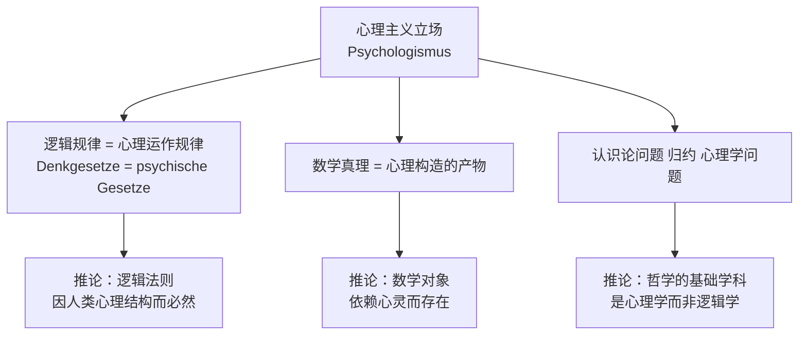
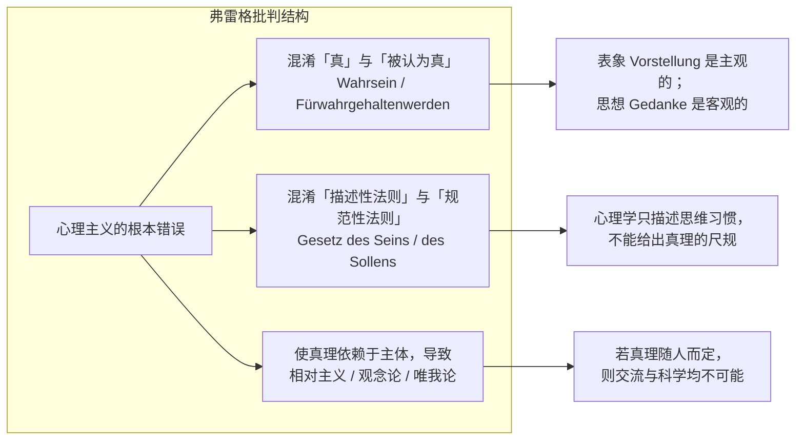
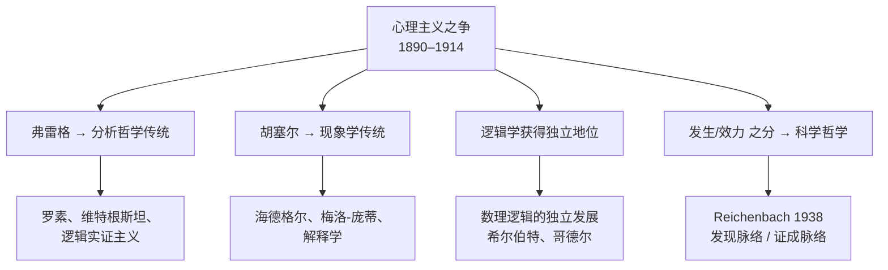

# Psychologism

> [!abstract] 概述
> 心理主义（Psychologismus；psychologism）是一种哲学立场，主张**逻辑法则和数学真理可以还原为或依赖于人类心理过程的规律**。19 世纪中后期在德语哲学界盛行，在 1890–1914 年间的**心理主义之争**（*Psychologismus-Streit*）中达到白热化，最终在弗雷格和胡塞尔的批判下被主流抛弃。这场争论是分析哲学与现象学两大传统共同诞生的核心事件。

## 术语速览（Deutsch–English–中文）

| 中文 | Deutsch | English |
|------|---------|---------|
| 心理主义 | Psychologismus | psychologism |
| 心理主义之争 | Psychologismus-Streit | the psychologism dispute |
| 反心理主义 | Antipsychologismus | antipsychologism |
| 逻辑主义 | Logizismus | logicism |
| 观念性 | Idealität | ideality |
| 效力（有效性） | Geltung | validity |
| 发生（起源） | Genesis | genesis |
| 自明性 | Evidenz | self-evidence |
| 思维法则 | Denkgesetz | law of thought |
| 表象 | Vorstellung | idea / representation |
| 思想（命题内容） | Gedanke | thought / proposition |
| 判断 | Urteil | judgment |
| 实践-规范学科 | Kunstlehre | practical-normative discipline |
| 科学论 | Wissenschaftslehre | theory of science |
| 种属相对主义 | Spezies-Relativismus | species relativism |
| 人类学主义 | Anthropologismus | anthropologism |

> [!note] 「心理主义」一词的来历
> 据 Kusch（1995）考察，*Psychologismus* 一词由黑格尔派哲学史家 **Johann Eduard Erdmann**（1805–1892）于 1870 年前后首创，用以批判 **Eduard Beneke**（1798–1854）的立场。
>
> ⚠️ **不要与 Benno Erdmann（1851–1921）混淆**：后者是 1892 年《逻辑学》（*Logik*）的作者，才是弗雷格和胡塞尔集中火力批判的那个「心理主义者」。两人不是同一人。

## 核心主张

> [!note] 三种典型形态
> - **方法论心理主义**（methodologischer Psychologismus）：哲学研究应以心理学方法为基础；
> - **逻辑心理主义**（logischer Psychologismus）：逻辑法则是人类思维的心理法则的规范化表达；
> - **认识论心理主义**（erkenntnistheoretischer Psychologismus）：知识的条件和限度应由心理学研究来确定。

### 五种可辨识的「心理主义论证」（PA）

Kusch 在 SEP 中将当时的论证归纳为五个模式（PA = psychologistic argument）：

| # | 论证形式 | 归属（代表人物） |
|---|---------|-----------------|
| **PA1** | 心理学研究**一切**思维法则；逻辑研究思维法则的**子集**；故逻辑是心理学的一部分 | Theodor Lipps (1893)、Gerardus Heymans (1894, 1905) |
| **PA2** | 规范学科必须以描述-说明科学为基础；逻辑是规范性学科；唯一候选是经验心理学；故逻辑须以心理学为基础 | Wilhelm Wundt (1880/83) |
| **PA3** | 逻辑研究判断、概念、推理；这些都是人的心理物；一切心理物属于心理学；故逻辑属于心理学 | Wilhelm Jerusalem (1905)、Christoph Sigwart (1921) |
| **PA4** | 逻辑真理的试金石是**自明感**（Evidenz）；自明感是心理经验；故逻辑研究的是心理经验 | Theodor Elsenhans (1897) |
| **PA5** | 我们无法设想另一种逻辑；可设想性的限度是心理限度；故逻辑相对于人类这一物种的思维 | Benno Erdmann (1892) |

> [!warning] 区分心理主义与自然主义
> 心理主义 ≠ 自然主义。自然主义主张哲学与经验科学连续，心理主义则**特别**将逻辑/数学还原为心理规律。一个自然主义者可以是反心理主义者（如弗雷格）；反之，一个反自然主义者也可以接受 PA5（如 Erdmann 以「人的思维非永恒」为理由）。

> [!tip] 为什么心理主义并非「愚蠢的立场」
> 它回答的是一个真实问题：**若逻辑规律既非经验归纳，也非柏拉图式天外之物，它的根据在哪里？** 答案：在人类心灵的普遍结构。这本身就是对康德问题（先天知识如何可能）的一种回答——也正因为康德的「先验主体」极易被读成「人类心灵」，心理主义才有机会从康德体系内部长出来。

## 历史脉络中的代表人物

| 哲学家 | 著作 | 主要立场 | 所属 PA |
|--------|------|---------|--------|
| Jakob Friedrich Fries | *System der Logik* (1811) | 逻辑规律的最终根据在「理性直观/情感」，哲学知识奠基于人类学与内经验 | 前身 |
| John Stuart Mill | *A System of Logic* (1843) | 逻辑的「理论基础全部借自心理学」；但另持反心理主义论点（见下） | 断裂 |
| Christoph von Sigwart | *Logik* (1873/1878) | 判断的真假必须先有思维主体；无主体则无真假（后期与胡塞尔争论的焦点） | PA3 |
| Wilhelm Wundt | *Logik* (1880/1883) | 逻辑规律是精神发展的最高产物；规范学科需以描述心理学为基础 | PA2 |
| Benno Erdmann | *Logik* (1892) | 逻辑规律只有「假设的必然性」——只对人类有效 | PA5 |
| Theodor Lipps | *Grundzüge der Logik* (1893) | 逻辑是「思维的物理学」，且是心理学的子学科 | PA1 |
| Gerardus Heymans | (1894, 1905) | 一切逻辑均可还原为意识现象的关系 | PA1 |
| Theodor Elsenhans | (1897) | 自明感是心理事实，逻辑须研究它 | PA4 |
| Wilhelm Jerusalem | (1905) | 判断的行为与内容不可分，故逻辑是心理学的 | PA3 |

> [!important] Mill 的「断裂」位置（Godden 2005）
> 密尔不是单纯的心理主义者：他一方面说 *"[Logic] is a part, or branch, of Psychology ... Its theoretical grounds are wholly borrowed from Psychology"*（*Examination of Hamilton*, 1865, CW 359），另一方面又坚持命题是**关于事物本身**而非关于「事物的观念」，并区分判断的**行为**（心理学）与**内容**（逻辑学）。弗雷格（不同于胡塞尔）清楚地看到了这一点，从未把密尔当作主要靶子——他真正的靶子是 Benno Erdmann。详见 [[Mill_Empiricism_about_Logic]]。

## 弗雷格对心理主义的批判

戈特洛布·弗雷格（Gottlob Frege, 1848–1925）是心理主义最系统的批判者，主要见于《算术基础》（*Die Grundlagen der Arithmetik*, 1884）、《算术基本法则》序言（*Grundgesetze der Arithmetik*, 1893）以及 1894 年对胡塞尔《算术哲学》的著名书评。

### 三条方法论原则（1884，导论）

《算术基础》导论声明遵循**三条**（不是五条）原则：

1. **心理的与逻辑的、主观的与客观的，必须严格分开**（*das Psychologische von dem Logischen, das Subjective von dem Objectiven sorgfältig auseinanderzuhalten*）；
2. **词的意义只能在命题的语境中询问**，不能在孤立语词中询问（*nach der Bedeutung der Wörter muss im Satzzusammenhange, nicht in ihrer Vereinzelung gefragt werden*）；
3. **概念与对象的区别必须始终保持在眼前**（*der Unterschied von Begriff und Gegenstand ist im Auge zu behalten*）。

> [!warning] 「表象 ≠ 思想」是这三条原则的推论，不是第四条原则
> 原笔记把「不要把表象当作思想」「句子是意义单位」也列为原则；这两条其实是上面第 1、2 条的具体展开，不属于 Frege 自述的三原则。

### 核心批判结构

> [!quote] 弗雷格《算术基本法则》序言（1893: XV）
> *Der Doppelsinn des Wortes „Gesetz“ ist hier verhängnissvoll. In dem einen Sinne besagt es, was ist, in dem andern schreibt es vor, was sein soll.*
> 「法则」（Gesetz）一词的双义在这里是致命的：一种意义说的是「是什么」，另一种意义规定「应当是什么」。

> [!quote] 弗雷格（1893: XVI）
> *Wahrsein ist etwas anderes als Fürwahrgehaltenwerden, sei es von Einem, sei es von Vielen, sei es von Allen.* ... *so sind auch die Gesetze des Wahrseins nicht psychologische Gesetze, sondern Grenzsteine in einem ewigen Grunde befestigt, von unserm Denken überfluthbar zwar, doch nicht verrückbar.*
> 真（Wahrsein）不同于被认为真（Fürwahrgehaltenwerden），无论是一个人、许多人还是所有人。……因而真理的法则不是心理学法则，而是**砌在永恒地基上的界石**：我们的思维可以漫过它们，却不能移动它们。

### 批判要点对照

| # | 批判 | 论证 |
|---|------|------|
| 1 | **混淆领域** | 表象（Vorstellung）是主观的、私人的；思想（Gedanke）是客观的、可公共分享的。Idee 一词既被用于客观抽象对象（数）又被用于主观观念，是混乱之源 |
| 2 | **破坏必然性** | 心理学只能描述「人们事实上如何思维」，无法证成「思维应当如何」的规范必然性；而**逻辑法则本身首先是描述性法则**（真），只是可被重述为规范（应当依此思维）——这与几何学、物理学法则无异 |
| 3 | **导向相对主义 / 唯我论** | 若逻辑依赖心理结构，则不同心理结构的存在者将有不同逻辑；真理被还原为共识，最终通向观念论与唯我论，交流也随之崩塌 |
| 4 | **取消抽象对象** | 心理主义取消数、命题等客观-非实在（objektiv, nicht-wirklich）实体；但数的同一性不因人而异（*die Zahl ist dasselbe für alle Subjekte*） |
| 5 | **类比反讽** | 若逻辑法则只是思维习惯的平均值，那么「按逻辑思维」就像「按健康的消化方式消化」「按语法正确地说话」「按当下风尚穿衣」一样（1893: XV f.）——这恰恰暴露了心理主义的荒谬 |

> [!note] 1894 年书评与胡塞尔转向
> 弗雷格 1894 年在 *Zeitschrift für Philosophie und philosophische Kritik*（103: 313–332）发表对胡塞尔《算术哲学》（1891）的书评，指责后者把「概念、对象」当作不同种类的观念，并提供抽象概念起源的**心理-发生学**解释。这一批评是否**导致**胡塞尔转向反心理主义，学界有争议（Kusch 1995: 12–13；Piovesani 2022）——原笔记写作「1893 年弗雷格批判胡塞尔」应更正为 **1894**。

## 胡塞尔对心理主义的批判

埃德蒙德·胡塞尔（Edmund Husserl, 1859–1938）在《逻辑研究》（*Logische Untersuchungen*, 1900/01）第一卷「纯粹逻辑导引」（*Prolegomena zur reinen Logik*）中对心理主义做了体系性清算——这是 1901–1920 年间德语世界讨论的核心文本。

> [!important] 胡塞尔的立场转变
> 胡塞尔早期《算术哲学》（*Philosophie der Arithmetik*, 1891）本身带有心理主义色彩。弗雷格 1894 年的书评促成了他的转向，但他后来公开声明自己「从未是心理主义者」，只承认《算术哲学》用词不当。转向的产物就是现象学。

### 《导论》的三部分结构

| 部分 | 章节 | 任务 |
|------|------|------|
| 一 | 第 1–2 章 | 逻辑作为**实践-规范学科**（*Kunstlehre*）与**科学论**（*Wissenschaftslehre*） |
| 二 | 第 3–10 章 | 论证实践-规范学科的理论基础**不是**心理学的 |
| 三 | 第 11 章 | 正面给出纯粹逻辑学的观念 |

### 对旧式反心理主义的双重拒绝（§17–§19）

> [!warning] 原笔记此处有误
> 胡塞尔**并不用**「规范/事实鸿沟」（is-ought）来反驳心理主义。恰恰相反：
> - §17 他拒绝「规范反心理主义」——「应当如何思维」只是「实际如何思维」的**特例**，不是两个不可通约的领域；
> - §19 他也不接受「循环论证」指控——心理学只把逻辑法则当作**方法论规则**使用，而不是当作理论前提。
> 因此，用「从事实推不出规范」来给心理主义定罪的是**新康德主义/自然主义谬误论**（如西南学派），不是胡塞尔。

### 胡塞尔自己的三条主攻线

1. **三大经验论后果的反驳**（§21, §23）：若逻辑规则以心理学法则为基础，则（a）所有逻辑规则将如心理学法则一样模糊——但逻辑规则不模糊；（b）它们将不可能是先天的，只是或然后——但它们是**明证的（apodiktisch einsichtig）**；（c）它们将涉及心理实体——但逻辑规则不关涉心理实体。
2. **真理的永恒性**（§24）：若逻辑法则以「事态」（*Sachverhalte*）为对象，则真理会有生灭。以「对任意真理 t，其矛盾 ~t 不是真理」为例，若它是关于事态的法则，将推出「关于真理的法则有生灭」的背谬。
3. **相对主义自我驳斥**（§§35–41）：一切心理主义都是**种属相对主义**（*Spezies-Relativismus*），即**人类学主义**（*Anthropologismus*）：
   - 矛盾律包含在「真理」的意义之中，故同一思想不可能对一个物种真、对另一物种假；
   - 真理是永恒的，不受时空限定；
   - 若真理是相对的，则作为「一切事实真理之理想体系」的相关物的**世界**也将是相对的。
   胡塞尔由此断言「人类学主义是背谬的（widersinnig）」。

### 三个「偏见」（§§41–51）

| 偏见 | 内容 | 胡塞尔的回应 |
|------|------|-------------|
| 1 | 规范心理事件的规则必须由心理学奠基 | 逻辑规范完全奠基于**作为理论学科的纯粹逻辑学** |
| 2 | 逻辑关乎观念、判断、推理、证明——都是心理现象 | 同一推理将推出「数学是心理学分支」，而数学心理主义已被 Lotze、Riehl、Frege、Natorp 驳倒 |
| 3 | 判断因**自明感**而被认作真，自明感是心理现象 | 纯粹逻辑命题不谈论自明感；**真理先于自明**（*die Wahrheit ist vor der Evidenz*）——自明是真理的**经验/判准**，不是真理的成分 |

> [!note] 一个关键术语：Geltung（效力）
> 弗雷格与胡塞尔的共同核心是**发生与效力之别**（*Genesis / Geltung*）：「我们如何获得一个信念」（心理发生）与「该信念凭什么有效」（观念效力）是两个不同问题。这一区分在 20 世纪被 Reichenbach（1938）改造为「发现的脉络 / 证成的脉络」（*context of discovery / context of justification*）。

## 早期反驳与当代重估

胡塞尔的《导论》在 1901–1920 年间被广泛讨论，**批评者远比追随者多**——这一点常被忽略。

| 批评者 | 年份 | 主要指控 |
|--------|------|---------|
| Paul Natorp | 1901 | 胡塞尔对怀疑论/相对主义的驳斥犯 *petitio principii*：怀疑论者恰恰否认「客观逻辑」这一前提 |
| Moritz Schlick | 1910 | 不能以「心理学法则都是模糊的」来论证——这是 *petitio*；逻辑结构无疑产生于心理过程 |
| Wilhelm Wundt | 1910 | 「逻辑主义」同样陷入循环：它宣称逻辑法则自明，又把自明奠基于逻辑法则的效力；最终只能诉诸「不可定义的直接感知」，而那恰恰是**重返心理主义** |
| Gerardus Heymans | 1905 | 关于矛盾律，认识论目前只能说「**大概**所有人都拒斥矛盾」；而「谬误」并非违反推理法则，而是前提把握不清——故可以同时主张「人们按逻辑法则思维」 |
| Christoph Sigwart | 1921 | 只有断言或意见才可真假，而断言必须先有思维主体；把「命题」当作独立实体是神话；胡塞尔混淆了「真」与「实」 |
| J. J. Katz | 1981 | 心理学法则未必模糊；也可以反过来说：逻辑-数学法则就是心理学法则中目前精确的例外，其余学科将来会赶上 |
| Gerald Massey | 1991 | Church 命题本身只是不可证明的假设，故「逻辑-数学是必然真理」的头衔已失；而 Quine 已使分析/综合之分相对化 |
| Dagfinn Føllesdal | 1958 | 胡塞尔对种属相对主义的论证是自问自答：其实质是「声称真理不是绝对的，因为真理是绝对的」 |

> [!tip] 对 Benno Erdmann 的部分平反（Meiland 1976；Nunn 1978）
> - **Meiland**：Erdmann 的观点可重构为「逻辑法则描述我们可思的**限度**」——故我们能说出「矛盾律是假的」不等于我们能**违逆地思维**；且应区分「命题明确地**关于**什么」与「命题凭**什么**为真」：诉诸重力与行星运动的类比——行星运动定律不「关于」重力，却「凭」重力为真。逻辑法则可以不明言地指涉人类，却凭人类心理构造为真。
> - **Nunn**：用 Fodor 的「思维语言」+ 图灵机类比可使之自洽——机器无法计算其机器表之外的公式，但这不意味着不存在别的机器表；「我们所认为的形式错误」对另一台机器可能是它检测错误所依据的法则。

> [!important] 当代校心：双方共享的前提
> 新近重估指出，弗雷格/胡塞尔与他们的对手**共享**两个可疑前提：
> 1. **逻辑只有一种且是必然的**——但 20 世纪发展出直觉主义、多值、次協调、相关逻辑等，「唯一性」前提已大为可疑；
> 2. **逻辑主要是描述性的**（描述对象或所谓「事态」Sachverhalte）——双方只在那个对象是心理的还是观念的上分歧。

## 心理主义的遗产

> [!note] 争论的终结与双重性质
> 争论在 1914 年因一战而中止（学术攻击氛围不再被接受；哲学家与心理学家分工：前者转向「战争天才」话语，后者转向士兵测试）。Kusch（1995）提醒：这场争论**不只是理论之争，也是德国大学中的学科地盘之争**（哲学 vs 实验心理学），这是他「哲学知识社会学」的核心案例。

> [!tip] 心理主义的当代回响：被指控者名单
> Quine 在 1960 年代号召「重新回到心理主义」（*Epistemology Naturalized*, 1969 为标志），使指控持续活跃。被贴上心理主义标签的现代人物包括：**Carnap、Dummett、Geach、Goodman、Kuhn、McDowell、Popper、Sellars、Wittgenstein**（Kusch 1995: 7）。
>
> 今天与之有结构相似性的议题：
> - **认知科学 / 具身认知**：心灵的计算理论是否重新引入心理主义？
> - **逻辑多元主义**（logical pluralism）：若逻辑不只一种，弗雷格/胡塞尔的「唯一逻辑」前提就失效了；
> - **自然化认识论**（naturalized epistemology）：把知识论交由经验科学，是不是精致的心理主义？
> - **数学哲学**：拉卡托斯（Lakatos）的《证明与反驳》是否隐含心理-发生学式的数学观？
> - ⚠️ 但要小心：布劳威尔的**直觉主义**并不是 19 世纪意义的心理主义——它是对数学真理的心智构造学说，但布劳威尔坚持数学的严格性，并不将逻辑法则还原为经验心理规律。

## 与康德认识论的关系

心理主义争论直接源于康德框架的内在张力：

| 康德的主张 | 被读作 | 心理主义结论 |
|-----------|-------|-------------|
| 范畴是心灵的先天结构 | 人类心灵的**经验**结构 | PA1（逻辑/范畴 = 心理规律） |
| 逻辑法则以「我思」为最高条件 | 思维自然规律 | PA4（自明感 = 逻辑的根据） |
| 先天综合判断奠基于主体形式 | 真理相对于主体 | PA5（逻辑只对人有效） |

- 康德区分了**纯粹一般逻辑 / 先验逻辑 / 应用逻辑**——但这一区分在 19 世纪被逐渐遗忘（尤其是随着《逻辑学》（Jäsche 编，1800）被当作心理学式文本阅读）；
- 后康德唯心论（费希特、黑格尔）把「先验主体」历史化、绝对化，抹平了先验与经验主体的界限；
- 新康德主义（尤其**马堡学派**：Cohen、Natorp、Cassirer）试图在康德框架内重建逻辑的客观性，Natorp 对胡塞尔的批评正是这一努力的一部分。

> [!warning] 康德不是心理主义者
> 尽管心理主义者常援引康德，但康德本人明确坚持逻辑的**先验客观性**：范畴不是经验心理规律，而是使一切经验成为可能的先天条件。混淆二者正是心理主义的根本错误。
> 但要注意：康德的**防線是薄的**——他从未把「先验主体」的本体论地位说得很清楚，这正是 19 世纪争论得以展开的空间。

## 相关链接

- [[Kant_Epistemology]]——先验主体与经验主体的裂缝
- [[Kant_to_Psychologism_Development]]——1781–1901 的历史脉络
- [[Mill_Empiricism_about_Logic]]——密尔为何**不是**典型心理主义者
- [[术语对照表_Deutsch_English]]——全目录德/英/中术语索引

## 关键文本

### 一手文献

- Mill, *A System of Logic*（1843）；*An Examination of Sir William Hamilton's Philosophy*（1865）
- Frege, *Die Grundlagen der Arithmetik*（1884）——反心理主义宣言（三条方法论原则）
- Frege, *Grundgesetze der Arithmetik*, Bd. I 序言（1893）——「法则」双义 / 「界石」隐喻
- Frege, 「Rezension von E. G. Husserls *Philosophie der Arithmetik*」（1894）——书评
- Frege, 「Der Gedanke」（1918）——「第三领域」（*drittes Reich*）
- Husserl, *Prolegomena zur reinen Logik*（*Logische Untersuchungen* I, 1900）
- Husserl, *Logische Untersuchungen* II（1901）；*Ideen I*（1913）；*Die Krisis der europäischen Wissenschaften*（1936）
- Sigwart, *Logik*（1873/1878）；Lipps, *Grundzüge der Logik*（1893）；Wundt, *Logik*（1880/1883）

### 二手文献

- Kusch, *Psychologism: A Case Study in the Sociology of Philosophical Knowledge*（1995）——权威研究
- Beiser, *The Genesis of Neo-Kantianism, 1796–1880*（2014）——德语心理主义兴起的最重要专着
- Baker & Hacker, *Frege: Logical Excavations*（1984）
- Pelletier, Elio & Hanson, 「The Case for Psychologism in Default and Inheritance Reasoning」（2008）
- SEP 条目：*Psychologism*（Kusch）；*Frege*；*Husserl*
