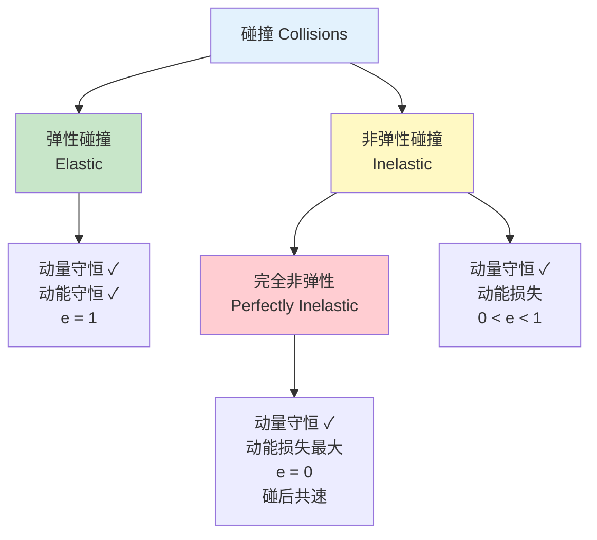
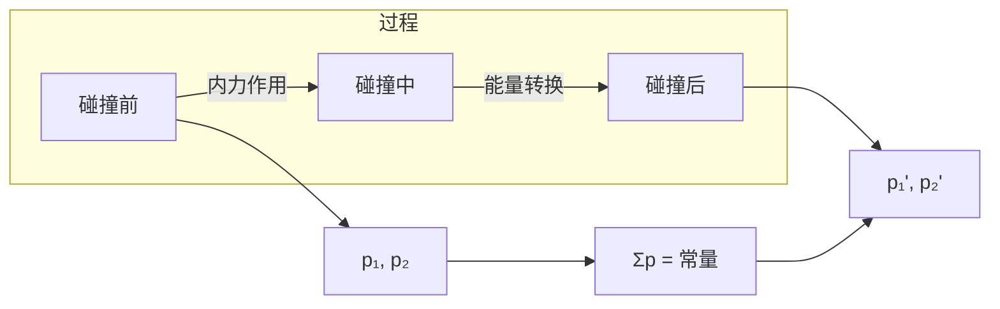
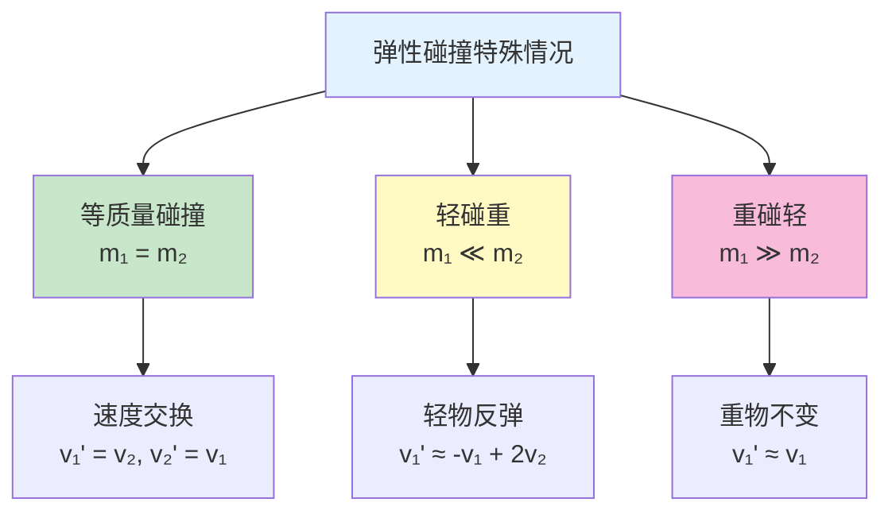
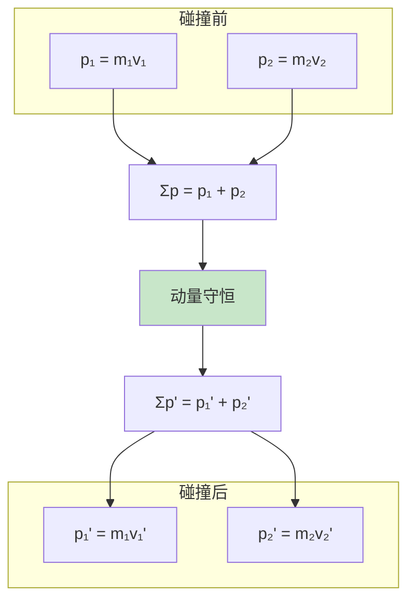
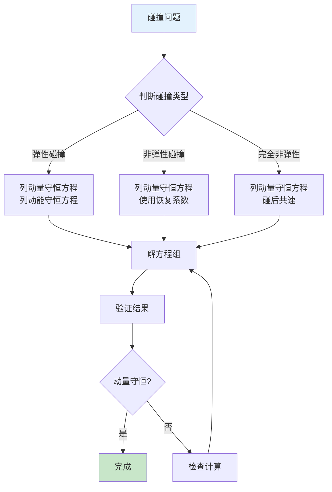
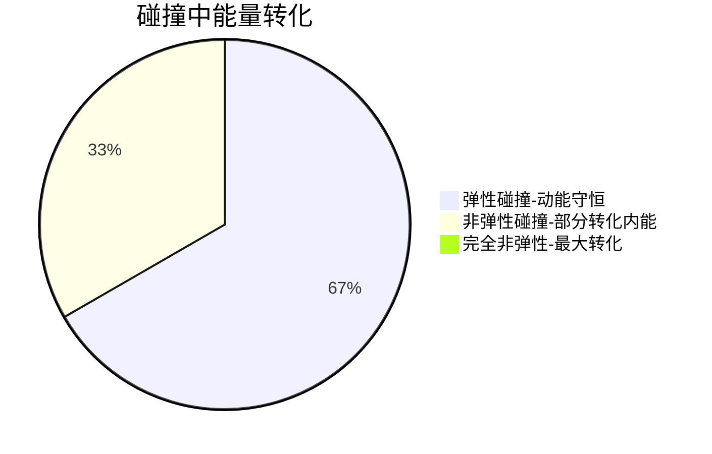

---
tags:
  - Physics
  - Exercise
  - 证明
title: Collision Problems (碰撞问题)
created: 2026-04-03T10:00:00
modified:
---
# Collision Problems (碰撞问题)

## 0. 核心概念图示

---

## 1. 碰撞的基本特征

### 1.1 碰撞的定义

碰撞是指两个或多个物体在极短时间内发生相互作用，物体间的相互作用力（内力）远大于外力。

**碰撞的特点：**
- 时间极短（$\Delta t \to 0$）
- 内力远大于外力
- 动量近似守恒
- 位置几乎不变（位移可忽略）

### 1.2 碰撞过程分析

---

## 2. 弹性碰撞 (Elastic Collision)

### 2.1 定义

弹性碰撞是指碰撞过程中**动能守恒**的碰撞。

**守恒定律：**
- 动量守恒：$\vec{p}_{total} = \text{常量}$
- 动能守恒：$E_k = \text{常量}$

### 2.2 一维弹性碰撞公式推导

**设定：**
- 物体1：质量 $m_1$，初速度 $v_1$，末速度 $v_1'$
- 物体2：质量 $m_2$，初速度 $v_2$，末速度 $v_2'$

**动量守恒方程：**
$$m_1 v_1 + m_2 v_2 = m_1 v_1' + m_2 v_2'$$

整理得：
$$m_1(v_1 - v_1') = m_2(v_2' - v_2) \tag{1}$$

**动能守恒方程：**
$$\frac{1}{2}m_1 v_1^2 + \frac{1}{2}m_2 v_2^2 = \frac{1}{2}m_1 v_1'^2 + \frac{1}{2}m_2 v_2'^2$$

整理得：
$$m_1(v_1^2 - v_1'^2) = m_2(v_2'^2 - v_2^2)$$

因式分解：
$$m_1(v_1 - v_1')(v_1 + v_1') = m_2(v_2' - v_2)(v_2' + v_2) \tag{2}$$

**联立求解：**

将式 (1) 代入式 (2)，消去 $m_1(v_1 - v_1')$ 和 $m_2(v_2' - v_2)$：

$$v_1 + v_1' = v_2 + v_2'$$

即：
$$v_1 - v_2 = v_2' - v_1' \tag{相对速度关系}$$

这表明：**碰撞前后的相对速度大小相等、方向相反**。

**最终公式：**

$$v_1' = \frac{(m_1 - m_2)v_1 + 2m_2 v_2}{m_1 + m_2}$$

$$v_2' = \frac{(m_2 - m_1)v_2 + 2m_1 v_1}{m_1 + m_2}$$

### 2.3 特殊情况分析

#### 情况一：等质量碰撞 ($m_1 = m_2$)

$$v_1' = v_2, \quad v_2' = v_1$$

**结论：两物体速度交换**

#### 情况二：轻物碰重静止物 ($m_1 \ll m_2, v_2 = 0$)

$$v_1' \approx -v_1, \quad v_2' \approx 0$$

**结论：轻物以原速率反弹，重物几乎不动**

> 例如：乒乓球撞墙

#### 情况三：重物碰轻静止物 ($m_1 \gg m_2, v_2 = 0$)

$$v_1' \approx v_1, \quad v_2' \approx 2v_1$$

**结论：重物速度几乎不变，轻物获得两倍于重物初速度**

> 例如：保龄球撞球瓶

### 2.4 例题：台球碰撞

> 一个质量为 $m$ 的台球以速度 $v$ 与另一个静止的相同质量的台球发生弹性正碰。求碰撞后两球的速度。

**解答：**

由于 $m_1 = m_2 = m$，$v_2 = 0$，应用弹性碰撞公式：

$$v_1' = \frac{(m - m)v + 2m \cdot 0}{m + m} = 0$$

$$v_2' = \frac{(m - m) \cdot 0 + 2m \cdot v}{m + m} = v$$

**结论：第一个球停止，第二个球以速度 $v$ 前进（速度交换）**

---

## 3. 非弹性碰撞 (Inelastic Collision)

### 3.1 定义

非弹性碰撞是指碰撞过程中**动能有损失**的碰撞。

**特点：**
- 动量守恒
- 动能不守恒（部分动能转化为内能、热能、形变能等）

### 3.2 恢复系数 (Coefficient of Restitution)

恢复系数 $e$ 定量描述碰撞的弹性程度：

$$e = \frac{|v_2' - v_1'|}{|v_1 - v_2|} = \frac{\text{分离速度}}{\text{接近速度}}$$

| 恢复系数 | 碰撞类型 | 动能守恒 |
|----------|----------|----------|
| $e = 1$ | 完全弹性碰撞 | 完全守恒 |
| $0 < e < 1$ | 非弹性碰撞 | 部分损失 |
| $e = 0$ | 完全非弹性碰撞 | 损失最大 |

### 3.3 动能损失公式

碰撞前后的动能损失：

$$\Delta E_k = \frac{1}{2}(1 - e^2) \cdot \frac{m_1 m_2}{m_1 + m_2}(v_1 - v_2)^2$$

**证明：**

设碰撞前相对速度 $v_r = v_1 - v_2$，碰撞后相对速度 $v_r' = v_2' - v_1' = e \cdot v_r$

由动量守恒和恢复系数定义可推导出上述公式。

---

## 4. 完全非弹性碰撞 (Perfectly Inelastic Collision)

### 4.1 定义

完全非弹性碰撞是碰撞后两物体**粘在一起**以共同速度运动的碰撞。

**特点：**
- 动量守恒
- 动能损失最大
- $e = 0$
- 碰后共速

### 4.2 公式推导

设碰撞后共同速度为 $v_f$：

**动量守恒：**
$$m_1 v_1 + m_2 v_2 = (m_1 + m_2) v_f$$

**解得：**
$$v_f = \frac{m_1 v_1 + m_2 v_2}{m_1 + m_2}$$

### 4.3 动能损失计算

$$\Delta E_k = \frac{1}{2}m_1 v_1^2 + \frac{1}{2}m_2 v_2^2 - \frac{1}{2}(m_1 + m_2) v_f^2$$

当 $v_2 = 0$ 时：

$$\Delta E_k = \frac{m_1 m_2 v_1^2}{2(m_1 + m_2)}$$

**动能损失比例：**

$$\frac{\Delta E_k}{E_{k0}} = \frac{m_2}{m_1 + m_2}$$

### 4.4 例题：子弹射入木块

> 质量为 $m$ 的子弹以速度 $v_0$ 水平射入质量为 $M$ 的静止木块并留在其中。求：
> 1. 碰撞后共同速度
> 2. 动能损失
> 3. 子弹损失的动能中有多少转化为内能

**解答：**

**(1) 共同速度：**

由动量守恒：
$$mv_0 = (m + M)v_f$$

$$v_f = \frac{mv_0}{m + M}$$

**(2) 动能损失：**

$$\Delta E_k = \frac{1}{2}mv_0^2 - \frac{1}{2}(m + M)\left(\frac{mv_0}{m + M}\right)^2$$

$$= \frac{1}{2}mv_0^2 - \frac{m^2 v_0^2}{2(m + M)}$$

$$= \frac{mM v_0^2}{2(m + M)}$$

**(3) 能量转化比例：**

子弹初始动能：$E_0 = \frac{1}{2}mv_0^2$

转化为内能的比例：
$$\frac{\Delta E_k}{E_0} = \frac{M}{m + M}$$

---

## 5. 二维碰撞 (Two-Dimensional Collisions)

### 5.1 分析方法

二维碰撞需要**在两个相互垂直的方向上分别应用动量守恒**：

$$x\text{方向：} m_1 v_{1x} + m_2 v_{2x} = m_1 v_{1x}' + m_2 v_{2x}'$$

$$y\text{方向：} m_1 v_{1y} + m_2 v_{2y} = m_1 v_{1y}' + m_2 v_{2y}'$$

### 5.2 矢量图示

### 5.3 弹性二维碰撞的特殊性质

**定理：** 当一个球以初速度 $v_1$ 与静止的等质量球发生弹性碰撞时，碰撞后两球速度方向**互相垂直**。

**证明：**

由动量守恒（矢量式）：
$$\vec{p}_1 = \vec{p}_1' + \vec{p}_2'$$

由动能守恒：
$$\frac{p_1^2}{2m} = \frac{p_1'^2}{2m} + \frac{p_2'^2}{2m}$$

即：
$$p_1^2 = p_1'^2 + p_2'^2$$

由勾股定理可知，$\vec{p}_1'$ 与 $\vec{p}_2'$ 互相垂直。

### 5.4 例题：台球斜碰

> 一个运动台球（质量 $m$）与一个静止的相同台球发生弹性碰撞。碰撞后，入射球偏离原方向 $30^\circ$。求碰撞后两球速度大小的比值。

**解答：**

设入射球初速度为 $v$，碰撞后两球速度分别为 $v_1'$ 和 $v_2'$。

由于是等质量弹性碰撞，两球速度互相垂直：
$$\theta_1 + \theta_2 = 90^\circ$$

已知 $\theta_1 = 30^\circ$，所以 $\theta_2 = 60^\circ$。

由动量守恒（x方向）：
$$mv = mv_1'\cos 30^\circ + mv_2'\cos 60^\circ$$

由动量守恒（y方向）：
$$0 = mv_1'\sin 30^\circ - mv_2'\sin 60^\circ$$

从 y 方程：
$$v_1' \cdot \frac{1}{2} = v_2' \cdot \frac{\sqrt{3}}{2}$$

$$v_2' = \frac{v_1'}{\sqrt{3}}$$

速度比：
$$\frac{v_1'}{v_2'} = \sqrt{3}$$

---

## 6. 爆炸问题 (Explosions)

### 6.1 特点

爆炸是碰撞的逆过程：
- 初态物体为一体
- 末态分裂为多个部分
- 动量守恒
- 动能增加（化学能 → 动能）

### 6.2 例题：炮弹爆炸

> 一枚质量为 $M$ 的炮弹在最高点水平飞行时爆炸成两块，质量分别为 $m_1 = \frac{M}{3}$ 和 $m_2 = \frac{2M}{3}$。爆炸后，质量小的一块速度变为零自由下落。求另一块的速度变化。

**解答：**

爆炸前动量：$p = Mv_0$

爆炸后动量：$p' = \frac{M}{3} \cdot 0 + \frac{2M}{3} \cdot v_2 = \frac{2M}{3}v_2$

由动量守恒：
$$Mv_0 = \frac{2M}{3}v_2$$

$$v_2 = \frac{3}{2}v_0$$

速度变化：$\Delta v = v_2 - v_0 = \frac{v_0}{2}$

---

## 7. 碰撞问题解题策略

### 解题要点

1. **确定研究对象**：明确系统边界
2. **判断守恒条件**：检查合外力是否为零
3. **选择正方向**：规定坐标轴正方向
4. **列出方程**：
   - 动量守恒方程
   - 能量守恒方程（弹性碰撞）
   - 恢复系数定义（非弹性碰撞）
5. **求解并验证**：检查结果合理性

---

## 8. 碰撞中的能量分析

### 8.1 能量转化总结

### 8.2 动能损失比较

以质量为 $m$ 的物体以速度 $v$ 与静止的质量为 $M$ 的物体碰撞为例：

| 碰撞类型 | 碰后速度 | 动能损失 |
|----------|----------|----------|
| 弹性 ($e=1$) | $v_1' = \frac{m-M}{m+M}v, v_2' = \frac{2m}{m+M}v$ | $0$ |
| 完全非弹性 ($e=0$) | $v_f = \frac{m}{m+M}v$ | $\frac{mM}{2(m+M)}v^2$ |

---

## 9. 与其他概念的联系

- [[Momentum & Impulse|动量与冲量]]：碰撞的理论基础
- [[Energy & Work Problems|能量与功]]：动能守恒与转化
- [[Center of Mass Problems|质心]]：质心速度与系统动量
- [[Rotational Motion Problems|转动]]：碰撞中的角动量守恒

---

## 参考

> Halliday, D., Resnick, R., & Walker, J. (2013). Fundamentals of Physics (10th ed.)
> AP Physics 1 Course and Exam Description - College Board
