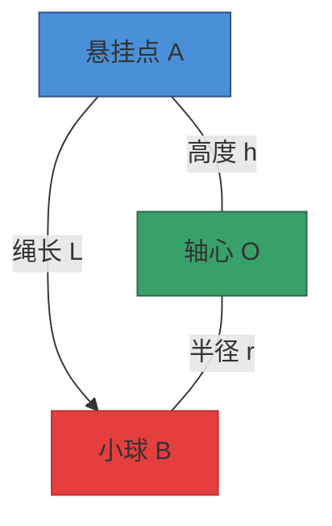

---
tags:
  - Physics
  - 定义性
  - Dynamics
  - CircularMotion
  - 证明
title: Conical Pendulum
created: 2026-04-02T10:00:00
modified:
---
[[Circular Motion & Gravitation]]
# Conical Pendulum

## 模型概述
![[conical_pendulum_demo.png]]

圆锥摆（Conical Pendulum）是一个经典物理模型：小球系于绳端，绕竖直轴做**匀速圆周运动**，绳子扫过的轨迹形成一个圆锥面。

## 几何关系

### 三角形几何

设：
- 悬挂点为 A，位置 $(0, h)$
- 小球为 B，位置 $(-r, 0)$（侧视图）
- 轴心为 O，位置 $(0, 0)$
- 绳与竖直方向夹角为 $\theta$

**基本几何量：**

$$\text{绳长: } L = \sqrt{r^2 + h^2}$$

$$\text{角度关系: } \tan\theta = \frac{r}{h}, \quad \sin\theta = \frac{r}{L}, \quad \cos\theta = \frac{h}{L}$$

$$\text{半径与高度: } r = L\sin\theta, \quad h = L\cos\theta$$

## 受力分析

小球受两个力：

### 1. 重力 $mg$
- 方向：竖直向下
- 作用点：小球 B

### 2. 绳子张力 $T$
- 方向：沿绳指向悬挂点 A
- 作用点：小球 B

### 力的分解

将张力 $T$ 分解为两个分量：

| 分量 | 表达式 | 方向 | 作用 |
|:---:|:---:|:---:|:---:|
| 竖直分量 | $T\cos\theta$ | 竖直向上 | 平衡重力 |
| 水平分量 | $T\sin\theta$ | 指向轴心 | 提供向心力 |

## 平衡方程

### 竖直方向：静止平衡

竖直方向加速度为零：

$$T\cos\theta = mg \quad \text{(1)}$$

### 水平方向：圆周运动

水平方向合力提供**向心力**：

$$T\sin\theta = F_c = m\omega^2 r = \frac{mv^2}{r} \quad \text{(2)}$$

## 核心公式推导

### 张力 $T$ 的表达式

由方程 (1) 直接得到：

$$\boxed{T = \frac{mg}{\cos\theta} = mg\sec\theta}$$

### 角速度 $\omega$ 的表达式

将方程 (1) 代入方程 (2)：

$$\frac{mg}{\cos\theta} \cdot \sin\theta = m\omega^2 r$$

$$g\tan\theta = \omega^2 r$$

由于 $\tan\theta = \frac{r}{h}$：

$$g \cdot \frac{r}{h} = \omega^2 r$$

$$\boxed{\omega = \sqrt{\frac{g}{h}} = \sqrt{\frac{g}{L\cos\theta}}}$$

**重要结论：** 角速度 $\omega$ 仅取决于**悬挂高度 $h$**，与半径 $r$ 无关！

### 线速度 $v$ 的表达式

利用 $v = \omega r$：

$$v = \omega r = \sqrt{\frac{g}{h}} \cdot r = \sqrt{\frac{g \cdot r^2}{h}}$$

由于 $r = h\tan\theta$：

$$\boxed{v = \sqrt{gh} \cdot \tan\theta = \sqrt{gL\sin^2\theta / \cos\theta}}$$

### 周期 $T_{rot}$ 的表达式

$$T_{rot} = \frac{2\pi}{\omega} = 2\pi\sqrt{\frac{h}{g}}$$

$$\boxed{T_{rot} = 2\pi\sqrt{\frac{L\cos\theta}{g}}}$$

### 向心力 $F_c$ 的表达式

$$F_c = m\omega^2 r = m \cdot \frac{g}{h} \cdot r = \frac{mgr}{h}$$

由于 $\tan\theta = \frac{r}{h}$：

$$\boxed{F_c = mg\tan\theta}$$

或者联立方程 (1) 和 (2)，消去 $T$：

$$\frac{F_c}{mg} = \tan\theta \Rightarrow F_c = mg\tan\theta$$

## 公式汇总

| 物理量 | 表达式 | 说明 |
|:---:|:---|:---|
| 张力 | $T = \dfrac{mg}{\cos\theta}$ | 随角度增大而增大 |
| 角速度 | $\omega = \sqrt{\dfrac{g}{h}} = \sqrt{\dfrac{g}{L\cos\theta}}$ | 仅取决于悬挂高度 |
| 线速度 | $v = \sqrt{gh}\tan\theta$ | 取决于高度和角度 |
| 周期 | $T_{rot} = 2\pi\sqrt{\dfrac{h}{g}}$ | 等效单摆周期公式的变体 |
| 向心力 | $F_c = mg\tan\theta$ | 水平分量提供 |
| 半径 | $r = h\tan\theta = L\sin\theta$ | 由几何确定 |

## 关键性质

### 1. 角速度独立性
角速度 $\omega = \sqrt{g/h}$ 仅取决于悬挂高度 $h$，与小球质量 $m$ 和运动半径 $r$ **无关**。

### 2. 张力与重力的关系
张力始终**大于**重力：
$$T = \frac{mg}{\cos\theta} > mg \quad (\text{因为 } \cos\theta < 1)$$

### 3. 角度限制
- 当 $\theta \to 0$：小球几乎静止悬挂，$\omega \to \infty$（不物理）
- 当 $\theta \to 90°$：需要无穷大的角速度来维持（不可能）
- 实际角度范围：$0 < \theta < 90°$

### 4. 与单摆的联系
当角度 $\theta$ 很小时，圆锥摆的周期趋近于**等长单摆**的周期：
$$T_{rot} = 2\pi\sqrt{\frac{L\cos\theta}{g}} \approx 2\pi\sqrt{\frac{L}{g}} \quad (\theta \ll 1)$$

## 典型例题

> 一个质量为 $m$ 的小球系在长为 $L$ 的轻绳上，做圆锥摆运动。已知绳与竖直方向的夹角为 $\theta$，求：
> 1. 小球的运动周期
> 2. 绳中的张力
> 3. 小球的线速度

**解答：**

1. **周期**：
$$T_{rot} = 2\pi\sqrt{\frac{L\cos\theta}{g}}$$

2. **张力**：
$$T = \frac{mg}{\cos\theta}$$

3. **线速度**：
$$v = \omega r = \sqrt{\frac{g}{L\cos\theta}} \cdot L\sin\theta = \sqrt{\frac{gL\sin^2\theta}{\cos\theta}}$$

---

**相关链接：**
- [[Circular Motion Problems]] - 圆周运动习题
- [[Tension Problems]] - 张力问题
- [[FBD Problems]] - 受力分析图
