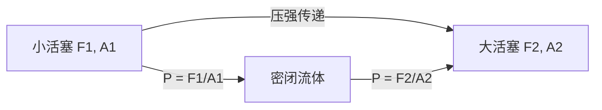
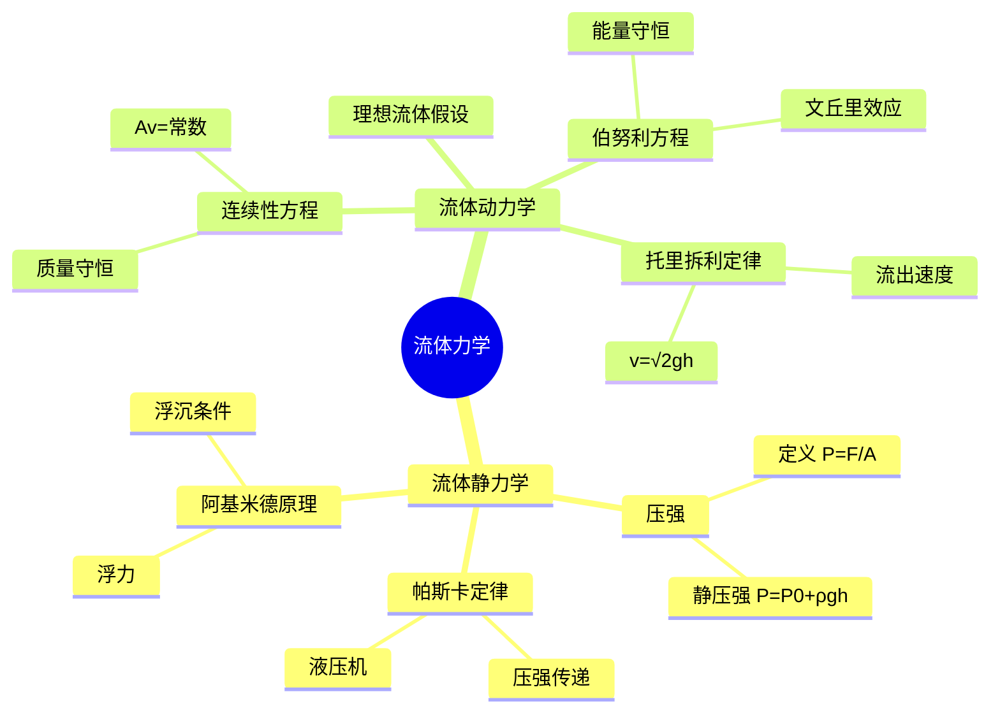

---
tags:
  - Physics
  - 定义性
  - 基本原理
title: Fluid Mechanics
created: 2026-04-14
modified: 2026-04-14
---

# Fluid Mechanics

> [!abstract] AP Physics 1 流体力学知识概览
> 流体力学研究流体（液体和气体）的平衡与运动规律。AP Physics 1 主要考察流体静力学（压强、浮力）和流体动力学基础（伯努利方程、托里拆利定律）。

## 核心知识点

### 1. 流体静力学基础

#### 1.1 压强 (Pressure)

> [!note] 定义
> 压强是单位面积上所受的垂直力：
> $$P = \frac{F}{A}$$
> 
> 单位：$\text{Pa}$ (Pascal) $= \text{N/m}^2$
> 常用单位换算：$1\text{atm} = 1.013 \times 10^5\text{Pa}$

#### 1.2 流体静压强

> [!important] 静压强公式
> 在深度为 $h$ 处，流体的压强为：
> $$P = P_0 + \rho g h$$
> 
> 其中：
> - $P_0$：液面处的大气压强
> - $\rho$：流体密度
> - $g$：重力加速度
> - $h$：距离液面的深度

> [!tip] 理解要点
> - 压强只与深度有关，与容器形状无关
> - 同一深度各方向压强相等
> - 深度增加，压强增大

---

### 2. 帕斯卡定律 (Pascal's Law)

> [!note] 帕斯卡定律
> 施加在密闭流体上的压强能够大小不变地被流体向各个方向传递。
> $$P_1 = P_2$$
> 
> 应用于液压系统：
> $$\frac{F_1}{A_1} = \frac{F_2}{A_2}$$

#### 液压机原理

$$F_2 = F_1 \cdot \frac{A_2}{A_1}$$

> [!tip] 液压机特点
> - 可以用较小的力产生较大的力（力放大）
> - 满足功的原理：$F_1 d_1 = F_2 d_2$
> - 小活塞移动距离大，大活塞移动距离小

---

### 3. 阿基米德原理 (Archimedes' Principle)

> [!important] 阿基米德原理
> 浸在流体中的物体受到向上的浮力，浮力大小等于物体排开流体的重量：
> $$F_B = \rho_f \cdot g \cdot V_{\text{displaced}}$$
> 
> 其中：
> - $\rho_f$：流体密度
> - $V_{\text{displaced}}$：排开流体的体积

#### 浮沉条件

| 条件 | 物体密度 vs 流体密度 | 运动状态 |
|------|---------------------|----------|
| 漂浮 | $\rho_{\text{object}} < \rho_f$ | 部分浸入，静止在液面 |
| 悬浮 | $\rho_{\text{object}} = \rho_f$ | 全部浸入，可静止在任意深度 |
| 下沉 | $\rho_{\text{object}} > \rho_f$ | 全部浸入，沉到底部 |

> [!tip] 漂浮时的平衡条件
> 当物体漂浮时：
> $$F_B = mg$$
> $$\rho_f g V_{\text{submerged}} = \rho_{\text{object}} g V_{\text{total}}$$
> 
> 浸入比例：
> $$\frac{V_{\text{submerged}}}{V_{\text{total}}} = \frac{\rho_{\text{object}}}{\rho_f}$$

---

### 4. 流体动力学基础

#### 4.1 理想流体假设

> [!note] 理想流体
> - 不可压缩：密度 $\rho$ 恒定
> - 无粘性：无内摩擦
> - 稳定流动（定常流动）：流场不随时间变化

#### 4.2 流线与流管

- **流线**：流体中各点速度方向的切线
- **流管**：由流线围成的管道状区域
- 定常流动中，流线形状不随时间变化

---

### 5. 连续性方程 (Continuity Equation)

> [!important] 质量守恒
> 对于不可压缩流体，通过任意截面的流量相等：
> $$A_1 v_1 = A_2 v_2$$
> 或写成：
> $$Q = Av = \text{常数}$$
> 
> 其中 $Q$ 为体积流量（单位时间内流过的体积）

> [!tip] 理解
> - 管道变细，流速增大
> - 管道变粗，流速减小
> - 流速与横截面积成反比

---

### 6. 伯努利方程 (Bernoulli's Equation)

> [!important] 伯努利方程
> 沿流线（理想流体稳定流动），下列量守恒：
> $$P + \frac{1}{2}\rho v^2 + \rho g h = \text{常数}$$
> 
> 各项含义：
> - $P$：静压（压强）
> - $\frac{1}{2}\rho v^2$：动压（单位体积动能）
> - $\rho g h$：重力势能项（单位体积势能）

#### 能量守恒解释

$$P + \frac{1}{2}\rho v^2 + \rho g h = \text{常数}$$

伯努利方程本质是**能量守恒**在流体中的体现：
- 总机械能密度沿流线保持不变

#### 应用形式

对于流线上两点 1 和 2：
$$P_1 + \frac{1}{2}\rho v_1^2 + \rho g h_1 = P_2 + \frac{1}{2}\rho v_2^2 + \rho g h_2$$

---

### 7. 伯努利方程的应用

#### 7.1 文丘里效应 (Venturi Effect)

水平管道中，流速大的地方压强小：

$$P_1 + \frac{1}{2}\rho v_1^2 = P_2 + \frac{1}{2}\rho v_2^2$$

结合连续性方程 $A_1 v_1 = A_2 v_2$：
- 管道变细（$A_2 < A_1$）→ $v_2 > v_1$ → $P_2 < P_1$

> [!tip] 应用
> - 喷雾器原理
> - 飞机机翼升力（上表面流速大、压强小）
> - 路易斯球（棒球弯曲球）

#### 7.2 皮托管 (Pitot Tube)

测量流体速度的装置：

$$P_{\text{static}} + \frac{1}{2}\rho v^2 = P_{\text{total}}$$

流速：
$$v = \sqrt{\frac{2(P_{\text{total}} - P_{\text{static}})}{\rho}}$$

---

### 8. 托里拆利定律 (Torricelli's Law)

> [!important] 托里拆利定律
> 容器中液体从孔中流出的速度：
> $$v = \sqrt{2gh}$$
> 
> 其中 $h$ 是液面到小孔的垂直深度。

#### 推导

应用伯努利方程于液面和小孔处：

**液面**：$P_0$（大气压），$v_1 \approx 0$（液面下降很慢），高度 $h_1 = h$

**小孔**：$P_0$（暴露在大气中），速度 $v_2 = v$，高度 $h_2 = 0$

$$P_0 + \rho g h = P_0 + \frac{1}{2}\rho v^2$$

$$v = \sqrt{2gh}$$

> [!tip] 理解
> - 流出速度等于自由落体下落高度 $h$ 后的速度
> - 流速只与深度 $h$ 有关，与液体密度无关
> - 这体现了机械能守恒

#### 流量计算

$$Q = A \cdot v = A\sqrt{2gh}$$

其中 $A$ 为小孔面积。

---

### 9. 流体静力学与动力学综合

#### 9.1 大容器底部开口

| 问题类型 | 关键公式 |
|----------|----------|
| 流出速度 | $v = \sqrt{2gh}$ |
| 体积流量 | $Q = A\sqrt{2gh}$ |
| 质量流量 | $\dot{m} = \rho A\sqrt{2gh}$ |
| 液面下降速率 | $\frac{dh}{dt} = -\frac{A_{\text{outlet}}}{A_{\text{surface}}}\sqrt{2gh}$ |

#### 9.2 容器放空时间

对于横截面积为 $A_{\text{surface}}$ 的容器，初始液面高度 $h_0$：

$$t = \frac{2 A_{\text{surface}} \sqrt{h_0}}{A_{\text{outlet}} \sqrt{2g}}$$

---

### 10. 常见题型与解题技巧

#### ① 浮力计算

> [!tip] 解题要点
> - 确定排开流体的体积
> - 注意区分浸入体积和总体积
> - 浮力方向永远向上

#### ② 压强计算

> [!tip] 解题要点
> - 使用 $P = P_0 + \rho g h$
> - 注意 $h$ 是从液面向下测量的深度
> - 大气压强通常不可忽略

#### ③ 伯努利方程应用

> [!tip] 解题要点
> - 选取流线上两点列方程
> - 常选液面、出口等特殊位置
> - 结合连续性方程联立求解

#### ④ 托里拆利定律应用

> [!tip] 解题要点
> - 确定液面到出口的深度 $h$
> - 若液面下降，注意 $h$ 随时间变化
> - 结合微积分求放空时间

---

### 11. AP Physics 1 考试要点

> [!warning] 考试重点
> 1. **压强计算**：$P = P_0 + \rho g h$ 的应用
> 2. **浮力计算**：阿基米德原理的应用
> 3. **浮沉条件**：根据密度判断物体浮沉状态
> 4. **伯努利方程**：定性理解和简单计算
> 5. **托里拆利定律**：流出速度的计算

> [!warning] 常见误区
> - 忽略大气压强的影响
> - 混淆压强深度与容器形状的关系
> - 错误判断浮力方向（浮力永远向上）
> - 混淆物体密度和流体密度
> - 应用伯努利方程时选点不当
> - 忽略托里拆利定律的适用条件（小孔、理想流体）

---

## 公式总结

| 定律/公式 | 表达式 | 说明 |
|-----------|--------|------|
| 压强定义 | $P = F/A$ | 基本定义 |
| 静压强 | $P = P_0 + \rho g h$ | 深度关系 |
| 帕斯卡定律 | $F_1/A_1 = F_2/A_2$ | 压强传递 |
| 阿基米德原理 | $F_B = \rho_f g V_{\text{disp}}$ | 浮力计算 |
| 连续性方程 | $A_1 v_1 = A_2 v_2$ | 质量守恒 |
| 伯努利方程 | $P + \frac{1}{2}\rho v^2 + \rho g h = \text{常数}$ | 能量守恒 |
| 托里拆利定律 | $v = \sqrt{2gh}$ | 流出速度 |

---

## 相关链接

- [[Energy & Work Problems]] - 能量守恒（伯努利方程的基础）
- [[Dynamic & Friction]] - 动力学基础
- [[Circular Motion & Gravitation]] - 引力场中的势能概念
- [[Unit Conversions]] - 单位换算

---

## 思维导图

