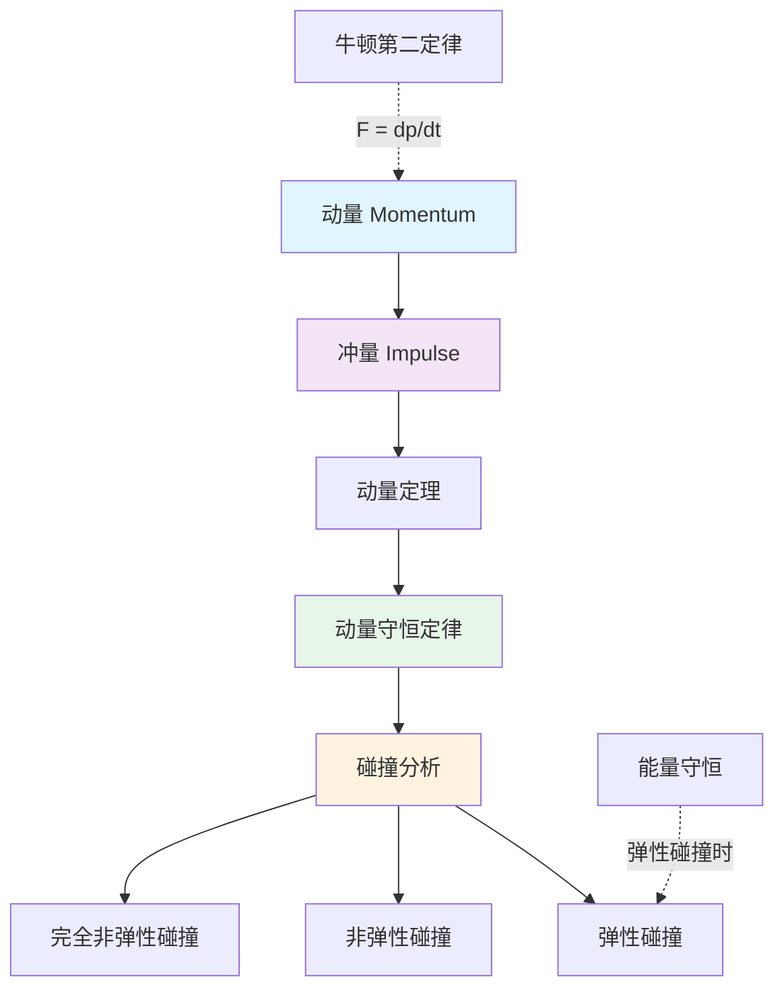
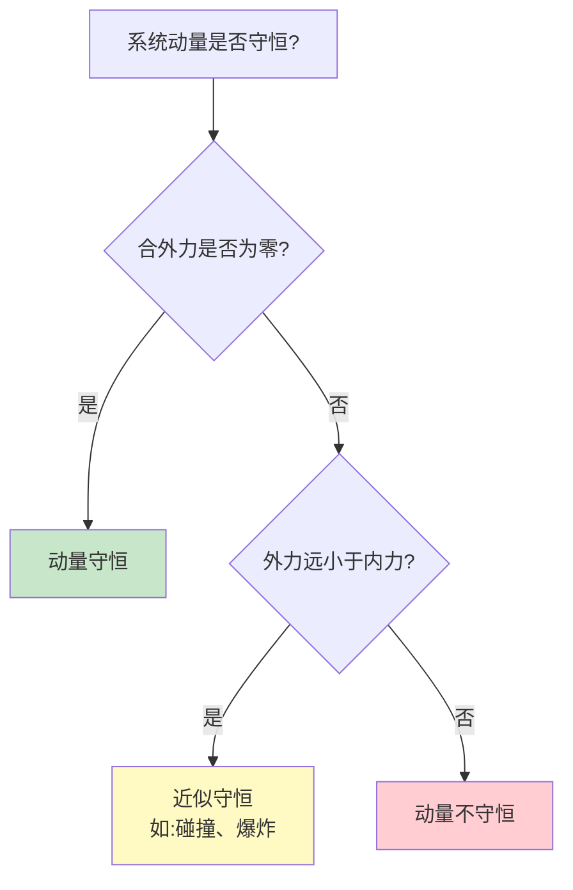
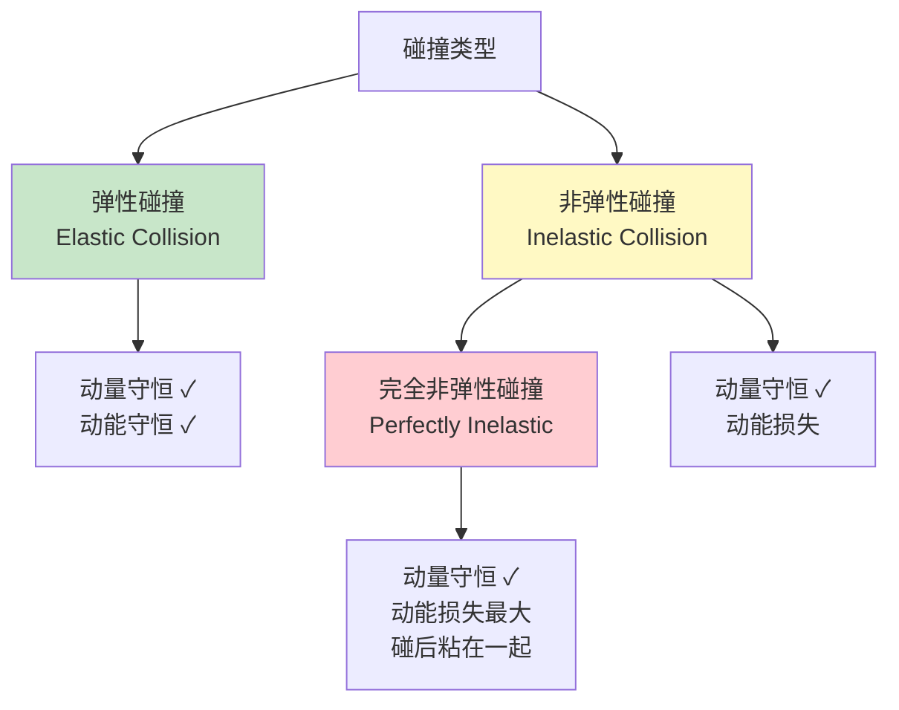
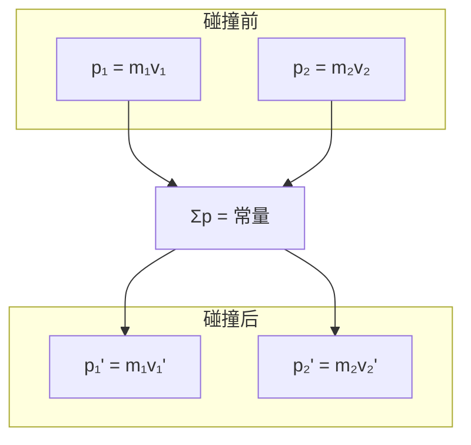
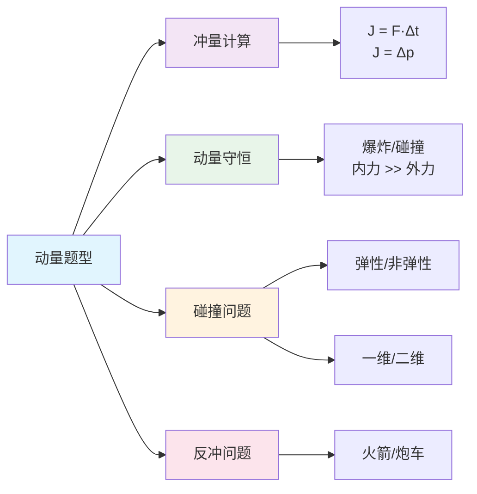

---
tags:
  - Physics
  - 定义性
  - 证明
  - Dynamics
title: Momentum & Impulse (动量与冲量)
created: 2026-03-21T10:00:00
modified:
---
# Momentum & Impulse (动量与冲量)

## 0. 核心概念图示

---

## 1. 动量 (Momentum)

### 1.1 定义

动量是描述物体运动状态的物理量，定义为质量与速度的乘积：

$$\vec{p} = m\vec{v}$$

**性质：**
- 动量是**矢量**，方向与速度方向相同
- 单位：$\text{kg} \cdot \text{m/s}$（或 $\text{N} \cdot \text{s}$）
- 动量具有**瞬时性**：描述物体在某时刻的运动状态

### 1.2 动量与动能的比较

| 物理量 | 公式 | 类型 | 守恒条件 |
|--------|------|------|----------|
| 动量 $\vec{p}$ | $m\vec{v}$ | 矢量 | 合外力为零 |
| 动能 $E_k$ | $\frac{1}{2}mv^2$ | 标量 | 保守力做功 |

两者的关系：
$$E_k = \frac{p^2}{2m}$$

---

## 2. 冲量 (Impulse)

### 2.1 定义

冲量是力对时间的累积效应：

**恒力情况：**
$$\vec{J} = \vec{F} \cdot \Delta t$$

**变力情况：**
$$\vec{J} = \int_{t_1}^{t_2} \vec{F}(t) \, dt$$

**性质：**
- 冲量是**矢量**，方向与力的方向相同
- 单位：$\text{N} \cdot \text{s} = \text{kg} \cdot \text{m/s}$
- 冲量是**过程量**：描述力在一段时间内的累积效果

### 2.2 冲量的几何意义

对于变力，冲量等于**F-t图线下的面积**：

$$\vec{J} = \text{面积} = \int F(t) \, dt$$

### 2.3 平均力

在碰撞等问题中，常使用平均力来简化计算：

$$\vec{F}_{avg} = \frac{\vec{J}}{\Delta t} = \frac{\Delta\vec{p}}{\Delta t}$$

---

## 3. 动量定理 (Impulse-Momentum Theorem)

### 3.1 定理内容

物体所受合外力的冲量等于物体动量的变化：

$$\vec{J} = \Delta\vec{p} = \vec{p}_f - \vec{p}_i$$

展开形式：
$$\vec{F}_{net} \cdot \Delta t = m\vec{v}_f - m\vec{v}_i$$

### 3.2 推导过程

从牛顿第二定律出发：

$$\vec{F}_{net} = m\vec{a} = m\frac{d\vec{v}}{dt}$$

对于质量不变的物体：
$$\vec{F}_{net} = \frac{d(m\vec{v})}{dt} = \frac{d\vec{p}}{dt}$$

两边对时间积分：
$$\int_{t_1}^{t_2} \vec{F}_{net} \, dt = \int_{\vec{p}_1}^{\vec{p}_2} d\vec{p} = \vec{p}_2 - \vec{p}_1 = \Delta\vec{p}$$

### 3.3 与牛顿第二定律的关系

牛顿第二定律的**原始表述**实际上是：

$$\vec{F} = \frac{d\vec{p}}{dt}$$

这比 $\vec{F} = m\vec{a}$ 更为普遍，因为它**适用于质量变化的系统**（如火箭推进）。

---

## 4. 动量守恒定律 (Conservation of Momentum)

### 4.1 定律内容

当系统所受**合外力为零**时，系统的总动量保持不变：

$$\sum\vec{p}_{initial} = \sum\vec{p}_{final}$$

或写作：
$$\vec{p}_1 + \vec{p}_2 + ... = \vec{p}_1' + \vec{p}_2' + ...$$

### 4.2 守恒条件

**具体条件：**
1. **严格守恒**：系统不受外力或合外力为零
2. **近似守恒**：内力远大于外力（如碰撞、爆炸过程）
3. **分方向守恒**：某方向合外力为零，该方向动量守恒

### 4.3 推导过程

考虑由两个物体组成的孤立系统：

根据牛顿第三定律，两物体之间的相互作用力大小相等、方向相反：
$$\vec{F}_{12} = -\vec{F}_{21}$$

对两个物体分别应用动量定理：
$$\vec{F}_{12} \cdot \Delta t = \Delta\vec{p}_1$$
$$\vec{F}_{21} \cdot \Delta t = \Delta\vec{p}_2$$

相加得：
$$(\vec{F}_{12} + \vec{F}_{21}) \cdot \Delta t = \Delta\vec{p}_1 + \Delta\vec{p}_2$$

由于 $\vec{F}_{12} = -\vec{F}_{21}$，所以：
$$0 = \Delta\vec{p}_1 + \Delta\vec{p}_2 = \Delta\vec{p}_{total}$$

即系统总动量不变。

---

## 5. 碰撞 (Collisions)

### 5.1 碰撞的分类

### 5.2 一维弹性碰撞

**设定：** 两物体质量分别为 $m_1$ 和 $m_2$，初速度分别为 $v_1$ 和 $v_2$，碰撞后速度分别为 $v_1'$ 和 $v_2'$。

**动量守恒：**
$$m_1 v_1 + m_2 v_2 = m_1 v_1' + m_2 v_2'$$

**动能守恒：**
$$\frac{1}{2}m_1 v_1^2 + \frac{1}{2}m_2 v_2^2 = \frac{1}{2}m_1 v_1'^2 + \frac{1}{2}m_2 v_2'^2$$

**解得：**
$$v_1' = \frac{(m_1 - m_2)v_1 + 2m_2 v_2}{m_1 + m_2}$$

$$v_2' = \frac{(m_2 - m_1)v_2 + 2m_1 v_1}{m_1 + m_2}$$

### 5.3 特殊情况分析

| 情况 | 条件 | 结果 |
|------|------|------|
| 等质量交换 | $m_1 = m_2$ | $v_1' = v_2, \quad v_2' = v_1$（速度交换） |
| 轻物碰重静止物 | $m_1 \ll m_2, v_2 = 0$ | $v_1' \approx -v_1$（反弹） |
| 重物碰轻静止物 | $m_1 \gg m_2, v_2 = 0$ | $v_1' \approx v_1$（几乎不变） |

### 5.4 完全非弹性碰撞

碰撞后两物体粘在一起，以共同速度运动。

设共同速度为 $v_f$：

$$m_1 v_1 + m_2 v_2 = (m_1 + m_2) v_f$$

$$v_f = \frac{m_1 v_1 + m_2 v_2}{m_1 + m_2}$$

**动能损失：**
$$\Delta E_k = \frac{1}{2}m_1 v_1^2 + \frac{1}{2}m_2 v_2^2 - \frac{1}{2}(m_1 + m_2) v_f^2$$

展开计算（当 $v_2 = 0$ 时）：
$$\Delta E_k = \frac{m_1 m_2 v_1^2}{2(m_1 + m_2)}$$

### 5.5 恢复系数

恢复系数 $e$ 用于定量描述碰撞的弹性程度：

$$e = \frac{v_2' - v_1'}{v_1 - v_2}$$

| $e$ 值 | 碰撞类型 |
|--------|----------|
| $e = 1$ | 完全弹性碰撞 |
| $0 < e < 1$ | 非弹性碰撞 |
| $e = 0$ | 完全非弹性碰撞 |

---

## 6. 二维碰撞 (Two-Dimensional Collisions)

### 6.1 分析方法

二维碰撞需要**在两个相互垂直的方向上分别应用动量守恒**：

$$x\text{方向：} m_1 v_{1x} + m_2 v_{2x} = m_1 v_{1x}' + m_2 v_{2x}'$$

$$y\text{方向：} m_1 v_{1y} + m_2 v_{2y} = m_1 v_{1y}' + m_2 v_{2y}'$$

### 6.2 矢量图示

### 6.3 弹性二维碰撞的特殊情况

当一个球以初速度 $v_1$ 与静止的等质量球发生弹性碰撞时：

- 两球速度方向**互相垂直**
- 这可以用来判断碰撞是否为弹性碰撞

---

## 7. 动量与[[Center of Mass Problems|质心]]

### 7.1 质心的动量

系统的总动量等于总质量与质心速度的乘积：

$$\vec{P}_{total} = M\vec{v}_{cm}$$

其中 $M = \sum m_i$ 为系统总质量。

### 7.2 质心运动定律

系统动量守恒等价于**质心速度不变**：

$$\vec{F}_{ext} = \frac{d\vec{P}_{total}}{dt} = M\vec{a}_{cm}$$

当合外力为零时：
$$\vec{v}_{cm} = \text{常数}$$

---

## 8. 反冲与推进 (Recoil and Propulsion)

### 8.1 反冲问题

当一个系统的一部分向某方向运动时，另一部分会向相反方向运动。

**例：** 质量为 $M$ 的炮车发射质量为 $m$ 的炮弹，炮弹出口速度为 $v$（相对于地面）。

炮车反冲速度：
$$V = -\frac{mv}{M}$$

### 8.2 火箭推进

火箭通过喷出气体获得推力，这是**变质量系统**的典型例子：

$$\vec{F}_{thrust} = \vec{v}_{exhaust} \cdot \frac{dm}{dt}$$

其中 $\frac{dm}{dt}$ 是燃料消耗率（负值），$\vec{v}_{exhaust}$ 是喷出气体相对于火箭的速度。

**齐奥尔科夫斯基方程：**
$$\Delta v = v_e \ln\frac{m_0}{m_f}$$

---

## 9. 常见题型总结

### 解题要点

1. **明确研究对象**：确定系统的边界
2. **分析受力情况**：判断是否满足守恒条件
3. **选择参考方向**：规定正方向，注意矢量的正负
4. **建立方程**：根据动量守恒建立方程
5. **能量分析**：必要时结合能量守恒

---

## 10. 与其他概念的联系

- [[Energy & Work Problems|能量与功]]：弹性碰撞中动能守恒
- [[Center of Mass Problems|质心]]：质心运动与系统动量
- [[Dynamic & Friction|动力学与摩擦]]：牛顿定律与动量定理
- [[FBD Problems|受力分析]]：判断守恒条件的基础

---

## 参考

> AP Physics 1 Course and Exam Description - College Board
