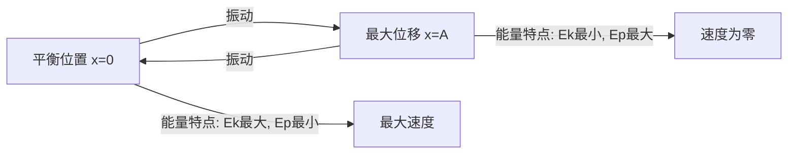

---
tags:
  - Physics
  - 定义性
  - 基本原理
title: Simple Harmonic Motion
created: 2026-04-07
modified: 2026-04-07
---

# Simple Harmonic Motion

> [!abstract] AP Physics 1 简谐运动知识概览
> 简谐运动是最基本的周期运动，是理解波动、交流电等现象的基础。AP Physics 1 主要考察弹簧振子和单摆两种模型。

## 核心知识点

### 1. 简谐运动的定义

> [!note] 定义
> 物体在平衡位置附近做往复运动，其**恢复力与位移成正比，方向相反**：
> $$F = -kx$$
> 其中 $k$ 是劲度系数，$x$ 是相对平衡位置的位移。

**判断简谐运动的方法：**
- 力学判据：$F \propto -x$（恢复力与位移正比反向）
- 运动学判据：$a = -\omega^2 x$（加速度与位移正比反向）

---

### 2. 描述简谐运动的物理量

| 物理量 | 符号 | 定义 | 单位 |
|--------|------|------|------|
| 振幅 | $A$ | 离开平衡位置的最大距离 | m |
| 周期 | $T$ | 完成一次全振动所需时间 | s |
| 频率 | $f$ | 单位时间内完成的振动次数 | Hz |
| 角频率 | $\omega$ | $2\pi$ 时间内完成的振动次数 | rad/s |

**基本关系：**
$$\omega = \frac{2\pi}{T} = 2\pi f$$

---

### 3. 运动学方程

#### 位移方程
$$x(t) = A\cos(\omega t + \phi)$$

其中 $\phi$ 为初相位，取决于初始条件。

#### 速度方程
$$v(t) = -A\omega\sin(\omega t + \phi) = -\omega\sqrt{A^2 - x^2}$$

> [!tip] 速度与位移的关系
> $$v = \pm\omega\sqrt{A^2 - x^2}$$
> - 平衡位置（$x=0$）：$v = \pm A\omega = v_{\max}$（速度最大）
> - 最大位移处（$x=\pm A$）：$v = 0$（速度为零）

#### 加速度方程
$$a(t) = -A\omega^2\cos(\omega t + \phi) = -\omega^2 x$$

> [!warning] 重要结论
> 简谐运动中加速度与位移成正比，方向相反：
> $$a = -\omega^2 x$$
> 加速度在平衡位置为零，在最大位移处最大。

---

### 4. 两种典型模型

#### 弹簧振子

> [!note] 周期公式
> $$T = 2\pi\sqrt{\frac{m}{k}}$$
> 
> 角频率：$\omega = \sqrt{\frac{k}{m}}$

**特点：**
- 周期只与质量和劲度系数有关，与振幅无关
- 水平弹簧振子：重力不影响周期
- 竖直弹簧振子：平衡位置改变，周期不变

#### 单摆（小角度近似）

> [!note] 周期公式
> $$T = 2\pi\sqrt{\frac{L}{g}}$$
> 
> 角频率：$\omega = \sqrt{\frac{g}{L}}$

**适用条件：** 摆角 $\theta < 5°$（或 $\theta < 10°$ 作为近似）

**特点：**
- 周期只与摆长和重力加速度有关
- 周期与小球质量无关
- 周期与振幅无关（等时性）

---

### 5. 能量关系

#### 弹簧振子的能量

**动能：**
$$E_k = \frac{1}{2}mv^2 = \frac{1}{2}m\omega^2(A^2 - x^2)$$

**弹性势能：**
$$E_p = \frac{1}{2}kx^2$$

**机械能（守恒）：**
$$E = E_k + E_p = \frac{1}{2}kA^2 = \frac{1}{2}mv_{\max}^2$$

#### 能量转换规律

| 位置 | 位移 | 速度 | 动能 | 势能 |
|------|------|------|------|------|
| 平衡位置 | $x = 0$ | $v = \pm A\omega$（最大） | 最大 | 零 |
| 最大位移 | $x = \pm A$ | $v = 0$ | 零 | 最大 |
| 一般位置 | $x$ | $v = \pm\omega\sqrt{A^2-x^2}$ | $\frac{1}{2}mv^2$ | $\frac{1}{2}kx^2$ |

---

### 6. 图像分析

#### x-t, v-t, a-t 图像关系

> [!important] 图像特征
> - **位移图**：余弦曲线
> - **速度图**：位移图的导数，正弦曲线，相位超前 $\frac{\pi}{2}$
> - **加速度图**：位移图乘以 $-\omega^2$，相位与位移相反（差 $\pi$）

**关键点对应：**

| 时刻 | 位移 $x$ | 速度 $v$ | 加速度 $a$ |
|------|----------|----------|------------|
| $t = 0$（正向最大位移）| $+A$ | $0$ | $-A\omega^2$（最大负值）|
| $t = T/4$（平衡位置）| $0$ | $-A\omega$（最大负值）| $0$ |
| $t = T/2$（负向最大位移）| $-A$ | $0$ | $+A\omega^2$（最大正值）|
| $t = 3T/4$（平衡位置）| $0$ | $+A\omega$（最大正值）| $0$ |

---

### 7. 相位与相位差

#### 相位
$$\phi(t) = \omega t + \phi_0$$

相位决定了物体的振动状态（位置和运动方向）。

#### 相位差
两个简谐运动的相位差：
$$\Delta\phi = \phi_1 - \phi_2$$

**常见相位差：**
- $\Delta\phi = 0$：同相（同步振动）
- $\Delta\phi = \pi$：反相（振动状态相反）
- $\Delta\phi = \pm\frac{\pi}{2}$：正交（相差四分之一周期）

---

### 8. 简谐运动的动力学分析

#### 牛顿第二定律应用

$$F = ma \Rightarrow -kx = ma$$

$$a = -\frac{k}{m}x = -\omega^2 x$$

由此可得角频率：
$$\omega = \sqrt{\frac{k}{m}}$$

#### 回复力分析

$$F = -kx$$

| 位置 | 位移 | 回复力大小 | 回复力方向 |
|------|------|------------|------------|
| 平衡位置 | $0$ | $0$ | 无 |
| 正向最大位移 | $+A$ | $kA$ | 指向平衡位置（负方向）|
| 负向最大位移 | $-A$ | $kA$ | 指向平衡位置（正方向）|

---

### 9. 常见题型与解题技巧

#### ① 周期、频率计算

> [!tip] 解题要点
> - 弹簧振子：$T = 2\pi\sqrt{m/k}$
> - 单摆：$T = 2\pi\sqrt{L/g}$
> - 注意区分质量和摆长的变化对周期的影响

#### ② 能量守恒问题

> [!tip] 解题要点
> - 利用 $E = \frac{1}{2}kA^2$（总能量守恒）
> - 利用 $v = \omega\sqrt{A^2 - x^2}$（速度与位移关系）

#### ③ 图像分析问题

> [!tip] 解题要点
> - 从图像读取振幅 $A$、周期 $T$
> - 计算角频率 $\omega = 2\pi/T$
> - 判断某时刻的速度、加速度方向和大小

#### ④ 多过程问题

> [!tip] 解题要点
> - 分段分析每个过程的运动特点
> - 注意连接点的连续性（位移、速度）
> - 应用能量守恒和动量守恒（如有碰撞）

---

### 10. AP Physics 1 考试要点

> [!warning] 考试重点
> 1. **定性理解**：简谐运动的定义、恢复力的特点
> 2. **周期公式**：弹簧振子和单摆的周期公式及其应用
> 3. **能量关系**：动能与势能的转换，机械能守恒
> 4. **图像分析**：x-t, v-t 图像的识别与分析
> 5. **实验设计**：验证周期公式的实验方法

> [!warning] 常见误区
> - 混淆周期与频率的关系
> - 忽略单摆周期与小球质量无关
> - 错误理解速度最大位置（在平衡位置而非最大位移处）
> - 混淆角频率 $\omega$ 与角速度

---

## 相关链接

- [[Simple Harmonic Motion Problems]] - 简谐运动习题
- [[Oscillation Problems]] - 振动基础
- [[Circular Motion & Gravitation]] - 圆周运动（类比角频率概念）
- [[Energy & Work Problems]] - 能量守恒

简谐运动的恢复力特点：$F = -kx$，力与位移成正比，方向相反
弹簧振子周期公式：$T = 2\pi\sqrt{m/k}$
单摆周期公式：$T = 2\pi\sqrt{L/g}$（小角度近似）
简谐运动速度最大位置：平衡位置 $x=0$
简谐运动能量守恒：$E = \frac{1}{2}kA^2$
