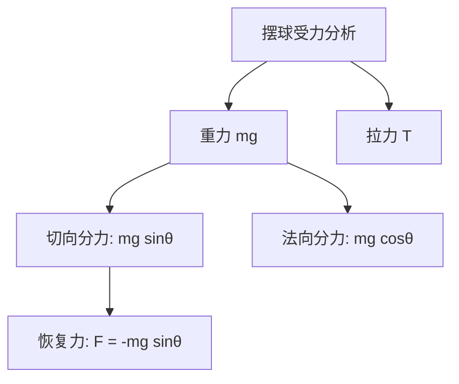
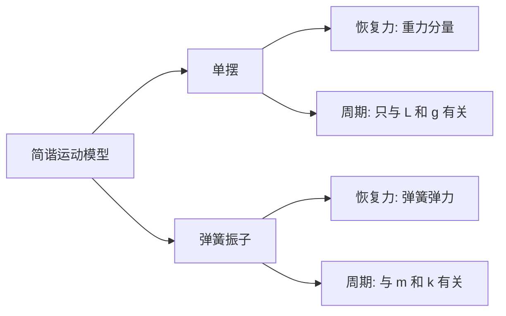

---
tags:
  - Physics
  - 定义性
  - Dynamics
title: Simple Pendulum
created: 2026-04-07
modified: 2026-04-07
---

# Simple Pendulum

> [!abstract] AP Physics 1 单摆知识概览
> 单摆是简谐运动的典型模型之一，是AP Physics 1考试的重点内容。理解单摆的运动规律有助于掌握周期运动的核心概念。

## 核心知识点

### 1. 单摆的定义

> [!note] 定义
> 一根不可伸长、质量可忽略的细线，上端固定，下端系一个质点，在竖直平面内做小角度摆动，这种装置称为**单摆**（Simple Pendulum）。

**理想单摆的条件：**
- 细线质量可忽略
- 细线不可伸长
- 摆球为质点（尺寸远小于摆长）
- 摆角很小（$\theta < 5°$ 或 $\theta < 10°$ 作为近似）

---

### 2. 单摆的受力分析

#### 平衡位置

摆球静止在最低点时：
- 重力：$mg$，方向竖直向下
- 拉力：$T = mg$，方向沿绳子向上

#### 一般位置

摆角为 $\theta$ 时，摆球受力：
- 重力：$mg$，方向竖直向下
- 拉力：$T$，方向沿绳子指向悬挂点

**力的分解：**

将重力沿切向和法向分解：
- 切向分力（恢复力）：$F_t = -mg\sin\theta$
- 法向分力（向心力）：$F_n = T - mg\cos\theta$

---

### 3. 单摆做简谐运动的条件

> [!important] 小角度近似
> 当摆角 $\theta$ 很小时（$\theta < 5°$），有：
> $$\sin\theta \approx \theta \approx \frac{x}{L}$$
> 
> 此时恢复力可写成：
> $$F = -mg\sin\theta \approx -mg\theta = -\frac{mg}{L}x$$
> 
> 令 $k = \frac{mg}{L}$，则 $F = -kx$，满足简谐运动条件。

**小角度近似的数学基础：**

| 角度 | $\theta$ (rad) | $\sin\theta$ | 相对误差 |
|------|----------------|--------------|----------|
| $1°$ | $0.0175$ | $0.0175$ | $< 0.01\%$ |
| $5°$ | $0.0873$ | $0.0872$ | $\approx 0.1\%$ |
| $10°$ | $0.1745$ | $0.1736$ | $\approx 0.5\%$ |

---

### 4. 单摆的周期公式

> [!note] 周期公式
> $$T = 2\pi\sqrt{\frac{L}{g}}$$
> 
> 角频率：
> $$\omega = \sqrt{\frac{g}{L}} = \frac{2\pi}{T}$$
> 
> 频率：
> $$f = \frac{1}{T} = \frac{1}{2\pi}\sqrt{\frac{g}{L}}$$

**推导过程：**

由简谐运动角频率公式：
$$\omega = \sqrt{\frac{k}{m}} = \sqrt{\frac{mg/L}{m}} = \sqrt{\frac{g}{L}}$$

周期：
$$T = \frac{2\pi}{\omega} = 2\pi\sqrt{\frac{L}{g}}$$

---

### 5. 周期公式的特点

> [!tip] 等时性
> 单摆的周期只与**摆长**和**重力加速度**有关，与以下因素无关：
> - **振幅**（小角度范围内）
> - **摆球质量**
> - **摆球形状和材质**

**物理意义：**

| 变量 | 变化 | 周期变化 |
|------|------|----------|
| 摆长 $L$ | 增大 | 增大 |
| 重力加速度 $g$ | 增大 | 减小 |
| 质量 $m$ | 变化 | 不变 |
| 振幅 $A$ | 变化（小角度）| 不变 |

**数学关系：**
$$T \propto \sqrt{L}, \quad T \propto \frac{1}{\sqrt{g}}$$

---

### 6. 单摆的能量分析

#### 势能

以平衡位置为零势能点，摆角为 $\theta$ 时：
$$E_p = mgh = mgL(1 - \cos\theta)$$

小角度近似：
$$\cos\theta \approx 1 - \frac{\theta^2}{2}$$
$$E_p \approx \frac{1}{2}mgL\theta^2 = \frac{1}{2}\frac{mg}{L}x^2 = \frac{1}{2}kx^2$$

#### 动能

$$E_k = \frac{1}{2}mv^2$$

#### 机械能守恒

$$E = E_k + E_p = \text{常数}$$

最大位移处（$\theta = \theta_{\max}$）：
$$E = E_{p,\max} = mgL(1 - \cos\theta_{\max})$$

平衡位置（$\theta = 0$）：
$$E = E_{k,\max} = \frac{1}{2}mv_{\max}^2$$

> [!tip] 能量转换
> - 平衡位置：动能最大，势能为零
> - 最大位移：势能最大，动能为零
> - 振动过程中：动能与势能相互转换

---

### 7. 单摆与弹簧振子的对比

| 特性 | 单摆 | 弹簧振子 |
|------|------|----------|
| 恢复力 | $F \approx -\frac{mg}{L}x$ | $F = -kx$ |
| 周期公式 | $T = 2\pi\sqrt{L/g}$ | $T = 2\pi\sqrt{m/k}$ |
| 与质量的关系 | 无关 | 有关 |
| 与振幅的关系 | 无关（小角度） | 无关 |
| 势能 | 重力势能 | 弹性势能 |
| 适用条件 | 小角度摆动 | 弹性限度内 |

---

### 8. 重力加速度的测量

> [!note] 利用单摆测重力加速度
> 由周期公式：
> $$g = \frac{4\pi^2 L}{T^2}$$
> 
> 实验步骤：
> 1. 测量摆长 $L$（从悬挂点到摆球中心）
> 2. 让单摆做小角度摆动
> 3. 测量 $n$ 次全振动的时间 $t$
> 4. 计算周期 $T = t/n$
> 5. 代入公式计算 $g$

**实验注意事项：**
- 摆角要小（$\theta < 5°$）
- 摆球应在同一竖直平面内摆动
- 计时应从平衡位置开始
- 测量多次取平均值

---

### 9. 单摆的应用

#### 钟摆

> [!tip] 摆钟原理
> 钟摆利用单摆的等时性计时。调节摆长可以改变钟摆的周期：
> - 走快了：增加摆长
> - 走慢了：减小摆长

#### 重力加速度探测

不同地点的重力加速度略有差异：
- 赤道：$g \approx 9.78 \, \text{m/s}^2$
- 两极：$g \approx 9.83 \, \text{m/s}^2$
- 海拔升高：$g$ 减小

#### 地下资源勘探

通过测量不同地点单摆周期的微小变化，可以探测地下矿藏（密度异常区域）。

---

### 10. 复摆（物理摆）简介

> [!note] 复摆周期公式
> 对于任意刚体绕固定轴摆动（复摆）：
> $$T = 2\pi\sqrt{\frac{I}{mgd}}$$
> 
> 其中：
> - $I$：刚体对转轴的转动惯量
> - $d$：质心到转轴的距离
> - $m$：刚体质量

**注意：** AP Physics 1 主要考察单摆，复摆属于 AP Physics C 的内容。

---

## 常见题型与解题技巧

### 题型一：周期计算

> [!example] 例题
> 一单摆摆长为 $1.0 \, \text{m}$，重力加速度 $g = 9.8 \, \text{m/s}^2$，求其周期。
> 
> **解：**
> $$T = 2\pi\sqrt{\frac{L}{g}} = 2\pi\sqrt{\frac{1.0}{9.8}} \approx 2.01 \, \text{s}$$

### 题型二：摆长变化

> [!example] 例题
> 一单摆的周期为 $2 \, \text{s}$，若将摆长变为原来的 $4$ 倍，周期变为多少？
> 
> **解：**
> 由 $T \propto \sqrt{L}$：
> $$T' = T\sqrt{\frac{L'}{L}} = 2\sqrt{4} = 4 \, \text{s}$$

### 题型三：位置变化

> [!example] 例题
> 地球表面周期为 $T$ 的单摆，移到月球表面（$g_{\text{月}} = g_{\text{地}}/6$），周期变为多少？
> 
> **解：**
> 由 $T \propto 1/\sqrt{g}$：
> $$T' = T\sqrt{\frac{g_{\text{地}}}{g_{\text{月}}}} = T\sqrt{6} \approx 2.45T$$

### 题型四：实验设计

> [!tip] 解题要点
> - 明确实验目的（测 $g$、验证周期公式等）
> - 确定需要测量的物理量
> - 设计合理的测量方法
> - 考虑误差来源和减小误差的方法

---

## AP Physics 1 考试要点

> [!warning] 考试重点
> 1. **周期公式**：$T = 2\pi\sqrt{L/g}$ 及其应用
> 2. **等时性**：周期与质量、振幅（小角度）无关
> 3. **小角度近似**：理解为什么单摆做简谐运动需要小角度
> 4. **能量分析**：动能与势能的转换
> 5. **实验设计**：利用单摆测量重力加速度

> [!warning] 常见误区
> - 认为单摆周期与质量有关
> - 忽略小角度近似的适用条件
> - 混淆摆长与绳长（摆长包括摆球半径）
> - 错误理解单摆的恢复力（是重力的切向分量，不是拉力）
> - 混淆角频率 $\omega$ 与摆角 $\theta$

---

## 相关链接

- [[Simple Harmonic Motion]] - 简谐运动
- [[Simple Harmonic Motion Problems]] - 简谐运动习题
- [[Oscillation Problems]] - 振动问题
- [[Conical Pendulum]] - 圆锥摆
- [[Energy & Work Problems]] - 能量守恒

---

## 快速记忆

单摆周期公式：$T = 2\pi\sqrt{L/g}$
小角度近似条件：$\theta < 5°$
周期与质量无关，与振幅无关（小角度）
恢复力：$F = -mg\sin\theta \approx -\frac{mg}{L}x$
能量守恒：动能与势能相互转换
