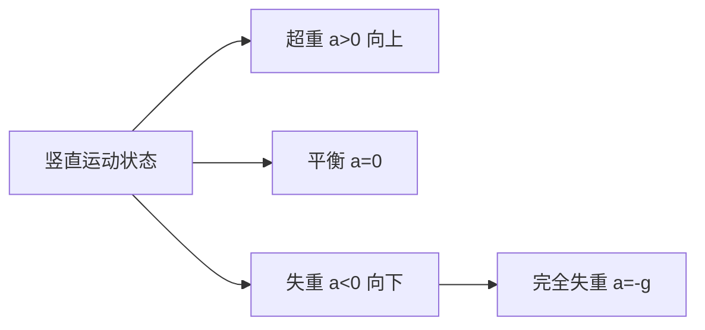

---
tags:
  - Physics
  - 定义性
title: Weightlessness & Overweight
created: 2026-03-27T10:00:00
modified:
---
# Weightlessness & Overweight
> 失重与超重现象的本质是**视重（Apparent Weight）**与**实重（Actual Weight）**的差异，详见[[Dynamic & Friction|动力学与摩擦]]

## 1. 核心概念

### 1.1 实重与视重
**实重（Actual Weight）**：物体所受的重力
$$W = mg$$

**视重（Apparent Weight）**：物体对支持面的压力或对悬挂物的拉力，即**支持力或拉力的大小**

当物体处于平衡状态（$a=0$）时，视重等于实重。但当物体有竖直方向的加速度时，视重与实重不再相等。

### 1.2 视重的计算
根据[[Dynamic & Friction|牛顿第二定律]]，对物体进行受力分析：

$$\sum F_y = ma_y$$

$$F_N - mg = ma$$

因此视重（支持力）为：
$$F_N = m(g + a)$$

其中 $a$ 为**竖直方向的加速度**，向上为正。

## 2. 三种状态

### 2.1 超重（Overweight）
当物体具有**向上的加速度**时：
$$F_N = m(g + a) > mg$$

**视重大于实重**，物体感觉"更重"。

**典型场景：**
- 电梯向上加速启动
- 电梯向下减速停止
- 火箭发射升空
- 过山车在底部冲过最低点

### 2.2 失重（Weightlessness）
当物体具有**向下的加速度**时：
$$F_N = m(g + a) = m(g - |a|) < mg$$

**视重小于实重**，物体感觉"更轻"。

**典型场景：**
- 电梯向下加速启动
- 电梯向上减速停止
- 宇航员在空间站

### 2.3 完全失重（Complete Weightlessness）
当物体向下的加速度等于重力加速度时：
$$a = -g$$

代入视重公式：
$$F_N = m(g + a) = m(g - g) = 0$$

**视重为零**，物体对支持面无压力。

**典型场景：**
- 自由落体运动
- 绕地球运行的卫星/空间站
- 抛体运动（忽略空气阻力）

> **注意**：完全失重并非重力消失，重力 $mg$ 依然存在。物体之所以"漂浮"是因为物体与支持面以相同加速度下落。

## 3. AP Physics 1 常见题型

### 3.1 电梯问题
电梯中站着一个质量为 $m$ 的人，分析不同运动状态下人的视重：

| 运动状态 | 加速度方向 | 视重 $F_N$ | 感受 |
|---------|-----------|-----------|-----|
| 静止/匀速 | 无 ($a=0$) | $mg$ | 正常 |
| 向上加速 | 向上 ($a>0$) | $m(g+a)$ | 超重 |
| 向上减速 | 向下 ($a<0$) | $m(g-a)$ | 失重 |
| 向下加速 | 向下 ($a<0$) | $m(g-a)$ | 失重 |
| 向下减速 | 向上 ($a>0$) | $m(g+a)$ | 超重 |
| 自由下落 | 向下 ($a=g$) | $0$ | 完全失重 |

### 3.2 磅秤读数问题
人站在电梯内的磅秤上，质量为 $m$：
- 磅秤读数显示的是**视重**
- 磅秤对人的支持力 $F_N$ 等于磅秤读数

**例题**：电梯从静止开始以加速度 $a$ 向上加速上升，求磅秤读数。

**解答**：
$$F_N - mg = ma$$
$$F_N = m(g + a)$$

磅秤读数为 $m(g + a)$，表现为超重。

### 3.3 圆周运动中的超重/失重
在竖直平面内的圆周运动中，视重随位置变化：

**在最高点**：
$$mg + F_N = m\frac{v^2}{r}$$
$$F_N = m\frac{v^2}{r} - mg$$

当 $v$ 较小时，$F_N < 0$ 表示需要向下的外力（如座椅安全带）；当 $v = \sqrt{gr}$ 时，$F_N = 0$，完全失重。

**在最低点**：
$$F_N - mg = m\frac{v^2}{r}$$
$$F_N = mg + m\frac{v^2}{r} > mg$$

始终处于超重状态，详见[[Circular Motion Problems|圆周运动问题]]。

## 4. 重要辨析

### 4.1 超重/失重与运动方向无关
**关键在于加速度方向，而非速度方向**

- 电梯向上运动时，可能超重（加速）也可能失重（减速）
- 电梯向下运动时，可能失重（加速）也可能超重（减速）

### 4.2 完全失重≠无重力
空间站中的宇航员处于完全失重状态，但：
- 地球对宇航员的引力依然存在
- 该引力提供向心力，使宇航员绕地球做圆周运动
- 引力大小：$F_g = \frac{GMm}{r^2} = mg'$（$g'$ 为该高度的重力加速度）

## 5. 与其他知识点的联系

- [[Momentum & Impulse|动量与冲量]]：冲击力与视重变化
- [[Energy & Work Problems|功与能量问题]]：自由落体中的能量转化
- [[Gravitation Problems|引力问题]]：卫星中的完全失重
- [[Circular Motion Problems|圆周运动问题]]：过山车的超重失重现象
