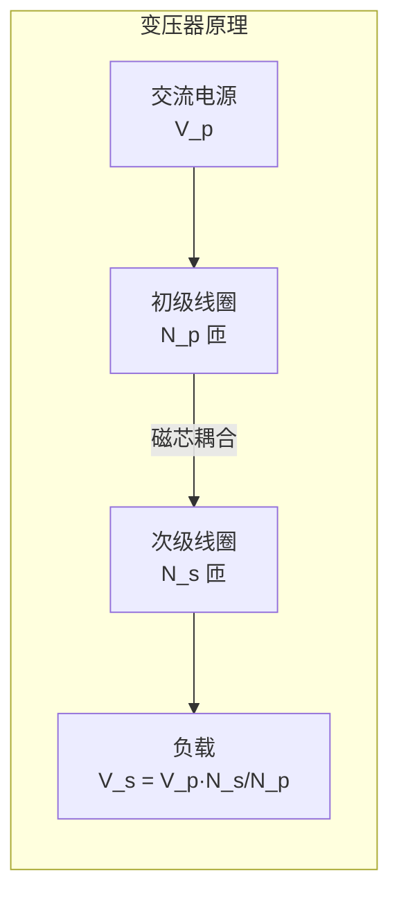

---
tags:
  - Physics
  - 定理性
  - 基本原理
title: Electromagnetic Induction
created: 2026-06-10
modified: 2026-06-10
---

# Electromagnetic Induction

> [!abstract] 电磁感应
> 电磁感应揭示了变化磁场产生电场的现象，是发电机、变压器等众多电气设备的工作原理基础。法拉第定律和楞次定律是电磁感应的核心。

> [!tip] 💡 一句话直觉
> 电磁感应 = **磁变生电**：
> - 如果你让穿过一个线圈的磁通量发生变化，线圈两端就会产生电压（电动势）
> - 磁通变化**越快**，产生的电压**越大**
> - **不动不变，一动就变**——磁铁静止在线圈里没有感应，磁铁一动就有
> - 这是**发电机、变压器、电磁炉、无线充电**的根本原理

## 法拉第定律 (Faraday's Law)

> [!important] 法拉第电磁感应定律
> 闭合回路中感应电动势的大小等于穿过回路的磁通量随时间的变化率：
> $$\mathcal{E} = -\frac{d\Phi_B}{dt}$$
> 
> 其中磁通量 $\Phi_B = \int_S \vec{B} \cdot d\vec{A}$。

> [!question] 🤔 怎么让磁通量变化？有三种方式：
> 1. **磁场变化**（磁铁靠近/远离线圈）
> 2. **面积变化**（线圈在磁场中转动——发电机原理）
> 3. **角度变化**（线圈旋转，改变磁场与线圈的法线夹角）
> 
> 三种方式都可以产生感应电动势！

### 感应电动势的类型

| 类型 | 产生机制 | 数学表达式 |
|-----|---------|-----------|
| **动生电动势** | 导体在磁场中运动 | $\mathcal{E} = Blv$（直导线） |
| **感生电动势** | 磁场随时间变化 | $\mathcal{E} = -\int \frac{\partial \vec{B}}{\partial t} \cdot d\vec{A}$ |

### 积分形式

$$\oint \vec{E} \cdot d\vec{l} = -\frac{d}{dt}\int_S \vec{B} \cdot d\vec{A}$$

### 微分形式

$$\nabla \times \vec{E} = -\frac{\partial \vec{B}}{\partial t}$$

> [!note] 物理含义
> 变化的磁场产生有旋电场（感应电场 $\vec{E}_i$），这一关系不再满足静电场的 $\nabla \times \vec{E} = 0$。

## 楞次定律 (Lenz's Law)

> [!note] 楞次定律
> 感应电流的方向总是**阻碍**引起感应的磁通量变化。
> 
> 法拉第定律中的负号正是楞次定律的数学体现。

> [!tip] 💡 楞次定律的直觉
> 楞次定律 = **电磁学的惯性原理**：
> - 系统不喜欢被改变，感应电流会「反抗」磁通量的变化
> - 磁通增加 → 感应电流产生反向磁场**对抗**增加
> - 磁通减少 → 感应电流产生同向磁场**补偿**减少
> - 这就像你推一扇沉重的门——门越不想动（惯性），你的推力就要越大。负号保证了**能量守恒**：如果没有负号，感应电流会反过来增强变化，导致能量无中生有！

**应用方法**：
1. 确定原磁场 $\vec{B}$ 的方向
2. 判断 $\Phi_B$ 是增加还是减少
3. 感应电流产生的磁场 $\vec{B}_{\text{ind}}$ 方向**对抗**原磁场的变化
4. 用右手定则确定感应电流方向

| 原磁场变化 | 感应磁场方向 | 感应电流方向 |
|-----------|------------|------------|
| $\Phi_B$ 增加 | 与原磁场相反 | 逆时针（从特定视角） |
| $\Phi_B$ 减少 | 与原磁场相同 | 顺时针（从特定视角） |

## 动生电动势 (Motional EMF)

### 直导线在均匀磁场中运动

导体棒以速度 $v$ 垂直于磁场 $B$ 运动：

$$\mathcal{E} = Blv$$

方向由右手定则确定。

**本质**：导体中的自由电子受洛伦兹力 $F = qvB$ 移动，建立平衡后产生稳定的感应电动势。

### 法拉第发电机

转动导体在磁场中产生的电动势：

$$\mathcal{E} = \frac{1}{2}B\omega l^2$$

## 感生电场 (Induced Electric Field)

变化的磁场产生感生电场 $\vec{E}_i$，这是一个**非保守场**（旋度不为零）：

$$\oint \vec{E}_i \cdot d\vec{l} = -\frac{d\Phi_B}{dt}$$

感生电场与静电场的关键区别：

| 性质 | 静电场 $\vec{E}_s$ | 感生电场 $\vec{E}_i$ |
|-----|-------------------|--------------------|
| 源 | 电荷 | 变化磁场 |
| 旋度 | $\nabla \times \vec{E}_s = 0$ | $\nabla \times \vec{E}_i = -\partial\vec{B}/\partial t$ |
| 保守性 | 保守场，可定义标势 | 非保守场 |
| 力线 | 始于正、终于负 | 闭合曲线 |

## 涡电流 (Eddy Current)

- 变化磁场在块状导体中感应出的漩涡状电流
- 产生焦耳热（电磁感应加热原理）
- 产生阻碍运动的磁力（电磁阻尼）
- 变压器铁芯中用叠片结构抑制涡流

## 变压器 (Transformer)

> [!note] 基本原理
> 根据法拉第定律和磁通连续性：
> $$\frac{V_s}{V_p} = \frac{N_s}{N_p}$$
> $$\frac{I_s}{I_p} = \frac{N_p}{N_s}$$
> 
> 理想变压器：$V_p I_p = V_s I_s$（能量守恒）

> [!tip] 💡 变压器直觉
> - **升压** = 次级匝数更多 → 电压升高、电流降低（远距离输电用）
> - **降压** = 次级匝数更少 → 电压降低、电流升高（手机充电器用）
> - 功率不变：$V_p I_p = V_s I_s$——你不能无中生有创造能量
> - 🌍 实际应用：高压输电（升高到 110kV 以上减少 $I^2R$ 损耗）→ 到家前降压到 220V

## 位移电流 (Displacement Current)

> [!important] 麦克斯韦的贡献
> $$I_d = \varepsilon_0 \frac{d\Phi_E}{dt}$$
> 
> 变化的电场也产生磁场，使电磁理论统一。

详见 [[Physics/Electromagnetism/Maxwell's Equations|Maxwell's Equations]]。

## 相关链接

- [[Physics/Electromagnetism/Magnetic Fields|Magnetic Fields]]
- [[Physics/Electromagnetism/Magnetic Forces|Magnetic Forces]]
- [[Physics/Electromagnetism/Inductance|Inductance]]
- [[Physics/Electromagnetism/Maxwell's Equations|Maxwell's Equations]]
- [[Physics/Electromagnetism/Electromagnetism - Home|Electromagnetism - Home]]

## 注意事项

1. 法拉第定律中的**负号**至关重要——它对应楞次定律，体现了能量守恒
2. 感应电动势的方向判断：右手定则（导体切割磁力线）或楞次定律（磁通量变化）
3. 感生电场与静电场的本质区别在于其**非保守性**
4. 位移电流不是真正的电流，但它产生的磁场与传导电流等价
