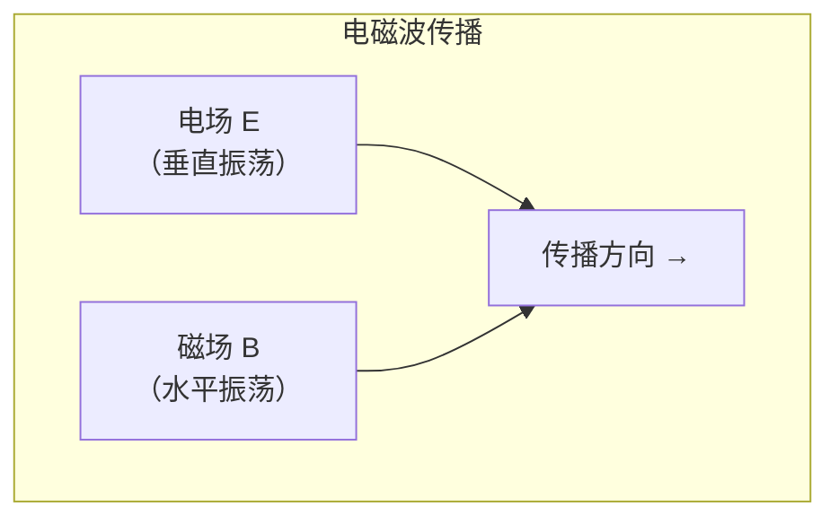
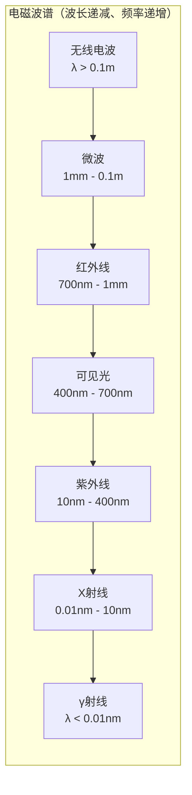

---
tags:
  - Physics
  - 定义性
  - 基本原理
title: Electromagnetic Waves
created: 2026-06-10
modified: 2026-06-10
---

# Electromagnetic Waves

> [!abstract] 电磁波
> 电磁波是电磁场在空间中的波动传播。麦克斯韦方程组预言了电磁波的存在，赫兹通过实验验证。电磁波包括无线电波、微波、红外线、可见光、紫外线、X射线和伽马射线。

## 波动方程的解

### 平面电磁波

真空中，电磁波的最简单形式是平面波解：

$$\vec{E}(x,t) = \vec{E}_0 \cos(kx - \omega t)$$
$$\vec{B}(x,t) = \vec{B}_0 \cos(kx - \omega t)$$

其中：
- $\omega = 2\pi f$ — 角频率
- $k = 2\pi/\lambda$ — 波数
- $\lambda f = c$ — 波长-频率关系

### $\vec{E}$ 和 $\vec{B}$ 的关系

> [!important] 横波特性
> 电磁波是**横波**，$\vec{E}$ 和 $\vec{B}$ 均垂直于传播方向，且 $\vec{E} \perp \vec{B}$：
> $$|\vec{E}| = c|\vec{B}|$$
> $$B_0 = \frac{E_0}{c}$$
> 
> 传播方向为 $\hat{k} = \hat{E} \times \hat{B}$（右手定则）。

## 能量与能流

### 能量密度

电磁波的总能量密度等于电场和磁场能量密度之和：

$$u = u_E + u_B = \frac{1}{2}\varepsilon_0 E^2 + \frac{B^2}{2\mu_0}$$

对于电磁波，$E = cB$，因此两者恰**好相等**：
$$u_E = u_B = \frac{1}{2}u$$

总能量密度：
$$u = \varepsilon_0 E^2 = \frac{B^2}{\mu_0}$$

### 坡印廷矢量 (Poynting Vector)

> [!important] 电磁能流密度
> $$\vec{S} = \frac{1}{\mu_0} \vec{E} \times \vec{B}$$
> 
> $\vec{S}$ 的方向为电磁波的传播方向，大小表示单位时间内通过垂直于传播方向单位面积的能量。

### 强度 (Intensity)

电磁波的平均强度（在一个周期内平均的坡印廷矢量大小）：

$$I = \langle S \rangle = \frac{1}{2}\varepsilon_0 c E_0^2 = \frac{c}{2\mu_0} B_0^2$$

### 球面波的强度衰减

从点源发出的球面波，强度与距离的平方成反比：

$$I \propto \frac{1}{r^2}$$

## 动量与辐射压

### 动量

电磁波携带动量：

$$\vec{p} = \frac{U}{c}\hat{k} \quad \text{（完全吸收）}$$
$$\Delta\vec{p} = \frac{2U}{c}\hat{k} \quad \text{（完全反射）}$$

### 辐射压 (Radiation Pressure)

$$P_{\text{rad}} = \frac{I}{c} \quad \text{（完全吸收）}$$
$$P_{\text{rad}} = \frac{2I}{c} \quad \text{（完全反射）}$$

> [!tip] 应用
> 辐射压虽然极小（太阳光在地球处约 $5\,\mu\text{Pa}$），但对**太阳帆**等深空推进有重要意义。

## 电磁波谱

| 波段 | 波长范围 | 频率范围 | 主要应用 |
|-----|---------|---------|---------|
| 无线电波 | $> 0.1\,\text{m}$ | $< 3\,\text{GHz}$ | 广播、通信、雷达 |
| 微波 | $1\,\text{mm} - 0.1\,\text{m}$ | $3\,\text{GHz} - 300\,\text{GHz}$ | Wi-Fi、微波炉、卫星通信 |
| 红外线 | $700\,\text{nm} - 1\,\text{mm}$ | $300\,\text{GHz} - 430\,\text{THz}$ | 热成像、遥控器 |
| 可见光 | $400\,\text{nm} - 700\,\text{nm}$ | $430\,\text{THz} - 750\,\text{THz}$ | 视觉 |
| 紫外线 | $10\,\text{nm} - 400\,\text{nm}$ | $750\,\text{THz} - 30\,\text{PHz}$ | 消毒、荧光 |
| X 射线 | $0.01\,\text{nm} - 10\,\text{nm}$ | $30\,\text{PHz} - 30\,\text{EHz}$ | 医学成像、晶体分析 |
| γ 射线 | $< 0.01\,\text{nm}$ | $> 30\,\text{EHz}$ | 核医学、天文学 |

## 偏振 (Polarization)

电磁波是**横波**，电场矢量可在垂直于传播方向的平面内取向：

- **线偏振**：电场矢量沿固定方向振动
- **圆偏振**：电场矢量端点描绘出圆形轨迹
- **椭圆偏振**：电场矢量端点描绘出椭圆形轨迹

## 相关链接

- [[Physics/Electromagnetism/Maxwell's Equations|Maxwell's Equations]]
- [[Physics/Electromagnetism/Electromagnetism - Home|Electromagnetism - Home]]
- [[Math/Mathematical_Analysis/Infinite Series|微积分 — 级数与微分方程]]

## 注意事项

1. 电磁波传播**不需要介质**，可在真空中传播——这与机械波本质不同
2. $\vec{E}$ 和 $\vec{B}$ 同相位、同频率，但振幅相差 $c$ 倍
3. 坡印廷矢量 $\vec{S}$ 是瞬时能流密度，工程中常用时间平均值
4. 电磁波的频率决定其性质，波长则随介质变化（$\lambda = \lambda_0/n$）
