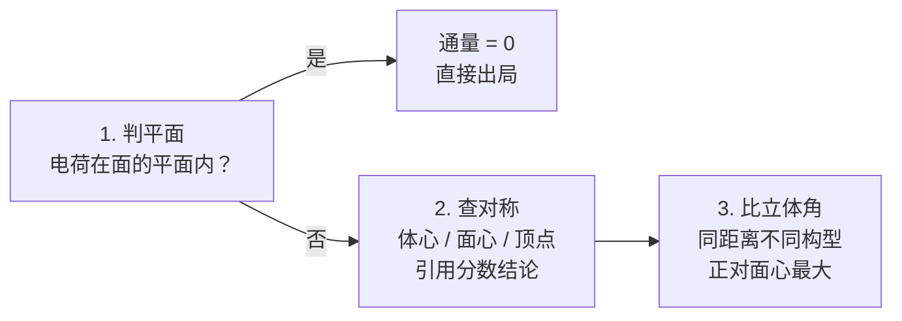

---
tags:
  - Physics
  - Exercise
  - 方法性
title: 09.20 cube face flux ranking
created: 2026-09-20
modified: 2026-09-20
---

# 09.20 cube face flux ranking

> [!abstract] 概述
> 本笔记积累电磁学「电通量」主题难题。第 1 题：立方体内三个等量点电荷，比较各自穿过同一面的电通量大小。核心武器：通量 $=$ 立体角。解题链：看电荷相对面平面的位置，比较立体角，对称性定标，数值验算收尾。与 09.04、09.07 的「连续分布积分」是不同家族——本题不积分，靠几何推理。

## 1. 立方体三电荷穿过同一面的通量排序

> [!question] 题目
> Three small, identical spheres each have the same amount of positive charge distributed uniformly throughout their volumes. Sphere X is at the midpoint of the bottom-left edge of the cube, Sphere Y is at the center of the bottom face, and Sphere Z is at the center of the cube. The front-left face of the cube is labeled Face A. Which of the following correctly ranks the electric flux magnitudes $\Phi_X$, $\Phi_Y$, and $\Phi_Z$ through Face A due to the electric fields of the three spheres?
>
> A. $\Phi_X = \Phi_Y = \Phi_Z$　　B. $\Phi_X > \Phi_Y = \Phi_Z$　　C. $\Phi_Y = \Phi_Z > \Phi_X$　　D. $\Phi_Z > \Phi_Y > \Phi_X$
>
> （AP Physics: E&M 选择题。三球很小，按点电荷处理。）

![[0920_cube_face_flux.png]]

> [!info] 图注
> TikZ 重绘：立方体半透明——面 A 淡蓝玻璃化，底面橙色高亮即 Y 所在平面；隐藏棱与体心轴线用虚线。X 在面 A 底棱中点（在面 A 平面内）；Y 在底面中心（橙色面上）；Z 在体心，正对 Y 上方 $a/2$。

### 物理图像

- 设棱长 $a$，每球带电 $q$。面 A 是前左面。
- 三球与面 A 的位置关系：
  - X 在面 A 的底棱中点——X **在面 A 所在的平面内**
  - Y 在底面中心——到面 A 平面的垂直距离是 $\dfrac{a}{2}$，但高度与面 A 底边平齐
  - Z 在体心——到面 A 平面的垂直距离也是 $\dfrac{a}{2}$，且正对面心
- 通量由「面在电荷处张开的立体角」决定，不是只由距离决定。三球立体角互不相同，排序才能分出三层。

### 核心公式：通量 = 立体角

点电荷 $q$ 穿过任一平面区域的通量：

$$\Phi = \int \vec{E}\cdot\hat{n}\,\mathrm{d}A = \frac{q}{4\pi\varepsilon_0}\,\Omega$$

其中 $\Omega$ 是该区域在电荷处张开的立体角（单位 sr，全空间 $4\pi$）。排序问题归结为比较立体角。

> [!note] 为什么本题不用积分
> 三道球对称电荷在球外激发的场与点电荷相同（球内也只差一个径向 profile，本题球很小按点电荷处理）。场的形式简单，难在几何：面相对电荷怎么摆。立体角就是「几何化的通量」。

### 球 X：通量恰好为零

X 在面 A 所在的平面内。X 的场在平面上每一点都沿径向、躺在平面内，与法线 $\hat{n}$ 处处垂直：

$$\Phi_X = \int \vec{E}\cdot\hat{n}\,\mathrm{d}A = 0$$

等价说法：平面区域对平面内一点张开的立体角为零，$\Omega_X = 0$。

> [!warning] 「在棱上」不是「离面近」
> X 到面 A 的距离是 0，直觉上「最近应该通量最大」。错。电荷一旦进入面的平面，场就不再穿面，通量归零。判断第一问永远是：电荷在不在面的平面内？

### 球 Z：对称最大值

Z 在体心，到面 A 的垂直距离 $\dfrac{a}{2}$，正对面心。对称性把总通量 $q/\varepsilon_0$ 平均分给 6 个面：

$$\Phi_Z = \frac{q}{6\varepsilon_0}, \qquad \Omega_Z = \frac{2\pi}{3} \approx 2.094\ \mathrm{sr}$$

> [!tip] 体心电荷的「每面 $\dfrac{q}{6\varepsilon_0}$」是自由结论
> 点电荷在立方体中心，6 个面全等，每面分 $\dfrac{1}{6}$。这个结论可以直接引用，省掉立体角计算。同族结论：电荷在面中心时，该面 $\dfrac{q}{2\varepsilon_0}$（半球对称）；在体对角线顶点时，三个相邻面各 $\dfrac{q}{4\varepsilon_0}$（象限对称）。

### 球 Y：距离相同，「视角」更差

Y 在底面中心：垂直距离同样是 $\dfrac{a}{2}$，但高度与面 A 底边平齐，不是正对面心。固定垂直距离时，正对面心恰是立体角最大的构型，所以 $\Omega_Y < \Omega_Z$。

矩形区域立体角的显式公式（电荷到平面距离 $d$，矩形两方向半宽 $x_1, x_2$ 与 $y_1, y_2$）：

$$\Omega = \sum_{i,j\in\{1,2\}} (-1)^{i+j}\arctan\frac{x_i y_j}{d\sqrt{d^2+x_i^2+y_j^2}}$$

代入 Y 的位置（$d = \dfrac{a}{2}$，横向半宽 $\dfrac{a}{2}$，纵向从 $0$ 到 $a$，取 $a=1$）：

$$\Omega_Y \approx 1.369\ \mathrm{sr} \;\Rightarrow\; \Phi_Y = \frac{q}{\varepsilon_0}\cdot\frac{1.369}{4\pi} \approx 0.109\,\frac{q}{\varepsilon_0} < \frac{q}{6\varepsilon_0} \approx 0.167\,\frac{q}{\varepsilon_0}$$

即 $\Phi_Y \approx 0.654\,\Phi_Z$。

### 数值自洽性检验

Y 在底面平面内，底面自身通量为零；进入立方体的总通量是 $q/2\varepsilon_0$（一半在底面之下）。用同一公式算其余五个面：

- 四个侧面各 $1.369$ sr（与 $\Omega_Y$ 对称相等）
- 顶面 $0.805$ sr

$$4\times 1.369 + 0.805 = 6.283\ \mathrm{sr} = 2\pi\ \mathrm{sr}\ \checkmark$$

恰好等于 $q/2\varepsilon_0$ 对应的立体角 $2\pi$。数值自洽。

### 答案

$$\Phi_Z > \Phi_Y > \Phi_X \qquad \textbf{选 (D)}$$

> [!warning] 高频错误选项 C
> C（$\Phi_Y = \Phi_Z > \Phi_X$）是本题的陷阱：它正确处理了 X（平面内通量为零），但假设「垂直距离相同则通量相同」。Y 对着面的底边、Z 正对面心，构型不同立体角就不同。**垂直距离相等 $\neq$ 通量相等**。

### 方法模板（通量排序三步）

### 与积分家族对照

| | 积分家族（09.04 / 09.07） | 本题（通量排序） |
|---|---|---|
| 问法 | 求场强 $E$ 的表达式 | 比较通量 $\Phi$ 的大小 |
| 核心武器 | 库仑定律 + 投影 + 积分 | $\Phi = \dfrac{q}{4\pi\varepsilon_0}\Omega$ |
| 关键动作 | 取电荷元、投影因子、换元 | 判平面、用对称、比构型 |
| 对称性角色 | 筛掉抵消分量 | 直接给出分数结论 |
| 检验 | 量纲 + 双极限 | 立体角守恒（$2\pi$ 校验） |

## 相关链接

- [[09.04 problem triangle electric field]] — 同目录姊妹题：细杆中垂线，三角换元详解
- [[09.07 3d field]] — 同目录姊妹题：圆盘轴线，极坐标 + $u$ 换元
- [[Physics/Electromagnetism/Gauss's Law|Gauss's Law]] — 通量的高斯面观点；体心每面 $\dfrac{q}{6\varepsilon_0}$ 的对称性来源
- [[Physics/Electromagnetism/Electric Fields|Electric Fields]] — 点电荷场与叠加原理汇总
- [[Physics/Electromagnetism/Electromagnetism - Home|Electromagnetism - Home]] — 电磁学知识地图

> [!summary] 一句话收束
> 面内电荷通量为零，体心电荷每面 $\dfrac{q}{6\varepsilon_0}$，同距离不同构型比立体角——面心对齐者赢。排序 $\Phi_Z > \Phi_Y > \Phi_X$。
