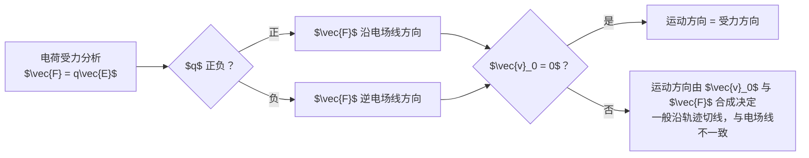

---
tags:
  - Physics
  - Exercise
  - 概念辨析
title: 09.23 field lines vs motion direction
created: 2026-09-23
modified: 2026-09-23
---

# 09.23 电场线方向 vs 运动方向 + 电磁学-力学类比

> [!abstract] 概述
> 本笔记辨析两组易混概念：（1）电场线方向与电荷运动方向的区别；（2）电势高低与机械能守恒中势能-动能转换的类比边界。并建立电磁学与牛顿力学的系统性类比框架，含 6 个对应层面与失效边界。

## 1. 电场线方向 vs 运动方向

> [!question] 核心问题
> 电场线从高电势指向低电势，电荷是否一定沿电场线运动？

### 概念定义对比

| 维度 | 电场线方向 | 运动方向 |
|------|-----------|----------|
| **定义** | 电场线上某点的切线方向 | 电荷轨迹的切线方向 |
| **描述对象** | 电场强度 $\vec{E}$（场的属性） | 速度 $\vec{v}$（电荷的属性） |
| **决定因素** | 仅由场源电荷分布决定 | 由初速度 $\vec{v}_0$ 与合力 $\vec{F}_{\text{net}}$ 共同决定 |
| **独立性** | 与是否放置检验电荷无关 | 依赖检验电荷的 $q$、$m$、$\vec{v}_0$ |

> [!warning] 关键区分
> 电场力 $q\vec{E}$ 只是合力的一部分。运动方向由动力学方程 $m\vec{a} = \vec{F}_{\text{net}}$ 决定，不由场线几何决定。

### 三种典型场景

> [!note] 场景 1：静止释放的正电荷
> 合力 = 电场力，沿电场线方向。加速度与速度始终沿电场线。
> $$\vec{v}_0 = 0,\quad \vec{F} = q\vec{E},\quad \vec{a}\parallel\vec{E}\;\Rightarrow\;\text{运动方向} = \text{电场线方向}$$

> [!note] 场景 2：有初速度的正电荷（类平抛）
> 如垂直射入匀强电场：合力沿电场线，但初速度垂直。轨迹为抛物线。
> $$\vec{v}_0 \perp \vec{E}\;\Rightarrow\;\text{运动方向} \neq \text{电场线方向（仅加速度方向沿电场线）}$$

> [!note] 场景 3：负电荷
> 电场力方向与电场线方向**相反**：$\vec{F} = -|q|\vec{E}$。静止释放的负电荷沿电场线**反方向**运动。

### 电场线方向与运动方向的关系图谱

$$\text{电场线方向} = \text{正电荷受力方向} \;\neq\; \text{电荷运动方向}$$

- **静止正电荷**：一致
- **有初速度正电荷**：一般不一致（曲线运动）
- **负电荷**：反向

## 2. 电势-动能类比：电场线方向 vs 机械能守恒

> [!question] 核心问题
> 「电场线从高电势流向低电势」能否类比「势能高时动能低，势能低时动能高」？

### 类比对照表

| 维度 | 电场线方向（高→低） | 机械能守恒（势能高→动能低） |
|------|---------------------|-----------------------------|
| **描述对象** | 场的**方向**（矢量线） | 同一系统内的**能量分配**（标量关系） |
| **与电荷关系** | 正电荷沿电场线运动；负电荷**逆**电场线运动 | 重力势能只有一种符号，无此分叉 |
| **能量含义** | 电场线本身不是能量流动线 | 势能↔动能是真实的能量形式转换 |

### 能量守恒视角（仅有电场力做功时）

电荷的动能 + 电势能守恒：

$$\Delta K + \Delta U_e = 0$$

| 电荷类型 | 运动方向 | 电势能变化 | 动能变化 | 与电场线方向关系 |
|----------|----------|-----------|----------|------------------|
| 正电荷 | 高电势 → 低电势 | $\downarrow$ | $\uparrow$ | 一致 |
| 负电荷 | 低电势 → 高电势 | $\downarrow$ | $\uparrow$ | 相反 |

> [!warning] 类比失效点
> 电场线方向（高→低）与能量转换方向**只在正电荷时一致**。机械能守恒是标量守恒律，电场线是几何描述——两者不在同一层级。

### 正确类比框架

若坚持用力学类比理解电场中的能量转换：

| 电学量 | 力学对应 |
|--------|----------|
| 电势能 $U_e = qV$ | 重力势能 $U_g = mgh$ |
| 电势 $V$ | 高度 $h$ |
| 正电荷从高电势到低电势 | 物体从高处落向低处 |
| 负电荷从低电势到高电势 | 负压强环境中的「上浮」（非直观） |

## 3. 电磁学与牛顿力学系统性类比

> [!tip] 教学脚手架
> 以下 6 个对应层面是经典的教学方法，用于从力学直觉迁移到电磁学图像。

### 3.1 静力学：库仑力 ↔ 万有引力

$$F_e = k\frac{q_1 q_2}{r^2} \quad\leftrightarrow\quad F_g = G\frac{m_1 m_2}{r^2}$$

| 相似点 | 差异 |
|--------|------|
| 都是平方反比有心力 | 质量恒正（引力只有吸引），电荷有正负（电力可吸引可排斥） |
| 都满足高斯定理 | |
| 都可定义势能 | $U_e = k\dfrac{q_1 q_2}{r}$ 可正可负；$U_g = -G\dfrac{m_1 m_2}{r}$ 恒负 |

### 3.2 场论：电场 ↔ 重力场

| 电学量 | 力学对应 |
|--------|----------|
| 电场强度 $\vec{E}$ | 重力加速度 $\vec{g}$ |
| 电势 $V$ | 重力势 $\phi = gh$ |
| 电场线 | 重力场线（指向地心） |
| 等势面 | 等高线 |

### 3.3 粒子运动：类平抛运动

带电粒子垂直入射匀强电场：

| 方向 | 运动形式 | 动力学方程 |
|------|----------|-----------|
| 垂直电场 | 匀速直线 | $x = v_0 t$ |
| 平行电场 | 匀加速 | $y = \dfrac{1}{2}at^2$，$a = \dfrac{qE}{m}$ |

**完全等同于重力场中的平抛运动**，只需把 $mg$ 换成 $qE$。

### 3.4 圆周运动：洛伦兹力 ↔ 向心力

$$qvB = \frac{mv^2}{r}$$

磁场中带电粒子的匀速圆周运动，形式与力学中向心力方程一模一样。

### 3.5 振动系统：LC 振荡 ↔ 弹簧振子

| 电磁学 | 力学 |
|--------|------|
| 电荷 $q$ | 位移 $x$ |
| 电流 $I = \dot{q}$ | 速度 $v = \dot{x}$ |
| 电感 $L$ | 质量 $m$ |
| $1/C$ | 弹簧系数 $k$ |

运动方程同构：

$$L\ddot{q} + \frac{1}{C}q = 0 \quad\leftrightarrow\quad m\ddot{x} + kx = 0$$

### 3.6 电路：流体类比

| 电路 | 水力学 |
|------|--------|
| 电压 $V$ | 水位差 / 水压 |
| 电流 $I$ | 水流流量 |
| 电阻 $R$ | 管道阻力 |
| 电容 $C$ | 蓄水池（储能） |
| 电感 $L$ | 惯性飞轮（阻碍流量变化） |

## 4. 类比失效边界（避免过度延伸）

> [!warning] 以下电磁现象无力学对应

| 电磁现象 | 为何无力学类比 |
|----------|---------------|
| **磁力不做功** | 洛伦兹力 $\vec{F} = q\vec{v}\times\vec{B}$ 永远垂直于速度，无力学对应 |
| **位移电流** | 变化的电场产生磁场，是纯电磁现象 |
| **电磁波** | 脱离场源传播的波动，无力学对应 |
| **规范不变性** | 电磁学具有力学不具备的 $U(1)$ 规范对称性 |

## 5. 方法模板（电场线-运动方向判据）

## 6. 一句话收束

> [!summary] 收束
> 电场线方向是场的属性（正电荷受力方向），运动方向是电荷的属性（由初速度与合力共同决定）——两者仅在「静止释放的正电荷」时一致。电磁学与力学可通过 6 层面类比迁移直觉，但在磁力、位移电流、电磁波、规范对称性处必须止步。

## 相关链接

- [[09.04 problem triangle electric field]] — 连续电荷分布的场强积分
- [[09.07 3d field]] — 圆盘轴线场的极坐标积分
- [[09.20 cube face flux ranking]] — 电通量与立体角方法
- [[Physics/Electromagnetism/Electric Fields|Electric Fields]] — 点电荷场与叠加原理汇总
- [[Physics/Electromagnetism/Electric Potential|Electric Potential]] — 电势与电势能
- [[Physics/Electromagnetism/Gauss's Law|Gauss's Law]] — 通量的高斯面观点
- [[Physics/Electromagnetism/Electromagnetism - Home|Electromagnetism - Home]] — 电磁学知识地图

