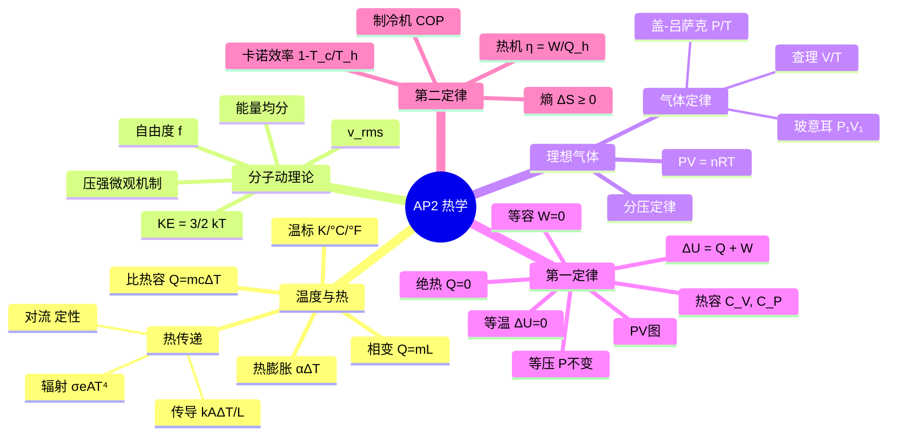

---
tags:
  - Physics
  - 基本原理
  - 定义性
title: AP2 Thermology - Complete Review
created: 2026-06-19
modified: 2026-06-19
---

# 🔥 热学 · Thermology — AP Physics 2 完整复习

## 📌 核心要求

热学是 AP Physics 2 的重要组成部分，占考试约 **15–18%**（Unit 9: Thermodynamics）。涵盖从温度与热传递、气体动理论、理想气体定律到热力学第一、第二定律的全部内容。要求在定性理解热学概念的基础上，能进行定量计算（能量守恒、热机效率、熵变）。

**相关笔记：**
- [[Temperature & Heat]] — 温标、热传递、比热容、相变
- [[Kinetic Molecular Theory]] — 分子动理论、方均根速率
- [[Ideal Gas Law]] — 气体定律、状态方程
- [[First Law of Thermodynamics]] — 内能、功、热力学过程
- [[Second Law of Thermodynamics]] — 熵、热机、卡诺循环

---

## 一、温度与热传递

### 温标

| 温标 | 与开尔文换算 | 物理意义 |
|------|-------------|----------|
| 开尔文 (K) | $T(\text{K}) = T(^\circ\text{C}) + 273.15$ | 绝对温标，比例计算必须使用 |
| 摄氏 (°C) | $T(^\circ\text{C}) = T(\text{K}) - 273.15$ | 日常使用 |
| 华氏 (°F) | $T(^\circ\text{F}) = \frac{9}{5}T(^\circ\text{C}) + 32$ | 仅需了解换算 |

### 热传递

| 方式 | 公式 | 关键参数 |
|------|------|----------|
| 传导 | $P = \dfrac{kA\Delta T}{L}$ | 热导率 $k$ |
| 对流 | $P \propto A\Delta T$（定性） | 流体运动 |
| 辐射 | $P = \sigma e A T^4$ | 发射率 $e$，$\sigma = 5.67 \times 10^{-8} \text{ W/m}^2\text{·K}^4$ |

### 热量计算

- **无相变**：$Q = mc\Delta T$
- **有相变**：$Q = mL$（相变中温度不变）
- **热量守恒**（绝热系统）：$\sum Q = 0$

### 热膨胀

- 线膨胀：$\Delta L = \alpha L_0 \Delta T$
- 体膨胀：$\Delta V = \beta V_0 \Delta T$（$\beta \approx 3\alpha$）

---

## 二、分子动理论

### 核心关系

| 公式 | 含义 |
|------|------|
| $P = \dfrac{1}{3}\dfrac{N}{V}m\overline{v^2}$ | 压强的微观机制 |
| $\overline{K}_{\text{trans}} = \dfrac{3}{2}kT$ | **温度 = 分子平均动能** |
| $v_{\text{rms}} = \sqrt{\dfrac{3kT}{m}} = \sqrt{\dfrac{3RT}{M}}$ | 方均根速率 |

### 能量均分定理

| 分子类型 | 自由度 $f$ | 内能 $U$ | $\gamma = C_P/C_V$ |
|----------|-----------|----------|-------------------|
| 单原子 | 3 | $\frac{3}{2}nRT$ | $\frac{5}{3} \approx 1.67$ |
| 双原子 | 5 | $\frac{5}{2}nRT$ | $\frac{7}{5} = 1.40$ |

> [!tip] AP 默认：除非特别说明，理想气体按单原子处理（$f = 3$）。

---

## 三、理想气体定律

### 宏观定律

| 定律 | 关系 | 不变条件 |
|------|------|----------|
| 玻意耳定律 | $P_1V_1 = P_2V_2$ | $T, n$ |
| 查理定律 | $V_1/T_1 = V_2/T_2$ | $P, n$ |
| 盖-吕萨克定律 | $P_1/T_1 = P_2/T_2$ | $V, n$ |
| 阿伏伽德罗定律 | $V_1/n_1 = V_2/n_2$ | $P, T$ |
| 理想气体定律 | $\boxed{PV = nRT} = NkT$ | — |
| 综合气体定律 | $\boxed{P_1V_1/T_1 = P_2V_2/T_2}$ | $n$ |

### 关键量

- $R = 8.314 \text{ J/(mol·K)}$（SI 制）或 $0.08206 \text{ L·atm/(mol·K)}$
- $k = 1.38 \times 10^{-23} \text{ J/K}$
- $N_A = 6.02 \times 10^{23} \text{ mol}^{-1}$
- STP：$T = 273.15 \text{ K}$，$P = 1 \text{ atm}$，$V_m = 22.4 \text{ L/mol}$

### 衍生公式

$$\rho = \frac{PM}{RT} \qquad P_{\text{total}} = \sum P_i \qquad P_i = x_i P_{\text{total}}$$

---

## 四、热力学第一定律

### 第一定律

$$\boxed{\Delta U = Q + W}$$

- $\Delta U = \frac{f}{2}nR\Delta T$（理想气体，内能只与温度有关）
- $W > 0$：外界对气体做功（压缩）
- $Q > 0$：系统吸热

### 四大热力学过程

| 过程 | 条件 | $\Delta U$ | $W_{\text{on gas}}$ | $Q$ | 方程 |
|------|------|-----------|-------------------|-----|------|
| **等温** | $\Delta T = 0$ | $0$ | $-nRT\ln(V_f/V_i)$ | $-W$ | $PV = \text{常数}$ |
| **绝热** | $Q = 0$ | $W$ | $\Delta U$ | $0$ | $PV^\gamma = \text{常数}$ |
| **等压** | $\Delta P = 0$ | $\frac{f}{2}nR\Delta T$ | $-P\Delta V$ | $nC_P\Delta T$ | $V/T = \text{常数}$ |
| **等容** | $\Delta V = 0$ | $\frac{f}{2}nR\Delta T$ | $0$ | $\Delta U$ | $P/T = \text{常数}$ |

### PV 图

- 过程曲线下的有向面积 = 气体对外做的功（膨胀为正，压缩为负）；外界对气体做功 $W = -$（曲线下面积）
- 顺时针循环 → 对外做正功、$W < 0$（热机）
- 逆时针循环 → 外界对系统做正功、$W > 0$（制冷机）
- 循环过程：$\Delta U = 0$，$Q_{\text{net}} = -W_{\text{net}}$

### 热容关系

$$C_V = \frac{f}{2}R \quad C_P = C_V + R \quad \gamma = \frac{C_P}{C_V} = \frac{f+2}{f}$$

---

## 五、热力学第二定律

### 熵

$$\boxed{\Delta S = \frac{Q_{\text{rev}}}{T}}$$

> [!warning] 对不可逆过程，$\Delta S > Q/T$（克劳修斯不等式），实际熵变需设计可逆路径计算。

**熵的基本性质：**
- 熵是**状态函数**，与过程路径无关
- $\Delta S_{\text{universe}} \geq 0$（第二定律核心）
- 统计解释：$S = k\ln\Omega$

**常见熵变：**

| 过程 | $\Delta S$ |
|------|-----------|
| 等温体积变化 | $nR\ln(V_f/V_i)$ |
| 等压温度变化 | $nC_P\ln(T_f/T_i)$ |
| 等容温度变化 | $nC_V\ln(T_f/T_i)$ |
| 相变 | $mL/T$ |
| 绝热可逆 | $0$ |

### 热机

$$\boxed{\eta = \frac{W}{Q_h} = 1 - \frac{Q_c}{Q_h}} \qquad \boxed{\eta_C = 1 - \frac{T_c}{T_h}}$$

- 卡诺效率是**最大可能效率**
- 卡诺循环：2 个等温 + 2 个绝热过程
- 所有实际效率 $< \eta_C$

### 制冷机

$$\text{COP}_{\text{ref}} = \frac{Q_c}{W} \qquad \text{COP}_{\text{ref, max}} = \frac{T_c}{T_h - T_c}$$

---

## 六、重点公式卡

### 核心公式一览

| 编号 | 公式 | 章节 |
|------|------|------|
| 1 | $Q = mc\Delta T$ | 温度与热量 |
| 2 | $Q = mL$ | 相变 |
| 3 | $P = \sigma e A T^4$ | 辐射 |
| 4 | $P = kA\Delta T / L$ | 传导 |
| 5 | $\overline{K} = \frac{3}{2}kT$ | 分子动理论 |
| 6 | $v_{\text{rms}} = \sqrt{3RT/M}$ | 分子动理论 |
| 7 | $\boxed{PV = nRT}$ | 理想气体 |
| 8 | $\boxed{\Delta U = Q + W}$ | 第一定律 |
| 9 | $\Delta U = \frac{f}{2}nR\Delta T$ | 内能 |
| 10 | $W = -P\Delta V$（等压） | 热力学过程 |
| 11 | $W = -nRT\ln(V_f/V_i)$（等温） | 热力学过程 |
| 12 | $PV^\gamma = \text{常数}$（绝热） | 热力学过程 |
| 13 | $\boxed{\eta = 1 - Q_c/Q_h}$ | 第二定律 |
| 14 | $\boxed{\eta_C = 1 - T_c/T_h}$ | 卡诺效率 |
| 15 | $\Delta S = Q/T$（可逆） | 熵 |
| 16 | $\Delta S_{\text{universe}} \geq 0$ | 第二定律 |

---

## 七、易错点汇总

> [!warning] **AP 考试高频错误**
> 
> 1. **温标错误**：比例计算（气体定律、卡诺效率）使用摄氏而非开尔文 ❌
> 2. **R 值选错**：R = 8.314 vs 0.08206 混用 ❌（解题时要确认单位制）
> 3. **功的符号**：等压膨胀中 $W = -P\Delta V$，符号正负取决于约定
> 4. **等温 vs 绝热**：等温 $\Delta U = 0$，绝热 $Q = 0$，两条线在 PV 图上斜率不同
> 5. **熵是状态量**：可逆与不可逆路径的 $\Delta S_{\text{system}}$ 相同
> 6. **卡诺效率**：$T$ 必须为开尔文，且 $\eta_C$ 是上限而非实际值
> 7. **效率 vs COP**：效率 $<1$，COP 通常 $>1$
> 8. **内能性质**：理想气体内能 $U$ 只与 $T$ 有关，与 $V$ 和 $P$ 无关

---

## 八、关联知识地图

---

## 相关链接

- [[Temperature & Heat]] — 详细温标与热传递
- [[Kinetic Molecular Theory]] — 分子动理论详解
- [[Ideal Gas Law]] — 气体定律详解
- [[First Law of Thermodynamics]] — 第一定律与过程详解
- [[Second Law of Thermodynamics]] — 熵与卡诺循环详解
- [[Fluid Mechanics]] — AP 1 流体力学（相关概念：压强）
