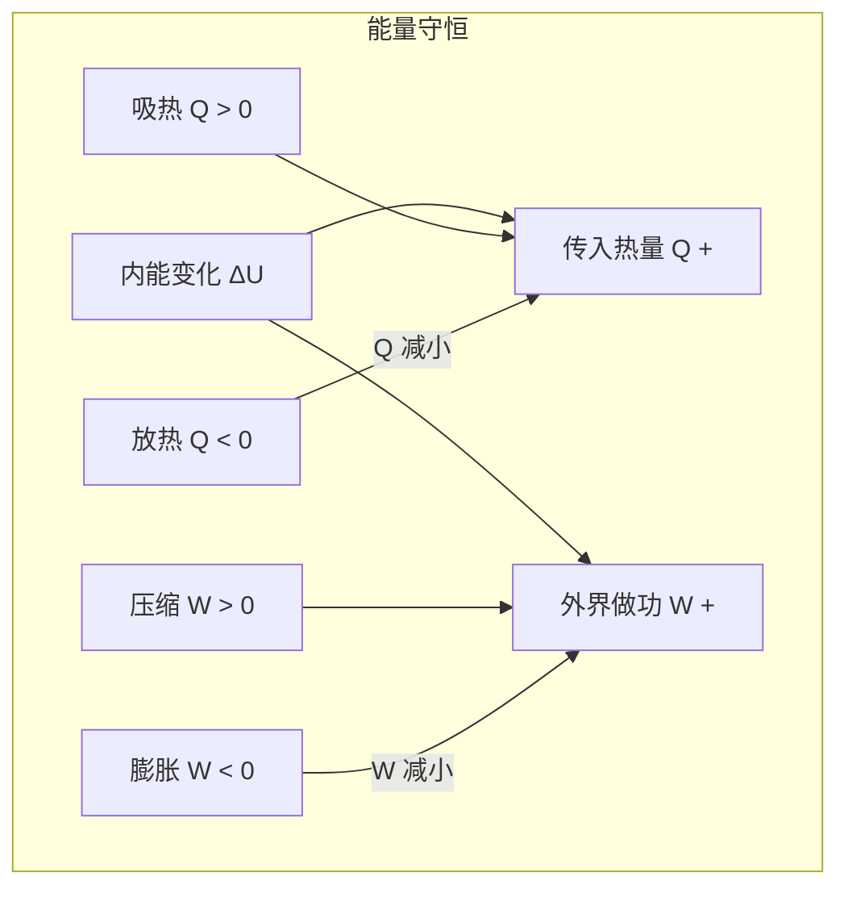
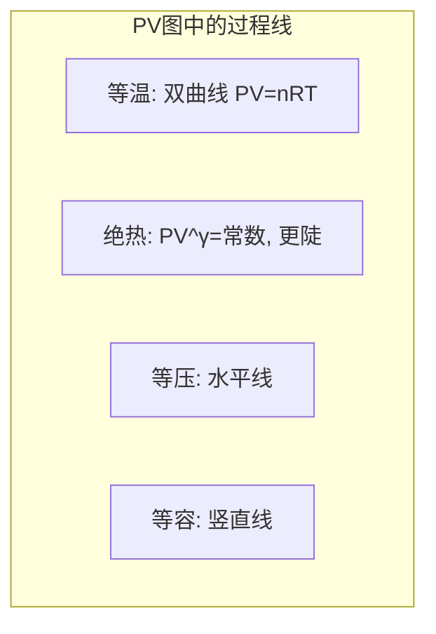

---
tags:
  - Physics
  - 基本原理
  - 定义性
  - 定理性
title: First Law of Thermodynamics
created: 2026-06-19
modified: 2026-06-19
---

# First Law of Thermodynamics

> [!abstract] AP Physics 2 热力学第一定律概述
> 热力学第一定律是能量守恒定律在热学中的具体表述，将热量、功与内能变化联系起来。PV 图是分析热力学过程的直观工具，各种特殊过程（等温、绝热、等压、等容）具有不同的能量交换特征。

---

## 一、热力学第一定律

> [!important] 热力学第一定律
> $$\Delta U = Q + W$$
> 
> 其中：
> - $\Delta U$：系统内能变化
> - $Q$：系统吸收的热量（$Q > 0$ 表示系统吸热）
> - $W$：外界对系统做的功（$W > 0$ 表示外界对系统做功）

> [!warning] 符号约定对照
> AP Physics 2 使用 $\Delta U = Q + W$ 约定：
> - $W > 0$：外界对系统做功（气体被压缩）
> - $W < 0$：系统对外界做功（气体膨胀）
> - $Q > 0$：系统吸收热量
> - $Q < 0$：系统放出热量
>
> 另一种教材使用 $\Delta U = Q - W$（$W$ 为系统对外做功）。AP 考试以 $\Delta U = Q + W$ 为默认约定。

### 第一定律的含义

> [!tip] 直观记忆
> - 加热气体 → $Q > 0$，内能增加
> - 压缩气体 → $W > 0$，内能增加
> - 气体膨胀 → $W < 0$，内能减少
> - 气体放热 → $Q < 0$，内能减少

---

## 二、内能

### 理想气体的内能

> [!important] 理想气体内能
> **内能只与温度有关**，与体积和压强无关。
> 
> 单原子理想气体：
> $$U = \frac{3}{2}nRT$$
> 
> 一般形式（$f$ 为自由度）：
> $$U = \frac{f}{2}nRT$$
> 
> 内能变化：
> $$\Delta U = \frac{f}{2}nR\Delta T$$

> [!important] 核心推论
> - 温度不变 → 内能不变（$\Delta U = 0$）
> - 温度升高 → 内能增加（$\Delta U > 0$）
> - 温度降低 → 内能减少（$\Delta U < 0$）

---

## 三、热力学过程

### 3.1 等温过程 (Isothermal, $\Delta T = 0$)

> [!important] 等温过程
> $$\Delta U = 0 \quad \Rightarrow \quad Q = -W$$
> 
> **气体做的功**（$n$ 不变）：
> $$W_{\text{by gas}} = nRT \ln\left(\frac{V_f}{V_i}\right)$$
> 
> **外界对气体做的功**：
> $$W_{\text{on gas}} = -nRT \ln\left(\frac{V_f}{V_i}\right)$$
> 
> **状态方程**：$PV = \text{常数}$（双曲线）

| 等温膨胀 | 等温压缩 |
|----------|----------|
| $V \uparrow, P \downarrow$ | $V \downarrow, P \uparrow$ |
| $W < 0$（气体对外做功） | $W > 0$（外界对气体做功） |
| $Q > 0$（吸热以维持温度） | $Q < 0$（放热） |

### 3.2 绝热过程 (Adiabatic, $Q = 0$)

> [!important] 绝热过程
> $$Q = 0 \quad \Rightarrow \quad \Delta U = W$$
> 
> **状态方程**：
> $$PV^\gamma = \text{常数}$$
> 
> 其中 $\gamma = \frac{C_P}{C_V} = \frac{f+2}{f}$：
> - 单原子气体：$\gamma = \frac{5}{3} \approx 1.67$
> - 双原子气体：$\gamma = \frac{7}{5} = 1.40$

| 绝热膨胀 | 绝热压缩 |
|----------|----------|
| $W < 0$（气体对外做功） | $W > 0$（外界对气体做功） |
| $\Delta U < 0$（内能减少） | $\Delta U > 0$（内能增加） |
| $T \downarrow$（温度降低） | $T \uparrow$（温度升高） |
| $P \downarrow$（比等温更快） | $P \uparrow$（比等温更快） |

> [!tip] 绝热线比等温线"更陡"
> 在 PV 图上，相同起点下绝热线的斜率大于等温线。

### 3.3 等压过程 (Isobaric, $\Delta P = 0$)

> [!important] 等压过程
> $$W_{\text{on gas}} = -P\Delta V$$
> 
> **热力学第一定律**：
> $$\Delta U = Q - P\Delta V$$
> 
> **吸收的热量**：
> $$Q = nC_P\Delta T$$
> 
> 其中 $C_P$ 为定压摩尔热容。

| 等压膨胀 | 等压压缩 |
|----------|----------|
| $\Delta V > 0$ | $\Delta V < 0$ |
| $W < 0$（气体对外做功） | $W > 0$（外界对气体做功） |
| $Q > 0$（吸热） | $Q < 0$（放热） |

### 3.4 等容过程 (Isochoric/Isovolumetric, $\Delta V = 0$)

> [!important] 等容过程
> $$W = 0 \quad \Rightarrow \quad \Delta U = Q$$
> 
> **吸收的热量**：
> $$Q = nC_V\Delta T = \Delta U$$
> 
> 其中 $C_V$ 为定容摩尔热容。

| 等容升温 | 等容降温 |
|----------|----------|
| $P \uparrow$ | $P \downarrow$ |
| $Q > 0$（吸热） | $Q < 0$（放热） |
| $\Delta U > 0$ | $\Delta U < 0$ |

---

## 四、热容关系

> [!important] 迈耶关系
> $$C_P - C_V = R$$
> 
> **单原子理想气体**：
> $$C_V = \frac{3}{2}R, \quad C_P = \frac{5}{2}R, \quad \gamma = \frac{5}{3}$$
> 
> **双原子理想气体**：
> $$C_V = \frac{5}{2}R, \quad C_P = \frac{7}{2}R, \quad \gamma = \frac{7}{5}$$

---

## 五、四类过程总结

| 过程 | 条件 | $\Delta U$ | $W_{\text{on gas}}$ | $Q$ | 关键关系 |
|------|------|-----------|-------------------|-----|----------|
| **等温** | $\Delta T = 0$ | $0$ | $-nRT\ln(V_f/V_i)$ | $-W$ | $PV = \text{常数}$ |
| **绝热** | $Q = 0$ | $W$ | $\Delta U$ | $0$ | $PV^\gamma = \text{常数}$ |
| **等压** | $\Delta P = 0$ | $\frac{f}{2}nR\Delta T$ | $-P\Delta V$ | $nC_P\Delta T$ | $\frac{V}{T} = \text{常数}$ |
| **等容** | $\Delta V = 0$ | $\frac{f}{2}nR\Delta T$ | $0$ | $\Delta U$ | $\frac{P}{T} = \text{常数}$ |

---

## 六、PV 图

### 基本规则

> [!important] PV 图要点
> - **横轴**：体积 $V$，**纵轴**：压强 $P$
> - **功**：曲线下的面积 = 气体对外的功（$|W_{\text{by gas}}|$）
> - **顺时针循环**：系统对外做正功
> - **逆时针循环**：外界对系统做正功

### PV 图对比（起点相同）

| 过程类型 | PV 图像 | 斜率 |
|----------|---------|------|
| 等压 | 水平直线 | 0 |
| 等容 | 竖直直线 | 无穷大 |
| 等温 | 双曲线 | 缓变 |
| 绝热 | 比等温更陡的双曲线 | 比等温大 |

### 循环过程

> [!note] 循环过程
> 系统经过一系列状态变化后回到初始状态：
> - $\Delta U_{\text{cycle}} = 0$
> - $Q_{\text{net}} = -W_{\text{net}}$（由 $\Delta U = Q + W = 0$ 得）
> - **净功** = PV 图上闭合曲线包围的有向面积
> - 顺时针循环：$W_{\text{net}} < 0$，系统对外输出净功 — 热机
> - 逆时针循环：$W_{\text{net}} > 0$，外界对系统做净功 — 制冷机

> [!tip] 循环功的计算
> $$W_{\text{net}} = \oint P\,dV = \text{闭合曲线包围的面积}$$
> 注意正负号由循环方向决定。

---

## 七、解题策略

### 分步分析法

1. **判断过程类型**：哪个量保持不变（T, P, V, Q）
2. **计算 $\Delta U$**：看温度是否变化，$\Delta U = \frac{f}{2}nR\Delta T$
3. **计算 $W$**：等压用 $W = -P\Delta V$，等容为 0，等温用 $nRT\ln(V_i/V_f)$，PV 图上读面积
4. **应用第一定律**：$\Delta U = Q + W$，求剩余未知量

> [!example] 例题：等压膨胀
> 
> 2.0 mol 单原子理想气体，在恒定压强 $1.0 \times 10^5$ Pa 下从 0.050 m³ 膨胀至 0.080 m³，温度从 300 K 升至 480 K。
> 
> (a) 求外界对气体做的功
> (b) 求内能变化
> (c) 求气体吸收的热量
>
> **解答：**
> (a) $W = -P\Delta V = -1.0 \times 10^5 \times (0.080 - 0.050) = -3000 \text{ J}$
> (b) $\Delta U = \frac{3}{2}nR\Delta T = 1.5 \times 2.0 \times 8.314 \times 180 = 4490 \text{ J}$
> (c) $Q = \Delta U - W = 4490 - (-3000) = 7490 \text{ J}$（或用 $Q = nC_P\Delta T = 2.0 \times \frac{5}{2} \times 8.314 \times 180 = 7483 \text{ J}$）

> [!example] 例题：绝热压缩
> 
> 0.50 mol 单原子理想气体被迅速压缩，外界对气体做功 1500 J。
> 求气体温度的变化。
>
> **解答：**
> 绝热过程 $Q = 0$，所以 $\Delta U = W = +1500 \text{ J}$
> $\Delta U = \frac{3}{2}nR\Delta T$
> $\Delta T = \frac{2\Delta U}{3nR} = \frac{2 \times 1500}{3 \times 0.50 \times 8.314} = \frac{3000}{12.47} \approx 241 \text{ K}$

---

## 八、AP 考试要点

> [!warning] 考试重点
> 1. **第一定律应用**：$\Delta U = Q + W$ 的定性定量分析
> 2. **PV 图解读**：过程识别、功的计算（面积）、内能变化
> 3. **各过程特征**：等温（$\Delta U = 0$）、绝热（$Q = 0$）、等容（$W = 0$）
> 4. **循环过程**：净功 = 闭合面积，$\Delta U = 0$
> 5. **理想气体内能**：$U \propto T$，与过程路径无关

> [!warning] 常见误区
> - 混淆等温与绝热线的相对斜率
> - 循环过程中误认为总功为零（实际上净功不为零，内能变化为零）
> - PV 图中功的正负号判断错误（膨胀 $W < 0$，压缩 $W > 0$）
> - 忘记 $\Delta U$ 是状态量（只与初末温度有关），$Q$、$W$ 是过程量

---

## 九、AP 练习题

> [!note] 选择题 1
> 理想气体从状态 A 等温膨胀到状态 B，以下哪个量一定不变？
> 
> A. 压强 &nbsp;&nbsp; B. 内能 &nbsp;&nbsp; C. 体积 &nbsp;&nbsp; D. 热量
> 
> **答案：B**（等温 $\Rightarrow \Delta T = 0 \Rightarrow \Delta U = 0$）

> [!note] 选择题 2
> 理想气体在绝热压缩过程中：
> 
> A. 温度升高 &nbsp;&nbsp; B. 温度降低 &nbsp;&nbsp; C. 温度不变 &nbsp;&nbsp; D. 吸热
> 
> **答案：A**（$Q = 0$，$W > 0$，$\Delta U > 0$，温度升高）

> [!note] FRQ 练习
> 2.0 mol 单原子理想气体经历如下循环：
> - A → B：等压膨胀（$P_0 = 2.0 \times 10^5$ Pa，$V_A = 0.020$ m³ → $V_B = 0.040$ m³）
> - B → C：等容降压
> - C → A：等温压缩回到初始状态
> 
> (a) 求 A → B 过程中外界对气体做的功。
> (b) 求 A → B 过程中内能的变化。
> (c) 求整个循环的净功。
>
> **解答要点：**
> (a) $W_{AB} = -P\Delta V = -2.0 \times 10^5 \times 0.020 = -4000 \text{ J}$
> (b) $T_A = \frac{PV}{nR} = \frac{2.0\times10^5\times0.020}{2.0\times8.314} \approx 241 \text{ K}$
> $T_B = \frac{P_0 V_B}{nR} = \frac{2.0\times10^5\times0.040}{2.0\times8.314} \approx 481 \text{ K}$
> $\Delta U_{AB} = \frac{3}{2}nR\Delta T = 1.5 \times 2.0 \times 8.314 \times 240 \approx 5986 \text{ J}$
> (c) C → A 等温压缩：$W_{CA} = -nRT_A\ln\left(\frac{V_A}{V_C}\right) = -2.0 \times 8.314 \times 241 \times \ln\left(\frac{0.020}{0.040}\right)$
> $= -4007 \times \ln(0.5) \approx -4007 \times (-0.693) \approx 2777 \text{ J}$（$W>0$ 表示外界对气体做功）
> B → C 等容：$W_{BC} = 0$
> $W_{\text{net}} = -4000 + 0 + 2777 = -1223 \text{ J}$（系统对外做正功 1223 J）

---

## 相关链接

- [[Ideal Gas Law]] — 气体状态方程
- [[Kinetic Molecular Theory]] — 内能的微观解释
- [[Second Law of Thermodynamics]] — 热机效率与卡诺循环
- [[AP2 Thermology - Complete Review]] — 完整总复习
