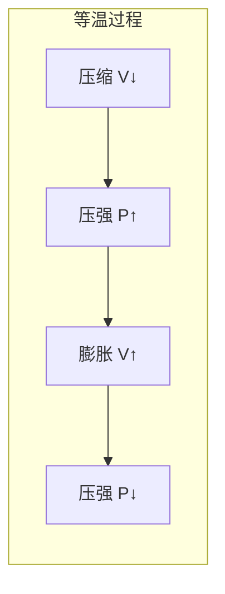
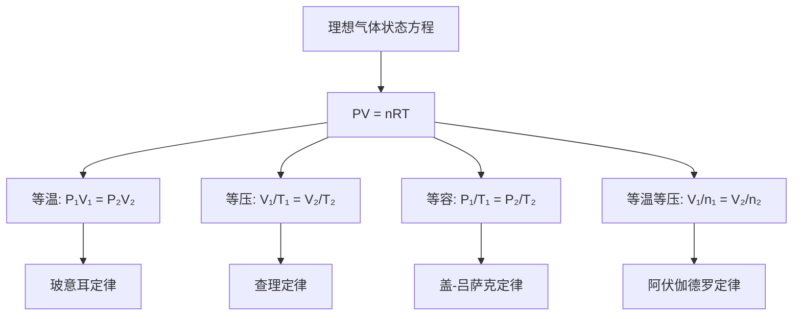

---
tags:
  - Physics
  - 定理性
  - 基本原理
title: Ideal Gas Law
created: 2026-06-19
modified: 2026-06-19
---

# Ideal Gas Law

> [!abstract] AP Physics 2 理想气体定律概述
> 理想气体定律将压强、体积、温度和物质的量联系在一起，是热力学分析的基本工具。本章涵盖各经验气体定律、理想气体状态方程及其应用。

---

## 一、经验气体定律

### 1.1 玻意耳定律 (Boyle's Law)

> [!important] 玻意耳定律
> 温度恒定且气体量不变时，压强与体积成反比：
> $$P_1 V_1 = P_2 V_2$$
> 
> **条件**：$T$ 不变，$n$ 不变

### 1.2 查理定律 (Charles's Law)

> [!important] 查理定律
> 压强恒定且气体量不变时，体积与绝对温度成正比：
> $$\frac{V_1}{T_1} = \frac{V_2}{T_2}$$
> 
> **条件**：$P$ 不变，$n$ 不变

> [!warning] 温度单位必须使用开尔文 (K)！

### 1.3 盖-吕萨克定律 (Gay-Lussac's Law)

> [!important] 盖-吕萨克定律
> 体积恒定且气体量不变时，压强与绝对温度成正比：
> $$\frac{P_1}{T_1} = \frac{P_2}{T_2}$$
> 
> **条件**：$V$ 不变，$n$ 不变

### 1.4 阿伏伽德罗定律 (Avogadro's Law)

> [!important] 阿伏伽德罗定律
> 温度和压强相同时，等体积的气体含有相同数量的分子：
> $$\frac{V_1}{n_1} = \frac{V_2}{n_2}$$
> 
> **条件**：$P$ 不变，$T$ 不变

### 经验定律关系图

---

## 二、理想气体状态方程

> [!important] 理想气体定律
> $$PV = nRT$$
> 
> 分子形式：
> $$PV = NkT$$
> 
> 其中：
> - $P$：压强 (Pa)
> - $V$：体积 (m³)
> - $n$：物质的量 (mol)
> - $N$：分子数
> - $T$：绝对温度 (K)
> - $R = 8.314 \text{ J/(mol·K)}$：普适气体常量
> - $k = 1.38 \times 10^{-23} \text{ J/K}$：玻尔兹曼常数

### 常用 R 值对照

| R 值 | 单位 | 适用场景 |
|------|------|----------|
| $8.314$ | J/(mol·K) | SI 制，能量计算 |
| $0.08206$ | L·atm/(mol·K) | 体积用 L，压强用 atm |
| $62.36$ | L·mmHg/(mol·K) | 医学、真空技术 |

> [!tip] 选对 R 值
> - 计算功或能量用 $R = 8.314$
> - 容器体积用 L、压强用 atm 时用 $R = 0.08206$

---

## 三、标准状况 (STP)

> [!note] 标准温度与压强
> - **标准温度** (STP)：$T = 273.15 \text{ K}$（$0^\circ\text{C}$）
> - **标准压强**：$P = 1 \text{ atm} = 1.013 \times 10^5 \text{ Pa}$
> - **摩尔体积**：$V_m = 22.4 \text{ L/mol}$

**推导：**
$$V = \frac{nRT}{P} = \frac{1 \times 0.08206 \times 273.15}{1} \approx 22.4 \text{ L}$$

---

## 四、气体密度与摩尔质量

> [!important] 密度公式
> 由 $PV = nRT$ 和 $n = m/M$ 可得：
> $$\rho = \frac{m}{V} = \frac{PM}{RT}$$
> 
> 其中 $\rho$ 为密度 (kg/m³)，$M$ 为摩尔质量 (kg/mol)。

> [!example] 例题：求 $27^\circ\text{C}$、$2.0 \text{ atm}$ 下氧气的密度
> 
> $M_{O_2} = 32 \times 10^{-3} \text{ kg/mol}$，$T = 300 \text{ K}$
> 
> $\rho = \frac{PM}{RT} = \frac{2.0 \times 1.013 \times 10^5 \times 0.032}{8.314 \times 300} = \frac{6483.2}{2494.2} \approx 2.60 \text{ kg/m}^3$

---

## 五、道尔顿分压定律

> [!important] 道尔顿分压定律
> 混合气体的总压强等于各组分气体分压强之和：
> $$P_{\text{total}} = P_1 + P_2 + P_3 + \cdots = \sum_i P_i$$
> 
> 其中每种气体的分压等于该气体单独占据整个容器时的压强：
> $$P_i = \frac{n_i RT}{V}$$

> [!tip] 分压与摩尔分数
> $$P_i = \frac{n_i}{n_{\text{total}}} \cdot P_{\text{total}} = x_i P_{\text{total}}$$
> 其中 $x_i = n_i/n_{\text{total}}$ 为组分 $i$ 的摩尔分数。

> [!example] 例题：空气中氮气和氧气的分压
> 
> 空气中 N₂ 约占 78%，O₂ 约占 21%（按体积/摩尔分数）。
> 
> 在 $P_{\text{total}} = 1 \text{ atm}$ 下：
> - $P_{N_2} = 0.78 \times 1 = 0.78 \text{ atm}$
> - $P_{O_2} = 0.21 \times 1 = 0.21 \text{ atm}$

---

## 六、解题策略与技巧

### 方法一：比例法（无需 R）

当气体的量 $n$ 不变时，使用 **综合气体定律**：

> [!important] 综合气体定律
> $$\frac{P_1 V_1}{T_1} = \frac{P_2 V_2}{T_2}$$

**适用场景：** 状态 A → 状态 B 的变化，无需计算 R 值。

### 方法二：直接使用 PV = nRT

**适用场景：** 已知三个量求第四个、求物质的量或气体质量。

### 方法三：分压法

**适用场景：** 混合气体、排水集气法收集气体。

> [!tip] AP 考试建议
> - 选择题优先用比例法（快，无需写 R）
> - FRQ 写出完整的 $PV = nRT$，代入数值并写单位
> - 温度一律转换为开尔文

### 常见题型

| 题型 | 关键思路 | 公式 |
|------|----------|------|
| 状态变化 | $n$ 不变，寻找不变量 | $\frac{P_1V_1}{T_1} = \frac{P_2V_2}{T_2}$ |
| 充气/放气 | $n$ 变化 | $PV = nRT$ 分别计算 |
| 混合气体 | 各组分分压相加 | $P_{\text{total}} = \sum P_i$ |
| 排水集气 | 水蒸气分压修正 | $P_{\text{dry}} = P_{\text{total}} - P_{\text{vapor}}$ |

---

## 七、AP 考试要点

> [!warning] 考试重点
> 1. **理想气体定律**：$PV = nRT$ 的直接应用
> 2. **综合气体定律**：$\frac{P_1V_1}{T_1} = \frac{P_2V_2}{T_2}$（变化类问题）
> 3. **分压计算**：道尔顿定律的应用
> 4. **密度推导**：$\rho = PM/RT$
> 5. **单位选择**：不同 R 值的正确使用

> [!warning] 常见误区
> - 温度忘记转换为开尔文
> - 体积单位没转换为 m³ 或 L（与 R 值匹配）
> - 混淆 atm 和 Pa（$1 \text{ atm} = 1.013 \times 10^5 \text{ Pa}$）
> - 分压计算中忽略水蒸气分压

---

## 八、AP 练习题

> [!note] 选择题 1
> 一个密封容器中的理想气体，初始压强为 2.0 atm，体积为 3.0 L，温度为 300 K。若温度升至 450 K，体积不变，则最终压强为？
> 
> A. 1.33 atm &nbsp;&nbsp; B. 2.0 atm &nbsp;&nbsp; C. 2.67 atm &nbsp;&nbsp; D. 3.0 atm
> 
> **答案：D**
> $\frac{P_1}{T_1} = \frac{P_2}{T_2}$，$P_2 = P_1 \cdot \frac{T_2}{T_1} = 2.0 \times \frac{450}{300} = 3.0 \text{ atm}$

> [!note] 选择题 2
> 某容器中的理想气体压强为 4.0 atm，体积为 2.0 L，温度为 300 K。若保持温度不变，将体积膨胀到 5.0 L，则压强变为？
> 
> A. 1.2 atm &nbsp;&nbsp; B. 1.6 atm &nbsp;&nbsp; C. 2.0 atm &nbsp;&nbsp; D. 10.0 atm
> 
> **答案：B**
> $P_1V_1 = P_2V_2$，$P_2 = \frac{4.0 \times 2.0}{5.0} = 1.6 \text{ atm}$

> [!note] FRQ 练习
> 一个 0.020 m³ 的容器装有 0.50 mol 的理想气体，温度为 350 K。
> 
> (a) 求容器中气体的压强。
> (b) 若保持温度不变，将气体压缩到 0.010 m³，求新的压强。
> (c) 随后保持体积不变，将温度降回 300 K，求最终压强。
>
> **解答要点：**
> (a) $P = \frac{nRT}{V} = \frac{0.50 \times 8.314 \times 350}{0.020} = \frac{1454.95}{0.020} = 7.27 \times 10^4 \text{ Pa}$
> (b) $P_2 = P_1 \frac{V_1}{V_2} = 7.27 \times 10^4 \times \frac{0.020}{0.010} = 1.45 \times 10^5 \text{ Pa}$
> (c) $P_3 = P_2 \frac{T_3}{T_2} = 1.45 \times 10^5 \times \frac{300}{350} = 1.24 \times 10^5 \text{ Pa}$

---

## 相关链接

- [[Kinetic Molecular Theory]] — 气体定律的微观解释
- [[Temperature & Heat]] — 温标与热传递
- [[First Law of Thermodynamics]] — 气体参与的能量过程
- [[AP2 Thermology - Complete Review]] — 完整总复习
