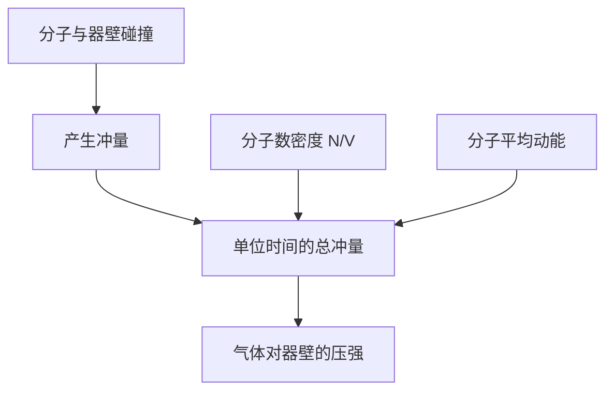
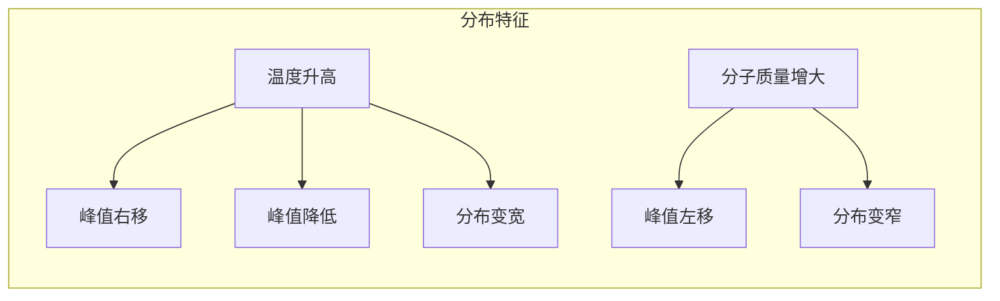

---
tags:
  - Physics
  - 基本原理
  - 定义性
title: Kinetic Molecular Theory
created: 2026-06-19
modified: 2026-06-19
---

# Kinetic Molecular Theory

> [!abstract] AP Physics 2 分子动理论概述
> 分子动理论（Kinetic Molecular Theory, KMT）从微观粒子运动出发解释宏观热力学现象，建立了温度、压强与分子运动的联系，是连接微观与宏观的桥梁。

---

## 一、理想气体的基本假设

> [!note] 理想气体的五条基本假设
> 1. **大量分子**：气体由大量分子组成，分子本身的体积可忽略
> 2. **无相互作用力**：分子之间除碰撞外无相互作用力
> 3. **弹性碰撞**：分子与容器壁以及分子之间的碰撞是完全弹性的
> 4. **随机运动**：分子做连续、无规则的运动，方向随机分布
> 5. **牛顿力学**：分子的运动服从牛顿运动定律

> [!warning] 假设在什么时候失效？
> - 高压下：分子间距减小，分子间作用力和分子体积不再可忽略
> - 低温下：分子动能降低，吸引力影响显著
> - **这些失效条件正是理想气体近似的前提限制**

---

## 二、压强的微观起源

> [!important] 压强公式推导
> $$P = \frac{1}{3} \frac{N}{V} m \overline{v^2}$$
> 
> 或写作：
> $$P = \frac{2}{3} \frac{N}{V} \overline{K}_{\text{trans}}$$
> 
> 其中：
> - $N$：分子总数
> - $V$：体积
> - $m$：单个分子的质量
> - $\overline{v^2}$：分子速度平方的平均值
> - $\overline{K}_{\text{trans}} = \frac{1}{2}m\overline{v^2}$：分子平均平动动能

### 推导要点

**直观理解**：气体压强来源于大量分子对容器壁的微观碰撞的宏观统计效果。压强大小取决于：
- **分子数密度** $N/V$：分子越多，碰撞越频繁
- **分子平均动能**：分子运动越快，每次碰撞冲量越大

---

## 三、温度与分子平均动能

> [!important] 温度—动能关系
> $$\overline{K}_{\text{trans}} = \frac{3}{2} kT$$
> 
> 其中 $k = 1.38 \times 10^{-23} \text{ J/K}$ 为玻尔兹曼常数。
> 
> 用摩尔形式表达：
> $$\overline{K}_{\text{trans}} = \frac{3}{2} \frac{R}{N_A} T$$
> 
> 对于 1 mol 气体，总平动动能：
> $$K_{\text{total}} = N_A \cdot \frac{3}{2}kT = \frac{3}{2}RT$$

> [!important] 核心结论
> **温度是分子平均平动动能的量度**。温度越高，分子平均动能越大。这与温标选择无关——开尔文温度直接正比于分子平均动能。

---

## 四、方均根速率

> [!important] 方均根速率
> $$v_{\text{rms}} = \sqrt{\overline{v^2}} = \sqrt{\frac{3kT}{m}} = \sqrt{\frac{3RT}{M}}$$
> 
> 其中：
> - $m$：单个分子质量 (kg)
> - $M$：摩尔质量 (kg/mol)
> - $R = 8.314 \text{ J/mol·K}$

> [!example] 计算：室温下氧气分子的 $v_{\text{rms}}$
> 
> $M_{O_2} = 32 \times 10^{-3} \text{ kg/mol}$，$T = 300 \text{ K}$
> 
> $v_{\text{rms}} = \sqrt{\frac{3 \times 8.314 \times 300}{0.032}} = \sqrt{233,831} \approx 484 \text{ m/s}$

**三种特征速度对比（定性了解）：**

| 速度类型 | 表达式 | 说明 |
|----------|--------|------|
| 最概然速率 $v_p$ | $\sqrt{2kT/m}$ | 分布峰值处的速度 |
| 平均速率 $\overline{v}$ | $\sqrt{8kT/\pi m}$ | 所有分子速率的算术平均 |
| 方均根速率 $v_{\text{rms}}$ | $\sqrt{3kT/m}$ | 动能计算的直接依据 |

> [!tip] 记忆顺序：$v_p < \overline{v} < v_{\text{rms}}$
> 比例关系：$v_p : \overline{v} : v_{\text{rms}} = 1 : 1.13 : 1.22$

---

## 五、麦克斯韦-玻尔兹曼速率分布

> [!note] 分布特征
> 麦克斯韦-玻尔兹曼分布描述在热平衡下气体分子速率的统计分布。

### 温度对分布的影响

| 性质 | 低温 | 高温 |
|------|------|------|
| 峰值位置 | 较低速 | 较高速 |
| 峰值高度 | 较高 | 较低 |
| 分布宽度 | 较窄 | 较宽 |
| $v_{\text{rms}}$ | 较小 | 较大 |

### 分子质量对分布的影响

| 性质 | 轻分子 (H₂) | 重分子 (O₂) |
|------|-------------|-------------|
| 相同温度下的 $v_{\text{rms}}$ | 较大 | 较小 |
| 分布形状 | 宽而矮 | 窄而高 |

> [!tip] AP 考试常见图像题
> 识别不同温度或不同气体下的分布曲线，判断哪个曲线对应更高温度或更轻气体。

---

## 六、平均自由程（定性了解）

> [!note] 平均自由程
> 分子在两次连续碰撞之间自由运动的平均距离：
> $$\lambda = \frac{1}{\sqrt{2} \pi d^2 (N/V)}$$
> 
> 其中 $d$ 为分子有效直径。

**影响因素：**
- 分子数密度增大 $\rightarrow$ $\lambda$ 减小
- 分子直径增大 $\rightarrow$ $\lambda$ 减小

> [!tip] 常压室温下空气分子平均自由程约 $70 \text{ nm}$，远大于分子直径

---

## 七、自由度与能量均分定理

> [!important] 能量均分定理
> 每个独立的**二次项自由度**平均分配 $\frac{1}{2}kT$ 的能量。

### 各类分子的自由度

| 分子类型 | 平动自由度 | 转动自由度 | 总自由度 $f$ | 示例 |
|----------|-----------|-----------|-------------|------|
| 单原子 | 3 | 0 | **3** | He, Ne, Ar |
| 双原子 | 3 | 2 | **5** | N₂, O₂, H₂ |
| 多原子 | 3 | 3 | **6** | H₂O, CO₂, CH₄ |

> [!note] 振动自由度
> AP Physics 2 中通常不考虑振动自由度（室温下振动自由度未被充分激发）。

### 内能表达式

> [!important] 理想气体的内能
> 单原子分子：
> $$U = \frac{3}{2}nRT = \frac{3}{2}NkT$$
> 
> 双原子分子：
> $$U = \frac{5}{2}nRT$$
> 
> 通式（$f$ 为总自由度）：
> $$U = \frac{f}{2}nRT$$

> [!warning] AP 考试注意
> - 除非特别说明，AP 考试中默认理想气体为**单原子**，$f = 3$
> - 内能只与温度有关（温度不变、内能不变），与体积、压强无关

---

## 八、实际气体与理想气体的偏差

> [!note] 范德瓦尔斯方程（定性了解）
> $$(P + a\frac{n^2}{V^2})(V - nb) = nRT$$
> 
> - $a$ 项：修正分子间吸引力（压强修正）
> - $b$ 项：修正分子本身占据的体积

### 偏差条件

| 条件 | 偏差方向 | 原因 |
|------|----------|------|
| 高压 | 实际 $P$ < 理想 $P$ | 分子间吸引力 |
| 高压 | 实际 $V$ > 理想 $V$ | 分子自身体积 |
| 低温 | 实际 $P$ < 理想 $P$ | 动能不足，吸引力占主导 |

---

## 九、AP 考试要点

> [!warning] 考试重点
> 1. **温度—动能关系**：$\overline{K} = \frac{3}{2}kT$ 的应用
> 2. **方均根速率计算**：$v_{\text{rms}} = \sqrt{3RT/M}$
> 3. **分布曲线分析**：温度和质量对分布形状的影响
> 4. **能量均分定理**：自由度与内能的关系
> 5. **压强微观解释**：从分子碰撞角度理解压强

> [!warning] 常见误区
> - 混淆 $\overline{v^2}$ 与 $(\overline{v})^2$（前者是平方的平均值，后者是平均值的平方）
> - $v_{\text{rms}}$ 中的摩尔质量 $M$ 要用 kg/mol 而非 g/mol
> - 混淆玻尔兹曼常数 $k$ 与普适气体常量 $R$：$R = kN_A$

---

## 十、AP 练习题

> [!note] 选择题 1
> 某理想气体温度从 300 K 升至 900 K，分子方均根速率变为原来的几倍？
> 
> A. $\sqrt{3}$ &nbsp;&nbsp; B. 3 &nbsp;&nbsp; C. 9 &nbsp;&nbsp; D. $\sqrt{2}$
> 
> **答案：A**
> $v_{\text{rms}} \propto \sqrt{T}$，$(900/300)^{1/2} = \sqrt{3}$

> [!note] 选择题 2
> 在相同温度下，氢气（H₂）分子与氧气（O₂）分子的平均平动动能之比为？
> 
> A. 1:1 &nbsp;&nbsp; B. 1:16 &nbsp;&nbsp; C. 16:1 &nbsp;&nbsp; D. 4:1
> 
> **答案：A**
> $\overline{K} = \frac{3}{2}kT$，相同温度下平均平动动能相同，与气体种类无关。

> [!note] FRQ 练习
> 容器中有 0.50 mol 的单原子理想气体，温度为 400 K。
> 
> (a) 求气体分子的总平动动能。
> (b) 求气体的内能。
> (c) 若温度升至 800 K，内能变化多少？
>
> **解答要点：**
> (a) $K_{\text{total}} = \frac{3}{2}nRT = 1.5 \times 0.50 \times 8.314 \times 400 \approx 2494 \text{ J}$
> (b) 单原子理想气体：$U = K_{\text{total}} = \frac{3}{2}nRT \approx 2494 \text{ J}$
> (c) $\Delta U = \frac{3}{2}nR\Delta T = 1.5 \times 0.50 \times 8.314 \times 400 \approx 2494 \text{ J}$

---

## 相关链接

- [[Temperature & Heat]] — 温度的微观内涵
- [[Ideal Gas Law]] — 宏观状态方程
- [[First Law of Thermodynamics]] — 内能与热力学过程
- [[AP2 Thermology - Complete Review]] — 完整总复习
