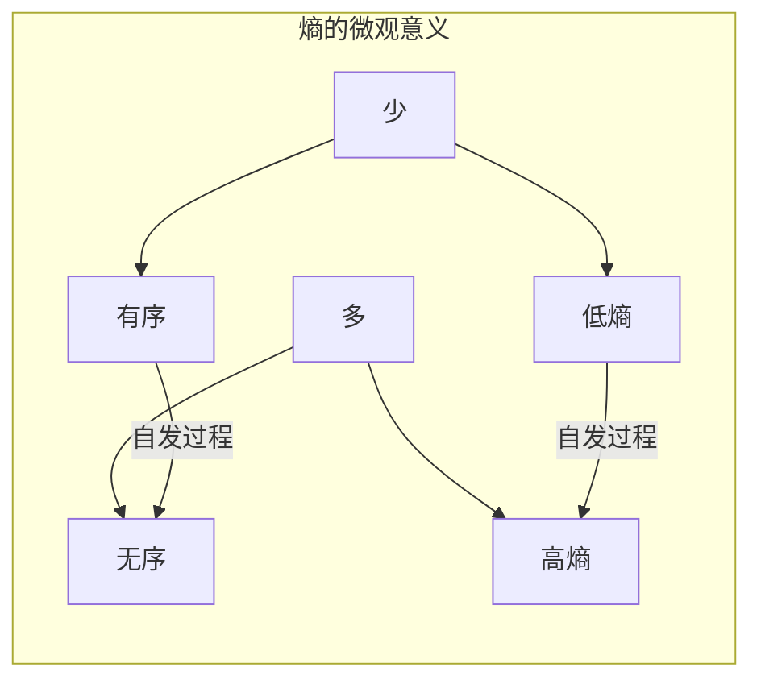
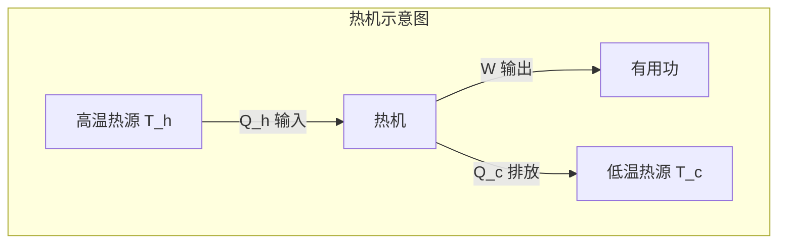
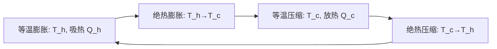
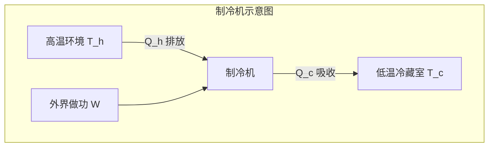

---
tags:
  - Physics
  - 基本原理
  - 定义性
  - 定理性
title: Second Law of Thermodynamics
created: 2026-06-19
modified: 2026-06-19
---

# Second Law of Thermodynamics

> [!abstract] AP Physics 2 热力学第二定律概述
> 热力学第二定律揭示了自然过程的不可逆性方向，引入了熵的概念来量化这种方向性。热机效率和卡诺循环是 AP 考试的核心考点，熵变计算和统计解释是理解的关键。

---

## 一、热力学第二定律的三种表述

### 1.1 克劳修斯表述 (Clausius)

> [!note] 克劳修斯表述
> **热量不能自发地从低温物体传递到高温物体而不产生其他影响。**

通俗理解：热量只能自发地从热到冷。要让热量从冷到热（如冰箱），必须消耗外界功。

### 1.2 开尔文-普朗克表述 (Kelvin-Planck)

> [!note] 开尔文-普朗克表述
> **不可能从单一热源吸收热量使之完全转化为有用功而不产生其他影响。**

通俗理解：热机效率不可能达到 100%。总会有部分热量排放到低温热源。

### 1.3 熵表述

> [!note] 熵表述
> **孤立系统的熵永不减少：**
> $$\Delta S_{\text{universe}} \geq 0$$
> 
> 对于可逆过程：$\Delta S = 0$
> 对于不可逆过程：$\Delta S > 0$

---

## 二、熵 (Entropy)

### 2.1 熵的定义

> [!important] 熵变公式
> 对于**可逆**过程：
> $$\Delta S = \frac{Q}{T}$$
> 
> 其中 $Q$ 为系统吸收的热量，$T$ 为绝对温度。

> [!warning] 熵是状态量
> 熵是**状态函数**，只与系统的初末状态有关，与路径无关。因此即使过程不可逆，也可以设计一条可逆路径计算 $\Delta S$。

### 2.2 常见过程的熵变

| 过程 | 熵变公式 | 说明 |
|------|----------|------|
| 等温可逆体积变化 | $\Delta S = nR\ln(V_f/V_i)$ | 膨胀 $\uparrow S$，压缩 $\downarrow S$ |
| 等压加热 | $\Delta S = nC_P\ln(T_f/T_i)$ | 温度升高，熵增加 |
| 等容加热 | $\Delta S = nC_V\ln(T_f/T_i)$ | 温度升高，熵增加 |
| 相变（熔化/汽化） | $\Delta S = mL/T$ | 相变温度下等温可逆 |
| 绝热可逆过程 | $\Delta S = 0$ | 等熵过程 |

### 2.3 熵的统计解释

> [!note] 玻尔兹曼熵公式
> $$S = k \ln \Omega$$
> 
> 其中 $\Omega$ 为系统可能的微观状态数，$k$ 为玻尔兹曼常数。

**熵的统计含义：**
- 熵是系统无序程度的量度
- 系统总是自发地向微观状态数更多的宏观状态演化
- 平衡态对应 $\Omega$ 最大的状态

> [!tip] 直观理解
> - 气体扩散到更大体积 → 分子位置更散乱 → $\Omega$ 增大 → $S$ 增大
> - 冰熔化为水 → 分子排列更无序 → $\Omega$ 增大 → $S$ 增大

---

## 三、热机 (Heat Engines)

### 3.1 工作原理

> [!note] 热机
> 热机将热量转化为机械功，工作于高温热源和低温热源之间。

**守恒关系：**
$$Q_h = W + Q_c$$
$$W = Q_h - Q_c$$

### 3.2 热机效率

> [!important] 热效率
> $$\eta = \frac{W}{Q_h} = 1 - \frac{Q_c}{Q_h}$$
> 
> 效率始终小于 1（$Q_c > 0$）。

| 效率范围 | 含义 |
|----------|------|
| $\eta = 1$ | 不可能（违反第二定律） |
| $0 < \eta < 1$ | 实际热机 |
| $\eta = 0$ | 不输出功（无意义） |

---

## 四、卡诺循环与卡诺效率

### 4.1 卡诺循环

> [!important] 卡诺循环
> 卡诺循环由**两个等温过程 + 两个绝热过程**组成，是可逆循环，也是效率最高的热机循环。

### 4.2 卡诺效率

> [!important] 卡诺效率
> $$\eta_C = 1 - \frac{T_c}{T_h}$$
> 
> 其中 $T_c$ 和 $T_h$ 必须使用**开尔文温标**。

> [!warning] 卡诺效率的重要特性
> - 卡诺效率是**所有热机在给定 $T_h$ 和 $T_c$ 下的最大可能效率**
> - 所有可逆热机的效率均等于卡诺效率
> - 实际热机的效率总是低于卡诺效率
> - 提高效率的方法：提高 $T_h$ 或降低 $T_c$（提高 $T_h$ 更有效）

> [!example] 例题：核电站热机
> 
> 核电站工作在 $T_h = 600 \text{ K}$ 和 $T_c = 300 \text{ K}$ 之间。
> 
> (a) 最大可能效率是多少？
> (b) 若实际效率为 35%，则实际 $Q_c$ 与 $Q_h$ 之比为多少？
>
> **解答：**
> (a) $\eta_C = 1 - \frac{300}{600} = 0.50 = 50\%$
> (b) $\eta = 1 - \frac{Q_c}{Q_h} \Rightarrow \frac{Q_c}{Q_h} = 1 - 0.35 = 0.65$

---

## 五、制冷机与热泵

### 5.1 制冷机

> [!note] 制冷机
> 制冷机利用外界做功将热量从低温物体传递到高温物体（逆向卡诺循环）。

### 5.2 性能系数 (Coefficient of Performance, COP)

> [!important] 制冷机 COP
> $$\text{COP}_{\text{ref}} = \frac{Q_c}{W} = \frac{Q_c}{Q_h - Q_c}$$
> 
> **理想卡诺制冷机 COP**：
> $$\text{COP}_{\text{ref, max}} = \frac{T_c}{T_h - T_c}$$

> [!important] 热泵 COP
> $$\text{COP}_{\text{hp}} = \frac{Q_h}{W} = \frac{Q_h}{Q_h - Q_c}$$
> 
> **理想卡诺热泵 COP**：
> $$\text{COP}_{\text{hp, max}} = \frac{T_h}{T_h - T_c}$$

> [!tip] COP vs 效率
> - 热机效率：$\eta = W/Q_h$（始终小于 1）
> - 制冷机 COP：$\text{COP}_{\text{ref}} = Q_c/W$（通常大于 1）
> - 热泵 COP：$\text{COP}_{\text{hp}} = Q_h/W$（通常大于 1）

---

## 六、可逆与不可逆过程

| 特征 | 可逆过程 | 不可逆过程 |
|------|----------|------------|
| 恢复原状 | 系统和环境可完全恢复 | 无法完全恢复 |
| 熵变 | $\Delta S_{\text{universe}} = 0$ | $\Delta S_{\text{universe}} > 0$ |
| 进行方向 | 可正反双向进行 | 仅单向自发进行 |
| 实际存在 | 理想化，不存在 | 所有实际过程 |
| 示例 | 准静态无摩擦膨胀 | 自由膨胀、摩擦、扩散 |

**常见不可逆过程：**
- 热量通过有限温差传递
- 气体的自由膨胀
- 摩擦生热
- 扩散混合
- 燃烧反应

---

## 七、熵变计算例题

> [!example] 例题 1：等温膨胀的熵变
> 
> 1.0 mol 理想气体在 300 K 下等温可逆膨胀，体积从 10 L 变为 20 L。求熵变。
>
> **解答：**
> $\Delta S = nR\ln(V_f/V_i) = 1.0 \times 8.314 \times \ln(20/10)$
> $= 8.314 \times \ln 2 \approx 8.314 \times 0.693 = 5.76 \text{ J/K}$

> [!example] 例题 2：热传导的熵变
> 
> 300 K 的物体与 400 K 的热源接触，传递了 1000 J 的热量。求宇宙熵变。
>
> **解答：**
> $\Delta S_{\text{hot}} = -Q/T_h = -1000/400 = -2.5 \text{ J/K}$
> $\Delta S_{\text{cold}} = +Q/T_c = +1000/300 = +3.33 \text{ J/K}$
> $\Delta S_{\text{universe}} = -2.5 + 3.33 = 0.83 \text{ J/K} > 0$ ✓ 不可逆

---

## 八、AP 考试要点

> [!warning] 考试重点
> 1. **卡诺效率计算**：$\eta_C = 1 - T_c/T_h$（温度用开尔文）
> 2. **热机能量守恒**：$Q_h = W + Q_c$
> 3. **熵变计算**：等温膨胀 $\Delta S = nR\ln(V_f/V_i)$
> 4. **第二定律定性分析**：判断过程是否自发、熵增或熵减
> 5. **制冷机 COP**：$\text{COP} = Q_c/W$

> [!warning] 常见误区
> - 卡诺效率计算中忘记将摄氏温度转换为开尔文
> - 混淆热机效率 $\eta = W/Q_h$ 与制冷机 COP = $Q_c/W$
> - 误认为 $\Delta S$ 必须是正数（系统的熵可以减少，但宇宙总熵不减少）
> - 混淆可逆与不可逆过程的熵变特征

---

## 九、AP 练习题

> [!note] 选择题 1
> 卡诺热机工作在 200 K 和 400 K 之间，其最大效率为？
> 
> A. 25% &nbsp;&nbsp; B. 50% &nbsp;&nbsp; C. 75% &nbsp;&nbsp; D. 100%
> 
> **答案：B**
> $\eta = 1 - 200/400 = 0.50 = 50\%$

> [!note] 选择题 2
> 1.0 mol 理想气体在 300 K 下**自由膨胀**到原体积的 2 倍。该过程的熵变是？
> 
> A. 0 &nbsp;&nbsp; B. 5.76 J/K &nbsp;&nbsp; C. -5.76 J/K &nbsp;&nbsp; D. 8.314 J/K
> 
> **答案：B**
> 熵是状态量，自由膨胀和可逆等温膨胀的初末状态相同，熵变相同：$\Delta S = nR\ln 2 = 5.76 \text{ J/K}$。

> [!note] FRQ 练习
> 
> 某热机工作于 500 K 和 300 K 之间，每个循环从高温热源吸收 2000 J 热量。
> 
> (a) 求该热机的最大可能效率。
> (b) 若实际效率为最大效率的 60%，求每个循环的实际输出功。
> (c) 求每个循环排放到低温热源的热量。
> (d) 该实际过程是否可逆？解释原因。
>
> **解答要点：**
> (a) $\eta_C = 1 - 300/500 = 0.40 = 40\%$
> (b) $\eta_{\text{actual}} = 0.60 \times 0.40 = 0.24$，$W = \eta \times Q_h = 0.24 \times 2000 = 480 \text{ J}$
> (c) $Q_c = Q_h - W = 2000 - 480 = 1520 \text{ J}$
> (d) 不可逆。因为实际效率低于卡诺效率，说明有不可逆损失（如摩擦、有限温差传热）。

---

## 相关链接

- [[First Law of Thermodynamics]] — 能量守恒与热力学过程
- [[Ideal Gas Law]] — 气体状态方程
- [[Kinetic Molecular Theory]] — 熵的统计解释
- [[AP2 Thermology - Complete Review]] — 完整总复习
