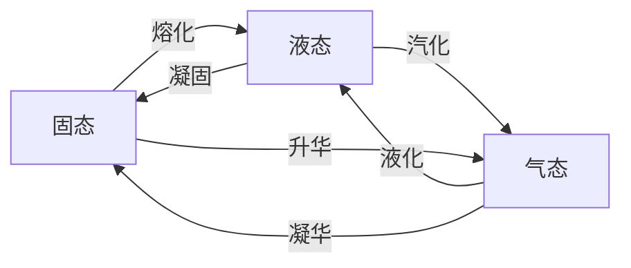
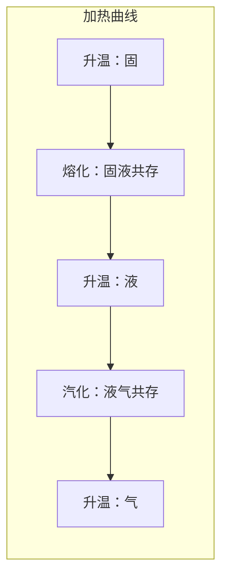

---
tags:
  - Physics
  - 定义性
  - 基本原理
title: Temperature & Heat
created: 2026-06-19
modified: 2026-06-19
---

# Temperature & Heat

> [!abstract] AP Physics 2 温度与热能概述
> 温度与热传递是热力学的基础。本章涵盖温标、热平衡、热量传递机制、比热容、相变潜热与热膨胀，是理解后续气体动理论和热力学定律的前提。

---

## 一、温标与绝对零度

### 知识点

**温度**是物体冷热程度的度量，与微观粒子平均动能直接相关。

#### 三种常见温标

| 温标 | 符号 | 冰点 | 沸点 | 绝对零度 |
|------|------|------|------|----------|
| 摄氏温标 | $^\circ\text{C}$ | $0$ | $100$ | $-273.15$ |
| 华氏温标 | $^\circ\text{F}$ | $32$ | $212$ | $-459.67$ |
| 开尔文温标 | $\text{K}$ | $273.15$ | $373.15$ | $0$ |

#### 温标换算

$$T(\text{K}) = T(^\circ\text{C}) + 273.15$$

$$T(^\circ\text{F}) = \frac{9}{5}T(^\circ\text{C}) + 32$$

$$T(^\circ\text{C}) = \frac{5}{9}[T(^\circ\text{F}) - 32]$$

> [!important] AP 考试关键
> **所有涉及比例关系（如气体定律、卡诺效率）的温度计算，必须使用开尔文温标。**

**绝对零度**（$0 \text{ K} = -273.15^\circ\text{C}$）是理论上可能达到的最低温度，此时粒子动能为零。根据热力学第三定律，绝对零度不可达到。

---

## 二、热平衡与热力学第零定律

> [!note] 热力学第零定律
> 若两个系统分别与第三个系统处于热平衡，则这两个系统彼此也处于热平衡。

**含义：**
- 温度是判断系统是否处于热平衡的物理量
- 温度相同的系统之间无净热量传递
- 第零定律为温度测量提供了理论基础（温度计的原理）

---

## 三、热量与热能的区别

| 概念 | 定义 | 性质 |
|------|------|------|
| **热能** (Thermal Energy) | 系统内部微观粒子无规则运动的动能之和 | 状态量，与系统的温度和质量有关 |
| **热量** (Heat) | 因温度差而传递的能量 | 过程量，传递过程中才有意义 |

> [!tip] 区分记忆
> - 热能是"拥有的"（系统储存的能量形式）
> - 热量是"传递的"（能量转移量）

---

## 四、热传递机制

### 4.1 传导 (Conduction)

> [!important] 傅里叶热传导定律
> $$Q = \frac{k A \Delta T t}{L}$$
> 
> 热传导速率：
> $$P_{\text{cond}} = \frac{Q}{t} = \frac{k A \Delta T}{L}$$
> 
> 其中：
> - $k$：热导率 (W/m·K)，材料固有属性
> - $A$：横截面积
> - $\Delta T$：温差
> - $L$：厚度/长度

**热导率对比：**

| 材料 | $k$ (W/m·K) | 说明 |
|------|-------------|------|
| 银 | 429 | 良导体 |
| 铜 | 401 | 常见导热材料 |
| 铝 | 237 | 轻质导热 |
| 玻璃 | 0.84 | 绝热体 |
| 空气 | 0.026 | 极佳绝热体 |

### 4.2 对流 (Convection)

> [!note] 对流
> 流体（液体或气体）通过宏观流动传递热量的方式。
> - **自然对流**：因温度差引起的密度差驱动
> - **强制对流**：外部驱动（风扇、泵）
> - 计算公式（AP 定性要求）：$P_{\text{conv}} \propto A \cdot \Delta T$

### 4.3 辐射 (Radiation)

> [!important] 斯特藩-玻尔兹曼定律
> $$P = \sigma e A T^4$$
> 
> 物体吸收辐射的功率：
> $$P_{\text{absorb}} = \sigma e A T_{\text{env}}^4$$
> 
> 净辐射功率：
> $$P_{\text{net}} = \sigma e A (T^4 - T_{\text{env}}^4)$$
> 
> 其中：
> - $\sigma = 5.67 \times 10^{-8} \text{ W/m}^2 \cdot \text{K}^4$：斯特藩-玻尔兹曼常数
> - $e$：发射率（黑体 $e=1$，理想反射体 $e=0$）
> - $T$：绝对温度（单位：K）

> [!tip] 理解要点
> - 辐射传递不需要介质
> - 辐射功率与 $T^4$ 成正比——高温时辐射占主导
> - 良好吸收体也是良好辐射体（$e$ 相同）

#### 三种热传递方式对比

| 方式 | 介质需求 | 驱动因素 | AP 计算要求 | 典型例题 |
|------|----------|----------|-------------|----------|
| 传导 | 介质 | 温度梯度 | $P = kA\Delta T/L$ | 双层窗户导热 |
| 对流 | 流体 | 密度差/外力 | 定性分析 | 暖气片对流 |
| 辐射 | 无 | 温度差 | $P = \sigma eAT^4$ | 太阳辐射吸收 |

---

## 五、比热容与量热学

> [!important] 比热容公式
> $$Q = mc\Delta T$$
> 
> 其中：
> - $Q$：吸收或放出的热量 (J)
> - $m$：质量 (kg)
> - $c$：比热容 (J/kg·K)
> - $\Delta T$：温度变化 (K 或 °C，数值相同)

**常见物质的比热容：**

| 物质 | $c$ (J/kg·K) |
|------|-------------|
| 水 | 4186 |
| 冰 | 2090 |
| 铝 | 900 |
| 铜 | 387 |
| 铁 | 448 |
| 玻璃 | 840 |

### 量热学 (Calorimetry)

> [!note] 热量守恒
> 在绝热系统中：
> $$Q_{\text{absorbed}} + Q_{\text{released}} = 0$$
> 或
> $$m_1 c_1 (T_f - T_{1i}) + m_2 c_2 (T_f - T_{2i}) = 0$$

#### 解题步骤

1. 确定系统：识别所有参与热交换的物体
2. 判断能量方向：哪个吸热、哪个放热
3. 列热量方程：$\sum Q = 0$
4. 解出未知量

> [!example] 例题：一杯 0.30 kg、温度 25°C 的水中加入 0.10 kg、温度 80°C 的铜块，求最终平衡温度（忽略杯子的热容）。
> 
> 解：$m_w c_w (T_f - 25) + m_{Cu} c_{Cu} (T_f - 80) = 0$
> 
> $0.30 \times 4186 \times (T_f - 25) + 0.10 \times 387 \times (T_f - 80) = 0$
> 
> $1255.8(T_f - 25) + 38.7(T_f - 80) = 0$
> 
> $1255.8T_f - 31395 + 38.7T_f - 3096 = 0$
> 
> $1294.5T_f = 34491$
> 
> $T_f \approx 26.6^\circ\text{C}$

---

## 六、相变与潜热

> [!important] 潜热公式
> $$Q = mL$$
> 
> 其中：
> - $L$：潜热 (J/kg)，单位质量物质发生相变吸收或放出的热量
> - $L_f$：熔化潜热 (fusion)
> - $L_v$：汽化潜热 (vaporization)

**常见潜热值：**

| 物质 | $L_f$ (J/kg) | $L_v$ (J/kg) |
|------|-------------|-------------|
| 水 | $3.33 \times 10^5$ | $2.26 \times 10^6$ |
| 铜 | $2.07 \times 10^5$ | $5.07 \times 10^6$ |

### 相变过程

> [!warning] 相变的关键特征
> - 相变过程中温度**保持不变**
> - 所有能量用于改变分子间结合状态
> - 相变后的继续加热才使温度再次上升

### 加热曲线

> [!important] 温度 vs 热量图解读
> 加热曲线中的**平台期**对应相变过程：
> - 斜率 = $1/(mc)$，比热容越大升温越慢
> - 平台长度 = $mL$，潜热越大平台越长
> - 水的比热容大、潜热大，是优良的储热介质

### 多阶段热量计算

> [!note] 从 -10°C 冰到 120°C 水蒸气的总热量
> $$Q_{\text{total}} = m c_{\text{ice}} \Delta T_{\text{ice}} + m L_f + m c_{\text{water}} \Delta T_{\text{water}} + m L_v + m c_{\text{steam}} \Delta T_{\text{steam}}$$

---

## 七、热膨胀

### 线膨胀

> [!important] 线膨胀公式
> $$\Delta L = \alpha L_0 \Delta T$$
> 
> 最终长度：
> $$L = L_0 (1 + \alpha \Delta T)$$
> 
> 其中 $\alpha$ 为线膨胀系数 (1/K 或 1/°C)

### 体膨胀

> [!important] 体膨胀公式
> $$\Delta V = \beta V_0 \Delta T$$
> 
> 最终体积：
> $$V = V_0 (1 + \beta \Delta T)$$
> 
> 对于各向同性材料：$\beta = 3\alpha$

**常见膨胀系数：**

| 材料 | $\alpha$ ($\times 10^{-6}$ /K) |
|------|-------------------------------|
| 铝 | 23 |
| 铜 | 17 |
| 铁 | 11 |
| 玻璃 | 9 |
| 因瓦合金 | 0.5 |

> [!tip] 双金属片
> 两种不同膨胀系数的金属片贴合在一起，温度变化时因膨胀量不同产生弯曲，用于温度计和恒温器。

> [!warning] AP 考试注意
> - 水的反常膨胀：$0^\circ\text{C}$ 到 $4^\circ\text{C}$ 之间，水加热时反而收缩（密度最大在 $4^\circ\text{C}$）
> - 中空物体的热膨胀如同实心——孔洞也随温度升高而扩大

---

## 八、AP 考试要点

> [!warning] 考试重点
> 1. **热量计算**：$Q = mc\Delta T$ 与 $Q = mL$ 的综合应用（多阶段问题）
> 2. **热传递机制**：传导的 $P = kA\Delta T/L$ 计算 + 辐射的 $P = \sigma e A T^4$
> 3. **量热学守恒**：$\sum Q = 0$ 的列方程和解方程
> 4. **加热曲线解读**：识别各阶段、计算各部分热量
> 5. **热膨胀**：$\Delta L = \alpha L_0 \Delta T$ 的简单计算
> 6. **温标换算**：向开尔文的转换

> [!warning] 常见误区
> - 在比例计算中使用摄氏温度（必须用开尔文温标）
> - 混淆热量 $Q$ 与热传递速率 $P$
> - 相变计算中漏掉潜热步骤
> - 比热容和潜热的单位弄混
> - $T^4$ 辐射计算中温度使用摄氏而非开尔文

---

## 九、AP 练习题

> [!note] 选择题 1
> 一块 2.0 kg 的铝块（$c = 900 \text{ J/kg·K}$）温度从 20°C 升高到 80°C，吸收了多少热量？
> 
> A. 54,000 J &nbsp;&nbsp; B. 108,000 J &nbsp;&nbsp; C. 144,000 J &nbsp;&nbsp; D. 162,000 J
> 
> **答案：B**
> $Q = mc\Delta T = 2.0 \times 900 \times 60 = 108,000 \text{ J}$

> [!note] 选择题 2
> 一个黑体辐射体（$e = 1$）温度从 300 K 升到 600 K，辐射功率变为原来的多少倍？
> 
> A. 2 &nbsp;&nbsp; B. 4 &nbsp;&nbsp; C. 8 &nbsp;&nbsp; D. 16
> 
> **答案：D**
> $P \propto T^4$，$(600/300)^4 = 2^4 = 16$

> [!note] FRQ 练习
> 一个 0.50 kg 的铜块（$c = 387 \text{ J/kg·K}$，$T = 200^\circ\text{C}$）放入一个盛有 1.0 kg 水（$c = 4186 \text{ J/kg·K}$，$T = 20^\circ\text{C}$）的绝热容器中。容器本身的热容可忽略。
> 
> (a) 求最终平衡温度。
> (b) 如果铜块换成质量相同的铝块（$c = 900 \text{ J/kg·K}$），平衡温度会更高还是更低？解释原因。
>
> **解答要点：**
> (a) $m_{Cu}c_{Cu}(T_f - 200) + m_w c_w (T_f - 20) = 0$
> $0.50 \times 387 \times (T_f - 200) + 1.0 \times 4186 \times (T_f - 20) = 0$
> $193.5 T_f - 38700 + 4186 T_f - 83720 = 0$
> $4379.5 T_f = 122420$
> $T_f \approx 27.9^\circ\text{C}$
>
> (b) 铝比热容更大，$c_{Al} = 900 > 387 = c_{Cu}$，所以铝块释放更多热量，平衡温度会更高。

---

## 相关链接

- [[Kinetic Molecular Theory]] — 温度与分子动能的微观联系
- [[Ideal Gas Law]] — 气体的状态方程
- [[First Law of Thermodynamics]] — 能量守恒在热学中的应用
- [[AP2 Thermology - Complete Review]] — 完整总复习
