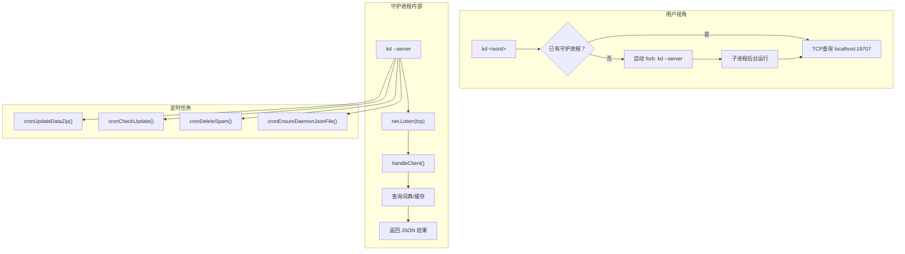
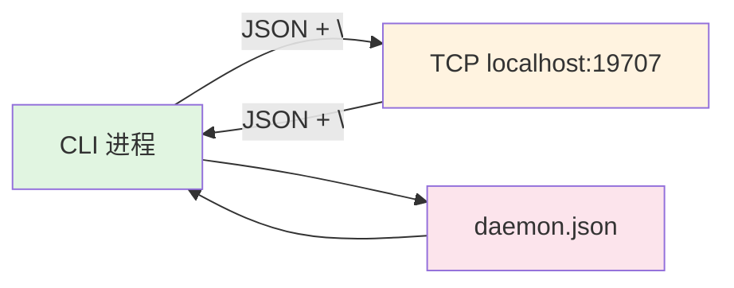

---
tags:
  - OperatingSystems
  - 定义性
  - 基本原理
title: "Process Programming - Daemon and Fork"
created: 2026-05-29
modified: 2026-05-29
---

# Process Programming - Daemon and Fork

> [!abstract] 守护进程（Daemon）与 fork 模式是系统编程中管理后台服务的基础架构
> 守护进程是运行在后台、不直接受终端控制的长生命周期进程。Self-daemonizing 模式允许**同一二进制**既作为客户端又作为服务器，通过 fork 子进程并传入 `--server` 标志实现角色分离。

## 1. 基本概念

### 1.1 进程 vs 线程

| 维度 | 进程 | 线程 |
|---|---|---|
| 资源拥有 | 独立地址空间 | 共享地址空间 |
| 创建开销 | 大（fork + exec） | 小 |
| 隔离性 | 高（一个崩溃不影响其他） | 低 |
| 通信方式 | IPC（管道/TCP/信号等） | 共享内存 |
| 调度单位 | 进程 | 线程通常是调度单位 |

### 1.2 守护进程（Daemon）

> [!note] 定义
> 守护进程是**后台运行、不与任何终端关联**的进程。典型特征：
> - 父进程通常是 init（PID 1）
> - 没有控制终端（`/dev/tty` 不可访问）
> - 工作目录通常是 `/`
> - 标准做法：fork → 父进程退出 → 子进程调用 `setsid()` 创建新会话

OS 级别的 daemon 创建步骤（经典 double-fork 模式）：

1. fork() → 父进程退出（确保子进程不是组长）
2. setsid() → 子进程创建新会话，脱离控制终端
3. 可选：再次 fork → 确保不是会话组长
4. chdir("/") → 避免占用挂载点
5. umask(0) → 放开文件权限掩码
6. close(stdin/stdout/stderr) → 切断终端

## 2. Self-Daemonizing 模式

> 这是 kd 和部分现代工具使用的架构：**单二进制自守护**。

### 2.1 架构示意



### 2.2 实现要点（以 kd 为例）

**启动** (`--daemon` 标志)：
```
flagDaemon()
  → 检查是否已有 daemon 运行（用 gopsutil 扫描进程列表）
  → 若无，通过 exec.Command(kdpath, "--server") fork 子进程
  → cmd.Start() 非阻塞启动
  → 轮询 3 次（每次 sleep 1s）确认子进程启动
  → 父进程退出
```

**服务端** (`--server` 标志，`Hidden: true`)：
```
flagServer() → StartServer()
  → net.Listen("tcp", "localhost:19707")
  → 写入 daemon.json（包含 PID、端口、版本等信息）
  → 启动定时任务（词库更新/版本检查/清理）
  → for { Accept() → go handleClient(conn) }
```

### 2.3 进程发现策略

守护进程需要能被"找到"。常用方法：

| 方法 | 实现 | 优点 | 缺点 |
|---|---|---|---|
| PID文件 | 写入 /var/run/daemon.pid | 简单 | PID 可能被重用 |
| 进程列表扫描 | gopsutil 遍历 /proc | 可靠 | 性能开销 |
| Lock文件 | flock() 锁文件 | 防重复启动 | 不提供位置信息 |
| Unix Socket | 抽象 sock 路径 | 隐式发现 | Linux only |

kd 的策略：
1. **PID 优先**：读 daemon.json → 匹配 PID + cmdline 含 `--server` → 直接返回
2. **全量扫描**：若 PID 不匹配，遍历所有进程，匹配 name="kd" + cmdline 含 " --server"

### 2.4 进程间通信（IPC）



**通信协议**（自定义 TCP JSON 协议，\n 定界）：

```go
// 请求
type TCPQuery struct {
    Action string      // "query"
    B      *BaseResult // { Query, IsLongText }
}
// 响应
type DaemonResponse struct {
    R     *Result      // 查询结果
    Error string       // 错误信息
    Base  *BaseResult  // 回显
}
```

**序列化**：`json.Marshal + "\n"` → `bufio.ReadBytes('\n')`

**优点**：简单直接
**缺点**：无流控、无版本校验、难以调试

## 3. 常见问题与陷阱

> [!warning] 关键 Bug 模式

### 3.1 竞态条件（Race Condition）

**问题**：daemon.json 异步写入，如果 CLI 在文件写完前查询，会找不到 daemon。

**kd 的实际代码**：
```go
// server.go — 异步写，不阻塞
go func() {
    run.Info.SaveToFile("daemon.json")
}()
```

- fork 后用 3 × 1s 轮询进程列表 → 确认进程**存在**但不确认它**就绪**
- 若 daemon.json 在进程启动后 2s 才写入 → 窗口期内的请求失败

### 3.2 孤儿进程（Orphan Process）

父进程（`--daemon`）退出后，子进程（`--server`）的父 PID 变成 1（init）。这是 **有意的设计**——子进程脱离父进程成为独立守护进程。但如果父进程异常退出而不处理子进程，子进程仍正常运行（只是变成孤儿）。

### 3.3 僵尸进程（Zombie Process）

子进程退出但父进程没有调用 `wait()` 回收其退出状态。kd 使用非阻塞 fork，如果子进程意外退出而父进程未 `wait`，短时会出现僵尸进程。操作系统最终会由 init 回收，但频繁产生会耗尽进程表。

### 3.4 端口冲突

**问题**：两次启动 daemon，第二个应检测到端口被占用并拒绝。

kd 的检测：
```go
pkg.IsPortOpen(19707) // 尝试 listen 确认端口可用
```

### 3.5 暴力退出

**问题**：下载新词库后，kd 直接调用 `os.Exit(0)`，没有优雅关闭。

```go
// cron.go 中更新完词库后
os.Exit(0) // 无 graceful shutdown
```

正确的做法应该是：
1. 暂停接受新连接
2. 等待正在进行的请求完成（带有超时）
3. 关闭文件句柄和数据库连接
4. 再退出或用 SIGHUP 热重启

## 4. 不同 IPC 方式对比

| 方式 | 延迟 | 处理能力 | 跨平台 | 调试难度 |
|---|---|---|---|---|
| **TCP** | 中（socket 开销） | 高（多连接） | 全平台 | 中（tcpdump）|
| **Unix Domain Socket** | 低（内核内传） | 高 | POSIX | 低（curl）|
| **共享内存** | 极低 | 极高 | POSIX | 高 |
| **命名管道** | 低 | 单向 | POSIX | 中 |
| **HTTP（REST）** | 中 | 高 | 全平台 | **低（浏览器/curl）** |

**推荐**：对于类似词典工具的守护进程，Unix Domain Socket + HTTP 是最佳组合——`/var/run/kd.sock`，用 HTTP 而非自定义 TCP 协议，方便调试和扩展。

## 5. 替代架构对比

| 架构 | 代表 | 优点 | 缺点 |
|---|---|---|---|
| **Self-daemonizing**（双进程）| kd | 单二进制；CLI 极轻 | 进程管理复杂；竞态多 |
| **持久化服务器 + CLI 客户端** | docker | 清晰分离；独立发布 | 两个二进制/包 |
| **独立进程单次查询** | ondict, sdcv | 最简单；无需 IPC | 每次重新加载数据慢 |
| **HTTP 服务器 + 多前端** | ondict (-serve) | 统一 API；Web/Mobile/CLI 共用 | 二进制体积大 |
| **插件/库模式** | translate-shell | 被集成到编辑器 | 有语言绑定依赖 |

## 6. 守护进程的最佳实践

> [!tip] 设计 Checklist

1. **进程发现**：优先用 Unix Domain Socket（隐式发现），次选 PID 文件
2. **通信协议**：优先 HTTP API，而不是自定义 TCP 协议
3. **优雅关闭**：监听 `SIGTERM`/`SIGINT`，执行清理后退出
4. **健康检查**：提供 `/health` 端接口（HTTP 模式）或可配置的心跳
5. **日志集中**：所有日志带时间戳写入固定位置（非 /tmp）
6. **资源限制**：SQLite 连接池大小、最大并发请求数
7. **重启策略**：崩溃后自动重启（systemd、supervisor 或自重启）
8. **配置热重载**：监听 SIGHUP 或文件变更，无需重启

## 相关链接

- [[Rust vs C++ - Dictionary Client Implementation|Rust vs C++ - 词典客户端实现]]
