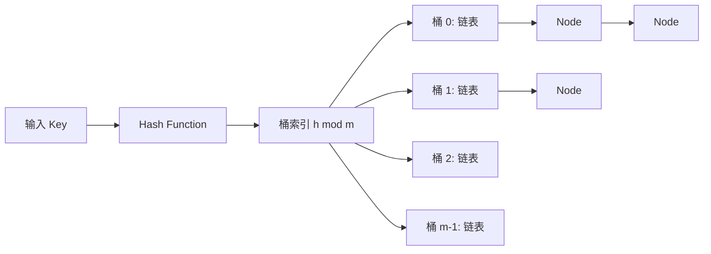

# Hash Table - Separate Chaining

> [!abstract] 哈希表 + 桶内挂链表
> 哈希表通过哈希函数将键映射到桶数组下标，实现期望 $O(1)$ 的查找、插入、删除。**分离链接法（Separate Chaining）** 是处理碰撞的经典策略：桶内挂链表，碰撞元素追加到链表末尾。C++ 标准库 `std::unordered_map` 和 `std::unordered_set` 底层采用此方案。

## 1. 整体架构



三要素：

| 组件 | 职责 | 关键性质 |
|:-----|:-----|:---------|
| **桶数组** | 固定长度的数组，每个位置挂一条链表 | 大小 $m$，索引范围 $[0, m)$ |
| **哈希函数** | 将任意键转换为桶索引 | 确定性、均匀性、雪崩效应 |
| **链表** | 存放同一桶内所有碰撞元素 | 长度期望 $= \alpha$（负载因子） |

## 2. 操作流程

### 2.1 插入

```cpp
// 伪代码
void insert(K key, V value) {
    size_t idx = hash(key) % buckets.size();  // 定位桶
    for (auto& [k, v] : buckets[idx]) {        // 遍历链表查重
        if (k == key) { v = value; return; }    // 已存在则更新
    }
    buckets[idx].push_back({key, value});       // 追加到链表尾
}
```

### 2.2 查找

```cpp
// 伪代码
optional<V> find(K key) {
    size_t idx = hash(key) % buckets.size();
    for (auto& [k, v] : buckets[idx]) {
        if (k == key) return v;                 // 命中
    }
    return nullopt;                             // 未找到
}
```

### 2.3 删除

```cpp
// 伪代码
bool remove(K key) {
    size_t idx = hash(key) % buckets.size();
    auto& list = buckets[idx];
    for (auto it = list.begin(); it != list.end(); ++it) {
        if (it->first == key) { list.erase(it); return true; }
    }
    return false;
}
```

## 3. 自定义 C++ 实现

### 3.1 完整代码

```cpp
#include <iostream>
#include <vector>
#include <list>
#include <optional>
#include <functional>
#include <string>

template <typename K, typename V>
class HashMap {
private:
    std::vector<std::list<std::pair<K, V>>> buckets;
    size_t num_elements;
    static constexpr double MAX_LOAD_FACTOR = 0.75;

    size_t getIndex(const K& key) const {
        return std::hash<K>{}(key) % buckets.size();
    }

    void rehash() {
        size_t new_size = buckets.size() * 2;
        std::vector<std::list<std::pair<K, V>>> new_buckets(new_size);
        for (auto& bucket : buckets) {
            for (auto& [k, v] : bucket) {
                size_t idx = std::hash<K>{}(k) % new_size;
                new_buckets[idx].push_back({k, v});
            }
        }
        buckets = std::move(new_buckets);
    }

public:
    HashMap(size_t initial_size = 16)
        : buckets(initial_size), num_elements(0) {}

    void insert(const K& key, const V& value) {
        if (load_factor() > MAX_LOAD_FACTOR) rehash();
        size_t idx = getIndex(key);
        for (auto& [k, v] : buckets[idx]) {
            if (k == key) { v = value; return; }
        }
        buckets[idx].push_back({key, value});
        ++num_elements;
    }

    std::optional<V> find(const K& key) const {
        size_t idx = getIndex(key);
        for (auto& [k, v] : buckets[idx]) {
            if (k == key) return v;
        }
        return std::nullopt;
    }

    bool remove(const K& key) {
        size_t idx = getIndex(key);
        auto& list = buckets[idx];
        for (auto it = list.begin(); it != list.end(); ++it) {
            if (it->first == key) {
                list.erase(it);
                --num_elements;
                return true;
            }
        }
        return false;
    }

    double load_factor() const {
        return static_cast<double>(num_elements) / buckets.size();
    }

    size_t size() const { return num_elements; }
};
```

### 3.2 使用示例

```cpp
int main() {
    HashMap<std::string, int> scores;

    scores.insert("Alice", 95);
    scores.insert("Bob", 87);
    scores.insert("Alice", 100);    // 更新已存在键

    auto result = scores.find("Alice");
    if (result) {
        std::cout << "Alice: " << *result << "\n";  // 输出 100
    }

    scores.remove("Bob");
    std::cout << "size: " << scores.size() << "\n"; // 输出 1
}
```

## 4. 标准库用法

### 4.1 `std::unordered_map` — 键值对哈希表

```cpp
#include <unordered_map>
#include <string>

std::unordered_map<std::string, int> map;
map["apple"] = 5;                       // 插入/更新
map.insert({"banana", 3});              // 插入（若键已存在则不操作）
map["apple"] = 10;                      // 覆盖原有值

// 查找（C++20）
if (map.contains("apple")) { ... }      // 返回 bool

// 查找（C++17 及之前）
if (map.count("apple")) { ... }         // 返回 0 或 1
auto it = map.find("apple");            // 返回迭代器，未找到则 == map.end()

// 遍历
for (const auto& [key, value] : map) {  // 顺序不确定
    std::cout << key << ": " << value << "\n";
}

// 删除
map.erase("apple");
```

### 4.2 `std::unordered_set` — 集合（去重）

```cpp
#include <unordered_set>
#include <string>

std::unordered_set<std::string> set;
set.insert("hello");
set.insert("world");
set.insert("hello");    // 重复，被忽略

if (set.contains("hello")) {            // C++20
    std::cout << set.size() << "\n";    // 输出 2
}
```

### 4.3 与 `std::map` / `std::set` 对比

| 特性 | `unordered_map` / `unordered_set` | `map` / `set` |
|:-----|:----------------------------------|:--------------|
| 底层结构 | 桶数组 + 链表（哈希） | 红黑树（平衡 BST） |
| 查找复杂度 | 期望 $O(1)$，最坏 $O(n)$ | $O(\log n)$ |
| 有序性 | 无序 | 按键排序 |
| 自定义类型 | 需定义哈ashi函数 + `operator==` | 需定义 `operator<` |
| 迭代顺序 | 不确定 | 升序遍历 |

## 5. 自定义类型的哈希

### 5.1 为 `struct` 特化 `std::hash`

```cpp
struct Point {
    int x, y;
    bool operator==(const Point& o) const {
        return x == o.x && y == o.y;
    }
};

namespace std {
    template<>
    struct hash<Point> {
        size_t operator()(const Point& p) const {
            // 组合两个字段：用位移和异或混合
            return hash<long long>{}(
                (static_cast<long long>(p.x) << 32) ^ static_cast<unsigned>(p.y)
            );
        }
    };
}

// 使用
std::unordered_map<Point, std::string> point_names;
point_names[{3, 4}] = "point A";
```

### 5.2 自定义哈希函数对象

```cpp
struct PointHash {
    size_t operator()(const Point& p) const {
        return std::hash<int>{}(p.x) * 31 + std::hash<int>{}(p.y);
    }
};

// 显式指定模板参数
std::unordered_map<Point, std::string, PointHash> point_names;
```

## 6. 负载因子与再哈希

> [!note] 再哈希触发条件
> 当 $\alpha = n / m > 0.75$（C++ 标准库默认 `max_load_factor()`），自动触发再哈希：桶数翻倍，所有元素重新分配。

```
插入前:  m=4, n=3, α=0.75          刚好达到阈值
插入第 4 个元素 → 触发 rehash
插入后:  m=8, n=4, α=0.50          重新分配后负载降低
```

再哈希期间所有操作阻塞，但**均摊分析**保证每次插入的均摊代价仍为 $O(1)$。

## 7. 复杂度分析

| 操作 | 期望 | 最坏（所有键碰撞） |
|:-----|:-----|:-------------------|
| 插入 | $O(1)$ | $O(n)$ |
| 查找 | $O(1)$ | $O(n)$ |
| 删除 | $O(1)$ | $O(n)$ |
| 遍历全部 | $O(n)$ | $O(n)$ |
| 空间 | $O(m + n)$ | $O(m + n)$ |

最坏情况极少出现——要求所有键哈希到同一桶，等价于哈希函数对这组输入完全失效。[[Hash Function Fundamentals]]

## 8. 防碰撞攻击

> [!warning] Anti-hash 攻击
> 攻击者构造大量碰撞键，使链表退化为 $O(n)$，导致超时。Codeforces 等平台曾有此问题。
>
> **C++ 对策**：GCC 的 `unordered_map` 从 GCC 9 起引入 "Power of Two" 随机种子（_Find_hash 中使用非确定性哈希）。

```cpp
// 自定义防御：加入随机种子
struct SafeHash {
    static uint64_t splitmix64(uint64_t x) {
        x += 0x9e3779b97f4a7c15;
        x = (x ^ (x >> 30)) * 0xbf58476d1ce4e5b9;
        x = (x ^ (x >> 27)) * 0x94d049bb133111eb;
        return x ^ (x >> 31);
    }
    size_t operator()(uint64_t x) const {
        static const uint64_t FIXED_RANDOM = chrono::steady_clock::now().time_since_epoch().count();
        return splitmix64(x + FIXED_RANDOM);
    }
};

std::unordered_map<long long, int, SafeHash> safe_map;
```

## 9. 典型应用场景

- **计数频次**：`unordered_map<char, int>` 统计字符出现次数
- **去重集合**：`unordered_set` 判重
- **邻接表**：`unordered_map<Node, vector<Edge>>` 图遍历
- **记忆化搜索**：`unordered_map<State, int>` DP 缓存
- **字符串键索引**：域名 → IP、用户名 → 用户信息

## 10. 相关笔记

- [[Linked List]] — 桶内链表的具体实现
- [[Hash Function Fundamentals]] — 哈希函数的构造原理
- [[Double Array Counting Pattern]] — 值域有限时替代哈希表
- [[Graph Theory and Search]] — 用哈希表存邻接关系
- [[Algorithm]] — `<algorithm>` 头文件中的辅助函数

## 11. 注意事项

1. **迭代顺序不确定**：`unordered_map` 遍历顺序与插入顺序无关，需有序时用 `map`。
2. **自定义键需同时定义哈希和相等判断**：哈希定位桶，`==` 在链表内查找。
3. **再哈希使迭代器失效**：插入触发 rehash 后，所有迭代器失效；查找/插入不触发 rehash 时迭代器保持有效。
4. **浮点数不宜做键**：精度问题导致相同数学值的浮点数可能哈希到不同桶。
5. **空间换时间**：负载因子越低碰撞越少，但内存越大；默认 0.75 是经验最优值。
