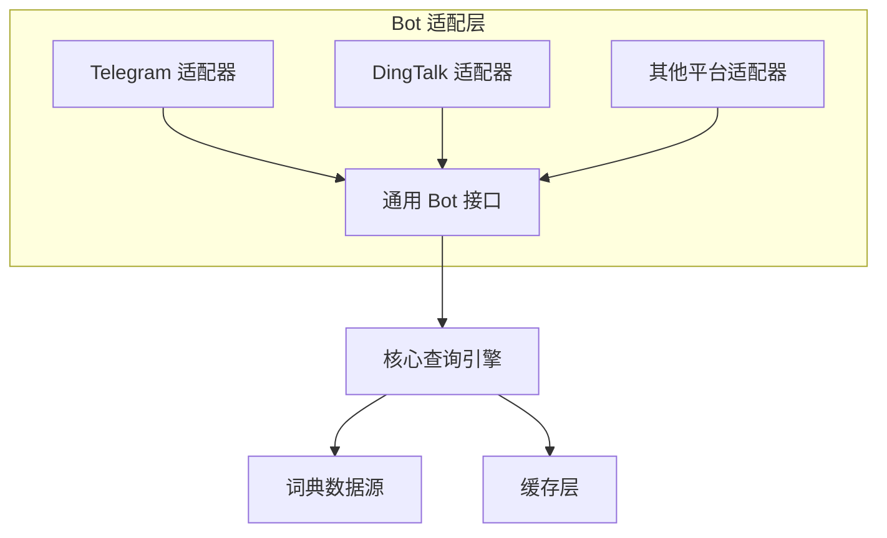

---
tags:
  - ComputerScience
  - Go
  - 方法性
title: "Bot Platform Adapter"
created: 2026-06-01
modified: 2026-06-01
---

# Bot Platform Adapter

> [!abstract] Bot 平台适配模式将不同 Bot 平台的接口统一到通用接口下。每个平台只需要一个薄适配层，核心查询逻辑在所有平台间共享。

## 1. 适配器模式

```go
// 通用 Bot 接口
type BotAdapter interface {
    SendMessage(chatID string, text string) error
    HandleMessage(handler MessageHandler)
}

// 具体平台：Telegram
type TelegramBot struct {
    token string
}

func (t *TelegramBot) SendMessage(chatID, text string) error {
    // Telegram API 调用
    url := fmt.Sprintf("https://api.telegram.org/bot%s/sendMessage", t.token)
    // ...
}

// 具体平台：DingTalk
type DingTalkBot struct {
    webhookURL string
}

func (d *DingTalkBot) SendMessage(chatID, text string) error {
    // DingTalk API 调用
    // ...
}
```

## 2. 通信方式

### 2.1 长轮询（Long Polling）

```
客户端 → HTTP 请求 → 服务器
         ← 有消息立即返回
         ← 无消息保持连接（等待超时后重试）
```

| 特性 | 说明 |
|------|------|
| **优点** | 不需要公网地址 |
| **缺点** | 频繁轮询消耗资源 |

### 2.2 Webhook

```
平台 → POST → 你的服务器（HTTPS）
```

| 特性 | 说明 |
|------|------|
| **优点** | 实时推送，资源消耗低 |
| **缺点** | 需要公网 HTTPS 端点 |

### 2.3 纯 HTTP 交互（DingTalk 模式）

```
平台 POST JSON → 服务器解析消息 → 处理 → 返回 JSON
```

零额外依赖——纯 `net/http` 即可。

## 3. 架构示意



| 组件 | 职责 |
|------|------|
| **Bot 适配器** | 平台消息解析 + 响应发送 |
| **通用接口** | 抽象 Bot 交互（发送消息、处理消息） |
| **核心引擎** | 与平台无关的查询逻辑 |

## 4. 优缺点

| 优点 | 缺点 |
|------|------|
| 核心逻辑一次实现，多平台复用 | 每个平台需独立注册/部署 |
| 新增平台只需写适配器 | 不同平台能力差异可能暴露到接口 |
| 平台升级不影响核心 | 适配器版本需要跟随平台 API 变化 |

## 相关笔记

- [[Strategy Pattern]] — 适配器模式类似策略模式，统一接口 + 多实现
- [[Layered Architecture]] — 适配器层位于最上层
