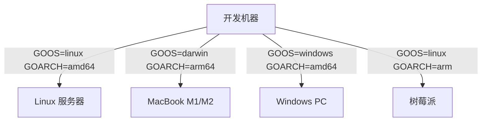

---
tags:
  - Go
  - 方法性
  - 基本原理
title: "Go Compilation and Deployment"
created: 2026-06-01
modified: 2026-06-01
---

# Go Compilation and Deployment

> [!abstract] Go 语言编译为单一静态二进制文件，无需运行时或动态库。结合零 CGO 依赖的策略，交叉编译到各平台无障碍。

## 1. 静态编译

```bash
# 产生单一二进制，无外部依赖
go build -o myapp ./cmd/myapp

# 输出是一个独立的可执行文件
$ file myapp
myapp: ELF 64-bit LSB executable, x86-64, statically linked
```

| 特性 | 说明 |
|------|------|
| **单一二进制** | 所有依赖打包进一个文件 |
| **无需运行时** | 不需要 .NET JVM 等运行时环境 |
| **无需动态库** | 不依赖系统 .so/.dll |
| **部署简单** | 拷贝文件即可运行 |

## 2. 交叉编译

```bash
# Linux amd64
GOOS=linux GOARCH=amd64 go build

# macOS (Intel)
GOOS=darwin GOARCH=amd64 go build

# macOS (Apple Silicon)
GOOS=darwin GOARCH=arm64 go build

# Windows
GOOS=windows GOARCH=amd64 go build

# ARM 设备（如树莓派）
GOOS=linux GOARCH=arm GOARM=7 go build
```



## 3. 零 CGO 依赖

CGO 启用时编译需要 C 编译器和依赖库，交叉编译困难。

```bash
# 需要 CGO 的情形
CGO_ENABLED=1 GOOS=linux GOARCH=arm64 go build  # ❌ 需要交叉编译工具链

# 纯 Go 的情形
CGO_ENABLED=0 GOOS=linux GOARCH=arm64 go build  # ✅ 直接编译
```

| 维度 | 有 CGO | 纯 Go |
|------|--------|-------|
| 编译 | 需要 C 编译器 | `go build` 即可 |
| 交叉编译 | 需要目标平台 C 工具链 | 一行命令 |
| 二进制体积 | 更小 | 稍大 |
| 适用场景 | 需要调用 C 库 | 纯 Go 实现已足够 |

## 4. 常用构建命令

```bash
# 构建所有包
go build ./...

# 静态检查
go vet ./...

# 运行测试
go test ./...

# 优化：禁用调试信息、减小体积
go build -ldflags="-s -w" ./...

# 输出平台信息
go version
go env GOOS GOARCH CGO_ENABLED
```

## 5. Go 构建速查

| 命令 | 用途 |
|------|------|
| `go build ./...` | 构建模块下所有包 |
| `go vet ./...` | 静态检查 |
| `go test ./...` | 运行测试 |
| `go build -ldflags="-s -w"` | 优化体积 |
| `CGO_ENABLED=0 GOOS=linux go build` | 静态度量交叉编译 |

## 相关笔记

- [[SQLite]] — Pure-Go SQLite 驱动实现零 CGO 依赖
