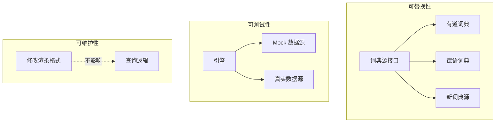

---
tags:
  - ComputerScience
  - Go
  - 方法性
  - 基本原理
title: "Layered Architecture"
created: 2026-06-01
modified: 2026-06-01
---

# Layered Architecture

> [!abstract] 分层架构将系统按职责划分为独立层次，上层依赖下层，下层不感知上层。每个层次独立变化，通过接口通信。

## 1. 分层原则

| 原则 | 说明 |
|------|------|
| **单一职责** | 每层只做一件事 |
| **依赖方向** | 上层依赖下层，下层不依赖上层 |
| **接口隔离** | 层间通过接口通信，而非具体类型 |

## 2. 分层结构（以 bl 为例）

```
┌─────────────────────────────────┐
│ 入口层（CLI / 管道 / Bot 消息）    │  ← 解析输入方式
├─────────────────────────────────┤
│ 引擎层（Rdict）                   │  ← 编排查询链、管理数据流
├─────────────────────────────────┤
│ 数据源层（Source）                 │  ← 抓取并解析特定网站的数据
├─────────────────────────────────┤
│ 缓存层（Cache）                    │  ← 本地读写缓存
├─────────────────────────────────┤
│ 渲染层（Render）                   │  ← 格式化输出
├─────────────────────────────────┤
│ 配置层（Config）                   │  ← 持久化读写配置
└─────────────────────────────────┘
```

### 2.1 各层职责

| 层次 | 职责 | 不做什么 |
|------|------|---------|
| **入口层** | 解析输入方式（CLI 参数、管道、交互式、Bot 消息） | 不处理词典逻辑 |
| **引擎层** | 编排查询链、管理数据流 | 不关心输出格式 |
| **数据源层** | 抓取并解析特定网站的数据 | 不关心缓存或渲染 |
| **缓存层** | 本地读写缓存 | 不关心数据含义 |
| **渲染层** | 格式化输出 | 不关心数据来源 |
| **配置层** | 持久化读写配置 | 不关心查询逻辑 |

## 3. 层间通信

层与层之间通过接口解耦：

```go
// 引擎依赖的接口
type Source interface {
    FetchURL(query string) string
    Parse(html string) (*TranslationData, error)
}

type Cache interface {
    Get(key string) (*TranslationData, bool)
    Set(key string, data *TranslationData)
}

// 引擎只依赖接口，不依赖具体实现
type Rdict struct {
    sources []Source
    cache   Cache
}
```

## 4. 分层的好处



| 好处 | 说明 |
|------|------|
| **可替换性** | 更换词典源只需实现接口，不影响其他层 |
| **可测试性** | 每层可独立测试（Mock 数据源测试引擎） |
| **可维护性** | 修改渲染格式不影响查词逻辑 |
| **可并行开发** | 不同层可以由不同开发者独立迭代 |

## 5. 常见反模式

| 反模式 | 问题 | 正确做法 |
|--------|------|---------|
| **层跳过** | 入口层直接访问数据源 | 必须通过引擎层 |
| **循环依赖** | 下层引用上层的类型 | 依赖方向严格单向 |
| **上帝对象** | 一层承担过多职责 | 拆分职责 |
| **泄漏抽象** | 下层细节暴露给上层 | 用接口封装下层细节 |

## 相关笔记

- [[Query Chain Pattern]] — 引擎层的核心编排模式
- [[Strategy Pattern]] — 数据源层的策略化设计
- [[Unified Data Flow Design]] — 各层间传递的统一数据模型
